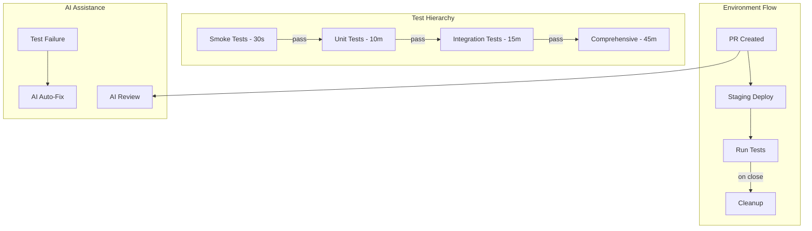

# GitHub Workflows Organizational Structure

## Root Cause Analysis

### Critical Issues Identified

1. **No Centralized Configuration**: Workflows lack a unified configuration system
2. **Inconsistent Failure Handling**: Different workflows handle failures differently
3. **Missing Dependency Management**: No clear test hierarchy or conditional execution
4. **Duplicated Logic**: Similar code patterns repeated across workflows
5. **No Health Monitoring**: No unified dashboard for workflow health
6. **Inefficient Resource Usage**: Tests run regardless of actual changes

## Workflow Categories

### 1. Testing Workflows (Core)
- **test-smoke.yml**: Quick validation (<30s)
- **test-unit.yml**: Unit tests with sharding
- **test-suite.yml**: Comprehensive test orchestrator
- **test-comprehensive.yml**: Full test suite with modules
- **test-on-demand.yml**: Manual/comment-triggered tests

### 2. Environment Management
- **staging-environment.yml**: PR staging deployments
- **staging-cleanup.yml**: Automated cleanup of stale environments
- **terraform-lock-cleanup.yml**: Terraform state lock management

### 3. AI/Automation Workflows
- **ai-autofix.yml**: Automated test fixing with AI
- **gemini-pr-review.yml**: AI-powered PR reviews
- **gemini-issue-automated-triage.yml**: Issue triage automation
- **gemini-cli.yml**: Gemini CLI integration

### 4. Code Quality
- **architecture-health.yml**: Architecture compliance monitoring

### 5. Staging Sub-Workflows
Located in `.github/workflows/staging-workflows/`:
- build-backend.yml
- build-frontend.yml
- deploy.yml
- destroy.yml
- notify.yml
- restart.yml
- setup.yml
- status.yml
- terraform.yml

## Workflow Dependencies & Hierarchy



## Failure Points & Solutions

### Critical Failure Points

1. **Test Cascade Failures**
   - **Issue**: If smoke fails, all other tests still run
   - **Solution**: Implement hierarchical test execution

2. **Staging Lock Conflicts**
   - **Issue**: Terraform locks not properly cleaned
   - **Solution**: Automated lock cleanup with monitoring

3. **Resource Exhaustion**
   - **Issue**: Too many parallel staging environments
   - **Solution**: Limit concurrent deployments, aggressive cleanup

4. **Flaky Test Recovery**
   - **Issue**: No automatic retry for flaky tests
   - **Solution**: Implement smart retry logic with AI assistance

5. **Cost Overruns**
   - **Issue**: Staging environments left running
   - **Solution**: Automated cleanup with cost monitoring

## Configuration System Design

### Central Configuration File
`.github/workflow-config.yml`:

```yaml
# Workflow Configuration
version: 1.0

# Global settings
global:
  enabled: true
  runner: warp-custom-default
  timeout_multiplier: 1.0
  
# Feature flags
features:
  test_hierarchy: true          # Enable hierarchical test execution
  smart_retry: true             # Enable intelligent retry logic
  ai_assistance: true          # Enable AI features
  cost_monitoring: true        # Enable cost tracking
  auto_cleanup: true           # Enable automatic cleanup
  
# Workflow-specific settings
workflows:
  testing:
    smoke:
      enabled: true
      timeout: 5
      required_for: [unit, integration]
      auto_trigger: true
      
    unit:
      enabled: true
      timeout: 10
      required_for: [integration]
      parallel_shards: 5
      skip_on_draft: true
      
    integration:
      enabled: true
      timeout: 15
      required_for: [comprehensive]
      skip_conditions:
        - docs_only_change
        - markdown_only_change
        
    comprehensive:
      enabled: true
      timeout: 45
      schedule: "0 3 * * 0"  # Weekly
      manual_only: false
      real_llm: false
      
  staging:
    enabled: true
    auto_deploy: true
    max_concurrent: 5
    auto_cleanup_hours: 72
    cost_limit_per_pr: 50
    
  ai_features:
    autofix:
      enabled: true
      max_attempts: 3
      providers: [claude, gemini, gpt4]
      confidence_threshold: 0.8
      
    pr_review:
      enabled: true
      auto_review: true
      focus_areas: [security, performance, correctness]
      
  monitoring:
    architecture_health:
      enabled: true
      fail_on_violations: false
      compliance_threshold: 90
      schedule: "0 9 * * *"
      
# Conditional execution rules
rules:
  skip_tests_if:
    - commit_message_contains: "[skip tests]"
    - commit_message_contains: "[skip ci]"
    - author_is_bot: true
    
  require_approval_if:
    - first_time_contributor: true
    - changes_critical_files: true
    - cost_exceeds: 100
    
# Cost controls
cost_controls:
  monthly_budget: 500
  alert_at_percentage: 80
  halt_at_percentage: 120
  
# Notification settings
notifications:
  slack:
    enabled: true
    channels:
      failures: "#ci-failures"
      cost_alerts: "#infrastructure"
      
  email:
    enabled: false
    recipients: []
```

### Implementation Approach

1. **Create Reusable Workflow Components**
2. **Implement Hierarchical Test Execution**
3. **Add Smart Failure Handling**
4. **Create Unified Monitoring Dashboard**
5. **Implement Cost Controls**

## Recommended Actions

### Immediate (Phase 1)
1. ✅ Document current workflow structure
2. Create central configuration file
3. Implement test hierarchy logic
4. Add workflow health monitoring

### Short-term (Phase 2)
1. Refactor workflows to use central config
2. Implement smart retry logic
3. Add cost monitoring and alerts
4. Create workflow templates

### Long-term (Phase 3)
1. Full workflow orchestration system
2. AI-powered failure prediction
3. Automated performance optimization
4. Complete workflow observability

## Workflow Enable/Disable System

### Repository Variables
Set these in GitHub repository settings:

```
WORKFLOWS_SMOKE_ENABLED=true
WORKFLOWS_UNIT_ENABLED=true
WORKFLOWS_INTEGRATION_ENABLED=true
WORKFLOWS_COMPREHENSIVE_ENABLED=true
WORKFLOWS_STAGING_ENABLED=true
WORKFLOWS_AI_AUTOFIX_ENABLED=true
WORKFLOWS_AI_REVIEW_ENABLED=true
WORKFLOWS_ARCHITECTURE_ENABLED=true
```

### Dynamic Control
Each workflow checks its enable flag:

```yaml
jobs:
  check-enabled:
    if: vars.WORKFLOWS_SMOKE_ENABLED == 'true'
    runs-on: ubuntu-latest
    outputs:
      enabled: ${{ steps.check.outputs.enabled }}
    steps:
      - id: check
        run: echo "enabled=${{ vars.WORKFLOWS_SMOKE_ENABLED }}" >> $GITHUB_OUTPUT
```

## Monitoring & Observability

### Workflow Health Dashboard
Track key metrics:
- Success/failure rates
- Average duration trends
- Cost per workflow run
- Resource utilization
- Flaky test identification

### Alert Conditions
- Test success rate < 95%
- Workflow duration > 2x average
- Cost exceeds daily budget
- Staging environments > limit
- Lock conflicts detected