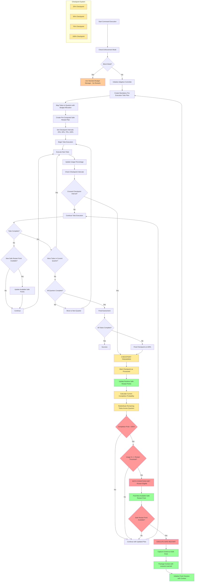
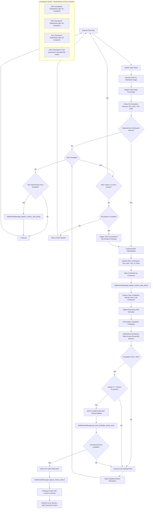
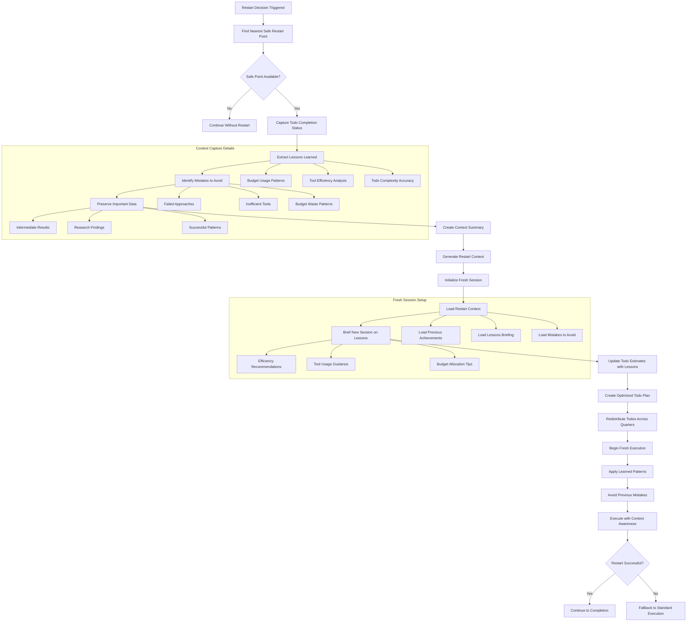

# Adaptive Budget Management Strategy for Zen Package

## Overview

This document outlines a comprehensive strategy for implementing adaptive budget management in the zen package. The feature will provide intelligent token/cost usage tracking with automatic task re-evaluation and redistribution across budget quarters.

## Current Architecture Analysis

Based on the existing zen package structure, we have:

### Existing Components
- **TokenBudgetManager** (`token_budget/budget_manager.py`): Handles token and cost budgets with enforcement modes
- **CommandBudgetInfo** (`token_budget/models.py`): Tracks per-command budget status
- **ClaudePricingEngine** (`token_transparency/claude_pricing_engine.py`): Converts tokens to costs
- **Zen Orchestrator** (`zen_orchestrator.py`): Main execution engine for slash commands

### Current Capabilities
- Token-based and cost-based budget tracking
- Per-command and overall session budgets
- Warn/block enforcement modes
- Real-time usage monitoring
- Budget visualization

## Proposed Adaptive Budget Management Architecture

### Core Components

#### 1. AdaptiveBudgetController
```
Location: token_budget/adaptive_controller.py
Purpose: Main orchestrator for adaptive budget management with percentage-based triggers
```

#### 2. QuarterManager
```
Location: token_budget/quarter_manager.py
Purpose: Manages budget distribution across quarters with dynamic reallocation
```

#### 3. ProactivePlanner
```
Location: token_budget/proactive_planner.py
Purpose: Creates todo lists and plans execution steps before command start
```

#### 4. SafeRestartManager
```
Location: token_budget/safe_restart.py
Purpose: Identifies safe restart points and manages context preservation
```

#### 5. AdaptiveExecutor
```
Location: token_budget/adaptive_executor.py
Purpose: Enhanced command executor with todo-driven quarter-based execution
```

#### 6. BudgetTrendAnalyzer
```
Location: token_budget/trend_analyzer.py
Purpose: Analyzes usage patterns and improves completion probability predictions
```

## Implementation Strategy

### Phase 1: Core Architecture Setup

#### 1.1 AdaptiveBudgetController Design

The controller will extend the existing TokenBudgetManager with checkpoint intervals and SafeRestartManager integration:

```python
class AdaptiveBudgetController(TokenBudgetManager):
    def __init__(self, total_budget, adaptive_mode=True, enforcement_mode="warn",
                 restart_threshold=0.9, checkpoint_intervals=None, min_completion_probability=0.5):
        super().__init__(overall_budget=total_budget, enforcement_mode=enforcement_mode)
        self.adaptive_mode = adaptive_mode
        self.restart_threshold = restart_threshold  # Only used when completion_probability < 0.5
        self.checkpoint_intervals = checkpoint_intervals or [0.25, 0.5, 0.75, 1.0]  # Quarter checkpoints
        self.min_completion_probability = min_completion_probability
        self.quarter_manager = QuarterManager(total_budget)
        self.proactive_planner = ProactivePlanner()
        self.safe_restart_manager = SafeRestartManager()
        self.trend_analyzer = BudgetTrendAnalyzer()
        self.execution_history = []
        self._processed_checkpoints = set()  # Track processed checkpoint intervals

    def execute_adaptive_command(self, command: str, context: dict) -> ExecutionResult:
        """
        Main execution method showing integration with SafeRestartManager infrastructure.
        """
        # PHASE 1: Pre-execution setup with guaranteed safe restart points
        execution_plan = self.proactive_planner.create_execution_plan(command, context, self.total_budget)
        restart_plan = self.safe_restart_manager.create_precomputed_restart_plan(execution_plan.todos)

        # Validate that safe restart points are guaranteed
        if not self.safe_restart_manager.validate_restart_plan_has_guaranteed_points():
            raise ValueError("Cannot proceed: No guaranteed safe restart points available")

        # PHASE 2: Execute todos with checkpoint interval monitoring
        execution_state = ExecutionState(todos=execution_plan.todos, quarter_plans=execution_plan.quarter_distribution)

        for todo in execution_plan.todos:
            # Execute todo
            todo_result = self.execute_todo(todo)
            execution_state.record_todo_completion(todo, todo_result)

            # Update usage and check checkpoint intervals
            current_usage_percentage = execution_state.total_usage / self.total_budget

            # Check if any checkpoint interval has been reached
            if self.should_trigger_evaluation(current_usage_percentage, self.checkpoint_intervals):
                checkpoint_result = self.process_checkpoint(execution_state, current_usage_percentage)

                if checkpoint_result.restart_recommended:
                    # Use SafeRestartManager to find best restart point and capture context
                    restart_point = self.safe_restart_manager.get_best_available_restart_point(execution_state)
                    restart_context = self.safe_restart_manager.capture_restart_context(execution_state, restart_point)

                    # Execute restart with preserved context
                    return self.execute_restart(restart_context)

        return ExecutionResult(success=True, todos_completed=execution_state.completed_todos)

    def process_checkpoint(self, execution_state: ExecutionState, usage_percentage: float) -> CheckpointResult:
        """Process checkpoint evaluation at quarter boundaries."""
        # Identify and mark checkpoint
        current_checkpoint = self.get_next_checkpoint(usage_percentage, self.checkpoint_intervals)
        if current_checkpoint:
            self.mark_checkpoint_processed(current_checkpoint)

        # Update runtime safe restart points
        self.safe_restart_manager.update_runtime_safe_points(execution_state)

        # Convert fractional checkpoint to quarter index for trend analyzer
        current_quarter = self.checkpoint_to_quarter_index(current_checkpoint, self.checkpoint_intervals)

        # Analyze trends and redistribute todos
        trend_analysis = self.trend_analyzer.analyze_usage_trend(
            current_quarter,  # Pass quarter index (1-4) not fractional checkpoint
            execution_state.planned_budget_for_checkpoint(current_checkpoint),
            execution_state.actual_usage,
            execution_state.completed_todos,
            execution_state.remaining_todos
        )

        # Redistribute remaining todos across remaining quarters
        updated_quarter_plans = self.trend_analyzer.update_quarter_allocations(
            execution_state.quarter_plans,
            current_quarter,  # Pass quarter index (1-4) not fractional checkpoint
            trend_analysis
        )

        # Apply the updated quarter plans
        execution_state.update_quarter_plans(updated_quarter_plans)

        # Evaluate restart conditions
        restart_recommended = self.evaluate_restart_conditions(
            usage_percentage,
            trend_analysis.completion_probability
        )

        return CheckpointResult(
            checkpoint=current_checkpoint,
            trend_analysis=trend_analysis,
            restart_recommended=restart_recommended,
            updated_quarter_plans=updated_quarter_plans
        )

    def checkpoint_to_quarter_index(self, checkpoint: float, checkpoint_intervals: List[float]) -> int:
        """
        Convert fractional checkpoint to quarter index based on configured intervals.
        Handles arbitrary checkpoint intervals, not just 0.25/0.5/0.75/1.0.

        Args:
            checkpoint: The fractional checkpoint that was reached (e.g., 0.3, 0.6)
            checkpoint_intervals: The configured checkpoint intervals (e.g., [0.2, 0.4, 0.6, 0.8, 1.0])

        Returns:
            Quarter index (1-based) corresponding to the checkpoint position
        """
        if not checkpoint_intervals:
            return 4  # Default fallback

        sorted_intervals = sorted(checkpoint_intervals)

        # Find which quarter this checkpoint represents
        for i, interval in enumerate(sorted_intervals):
            if checkpoint <= interval:
                return i + 1  # Return 1-based quarter index

        # If checkpoint is beyond all intervals, it's the final quarter
        return len(sorted_intervals)

    def should_trigger_evaluation(self, usage_percentage: float, checkpoint_intervals: List[float]) -> bool:
        """
        CRITICAL: Determine if checkpoint evaluation should trigger based on configured intervals.
        Evaluations must run at EVERY quarter interval (25%, 50%, 75%, 100%) regardless of single threshold.

        Args:
            usage_percentage: Current budget usage as percentage (0.0-1.0)
            checkpoint_intervals: List of percentages when to trigger evaluation [0.25, 0.5, 0.75, 1.0]
        """
        # Block mode supersedes adaptive behavior
        if self.enforcement_mode == "block":
            return False

        # Check if we've crossed any checkpoint interval
        for interval in checkpoint_intervals:
            if usage_percentage >= interval and not self.checkpoint_reached(interval):
                return True

        return False

    def checkpoint_reached(self, interval: float) -> bool:
        """Track which checkpoint intervals have already been processed."""
        return interval in getattr(self, '_processed_checkpoints', set())

    def mark_checkpoint_processed(self, interval: float):
        """Mark a checkpoint interval as processed."""
        if not hasattr(self, '_processed_checkpoints'):
            self._processed_checkpoints = set()
        self._processed_checkpoints.add(interval)

    def get_next_checkpoint(self, usage_percentage: float, checkpoint_intervals: List[float]) -> Optional[float]:
        """Get the next unprocessed checkpoint that should trigger evaluation."""
        processed = getattr(self, '_processed_checkpoints', set())

        for interval in sorted(checkpoint_intervals):
            if interval not in processed and usage_percentage >= interval:
                return interval

        return None

    def evaluate_restart_conditions(self, usage_percentage: float, completion_probability: float) -> bool:
        """
        CRITICAL: Restart logic must follow these exact conditions:
        1. Block mode supersedes everything (no restart)
        2. If completion_probability < 0.5, then BOTH conditions must be met:
           a) usage_percentage >= restart_threshold
           b) completion_probability < min_completion_probability (0.5)
        3. This allows early restart when budget is approaching exhaustion
        """
        # Block mode prevents restart
        if self.enforcement_mode == "block":
            return False

        # Only consider restart when completion probability drops below 0.5
        if completion_probability >= self.min_completion_probability:
            return False

        # BOTH conditions must be met for restart:
        # 1. Usage percentage exceeds restart threshold (budget approaching exhaustion)
        # 2. Completion probability is too low
        usage_exceeds_threshold = usage_percentage >= self.restart_threshold
        probability_too_low = completion_probability < self.min_completion_probability

        return usage_exceeds_threshold and probability_too_low

    def find_safe_restart_point(self, current_execution_state: ExecutionState) -> Optional[RestartPoint]:
        """
        Locate the nearest safe restart point from current execution position.
        Safe points are between discrete operations to avoid corrupting state.
        """
        current_position = current_execution_state.current_todo_index
        completed_todos = current_execution_state.completed_todos

        # Look for completed todos that end with safe restart markers
        for i in range(len(completed_todos) - 1, -1, -1):
            todo = completed_todos[i]
            if self.is_safe_restart_point(todo, completed_todos[:i+1]):
                return RestartPoint(
                    todo_index=i,
                    context_cutoff=todo.completion_timestamp,
                    safe_to_restart=True,
                    context_to_preserve=self.determine_context_to_preserve(completed_todos[:i+1])
                )

        return None

    def is_safe_restart_point(self, todo: TodoItem, completed_todos: List[TodoItem]) -> bool:
        """
        Determine if a todo completion represents a safe restart point.
        Safe points occur:
        - After completing analysis/research (data collected)
        - Before file modifications (no partial writes)
        - After tool operations complete (no hanging processes)
        - At workflow phase boundaries
        """
        # Safe after data collection phases
        if todo.category in ['analysis', 'research', 'data_collection', 'search']:
            return True

        # Safe before destructive operations
        if todo.category in ['planning', 'validation', 'preparation']:
            return True

        # Safe after completing tool operations
        if todo.involves_tools and todo.status == 'completed' and not todo.has_partial_state:
            return True

        # Safe at phase boundaries (when dependencies for next phase are complete)
        if self.represents_phase_boundary(todo, completed_todos):
            return True

        return False
```

#### 1.2 Quarter Management System

The quarter system divides the total budget into four phases:
- **Q1 (25%)**: Initial execution and assessment
- **Q2 (25%)**: Primary task execution
- **Q3 (25%)**: Secondary task execution
- **Q4 (25%)**: Completion and buffer

### Phase 2: Proactive Planning and Todo Integration

#### 2.1 ProactivePlanner Design

The planner creates detailed todo lists and execution plans before command execution:

```python
class ProactivePlanner:
    def create_execution_plan(self, command: str, context: dict, total_budget: float) -> ExecutionPlan:
        """
        Create a comprehensive todo list and quarter-based execution plan BEFORE starting

        Steps:
        1. Analyze command and break into discrete steps
        2. Estimate resource requirements for each step
        3. Create detailed todo list with priorities
        4. Distribute todos across quarters based on dependencies and complexity
        5. Allocate budget to each todo item
        """

        # Parse command and create todo items
        todos = self.parse_command_to_todos(command, context)

        # Estimate resource needs for each todo
        for todo in todos:
            todo.estimated_tokens = self.estimate_todo_complexity(todo)
            todo.dependencies = self.identify_dependencies(todo, todos)
            todo.safe_restart_points = self.identify_restart_points(todo)

        # Distribute across quarters
        quarter_plan = self.distribute_todos_by_quarters(todos, total_budget)

        return ExecutionPlan(
            todos=todos,
            quarter_distribution=quarter_plan,
            total_estimated_budget=sum(t.estimated_tokens for t in todos),
            safe_restart_points=self.compile_restart_points(todos)
        )

    def parse_command_to_todos(self, command: str, context: dict) -> List[TodoItem]:
        """
        MANDATORY: Break down slash command into concrete, actionable todo items that map
        to specific tools, agents, and operations. Each todo must have estimated budget.

        Examples:
        - /analyze-code -> [
            TodoItem("Search codebase for patterns", category='search', estimated_tokens=150, tools=['Grep', 'Glob']),
            TodoItem("Read key files identified", category='read', estimated_tokens=300, tools=['Read']),
            TodoItem("Analyze code structure", category='analyze', estimated_tokens=400, tools=['Task']),
            TodoItem("Generate analysis report", category='write', estimated_tokens=200, tools=['Write'])
          ]
        - /debug-issue -> [
            TodoItem("Reproduce issue with test", category='test', estimated_tokens=200, tools=['Bash']),
            TodoItem("Search logs for error patterns", category='search', estimated_tokens=100, tools=['Grep']),
            TodoItem("Analyze root cause", category='analyze', estimated_tokens=300, tools=['Task']),
            TodoItem("Implement fix", category='modify', estimated_tokens=250, tools=['Edit', 'MultiEdit'])
          ]
        - /agent-spawn -> [
            TodoItem("Setup agent parameters", category='setup', estimated_tokens=50, agents=['specialist-agent']),
            TodoItem("Spawn parallel agents", category='spawn', estimated_tokens=100, agents=['multiple']),
            TodoItem("Monitor agent execution", category='monitor', estimated_tokens=75, tools=['monitoring']),
            TodoItem("Collect and merge results", category='merge', estimated_tokens=125, tools=['aggregation'])
          ]
        """

        # Extract command type and parameters
        command_type = self.extract_command_type(command)
        command_params = self.extract_command_parameters(command, context)

        # Generate specific todos based on command type
        todos = []
        todo_id_counter = 1

        if command_type == 'analyze-code':
            todos = [
                TodoItem(
                    todo_id=f"todo_{todo_id_counter}",
                    description="Search codebase for relevant patterns and files",
                    category='search',
                    estimated_tokens=150,
                    tools=['Grep', 'Glob'],
                    dependencies=[],
                    safe_restart_after=True
                ),
                TodoItem(
                    todo_id=f"todo_{todo_id_counter+1}",
                    description="Read and understand key files identified",
                    category='read',
                    estimated_tokens=300,
                    tools=['Read'],
                    dependencies=[f"todo_{todo_id_counter}"],
                    safe_restart_after=True
                ),
                TodoItem(
                    todo_id=f"todo_{todo_id_counter+2}",
                    description="Analyze code structure and patterns",
                    category='analyze',
                    estimated_tokens=400,
                    tools=['Task'],
                    dependencies=[f"todo_{todo_id_counter+1}"],
                    safe_restart_after=True
                ),
                TodoItem(
                    todo_id=f"todo_{todo_id_counter+3}",
                    description="Generate comprehensive analysis report",
                    category='write',
                    estimated_tokens=200,
                    tools=['Write'],
                    dependencies=[f"todo_{todo_id_counter+2}"],
                    safe_restart_after=False  # Writing operation - not safe to restart during
                )
            ]

        elif command_type == 'debug-issue':
            todos = self.create_debug_todos(command_params, todo_id_counter)

        elif command_type == 'test-fix':
            todos = self.create_test_fix_todos(command_params, todo_id_counter)

        # Add budget estimates and safe restart points
        for todo in todos:
            todo.estimated_tokens = self.refine_token_estimate(todo, command_params)
            todo.safe_restart_points = self.identify_todo_restart_points(todo)

        return todos

    def distribute_todos_by_quarters(self, todos: List[TodoItem], total_budget: float) -> Dict[int, QuarterPlan]:
        """
        MANDATORY: Distribute concrete todo items across quarters with specific budget allocations.
        Each quarter gets allocated budget for its assigned todos.

        Quarter distribution strategy:
        1. Q1 (25%): Setup, search, and initial data collection
        2. Q2 (25%): Primary analysis and processing work
        3. Q3 (25%): Implementation and modification tasks
        4. Q4 (25%): Validation, completion, and buffer
        """

        # Calculate base quarter budgets
        base_quarter_budget = total_budget * 0.25
        quarter_plans = {
            1: QuarterPlan(allocated_budget=base_quarter_budget, todos=[]),
            2: QuarterPlan(allocated_budget=base_quarter_budget, todos=[]),
            3: QuarterPlan(allocated_budget=base_quarter_budget, todos=[]),
            4: QuarterPlan(allocated_budget=base_quarter_budget, todos=[])
        }

        # Sort todos by dependencies (prerequisites first)
        sorted_todos = self.sort_todos_by_dependencies(todos)

        # Distribute todos ensuring logical quarter boundaries
        current_quarter = 1
        remaining_budget = quarter_plans[current_quarter].allocated_budget

        for todo in sorted_todos:
            # Check if todo fits in current quarter
            if todo.estimated_tokens > remaining_budget and current_quarter < 4:
                # Move to next quarter
                current_quarter += 1
                remaining_budget = quarter_plans[current_quarter].allocated_budget

            # Assign todo to current quarter
            quarter_plans[current_quarter].todos.append(todo)
            quarter_plans[current_quarter].assigned_budget += todo.estimated_tokens
            remaining_budget -= todo.estimated_tokens

            # Update quarter plan with todo-specific budget tracking
            quarter_plans[current_quarter].todo_budget_map[todo.todo_id] = todo.estimated_tokens

        # Validate quarter distributions
        for quarter, plan in quarter_plans.items():
            if plan.assigned_budget > plan.allocated_budget * 1.1:  # 10% overflow tolerance
                self.rebalance_quarter_distribution(quarter_plans, quarter)

        return quarter_plans

    def sort_todos_by_dependencies(self, todos: List[TodoItem]) -> List[TodoItem]:
        """Sort todos ensuring dependencies are satisfied before dependents."""
        sorted_todos = []
        remaining_todos = todos.copy()

        while remaining_todos:
            # Find todos with no unmet dependencies
            ready_todos = []
            for todo in remaining_todos:
                if self.dependencies_satisfied(todo, [t.todo_id for t in sorted_todos]):
                    ready_todos.append(todo)

            if not ready_todos:
                # Circular dependency or error - break it
                ready_todos = [remaining_todos[0]]

            # Add ready todos to sorted list
            for todo in ready_todos:
                sorted_todos.append(todo)
                remaining_todos.remove(todo)

        return sorted_todos

    def dependencies_satisfied(self, todo: TodoItem, completed_todo_ids: List[str]) -> bool:
        """Check if all dependencies for a todo are in the completed list."""
        if not todo.dependencies:
            return True
        return all(dep_id in completed_todo_ids for dep_id in todo.dependencies)

    def rebalance_quarter_distribution(self, quarter_plans: Dict[int, QuarterPlan], overloaded_quarter: int):
        """Rebalance todos when a quarter exceeds its budget allocation."""
        overloaded_plan = quarter_plans[overloaded_quarter]

        # Move some todos to later quarters
        for quarter in range(overloaded_quarter + 1, 5):
            if quarter in quarter_plans:
                target_plan = quarter_plans[quarter]
                available_budget = target_plan.allocated_budget - target_plan.assigned_budget

                # Move todos that fit in available budget
                todos_to_move = []
                for todo in overloaded_plan.todos:
                    if todo.estimated_tokens <= available_budget:
                        todos_to_move.append(todo)
                        available_budget -= todo.estimated_tokens

                        # Stop if overload is resolved
                        if overloaded_plan.assigned_budget - sum(t.estimated_tokens for t in todos_to_move) <= overloaded_plan.allocated_budget:
                            break

                # Execute the move
                for todo in todos_to_move:
                    overloaded_plan.todos.remove(todo)
                    overloaded_plan.assigned_budget -= todo.estimated_tokens
                    del overloaded_plan.todo_budget_map[todo.todo_id]

                    target_plan.todos.append(todo)
                    target_plan.assigned_budget += todo.estimated_tokens
                    target_plan.todo_budget_map[todo.todo_id] = todo.estimated_tokens

                if overloaded_plan.assigned_budget <= overloaded_plan.allocated_budget:
                    break
```

#### 2.2 Dynamic Todo Rebalancing

At each quarter checkpoint, the system updates todo allocations based on actual usage:

```python
class BudgetTrendAnalyzer:
    def analyze_usage_trend(self, quarter: int, planned_budget: float, actual_usage: float,
                          completed_todos: List[TodoItem], remaining_todos: List[TodoItem]) -> TrendAnalysis:
        """
        Analyze budget usage trends and update predictions

        Returns:
        - Usage velocity (tokens per todo item)
        - Accuracy of initial estimates
        - Projected completion probability
        - Recommended budget reallocation
        """

        # Calculate actual vs. estimated accuracy
        accuracy = self.calculate_estimation_accuracy(completed_todos)

        # Project remaining resource needs
        remaining_budget = self.calculate_remaining_budget(quarter, actual_usage)
        updated_estimates = self.update_todo_estimates(remaining_todos, accuracy)

        # Recalculate completion probability
        completion_probability = self.calculate_completion_probability(
            remaining_budget, updated_estimates
        )

        return TrendAnalysis(
            usage_velocity=actual_usage / len(completed_todos) if completed_todos else 0,
            estimation_accuracy=accuracy,
            completion_probability=completion_probability,
            recommended_reallocation=self.suggest_budget_reallocation(
                remaining_todos, remaining_budget
            )
        )

    def update_quarter_allocations(self, quarter_plans: Dict[int, QuarterPlan],
                                 current_quarter: int, trend_analysis: TrendAnalysis) -> Dict[int, QuarterPlan]:
        """
        Redistribute todos across remaining quarters based on usage trends
        """

        # Get remaining todos from current and future quarters
        remaining_todos = []
        for q in range(current_quarter, 5):
            if q in quarter_plans:
                remaining_todos.extend(quarter_plans[q].todos)

        # Apply updated estimates
        for todo in remaining_todos:
            todo.estimated_tokens *= trend_analysis.estimation_accuracy

        # Redistribute with updated estimates
        return self.redistribute_todos(remaining_todos, current_quarter,
                                     trend_analysis.recommended_reallocation)
```

### Phase 3: Safe Restart Points and Context Preservation

#### 3.1 SafeRestartManager Design - Detailed Safe Point Identification

The restart manager identifies logical breakpoints and preserves context to avoid repeating mistakes. Safe restart points are critical to prevent state corruption and work duplication:

```python
class SafeRestartManager:
    def __init__(self):
        self.precomputed_plan = None
        self.runtime_safe_points = []

    def create_precomputed_restart_plan(self, todos: List[TodoItem]) -> RestartPlan:
        """
        CRITICAL: Create restart plan BEFORE execution starts based on todo metadata.
        This solves the chicken-and-egg problem where todos haven't been completed yet.

        Pre-computes safe restart opportunities based on todo structure and categories.
        """

        planned_restart_points = []

        for i, todo in enumerate(todos):
            # PLANNED SAFE POINT: After read-only operations (when they complete)
            if todo.category in ['search', 'read', 'analyze', 'research']:
                planned_restart_points.append(PlannedRestartPoint(
                    todo_index=i,
                    trigger_condition='completion',  # Becomes available when todo completes
                    reason=f"After read-only operation: {todo.description}",
                    context_to_preserve=[
                        'search_results', 'analysis_findings', 'research_data',
                        'file_contents', 'code_understanding'
                    ],
                    state_corruption_risk=False,
                    priority=1  # High priority - very safe
                ))

            # PLANNED SAFE POINT: Before destructive operations
            next_todo = todos[i+1] if i+1 < len(todos) else None
            if next_todo and next_todo.category in ['write', 'modify', 'deploy', 'delete']:
                planned_restart_points.append(PlannedRestartPoint(
                    todo_index=i,  # Before the destructive operation
                    trigger_condition='before_next',  # Available when current todo completes
                    reason=f"Before destructive operation: {next_todo.description}",
                    context_to_preserve=[
                        'preparation_work', 'validation_results', 'planned_changes'
                    ],
                    state_corruption_risk=False,
                    priority=1  # High priority - prevents corruption
                ))

            # PLANNED SAFE POINT: After tool operations (when complete, no hanging processes)
            if todo.involves_tools:
                planned_restart_points.append(PlannedRestartPoint(
                    todo_index=i,
                    trigger_condition='tool_completion',  # When tool finishes cleanly
                    reason=f"After tool operation: {todo.description}",
                    context_to_preserve=[
                        'tool_outputs', 'command_results', 'api_responses'
                    ],
                    state_corruption_risk=False,
                    priority=2  # Medium priority - depends on clean tool exit
                ))

            # PLANNED SAFE POINT: At dependency boundaries
            if self.has_dependents(todo, todos):
                planned_restart_points.append(PlannedRestartPoint(
                    todo_index=i,
                    trigger_condition='dependencies_complete',
                    reason=f"Dependency boundary: {todo.description}",
                    context_to_preserve=[
                        'dependency_results', 'prerequisite_outputs'
                    ],
                    state_corruption_risk=False,
                    priority=2  # Medium priority
                ))

        # Create restart plan with at least one guaranteed safe point
        self.precomputed_plan = RestartPlan(
            planned_points=planned_restart_points,
            guaranteed_safe_points=self.identify_guaranteed_safe_points(planned_restart_points),
            fallback_points=self.create_fallback_points(todos)
        )

        # CRITICAL: Ensure at least one restart point is guaranteed to be available
        if not self.precomputed_plan.guaranteed_safe_points and not self.precomputed_plan.fallback_points:
            # Create emergency fallback at todo index 0 (can always restart before first todo)
            emergency_fallback = PlannedRestartPoint(
                todo_index=0,
                trigger_condition='always_available',
                reason="Emergency fallback: Beginning of execution",
                context_to_preserve=['initial_state'],
                state_corruption_risk=False,
                priority=4  # Lowest priority emergency fallback
            )
            self.precomputed_plan.fallback_points.append(emergency_fallback)

        return self.precomputed_plan

    def identify_guaranteed_safe_points(self, planned_points: List[PlannedRestartPoint]) -> List[PlannedRestartPoint]:
        """Identify restart points that are guaranteed to be available."""
        guaranteed = []

        for point in planned_points:
            # High priority points with minimal conditions are guaranteed
            if (point.priority == 1 and
                point.trigger_condition in ['completion', 'before_next']):
                guaranteed.append(point)

        return guaranteed

    def create_fallback_points(self, todos: List[TodoItem]) -> List[PlannedRestartPoint]:
        """Create fallback restart points to ensure at least one is always available."""
        fallback_points = []

        # Fallback after first quarter of todos
        quarter_point = len(todos) // 4
        if quarter_point > 0:
            fallback_points.append(PlannedRestartPoint(
                todo_index=quarter_point - 1,
                trigger_condition='completion',
                reason="Fallback: First quarter completion",
                context_to_preserve=['partial_progress', 'early_results'],
                state_corruption_risk=False,
                priority=3  # Lower priority fallback
            ))

        return fallback_points

    def update_runtime_safe_points(self, execution_state: ExecutionState) -> List[RestartPoint]:
        """
        Update available safe restart points based on actual execution progress.
        Converts planned points to actual restart points as conditions are met.
        """

        available_restart_points = []
        completed_todos = execution_state.completed_todos

        for planned_point in self.precomputed_plan.planned_points:
            todo_index = planned_point.todo_index

            # Check if this planned point has become available
            if self.is_planned_point_available(planned_point, completed_todos, execution_state):
                actual_point = RestartPoint(
                    todo_index=todo_index,
                    reason=planned_point.reason,
                    context_to_preserve=planned_point.context_to_preserve,
                    safe_to_restart=True,
                    state_corruption_risk=planned_point.state_corruption_risk,
                    availability_confirmed=True
                )
                available_restart_points.append(actual_point)

        return available_restart_points

    def is_planned_point_available(self, planned_point: PlannedRestartPoint,
                                 completed_todos: List[TodoItem],
                                 execution_state: ExecutionState) -> bool:
        """Check if a planned restart point has become available based on execution state."""

        todo_index = planned_point.todo_index

        if planned_point.trigger_condition == 'completion':
            # Available if the todo at this index is completed
            return (todo_index < len(completed_todos) and
                   completed_todos[todo_index].status == 'completed')

        elif planned_point.trigger_condition == 'before_next':
            # Available if current todo is done and next is destructive
            return todo_index < len(completed_todos)

        elif planned_point.trigger_condition == 'tool_completion':
            # Available if tool operation completed cleanly
            if todo_index < len(completed_todos):
                todo = completed_todos[todo_index]
                return (todo.status == 'completed' and
                       not getattr(todo, 'has_hanging_processes', False))

        elif planned_point.trigger_condition == 'dependencies_complete':
            # Available if all dependencies are satisfied
            return todo_index < len(completed_todos)

        return False

    def has_dependents(self, todo: TodoItem, all_todos: List[TodoItem]) -> bool:
        """Check if other todos depend on this one."""
        todo_id = todo.todo_id
        return any(todo_id in getattr(other_todo, 'dependencies', [])
                  for other_todo in all_todos if other_todo != todo)

    def get_best_available_restart_point(self, execution_state: ExecutionState) -> Optional[RestartPoint]:
        """
        Get the best available restart point based on current execution state.
        GUARANTEED to return a restart point due to pre-computed fallback system.
        """
        available_points = self.update_runtime_safe_points(execution_state)

        if not available_points:
            # Use fallback points if no primary points available
            fallback_points = self.get_available_fallback_points(execution_state)
            if fallback_points:
                return self.convert_planned_to_actual_restart_point(fallback_points[0], execution_state)

            # Emergency fallback - should never happen due to pre-computed guarantees
            return RestartPoint(
                todo_index=0,
                reason="Emergency fallback: Beginning of execution",
                context_to_preserve=['initial_state'],
                safe_to_restart=True,
                state_corruption_risk=False
            )

        # Sort by priority and return best option
        available_points.sort(key=lambda p: getattr(p, 'priority', 2))
        return available_points[0]

    def get_available_fallback_points(self, execution_state: ExecutionState) -> List[PlannedRestartPoint]:
        """Get fallback restart points that are currently available."""
        available_fallbacks = []

        for fallback_point in self.precomputed_plan.fallback_points:
            if self.is_planned_point_available(fallback_point, execution_state.completed_todos, execution_state):
                available_fallbacks.append(fallback_point)

        return available_fallbacks

    def convert_planned_to_actual_restart_point(self, planned_point: PlannedRestartPoint,
                                              execution_state: ExecutionState) -> RestartPoint:
        """Convert a planned restart point to an actual restart point."""
        return RestartPoint(
            todo_index=planned_point.todo_index,
            reason=planned_point.reason,
            context_to_preserve=planned_point.context_to_preserve,
            safe_to_restart=True,
            state_corruption_risk=planned_point.state_corruption_risk
        )

    def validate_restart_plan_has_guaranteed_points(self) -> bool:
        """
        Validate that the restart plan has at least one guaranteed safe point.
        This ensures the 'always look for a safe place to restart' requirement is met.
        """
        if not self.precomputed_plan:
            return False

        # Check for guaranteed safe points
        if self.precomputed_plan.guaranteed_safe_points:
            return True

        # Check for fallback points
        if self.precomputed_plan.fallback_points:
            return True

        return False

    def all_dependencies_satisfied(self, todo: TodoItem, completed_todos: List[TodoItem]) -> bool:
        """Check if all dependencies for a todo are satisfied by completed todos."""
        if not todo.dependencies:
            return True

        completed_todo_ids = {t.todo_id for t in completed_todos if t.status == 'completed'}
        required_dependencies = set(todo.dependencies)

        return required_dependencies.issubset(completed_todo_ids)

    def capture_restart_context(self, execution_state: ExecutionState,
                              restart_point: RestartPoint) -> RestartContext:
        """
        CRITICAL: Package complete context to avoid repeating mistakes in fresh session.

        Context packaging strategy:
        1. Capture ALL completed todo results up to restart point
        2. Extract specific lessons learned from efficiency patterns
        3. Identify concrete mistakes and alternative approaches
        4. Package actionable insights for fresh session
        5. Preserve intermediate data that would be expensive to recreate
        """

        # Capture todos completed up to restart point
        completed_todos = execution_state.completed_todos[:restart_point.todo_index + 1]
        remaining_todos = execution_state.remaining_todos

        # Extract concrete lessons from actual execution patterns
        lessons = self.extract_concrete_lessons(completed_todos, execution_state)
        mistakes = self.identify_specific_mistakes(execution_state)
        successful_patterns = self.capture_successful_approaches(completed_todos)

        # Package context for fresh session
        context = RestartContext(
            session_id=execution_state.session_id,
            restart_point=restart_point,

            # Essential execution data
            completed_todos=completed_todos,
            todo_results=self.package_todo_results(completed_todos),
            remaining_todos=remaining_todos,

            # Learning and optimization data
            lessons_learned=lessons,
            mistakes_to_avoid=mistakes,
            successful_patterns=successful_patterns,

            # Context-specific data to preserve
            preserved_data=self.preserve_context_data(execution_state, restart_point),

            # Budget and efficiency insights
            budget_analysis=execution_state.budget_trend_analysis,
            efficiency_insights=self.capture_efficiency_insights(completed_todos),

            # Actionable guidance for fresh session
            recommended_approach=self.generate_approach_recommendations(lessons, mistakes),
            tool_usage_guidance=self.generate_tool_guidance(execution_state),
            estimated_remaining_budget=self.calculate_optimized_remaining_budget(
                remaining_todos, lessons
            )
        )

        return context

    def package_todo_results(self, completed_todos: List[TodoItem]) -> Dict[str, Any]:
        """Package todo results in a format that prevents work duplication."""
        results = {}

        for todo in completed_todos:
            results[todo.todo_id] = {
                'description': todo.description,
                'category': todo.category,
                'outputs': todo.outputs,
                'intermediate_data': todo.intermediate_data,
                'tools_used': todo.tools_used,
                'actual_cost': todo.actual_tokens,
                'completion_time': todo.completion_timestamp,
                'success_factors': todo.success_factors,
                'efficiency_rating': todo.efficiency_rating
            }

        return results

    def preserve_context_data(self, execution_state: ExecutionState,
                            restart_point: RestartPoint) -> Dict[str, Any]:
        """Preserve specific data types mentioned in restart point context_to_preserve."""
        preserved = {}

        for data_type in restart_point.context_to_preserve:
            if data_type in execution_state.context_data:
                preserved[data_type] = execution_state.context_data[data_type]

        # Always preserve critical session data
        preserved.update({
            'codebase_understanding': execution_state.codebase_insights,
            'discovered_patterns': execution_state.discovered_patterns,
            'validation_results': execution_state.validation_results,
            'search_indexes': execution_state.search_indexes  # Avoid re-searching
        })

        return preserved

    def generate_approach_recommendations(self, lessons: List[Lesson],
                                        mistakes: List[Mistake]) -> Dict[str, str]:
        """Generate specific recommendations for fresh session approach."""
        recommendations = {
            'primary_strategy': 'Continue with proven patterns',
            'tools_to_favor': [],
            'tools_to_avoid': [],
            'estimation_adjustments': {},
            'efficiency_tips': []
        }

        # Extract tool preferences from lessons
        for lesson in lessons:
            if lesson.category == 'tool_efficiency':
                if lesson.efficiency_rating > 0.8:
                    recommendations['tools_to_favor'].append(lesson.tool_name)
                else:
                    recommendations['tools_to_avoid'].append(lesson.tool_name)

        # Extract estimation adjustments
        for lesson in lessons:
            if lesson.category == 'estimation_accuracy':
                recommendations['estimation_adjustments'][lesson.todo_category] = lesson.adjustment_factor

        return recommendations

    def extract_lessons_learned(self, execution_state: ExecutionState) -> List[Lesson]:
        """
        Extract lessons from current execution to inform restart

        Examples:
        - "File search required more tokens than estimated"
        - "Agent spawning was more efficient than manual tool usage"
        - "Code analysis phase took 2x longer due to complex dependencies"
        """

        lessons = []

        # Analyze todo completion efficiency
        for todo in execution_state.completed_todos:
            actual_cost = todo.actual_tokens
            estimated_cost = todo.estimated_tokens

            if actual_cost > estimated_cost * 1.5:
                lessons.append(Lesson(
                    category="estimation_accuracy",
                    description=f"Todo '{todo.description}' took {actual_cost/estimated_cost:.1f}x longer than estimated",
                    adjustment_factor=actual_cost / estimated_cost,
                    todo_category=todo.category
                ))

        # Analyze tool usage patterns
        tool_usage = execution_state.get_tool_usage_patterns()
        for tool, efficiency in tool_usage.items():
            if efficiency < 0.5:
                lessons.append(Lesson(
                    category="tool_efficiency",
                    description=f"Tool '{tool}' was inefficient, consider alternatives",
                    recommendation=f"Avoid overusing {tool} in restart"
                ))

        return lessons

    def identify_mistakes(self, execution_state: ExecutionState) -> List[Mistake]:
        """
        Identify specific mistakes to avoid in restart session
        """

        mistakes = []

        # Failed todos or repeated attempts
        for todo in execution_state.failed_todos:
            mistakes.append(Mistake(
                description=todo.failure_reason,
                todo_context=todo.description,
                avoidance_strategy=todo.suggested_alternative
            ))

        # Budget waste patterns
        if execution_state.budget_waste_detected():
            mistakes.append(Mistake(
                description="Inefficient budget usage detected",
                avoidance_strategy="Use more targeted approaches, avoid broad searches"
            ))

        return mistakes

    def prepare_restart_session(self, restart_context: RestartContext) -> SessionPreparation:
        """
        Prepare fresh session with preserved context and lessons learned
        """

        preparation = SessionPreparation(
            context_summary=self.create_context_summary(restart_context),
            lessons_briefing=self.create_lessons_briefing(restart_context.lessons_learned),
            mistakes_briefing=self.create_mistakes_briefing(restart_context.mistakes_to_avoid),
            remaining_work_plan=self.optimize_remaining_plan(
                restart_context.remaining_todos,
                restart_context.lessons_learned
            ),
            initial_budget_allocation=self.calculate_fresh_budget_allocation(restart_context)
        )

        return preparation

    def create_context_summary(self, restart_context: RestartContext) -> str:
        """
        Create comprehensive but concise context summary for new session
        """

        summary = f"""
        RESTART CONTEXT SUMMARY:

        Previous Session Achievements:
        - Completed {len(restart_context.completed_todos)} todos
        - Key results: {self.summarize_key_results(restart_context.todo_results)}

        Lessons Learned:
        {self.format_lessons_for_new_session(restart_context.lessons_learned)}

        Mistakes to Avoid:
        {self.format_mistakes_for_new_session(restart_context.mistakes_to_avoid)}

        Remaining Work:
        {self.format_remaining_work(restart_context.remaining_todos)}

        Budget Insights:
        {self.format_budget_insights(restart_context.budget_analysis)}
        """

        return summary
```

#### 3.2 Context-Aware Restart Logic

The restart logic considers both budget constraints and safe restart points:

```python
def evaluate_restart_decision(self, execution_state: ExecutionState,
                           usage_percentage: float, completion_probability: float) -> RestartDecision:
    """
    Make intelligent restart decisions considering:
    1. Block enforcement supersedes all (no restart if block mode)
    2. Only consider restart when completion_probability < 0.5
    3. Find nearest safe restart point
    4. Ensure context preservation is possible
    """

    # Block mode prevents restart
    if execution_state.enforcement_mode == "block":
        return RestartDecision(should_restart=False, reason="Block mode active")

    # Only restart if completion probability is low
    if completion_probability >= 0.5:
        return RestartDecision(should_restart=False, reason="Completion probability acceptable")

    # Check restart conditions (both must be true)
    usage_exceeds_threshold = usage_percentage >= self.restart_threshold
    probability_too_low = completion_probability < 0.5

    if not (usage_exceeds_threshold and probability_too_low):
        return RestartDecision(should_restart=False, reason="Restart conditions not met")

    # Find safe restart point using SafeRestartManager's precomputed plan
    best_restart_point = self.safe_restart_manager.get_best_available_restart_point(execution_state)

    if not best_restart_point:
        return RestartDecision(should_restart=False, reason="No safe restart point available from SafeRestartManager")

    # Validate restart point is actually safe and context can be preserved
    if best_restart_point.state_corruption_risk:
        return RestartDecision(should_restart=False, reason="Selected restart point has corruption risk")

    # All conditions met - recommend restart with SafeRestartManager context capture
    restart_context = self.safe_restart_manager.capture_restart_context(execution_state, best_restart_point)

    return RestartDecision(
        should_restart=True,
        restart_point=best_restart_point,
        restart_context=restart_context,
        reason="Optimal restart conditions met with SafeRestartManager guarantee"
    )
```

## Detailed Flow Diagrams

### Main Adaptive Execution Flow - Checkpoint Interval Based Evaluation



### Todo-Driven Quarter Management Flow



### Context Preservation and Safe Restart Flow



## Implementation Steps

### Step 1: Core Infrastructure
1. Create `AdaptiveBudgetController` extending `TokenBudgetManager`
2. Implement `QuarterManager` for budget distribution
3. Add quarter-based tracking to existing models
4. Create configuration schema for adaptive features

### Step 2: Task Assessment Engine
1. Implement task complexity analysis algorithms
2. Create resource estimation models based on historical data
3. Build task distribution algorithms for quarter management
4. Add completion probability prediction logic

### Step 3: Context Management System
1. Design session state capture mechanisms
2. Implement context serialization/deserialization
3. Create restart preparation logic
4. Build result merging capabilities

### Step 4: Integration with Existing Systems - Block Mode Precedence

#### 4.1 Critical Integration Rule: Block Mode Supersedes All Adaptive Behavior

The integration MUST respect the existing enforcement system precedence:

```python
# zen_orchestrator.py integration logic
class ZenOrchestrator:
    def execute_command(self, command: str, budget_config: BudgetConfig):
        # CRITICAL: Check enforcement mode first
        if budget_config.enforcement_mode == "block":
            # Use standard TokenBudgetManager - NO adaptive features
            budget_manager = TokenBudgetManager(
                overall_budget=budget_config.total_budget,
                enforcement_mode="block"
            )
            # Execute with standard budget management (no restarts)
            return self.execute_standard_flow(command, budget_manager)

        elif budget_config.adaptive_enabled:
            # Use adaptive controller only when NOT in block mode
            adaptive_controller = AdaptiveBudgetController(
                total_budget=budget_config.total_budget,
                enforcement_mode="warn",  # Adaptive only works with warn mode
                checkpoint_intervals=budget_config.checkpoint_intervals,
                restart_threshold=budget_config.restart_threshold,
                min_completion_probability=budget_config.min_completion_probability
            )
            return self.execute_adaptive_flow(command, adaptive_controller)

        else:
            # Standard flow with warn mode
            budget_manager = TokenBudgetManager(
                overall_budget=budget_config.total_budget,
                enforcement_mode="warn"
            )
            return self.execute_standard_flow(command, budget_manager)
```

#### 4.2 Integration Requirements

1. **Enforcement Mode Priority**: Block mode completely bypasses adaptive features
2. **Warn Mode Compatibility**: Adaptive features only work with warn enforcement
3. **Graceful Fallback**: If adaptive fails, fall back to standard budget management
4. **Configuration Validation**: Validate that block + adaptive are not both enabled

#### 4.3 Configuration Validation

```python
def validate_budget_config(config: BudgetConfig) -> BudgetConfig:
    """Validate budget configuration for proper precedence."""

    # Block mode supersedes adaptive
    if config.enforcement_mode == "block" and config.adaptive_enabled:
        logger.warning("Block enforcement mode supersedes adaptive budget management. Disabling adaptive features.")
        config.adaptive_enabled = False

    # Adaptive requires warn mode
    if config.adaptive_enabled and config.enforcement_mode == "block":
        raise ValueError("Adaptive budget management cannot be used with block enforcement mode")

    return config
```

#### 4.4 Integration Points

1. **CLI Parameter Processing**: Validate enforcement + adaptive combinations
2. **Config File Loading**: Ensure block mode disables adaptive features
3. **Runtime Switching**: Allow switching modes but respect precedence
4. **Error Handling**: Clear messages when incompatible modes are requested

### Step 5: Enhanced Execution Logic
1. Implement checkpoint evaluation at quarter boundaries
2. Add dynamic task rebalancing algorithms
3. Create intelligent restart decision logic
4. Build comprehensive logging and monitoring

### Step 6: Testing and Validation
1. Create comprehensive test suites for all components
2. Implement integration tests with real command execution
3. Add performance benchmarks for adaptive overhead
4. Create validation scenarios for different budget scenarios

## Configuration Schema

```python
@dataclass
class AdaptiveConfig:
    # Core adaptive features
    enabled: bool = True
    min_completion_probability: float = 0.5   # Minimum acceptable completion probability
    restart_threshold: float = 0.9            # Only used when completion_prob < 0.5

    # Checkpoint configuration (replaces single percentage_trigger)
    checkpoint_intervals: List[float] = field(
        default_factory=lambda: [0.25, 0.5, 0.75, 1.0]  # Quarter boundaries for evaluation
    )

    # Quarter and todo management
    quarter_buffer: float = 0.05              # 5% buffer per quarter
    todo_estimation_buffer: float = 0.1       # 10% buffer per todo estimate
    max_restarts: int = 2                     # Maximum restart attempts

    # Context and learning
    context_preservation: bool = True
    learn_from_mistakes: bool = True
    detailed_logging: bool = True
    safe_restart_only: bool = True            # Only restart at safe points

    # Todo planning
    proactive_planning: bool = True
    todo_dependency_analysis: bool = True
    quarter_rebalancing: bool = True

    # Enforcement interaction
    respect_block_mode: bool = True           # Block mode supersedes adaptive behavior
    fallback_to_standard: bool = True        # Fallback when adaptive fails
```

## CLI Interface Extensions

```bash
# Enable adaptive budget management with checkpoint intervals
zen "/analyze-code" --adaptive-budget --total-budget 1000 --checkpoint-intervals 0.25,0.5,0.75,1.0

# Set completion probability threshold
zen "/debug-issue" --adaptive-budget --min-completion-prob 0.4

# Configure restart conditions (only applies when completion_prob < 0.5)
zen "/optimize" --adaptive-budget --restart-threshold 0.85

# Enable proactive todo planning
zen "/review" --adaptive-budget --proactive-planning --todo-estimation-buffer 0.15

# Configure safe restart behavior
zen "/generate" --adaptive-budget --safe-restart-only --max-restarts 2

# Enable context learning
zen "/test-fix" --adaptive-budget --learn-from-mistakes --context-preservation

# Configure quarter rebalancing with custom checkpoints
zen "/deploy" --adaptive-budget --quarter-rebalancing --checkpoint-intervals 0.2,0.4,0.6,0.8,1.0

# Respect enforcement modes
zen "/critical-task" --adaptive-budget --enforcement-mode block  # Block supersedes adaptive

# Custom checkpoint intervals (more frequent evaluation)
zen "/intensive-task" --adaptive-budget --checkpoint-intervals 0.1,0.2,0.3,0.4,0.5,0.6,0.7,0.8,0.9,1.0

# Mixed configuration example with checkpoint intervals
zen "/complex-task" \
    --adaptive-budget \
    --total-budget 2000 \
    --checkpoint-intervals 0.25,0.5,0.75,1.0 \
    --min-completion-prob 0.6 \
    --restart-threshold 0.9 \
    --max-restarts 1 \
    --proactive-planning \
    --safe-restart-only
```

## Monitoring and Observability

### Metrics to Track
- Budget utilization per quarter
- Task completion rates
- Restart frequency and causes
- Context preservation overhead
- Rebalancing effectiveness

### Dashboard Components
- Real-time quarter progress visualization
- Task distribution across quarters
- Restart history and success rates
- Budget efficiency metrics
- Completion probability trends

## Risk Mitigation

### Potential Issues
1. **Context Loss**: Implement robust state serialization
2. **Performance Overhead**: Optimize checkpoint operations
3. **Infinite Restarts**: Implement maximum restart limits
4. **Task Estimation Accuracy**: Use machine learning for improvement
5. **Budget Fragmentation**: Smart task grouping algorithms

### Fallback Mechanisms
- Graceful degradation to standard budget management
- Manual override capabilities for critical operations
- Emergency context recovery from telemetry data
- Simplified execution mode for resource-constrained environments

## Success Criteria

1. **Accuracy**: Task completion rate improves by 25%
2. **Efficiency**: Budget utilization improves by 20%
3. **Reliability**: Restart success rate > 85%
4. **Performance**: Adaptive overhead < 5% of total execution time
5. **User Experience**: Seamless operation with clear progress indicators

## Future Enhancements

1. **Machine Learning Integration**: Learn from execution patterns
2. **Multi-Model Support**: Adaptive switching between different LLM models
3. **Collaborative Sessions**: Budget sharing across multiple users
4. **Historical Analysis**: Long-term budget optimization insights
5. **Integration APIs**: External system integration for budget management

This comprehensive strategy provides a roadmap for implementing sophisticated adaptive budget management while maintaining backward compatibility with existing zen package functionality.