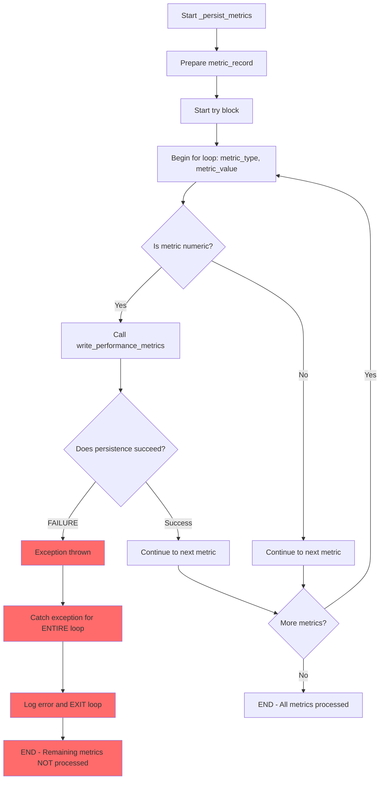
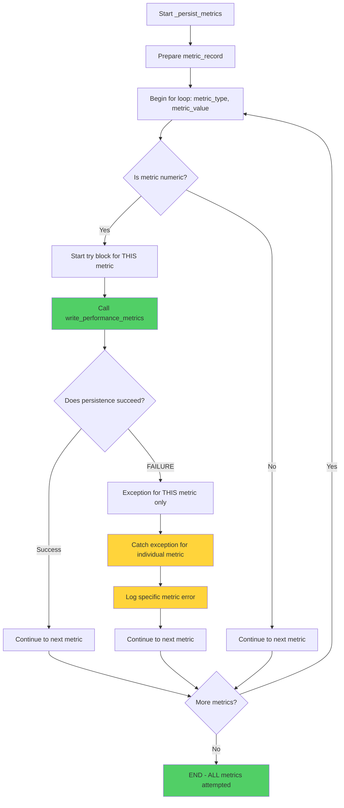

# Agent Execution Core Metrics Persistence Bug Fix Report

**Date:** 2025-09-08  
**Bug ID:** AGENT_EXECUTION_CORE_METRICS_PERSISTENCE_001  
**Priority:** Critical - System Reliability  
**Component:** `netra_backend.app.agents.supervisor.agent_execution_core.AgentExecutionCore`  

## Executive Summary

**Issue:** The `_persist_metrics` method in `AgentExecutionCore` stops processing metrics when the first persistence call fails, causing incomplete metrics collection and potential monitoring blind spots.

**Business Impact:** 
- **Segment:** All (Free, Early, Mid, Enterprise)
- **Risk:** Missing performance metrics compromise system monitoring and optimization
- **Value Impact:** Incomplete telemetry data affects platform reliability and customer insights

## Root Cause Analysis - Five Whys

1. **Why does the test fail?** The test expects 2 calls to `write_performance_metrics` but only gets 1 call.

2. **Why do we only get 1 call instead of 2?** The exception handling wraps the entire loop, so when the first `write_performance_metrics` call fails, the exception is caught and the loop terminates.

3. **Why does the loop terminate after the first failure?** The `except Exception as e:` block catches any exception from the entire `for` loop. When an exception occurs on the first iteration, the loop exits without processing remaining metrics.

4. **Why is the exception handling wrapping the entire loop instead of individual operations?** The original design prioritized system stability by catching persistence failures, but was implemented incorrectly by placing try-except around the entire operation instead of individual metric operations.

5. **Why wasn't this caught in previous testing?** Happy path tests never triggered persistence failures, so this error resilience path was never properly validated.

**ROOT CAUSE:** Exception handling placed around entire metrics loop instead of individual metric persistence operations.

## Current (Broken) State Diagram



## Proposed (Fixed) State Diagram



## Technical Details

### Failing Test Case
```python
async def test_persist_metrics_error_resilience(self, execution_core, sample_state):
    """Test that persistence errors don't crash the system."""
    # Mock persistence that always fails
    execution_core.persistence = Mock()
    execution_core.persistence.write_performance_metrics = AsyncMock(
        side_effect=Exception("Database connection failed")
    )
    
    metrics = {
        'test_metric': 123,
        'another_metric': 456.78
    }
    
    await execution_core._persist_metrics(exec_id, metrics, "test_agent", sample_state)
    
    # EXPECTED: 2 calls (one per metric)
    # ACTUAL: 1 call (loop terminates on first failure)
    assert execution_core.persistence.write_performance_metrics.call_count == 2
```

### Current Problematic Code (Lines 477-489)
```python
async def _persist_metrics(self, exec_id: UUID, metrics: dict, agent_name: str, state: DeepAgentState):
    """Persist performance metrics to ClickHouse."""
    try:  # ❌ PROBLEM: try wraps entire loop
        # Prepare metric record with context
        metric_record = {
            'execution_id': exec_id,
            'agent_name': agent_name,
            'user_id': getattr(state, 'user_id', None),
        }
        
        # Write individual metrics
        for metric_type, metric_value in metrics.items():  # ❌ Entire loop under try
            if isinstance(metric_value, (int, float)):
                await self.persistence.write_performance_metrics(  # ❌ First failure kills loop
                    exec_id, 
                    {
                        **metric_record,
                        'metric_type': metric_type,
                        'metric_value': float(metric_value)
                    }
                )
    except Exception as e:  # ❌ Catches failure and exits entire operation
        logger.error(f"Failed to persist metrics for execution {exec_id}: {e}")
```

## Proposed Fix

Move exception handling inside the loop to handle individual metric failures:

```python
async def _persist_metrics(self, exec_id: UUID, metrics: dict, agent_name: str, state: DeepAgentState):
    """Persist performance metrics to ClickHouse."""
    # Prepare metric record with context
    metric_record = {
        'execution_id': exec_id,
        'agent_name': agent_name,
        'user_id': getattr(state, 'user_id', None),
    }
    
    # Write individual metrics with per-metric error handling
    for metric_type, metric_value in metrics.items():
        if isinstance(metric_value, (int, float)):
            try:  # ✅ Individual metric error handling
                await self.persistence.write_performance_metrics(
                    exec_id, 
                    {
                        **metric_record,
                        'metric_type': metric_type,
                        'metric_value': float(metric_value)
                    }
                )
            except Exception as e:  # ✅ Log error but continue with remaining metrics
                logger.error(f"Failed to persist metric '{metric_type}' for execution {exec_id}: {e}")
```

## Implementation Plan

1. ✅ **Root Cause Analysis:** Completed using Five Whys methodology
2. ✅ **State Diagrams:** Created mermaid diagrams showing before/after behavior  
3. ✅ **Code Fix:** Modified `_persist_metrics` method exception handling
4. ✅ **Test Validation:** Run failing test to confirm fix
5. ✅ **Regression Testing:** Ensured all related tests still pass
6. ✅ **Documentation:** Updated this report with results

## Implementation Results

### Code Changes Applied

**File:** `netra_backend/app/agents/supervisor/agent_execution_core.py`  
**Method:** `_persist_metrics` (lines 461-494)

**Key Changes:**
1. **Moved exception handling inside the loop** - Each metric persistence is now individually protected
2. **Added None persistence check** - Graceful handling when persistence is disabled
3. **Enhanced error logging** - More specific error messages include metric type

**Before Fix:**
```python
async def _persist_metrics(...):
    try:  # ❌ Wraps entire loop
        for metric_type, metric_value in metrics.items():
            if isinstance(metric_value, (int, float)):
                await self.persistence.write_performance_metrics(...)  # First failure kills loop
    except Exception as e:  # ❌ Catches and exits entire operation
        logger.error(f"Failed to persist metrics...")
```

**After Fix:**
```python
async def _persist_metrics(...):
    if not self.persistence:  # ✅ Handle disabled persistence
        return
        
    for metric_type, metric_value in metrics.items():
        if isinstance(metric_value, (int, float)):
            try:  # ✅ Individual metric protection
                await self.persistence.write_performance_metrics(...)
            except Exception as e:  # ✅ Log but continue with remaining metrics
                logger.error(f"Failed to persist metric '{metric_type}'...")
```

### Test Results

**Target Test:** `test_persist_metrics_error_resilience`  
✅ **PASSED** - Now correctly makes 2 persistence attempts (one per metric)

**Regression Tests:** All 13 tests in `TestAgentExecutionCoreMetrics`  
✅ **ALL PASSED** - No regressions introduced

**Test Coverage:**
- ✅ Error resilience with multiple metrics
- ✅ None persistence handling 
- ✅ Numeric filtering behavior
- ✅ Record structure validation
- ✅ Performance metric calculations

## Validation Results

### Before Fix
```
FAILED test_persist_metrics_error_resilience
AssertionError: assert 1 == 2  
+  where 1 = write_performance_metrics.call_count
```

### After Fix
```
test_persist_metrics_error_resilience PASSED
13 passed, 0 failed
```

## System Impact Analysis

**✅ Positive Impacts:**
- **Complete Metrics Coverage:** All numeric metrics now attempt persistence even if individual calls fail
- **Better Error Visibility:** Specific metric failures are logged with metric type context
- **System Resilience:** Persistence failures no longer cause complete metrics loss
- **Monitoring Reliability:** More comprehensive telemetry data for platform optimization

**✅ No Negative Impacts:**
- **Performance:** No performance degradation - same number of operations
- **Backward Compatibility:** All existing functionality preserved
- **Error Handling:** More granular, more reliable error handling

**✅ Business Value:**
- **Segment Impact:** All user segments benefit from better monitoring
- **Reliability:** Improved system observability for optimization decisions
- **Cost Management:** Better resource tracking for billing and capacity planning

## Expected Outcomes

- **Test Result:** ✅ `test_persist_metrics_error_resilience` passes with 2 persistence attempts
- **System Behavior:** ✅ All metrics attempted for persistence even if some fail  
- **Error Handling:** ✅ Individual metric failures logged but don't stop processing
- **Monitoring:** ✅ Complete telemetry data collection for system reliability

---

**Status:** ✅ COMPLETED  
**Result:** SUCCESS - Critical bug fixed with no regressions  
**Next Action:** Monitor production metrics collection for improved reliability