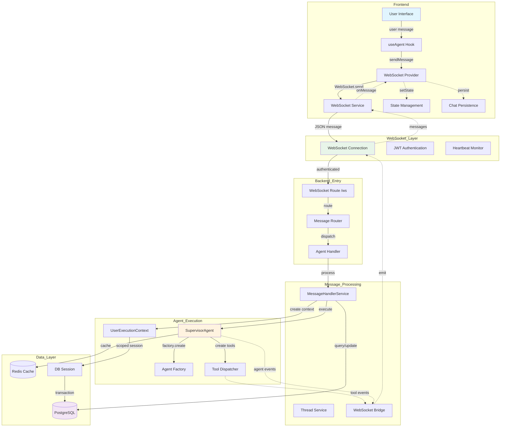
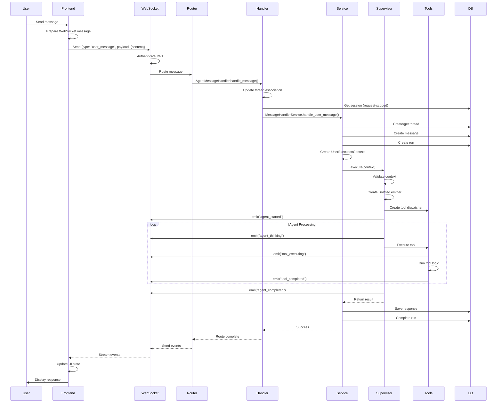

# Complete Agent Flow Trace: Frontend to Backend and Back

## Executive Summary
This document traces the complete flow of an agent request from frontend initiation through WebSocket connection, backend processing, and event streaming back to the frontend with every parameter and configuration detail.

## System Architecture Diagram



## Sequence Diagram: Complete Agent Request Flow



## 1. Frontend Agent Request Initiation

### 1.1 User Action Trigger
**Location**: `frontend/hooks/useAgent.ts:10-18`
```typescript
const sendUserMessage = useCallback((text: string) => {
  const message = {
    type: 'user_message' as const,
    payload: {
      content: text,  // User's input text
    },
  };
  webSocket?.sendMessage(message);
}, [webSocket]);
```

**Parameters**:
- `text`: User's message content (string)
- `type`: Fixed as 'user_message' or 'start_agent'
- `payload.content`: The actual message text
- Optional: `thread_id`, `context`, `settings` for start_agent

### 1.2 WebSocket Provider Message Preparation
**Location**: `frontend/providers/WebSocketProvider.tsx:40-106`

The WebSocketProvider handles:
- Message reconciliation via `reconciliationService.processConfirmation(newMessage)`
- Thread management (creates/updates `thread_id`)
- Message persistence via `chatStatePersistence`
- Duplicate detection using `message_id`
- Message queuing (max 500 messages retained)

**Key Data Structures**:
```typescript
interface WebSocketMessage {
  type: string;
  payload: {
    content?: string;
    thread_id?: string;
    message_id?: string;
    timestamp?: number;
    result?: string;
  };
}
```

## 2. WebSocket Connection Establishment

### 2.1 Connection Setup
**Location**: `frontend/providers/WebSocketProvider.tsx:115-200`

**Connection Flow**:
1. **URL Construction**:
   - Base: `appConfig.wsUrl` or `${appConfig.apiUrl.replace(/^http/, 'ws')}/ws`
   - Secure URL via `webSocketService.getSecureUrl(baseWsUrl)`
   - Auth via JWT in subprotocol or header

2. **Connection Parameters**:
   ```typescript
   {
     token: currentToken || undefined,
     refreshToken: async () => unifiedAuthService.getWebSocketAuthConfig().refreshToken(),
     onOpen: () => connectionStateRef.current = 'connected',
     onError: (error) => handleAuthError(error),
     heartbeat_interval: 30-45 seconds (env-dependent),
     max_message_size: 8192 bytes
   }
   ```

### 2.2 Authentication
**Backend Location**: `netra_backend/app/routes/websocket.py:153-280`

**Authentication Methods**:
1. **Subprotocol**: `Sec-WebSocket-Protocol: jwt.<base64url_encoded_token>`
2. **Authorization Header**: `Bearer <jwt_token>`

**Process**:
1. Accept WebSocket with subprotocol if available (line 157-168)
2. Authenticate via `secure_websocket_context` (line 283)
3. Register connection with manager (line 301)
4. Start heartbeat monitoring (line 310-314)

## 3. Backend WebSocket Message Routing

### 3.1 Message Reception and Routing
**Location**: `netra_backend/app/routes/websocket.py:438-581`

**Message Flow**:
1. **Receive**: `raw_message = await websocket.receive_text()` (line 473-476)
2. **Validate Size**: Max 8192 bytes (line 482-487)
3. **Parse JSON**: `message_data = json.loads(raw_message)` (line 491)
4. **Route**: `await message_router.route_message(user_id, websocket, message_data)` (line 506)

### 3.2 Agent Handler Registration
**Location**: `netra_backend/app/routes/websocket.py:179-279`

**Handler Setup**:
```python
# Create handler with dependencies
message_handler_service = MessageHandlerService(supervisor, thread_service, ws_manager)
agent_handler = AgentMessageHandler(message_handler_service, websocket)

# Register with router
message_router.add_handler(agent_handler)
```

## 4. Agent Message Processing

### 4.1 AgentMessageHandler Processing
**Location**: `netra_backend/app/websocket_core/agent_handler.py:50-198`

**Key Steps**:
1. **Thread Association Update** (lines 54-68):
   ```python
   if thread_id:
       ws_manager.update_connection_thread(connection_id, thread_id)
   ```

2. **Database Session Management** (lines 71-90):
   ```python
   async for db_session in get_request_scoped_db_session():
       success = await self._route_agent_message(user_id, message, db_session)
   ```

3. **Message Type Routing** (lines 104-110):
   - `START_AGENT` → `_handle_start_agent()`
   - `USER_MESSAGE`/`CHAT` → `_handle_user_message()`

### 4.2 MessageHandlerService Processing
**Location**: `netra_backend/app/services/message_handlers.py:88-306`

**Processing Flow for start_agent**:
1. **Thread Management** (lines 96-110):
   - Get/create thread
   - Update WebSocket connection-thread mapping
   
2. **Agent Request Processing** (lines 143-177):
   ```python
   # Create user message
   await self._create_user_message(thread, user_request, user_id, db_session)
   
   # Create run
   run = await self._create_run(thread, db_session)
   
   # Configure supervisor with WebSocket manager
   self._configure_supervisor(user_id, thread, db_session)
   if self.websocket_manager:
       self.supervisor.agent_registry.set_websocket_manager(self.websocket_manager)
   
   # Execute supervisor
   response = await self._execute_supervisor(user_request, thread, user_id, run, db_session)
   ```

3. **Run-Thread Mapping Registration** (lines 217-246):
   ```python
   bridge = await get_agent_websocket_bridge()
   await bridge.register_run_thread_mapping(
       run_id=run.id,
       thread_id=thread.id,
       metadata={"user_id": user_id, "user_request": user_request[:100]}
   )
   ```

## 5. SupervisorAgent Execution

### 5.1 UserExecutionContext Pattern
**Location**: `netra_backend/app/agents/supervisor_consolidated.py:122-200`

**Execution with Complete Isolation**:
```python
async def execute(self, context: UserExecutionContext, stream_updates: bool = False):
    # Validate context
    context = validate_user_context(context)
    
    # Create isolated WebSocket emitter
    websocket_emitter = IsolatedWebSocketEventEmitter.create_for_user(
        user_id=context.user_id,
        thread_id=context.thread_id,
        run_id=context.run_id,
        websocket_manager=self.websocket_bridge.websocket_manager
    )
    
    # Create isolated tool system
    tool_system = await UserContextToolFactory.create_user_tool_system(
        context=context,
        tool_classes=tool_classes,
        websocket_bridge_factory=websocket_bridge_factory
    )
    
    # Store isolated components
    self.tool_dispatcher = tool_system['dispatcher']
    self.user_tool_registry = tool_system['registry']
```

### 5.2 WebSocket Event Emission Points
**Critical Events** (as per `netra_backend/app/websocket_core/agent_handler.py`):

1. **agent_started**: When agent begins processing
2. **agent_thinking**: Real-time reasoning visibility
3. **tool_executing**: Tool usage transparency
4. **tool_completed**: Tool results display
5. **agent_completed**: Final response ready

## 6. Tool Execution and Events

### 6.1 Tool Dispatcher Architecture
**Location**: `netra_backend/app/agents/tool_dispatcher.py`

**Request-Scoped Tool Dispatcher Creation**:
```python
def create_request_scoped_tool_dispatcher(
    user_context: UserExecutionContext,
    websocket_manager: Optional[WebSocketManager] = None,
    tools: Optional[List[BaseTool]] = None
) -> UnifiedToolDispatcher:
    return UnifiedToolDispatcherFactory.create_for_request(
        user_context=user_context,
        websocket_manager=websocket_manager,
        tools=tools
    )
```

**Features**:
- Per-request isolation (no shared state)
- WebSocket events for ALL tool executions
- Clean separation: Registry, Execution, Events, Permissions

## 7. WebSocket Events Back to Frontend

### 7.1 Backend Event Emission
**Location**: `netra_backend/app/websocket_core/unified_manager.py:112-127`

```python
async def emit_critical_event(self, user_id: str, event_type: str, data: Dict[str, Any]):
    message = {
        "type": event_type,
        "data": data,
        "timestamp": datetime.utcnow().isoformat()
    }
    await self.send_to_user(user_id, message)
```

### 7.2 Frontend Event Reception
**Location**: `frontend/services/webSocketService.ts:117-186`

**Message Type Validation**:
```typescript
// Agent message types
const agentTypes = [
  'agent_started', 'tool_executing', 'agent_thinking', 
  'partial_result', 'agent_completed', 'agent_response', 
  'agent_progress', 'agent_error'
];

// Backend to frontend field mapping
if (!obj.payload && obj.data) {
  obj.payload = obj.data;  // Convert backend 'data' to frontend 'payload'
}
```

### 7.3 WebSocket Provider Event Processing
**Location**: `frontend/providers/WebSocketProvider.tsx:41-105`

**Event Processing Flow**:
1. **Message Reception**: Via WebSocket `onmessage` handler
2. **Reconciliation**: `reconciliationService.processConfirmation(newMessage)`
3. **Thread Updates**: Update `currentThreadIdRef` for thread events
4. **State Updates**: Update React state via `setMessages()`
5. **Persistence**: Save to `chatStatePersistence` for user/assistant messages

## 8. Complete Parameter Flow Summary

### Request Flow Parameters:
```
Frontend → Backend:
{
  type: "user_message" | "start_agent",
  payload: {
    content: string,
    thread_id?: string,
    context?: object,
    settings?: object,
    references?: array
  }
}

Backend Processing:
- user_id: From JWT auth
- thread_id: Created/validated
- run_id: Generated for execution
- db_session: Request-scoped AsyncSession
- websocket: Active WebSocket instance
- connection_id: Unique connection identifier

Backend → Frontend Events:
{
  type: "agent_started" | "agent_thinking" | "tool_executing" | etc,
  data/payload: {
    agent_name?: string,
    thought?: string,
    tool_name?: string,
    tool_args?: object,
    result?: any,
    error?: string,
    thread_id: string,
    message_id?: string,
    timestamp: ISO string
  }
}
```

### Configuration Parameters:

**WebSocket Configuration**:
- `heartbeat_interval`: 25-45 seconds (env-dependent)
- `connection_timeout`: 300-900 seconds
- `max_message_size`: 8192 bytes
- `max_message_rate`: 30-1000 msg/min (env-dependent)
- `max_connections_per_user`: 3

**Execution Configuration**:
- `MAX_CONCURRENT_AGENTS`: 10
- `AGENT_EXECUTION_TIMEOUT`: 30 seconds
- `MAX_HISTORY_SIZE`: 100 messages
- Message retention: 500 messages (frontend)

## 9. Critical Integration Points

### 9.1 Thread Association
The thread_id is critical for routing WebSocket events back to the correct user connection. It's established at multiple points:
1. Frontend sends thread_id in message
2. AgentMessageHandler updates connection-thread mapping
3. MessageHandlerService confirms association before processing
4. SupervisorAgent maintains association through execution

### 9.2 WebSocket Manager Propagation
The WebSocketManager must be passed through the entire chain:
1. Set on MessageHandlerService constructor
2. Passed to SupervisorAgent via agent_registry
3. Used by AgentInstanceFactory for sub-agents
4. Available to ToolDispatcher for tool events

### 9.3 Database Session Lifecycle
Each request gets its own AsyncSession:
- Created via `get_request_scoped_db_session()`
- Passed through UserExecutionContext
- Auto-closed after request completion
- Never shared between requests

## 10. Critical Errors, Single Points of Failure, and Weaknesses

### 10.1 🔴 CRITICAL ERRORS DETECTED

#### Error 1: Missing WebSocket Connection Check
**Location**: `frontend/hooks/useAgent.ts:18`
```typescript
webSocket?.sendMessage(message);  // ❌ No error handling if websocket is null
```
**Impact**: Silent failures when WebSocket is disconnected
**Fix Required**: Add connection state check and user feedback

#### Error 2: Race Condition in Thread Association
**Location**: `netra_backend/app/services/message_handlers.py:102-110`
```python
# Thread association AFTER WebSocket setup - creates race condition
if thread and self.websocket_manager and websocket:
    connection_id = self.websocket_manager.get_connection_id_by_websocket(websocket)
    # ❌ Delay here can cause events to be lost
    await asyncio.sleep(0.01)  # Small delay to ensure propagation
```
**Impact**: Initial agent events may not reach frontend
**Fix Required**: Establish association before any async operations

#### Error 3: Fallback Handler Security Risk
**Location**: `netra_backend/app/routes/websocket.py:590-648`
```python
def _create_fallback_agent_handler(websocket: WebSocket = None):
    # ❌ Fallback handler bypasses authentication and security checks
    # Sends arbitrary responses without validation
```
**Impact**: Security vulnerability in development/testing environments
**Fix Required**: Add authentication checks even in fallback mode

#### Error 4: Uncaught Database Session Errors
**Location**: `netra_backend/app/websocket_core/agent_handler.py:71-90`
```python
async for db_session in get_request_scoped_db_session():
    # ❌ No handling if session creation fails
    success = await self._route_agent_message(user_id, message, db_session)
```
**Impact**: Complete request failure without proper error messaging
**Fix Required**: Add try-catch with user-friendly error responses

### 10.2 ⚠️ SINGLE POINTS OF FAILURE

#### SPOF 1: WebSocketManager Global Instance
**Location**: `netra_backend/app/websocket_core/unified_manager.py:152-160`
```python
_manager_instance = None  # ❌ Global singleton

def get_websocket_manager() -> UnifiedWebSocketManager:
    global _manager_instance
    if _manager_instance is None:
        _manager_instance = UnifiedWebSocketManager()
    return _manager_instance
```
**Impact**: If manager crashes, ALL WebSocket connections fail
**Mitigation**: Implement manager redundancy and health checks

#### SPOF 2: Message Router Single Instance
**Location**: `netra_backend/app/routes/websocket.py:393-415`
```python
message_router = get_message_router()  # ❌ Single router for all connections
```
**Impact**: Router failure blocks ALL message processing
**Mitigation**: Per-connection routers or router pool

#### SPOF 3: Database Connection Pool
**Impact**: No fallback if PostgreSQL becomes unavailable
**Current State**: No caching layer for read operations
**Mitigation**: Implement Redis read-through cache

#### SPOF 4: AgentWebSocketBridge
**Location**: `netra_backend/app/services/message_handlers.py:217-246`
```python
bridge = await get_agent_websocket_bridge()  # ❌ Single bridge instance
```
**Impact**: Bridge failure prevents ALL agent events
**Mitigation**: Implement bridge pool with failover

### 10.3 🟡 ARCHITECTURAL WEAKNESSES

#### Weakness 1: Message Size Limitation
**Constraint**: 8192 bytes max message size
```python
max_message_size_bytes=8192  # ❌ Too small for complex agent responses
```
**Impact**: Large responses get truncated or fail
**Solution**: Implement message chunking or increase limit

#### Weakness 2: No Message Priority Queue
**Current**: All messages processed FIFO
**Impact**: Critical errors can be delayed behind normal messages
**Solution**: Implement priority-based message queue

#### Weakness 3: Thread ID Dependency
**Issue**: Events routed solely by thread_id mapping
```python
ws_manager.update_connection_thread(connection_id, thread_id)
```
**Impact**: Lost events if mapping fails
**Solution**: Fallback to user_id based routing

#### Weakness 4: Heartbeat Timeout Vulnerability
**Configuration**: 25-90 seconds depending on environment
**Issue**: Long agent operations can trigger false disconnections
**Solution**: Separate heartbeat from processing timeout

### 10.4 🔶 PERFORMANCE BOTTLENECKS

#### Bottleneck 1: Synchronous Handler Registration
**Location**: `netra_backend/app/routes/websocket.py:219`
```python
message_router.add_handler(agent_handler)  # ❌ Blocks during registration
```
**Impact**: Connection setup delays under load
**Solution**: Async handler registration

#### Bottleneck 2: Sequential Event Emission
**Issue**: Events sent one by one to each connection
```python
for conn_id in connection_ids:
    await connection.websocket.send_json(message)  # ❌ Sequential
```
**Impact**: Slow broadcast to multiple users
**Solution**: Parallel emission with asyncio.gather()

#### Bottleneck 3: No Connection Pooling
**Issue**: Each WebSocket creates new resources
**Impact**: Memory overhead with many connections
**Solution**: Resource pooling for handlers and sessions

### 10.5 🔷 RELIABILITY CONCERNS

#### Concern 1: No Event Replay Mechanism
**Issue**: Lost events cannot be recovered
**Impact**: Incomplete agent execution visibility
**Solution**: Event log with replay capability

#### Concern 2: Missing Circuit Breakers
**Issue**: Failed services keep getting called
**Impact**: Cascading failures
**Solution**: Implement circuit breaker pattern

#### Concern 3: No Rate Limiting Per Operation
**Current**: Global rate limit only
**Impact**: Single expensive operation can block user
**Solution**: Per-operation rate limits

### 10.6 🟣 DATA CONSISTENCY ISSUES

#### Issue 1: Race Condition in Message Persistence
**Location**: `frontend/providers/WebSocketProvider.tsx:90-103`
```typescript
// ❌ State updates not atomic
setMessages((prevMessages) => [...prevMessages, newMessage]);
chatStatePersistence.updateMessages(chatMessages);
```
**Impact**: Messages can be lost or duplicated
**Solution**: Atomic state transaction

#### Issue 2: No Transaction Boundaries
**Issue**: Multiple DB operations not wrapped in transaction
```python
await self._create_user_message(...)  # Separate operation
run = await self._create_run(...)      # Could fail independently
```
**Impact**: Partial state on failures
**Solution**: Wrap in database transaction

### 10.7 📊 MONITORING GAPS

1. **No metrics on**:
   - WebSocket reconnection frequency
   - Message processing latency percentiles
   - Handler registration/cleanup success rates
   - Thread association success rates

2. **Missing alerts for**:
   - Sustained high error rates
   - Memory leaks in message queues
   - Database connection pool exhaustion
   - WebSocket manager degradation

### 10.8 🔧 RECOMMENDED FIXES PRIORITY

**Priority 1 (Immediate)**:
1. Add WebSocket connection checks in frontend
2. Fix thread association race condition
3. Add database session error handling
4. Implement WebSocketManager health checks

**Priority 2 (Short-term)**:
1. Increase message size limit or add chunking
2. Implement priority message queue
3. Add circuit breakers
4. Create event replay mechanism

**Priority 3 (Long-term)**:
1. Refactor to eliminate global singletons
2. Implement connection pooling
3. Add comprehensive monitoring
4. Create redundancy for critical components

## Conclusion

While the agent flow implements good user isolation through request-scoped sessions and isolated tool dispatchers, there are critical reliability and performance issues that need addressing. The architecture's heavy reliance on global singletons (WebSocketManager, MessageRouter, AgentWebSocketBridge) creates multiple single points of failure that could bring down the entire system.

**Key Strengths**:
- Request-scoped database sessions prevent data leakage
- Per-user WebSocket emitters provide isolation
- Factory-enforced component creation ensures consistency
- Thread-based event routing enables targeted messaging

**Critical Weaknesses**:
- Multiple single points of failure with no redundancy
- Race conditions in critical paths (thread association)
- No error recovery mechanisms (circuit breakers, event replay)
- Limited monitoring and alerting capabilities
- Performance bottlenecks under concurrent load

**Recommendation**: Prioritize fixing the critical errors and single points of failure before scaling to production load. Implement comprehensive monitoring to detect issues before they impact users.