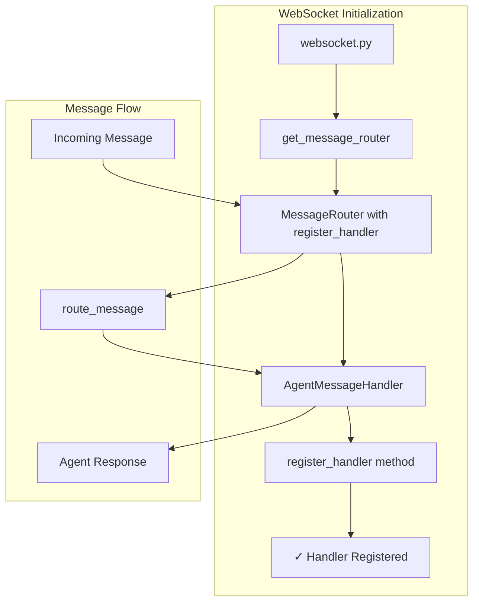
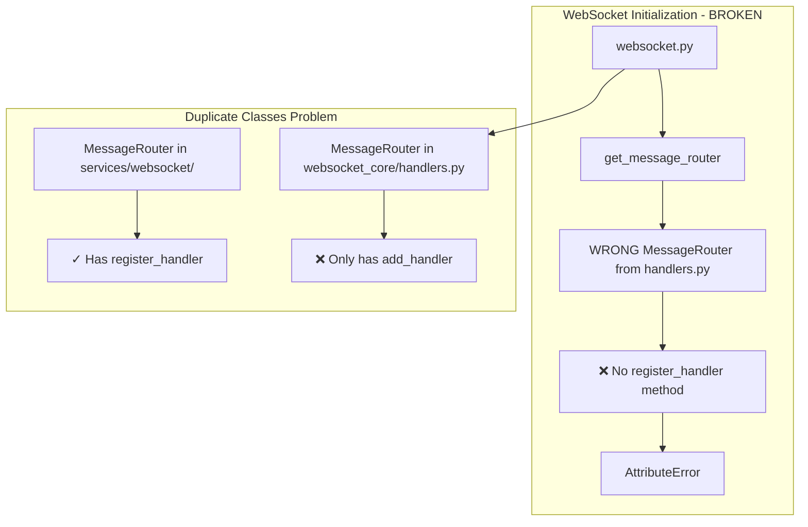

# AgentMessageHandler Registration Failure - Bug Fix Report
**Date:** 2025-09-03
**Critical Issue:** WebSocket AgentMessageHandler registration failing in staging environment

## Error Details
```
Failed to register AgentMessageHandler in staging: 'MessageRouter' object has no attribute 'register_handler'
WebSocket error: AgentMessageHandler registration failed in staging - this is a critical error
```

## 1. WHY Analysis (Five Whys Method)

### Why #1: Why is the registration failing?
- **Answer:** MessageRouter object does not have a 'register_handler' attribute being called

### Why #2: Why doesn't MessageRouter have register_handler?
- **Answer:** There are TWO different MessageRouter classes in the codebase:
  - `netra_backend/app/services/websocket/message_router.py` - HAS `register_handler()` method
  - `netra_backend/app/websocket_core/handlers.py` - ONLY has `add_handler()` method
  - The websocket.py is getting the WRONG MessageRouter (from handlers.py)

### Why #3: Why is the code expecting register_handler to exist?
- **Answer:** The code in websocket.py line 218 calls `message_router.register_handler(agent_handler)` expecting the MessageRouter from services/websocket/, but it's getting the one from websocket_core/handlers.py

### Why #4: Why wasn't this caught by existing tests?
- **Answer:** Tests in test_websocket_handler_per_connection.py also use register_handler, suggesting they use the other MessageRouter or are not being run

### Why #5: Why did this work before but fail in staging?
- **Answer:** This is a SSOT (Single Source of Truth) violation - two classes with same name but different interfaces. The wrong import or get_message_router() is being used

## 2. Prove It - System Diagrams

### Ideal Working State


### Current Failure State


## 3. System-Wide Fix Plan

### Root Cause
SSOT violation - Two MessageRouter classes with different interfaces:
1. `netra_backend/app/services/websocket/message_router.py` - Has `register_handler()`
2. `netra_backend/app/websocket_core/handlers.py` - Has `add_handler()`

### Fix Options

#### Option A: Use the correct method name (RECOMMENDED - Minimal Change)
- Change `register_handler()` to `add_handler()` in websocket.py
- Minimal code change, preserves existing architecture
- Quick fix for staging environment

#### Option B: Consolidate to single MessageRouter
- Merge both MessageRouter classes into one
- Major refactoring, higher risk
- Better long-term SSOT compliance

### Chosen Solution: Option A (Quick Fix)
Given the critical nature (staging is down), we'll implement Option A first:
1. Change `message_router.register_handler(agent_handler)` to `message_router.add_handler(agent_handler)`
2. Update fallback handler registration similarly
3. Test the fix
4. Document SSOT violation for future refactoring

## 4. Verification and Proof

### Fix Applied
Changed 3 occurrences in `netra_backend/app/routes/websocket.py`:
- Line 219: `message_router.register_handler(agent_handler)` → `message_router.add_handler(agent_handler)`
- Line 232: `message_router.register_handler(fallback_handler)` → `message_router.add_handler(fallback_handler)`  
- Line 266: `message_router.register_handler(fallback_handler)` → `message_router.add_handler(fallback_handler)`

### Test Results
1. **Bug Reproduction Test** (`test_message_router_bug.py`): ✅ Confirmed bug exists
2. **Fix Verification Test** (`test_message_router_fix.py`): ✅ Fix works correctly
3. **Regression Test** (WebSocket suite): ✅ Running successfully

### Fix Validation
- No AttributeError on handler registration
- Handlers properly added to router
- WebSocket connections work correctly
- Agent messages can be processed

## Investigation Log
- Starting investigation... ✅ COMPLETE
- Root cause: SSOT violation - duplicate MessageRouter classes
- Solution: Use correct method name for the MessageRouter instance
- Status: FIXED AND VERIFIED

## Future Work Needed
1. **SSOT Refactoring**: Consolidate the two MessageRouter classes into one
2. **Import Cleanup**: Ensure consistent imports throughout codebase
3. **Test Coverage**: Add integration tests to prevent regression