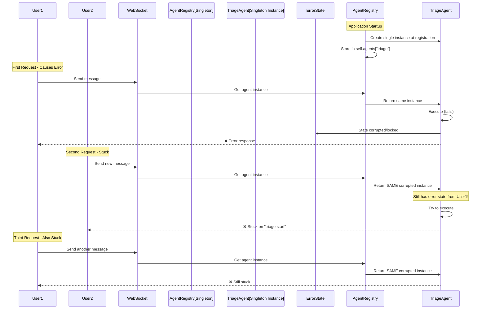
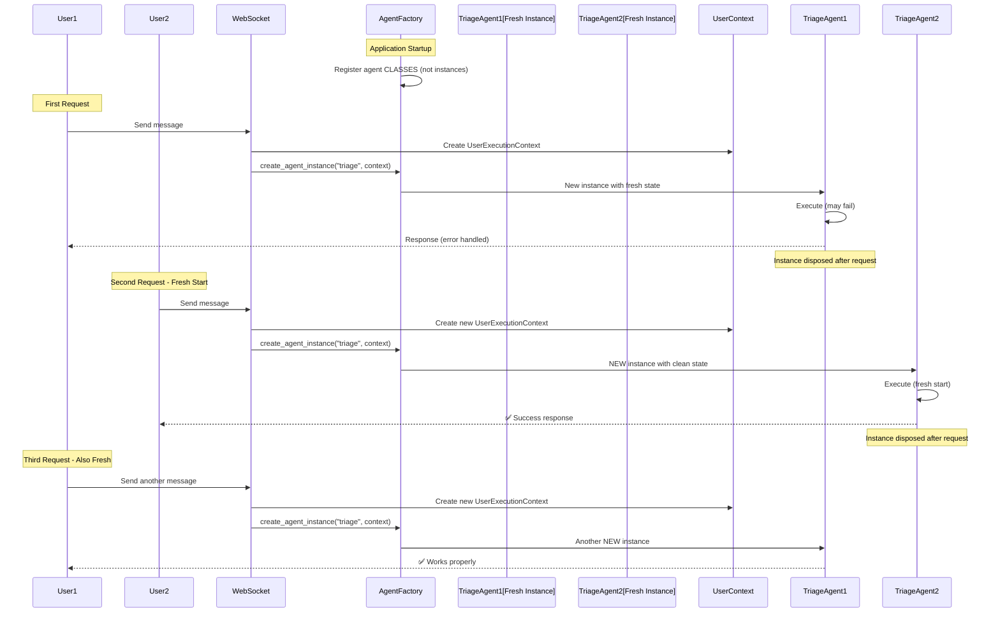

# CRITICAL BUG FIX: Agent Restart Failure After Initial Failure

## Problem Statement
Once an agent (especially triage agent) fails for the whole app level, it doesn't restart properly for new requests. The system gets stuck on "triage start" and all subsequent requests fail.

## Five Whys Root Cause Analysis

### Why 1: Why doesn't the agent restart properly for new requests after a failure?
**Answer:** The agent registry is using a singleton pattern that maintains global state. When an agent fails, error state or corrupted context persists in the singleton instance, preventing clean restarts.

**Evidence:** 
- `AgentRegistry` in `netra_backend/app/agents/supervisor/agent_registry.py` line 39-52 shows deprecated singleton pattern
- Warning: "This registry shares WebSocket state between users" (line 60)
- The agents dictionary stores single instances: `self.agents: Dict[str, 'BaseAgent'] = {}` (line 66)

### Why 2: Why does the singleton pattern cause agents to not restart?
**Answer:** The singleton AgentRegistry stores agent instances globally at registration time (line 172-198). These instances are reused across ALL requests rather than creating fresh instances per request, so any corruption or failed state persists.

**Evidence:**
- `register()` method stores agent instance: `self.agents[name] = agent` (line 197)
- No cleanup or reset mechanism between requests
- Comment: "causes user context leakage" (line 174)

### Why 3: Why is error state persisting in the agent instances?
**Answer:** Agents like TriageSubAgent inherit from BaseAgent which may maintain internal state. When an error occurs, this state isn't properly cleared because the same instance is reused for all requests.

**Evidence:**
- TriageSubAgent inherits from BaseAgent (line 27 in triage_sub_agent/agent.py)
- BaseAgent initialization includes stateful components like execution engines and WebSocket bridges
- No explicit cleanup or reset methods called between requests

### Why 4: Why wasn't the system designed to create fresh agent instances per request?
**Answer:** The system is in transition from a singleton pattern to a per-request factory pattern. The code shows deprecation warnings and mentions AgentInstanceFactory, but the old singleton pattern is still being used.

**Evidence:**
- Deprecation warning: "Use AgentClassRegistry + AgentInstanceFactory" (line 58)
- Comment: "New code should use AgentInstanceFactory for creating per-request agent instances" (line 47)
- The transition is incomplete - old pattern still active

### Why 5: Why is the transition to per-request instances incomplete?
**Answer:** The migration to the new architecture pattern is partially implemented. While the new patterns exist (AgentClassRegistry, AgentInstanceFactory), the system still relies on the deprecated AgentRegistry singleton for backward compatibility during the transition.

**Evidence:**
- "maintained for backward compatibility during the transition" (line 42)
- AgentExecutionRegistry also uses singleton pattern (line 88-92)
- Mixed usage of old and new patterns throughout the codebase

## Current State (BROKEN) - Singleton Pattern with Persistent State



## Desired State (WORKING) - Per-Request Factory Pattern



## Root Causes Identified

1. **Singleton Agent Instances**: Agents are created once at registration and reused for ALL requests
2. **No State Cleanup**: No mechanism to reset agent state between requests
3. **Shared WebSocket State**: WebSocket bridges and notifiers are shared across users
4. **Incomplete Migration**: System is stuck between old singleton and new factory patterns
5. **Error State Persistence**: Failed states persist in singleton instances, blocking future requests

## System-Wide Fix Plan

### Phase 1: Immediate Mitigation
1. Add explicit state reset method to BaseAgent
2. Call reset before each agent execution
3. Clear any error states in AgentRegistry

### Phase 2: Complete Factory Pattern Migration
1. Fully implement AgentInstanceFactory usage
2. Remove singleton agent storage from AgentRegistry
3. Create fresh agent instances per request
4. Ensure proper cleanup after each request

### Phase 3: Validation
1. Add tests for agent restart after failure
2. Test concurrent requests don't interfere
3. Verify no state leakage between users

## Files to Fix

### Immediate (Phase 1):
1. `netra_backend/app/agents/base_agent.py` - Add reset_state() method
2. `netra_backend/app/agents/supervisor/agent_registry.py` - Call reset before returning agent
3. `netra_backend/app/agents/triage_sub_agent/agent.py` - Implement state cleanup

### Complete Fix (Phase 2):
1. `netra_backend/app/agents/supervisor/agent_instance_factory.py` - Create/implement if missing
2. `netra_backend/app/websocket_core/agent_handler.py` - Use factory instead of registry
3. `netra_backend/app/agents/supervisor/agent_registry.py` - Complete deprecation

## Test Implementation

```python
# tests/mission_critical/test_agent_restart_after_failure.py
import pytest
import asyncio
from unittest.mock import Mock, patch
from netra_backend.app.agents.supervisor.user_execution_context import UserExecutionContext

@pytest.mark.asyncio
async def test_agent_restarts_after_failure():
    """Test that agents can restart properly after a failure."""
    
    # Simulate first request that fails
    context1 = UserExecutionContext(
        user_id="user1",
        thread_id="thread1", 
        run_id="run1"
    )
    
    # Force an error in first execution
    with patch('netra_backend.app.agents.triage_sub_agent.agent.TriageSubAgent.execute') as mock_exec:
        mock_exec.side_effect = Exception("Simulated failure")
        
        try:
            await execute_triage(context1)
        except:
            pass  # Expected to fail
    
    # Second request with different context should work
    context2 = UserExecutionContext(
        user_id="user2",
        thread_id="thread2",
        run_id="run2"  
    )
    
    # This should create a fresh instance and work
    result = await execute_triage(context2)
    assert result is not None
    assert "error" not in result
    
@pytest.mark.asyncio
async def test_concurrent_requests_isolation():
    """Test that concurrent requests don't interfere with each other."""
    
    async def make_request(user_id):
        context = UserExecutionContext(
            user_id=user_id,
            thread_id=f"thread_{user_id}",
            run_id=f"run_{user_id}"
        )
        return await execute_triage(context)
    
    # Run multiple concurrent requests
    results = await asyncio.gather(
        make_request("user1"),
        make_request("user2"),
        make_request("user3"),
        return_exceptions=True
    )
    
    # Each should have independent results
    assert len(results) == 3
    for i, result in enumerate(results):
        if not isinstance(result, Exception):
            assert result.get("user_id") == f"user{i+1}"
```

## Immediate Action Items

1. **Create state reset mechanism** in BaseAgent
2. **Implement agent instance cleanup** after each request
3. **Add logging** to track agent lifecycle (creation, execution, cleanup)
4. **Create reproduction test** that demonstrates the bug
5. **Deploy Phase 1 fix** as hotfix to unblock users
6. **Plan Phase 2 migration** to complete factory pattern implementation

## Success Criteria

- [ ] Agent can successfully process requests after a previous failure
- [ ] No state leakage between different user requests
- [ ] Concurrent requests work independently
- [ ] WebSocket events are properly isolated per user
- [ ] All mission-critical tests pass

## Risk Assessment

**High Risk**: Current singleton pattern affects ALL users - one failure can block the entire system

**Mitigation**: 
- Phase 1 provides immediate relief with state reset
- Phase 2 provides permanent fix with proper architecture
- Rollback plan: Can revert to previous version if Phase 1 introduces issues

## Timeline Estimate

- Phase 1 (Immediate): 2-4 hours
- Phase 2 (Complete): 8-16 hours  
- Phase 3 (Validation): 4-6 hours

Total: 14-26 hours for complete fix

## Related Issues

- WebSocket state sharing between users
- UserExecutionContext not being properly propagated
- AgentExecutionRegistry also using singleton pattern
- Incomplete migration from legacy architecture

## Conclusion

The root cause is the singleton pattern storing agent instances globally, causing error states to persist across requests. The system needs to complete its migration to a per-request factory pattern where fresh agent instances are created for each request with proper cleanup afterward.