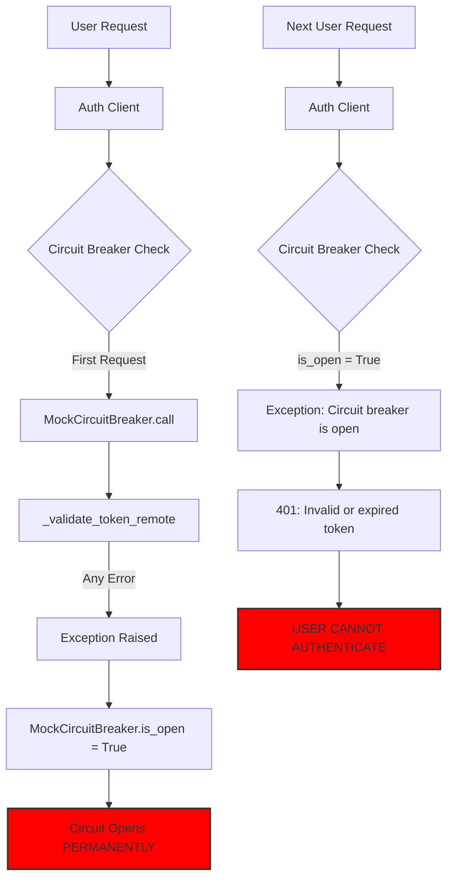
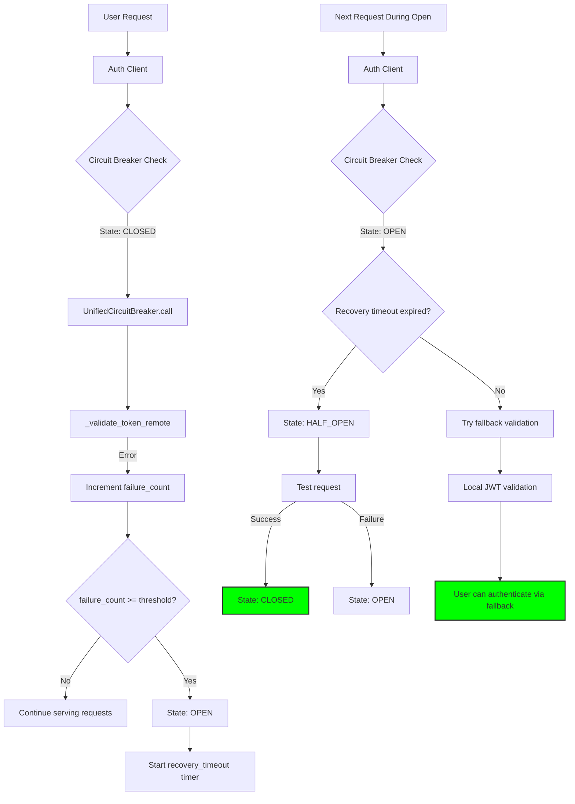

# Auth Circuit Breaker Critical Bug Fix Report - 2025-09-05

## Executive Summary
**CRITICAL**: Authentication failures are occurring in production due to a circuit breaker implementation bug that causes permanent failure states after any single error. This prevents users from authenticating and accessing the system.

## Five Whys Root Cause Analysis

### Problem: Users cannot authenticate - "Circuit breaker _validate_token_remote_breaker is open"

**Why #1**: Circuit breaker is open and blocking all authentication requests
- Evidence: `Circuit breaker _validate_token_remote_breaker is open` error in logs

**Why #2**: The circuit breaker opened after a single error and never recovered
- Evidence: MockCircuitBreaker implementation opens on ANY error (line 426: `self.is_open = True`)
- No automatic recovery mechanism exists

**Why #3**: MockCircuitBreaker is being used instead of UnifiedCircuitBreaker
- Evidence: `auth_client_cache.py:386: self._breakers[name] = MockCircuitBreaker(name)`
- UnifiedCircuitBreaker exists but is not integrated

**Why #4**: The migration from MockCircuitBreaker to UnifiedCircuitBreaker was documented but never completed
- Evidence: `auth_circuit_breaker_fixes_2025.xml` mentions migration but code still uses MockCircuitBreaker
- Issue #4 in learnings file claims migration complete but it's not

**Why #5**: Lack of verification after implementing fixes - the implementation was marked complete without actual testing
- Root Cause: **Incomplete implementation and insufficient verification processes**

## Current State vs Expected State Diagrams

### Current State (BROKEN)


### Expected State (WORKING)


## Bug Details

### 1. MockCircuitBreaker Never Recovers
**File**: `netra_backend/app/clients/auth_client_cache.py`
**Lines**: 403-427

```python
class MockCircuitBreaker:
    async def call(self, func, *args, **kwargs):
        if self.is_open:
            raise Exception(f"Circuit breaker {self.name} is open")  # PERMANENT BLOCK
        try:
            # ...execute function...
        except Exception as e:
            self.is_open = True  # OPENS ON ANY ERROR, NEVER CLOSES
            raise
```

**Problems**:
- Opens on first error (no threshold)
- Never automatically closes (no recovery timeout)
- No half-open state for testing recovery
- No metrics or observability

### 2. AuthCircuitBreakerManager Creates Wrong Type
**File**: `netra_backend/app/clients/auth_client_cache.py`
**Line**: 386

```python
def get_breaker(self, name: str) -> Any:
    if name not in self._breakers:
        self._breakers[name] = MockCircuitBreaker(name)  # WRONG TYPE!
```

Should be using `UnifiedCircuitBreaker` with proper configuration.

### 3. Missing Service Secret Causes Initial Failures
**Evidence**: Logs show `SERVICE_SECRET not configured`
- This triggers the first error
- MockCircuitBreaker opens permanently
- All subsequent requests fail even if secret is later configured

## Impact Analysis

### Business Impact
- **Users cannot authenticate**: Complete service outage for authentication
- **No automatic recovery**: Manual intervention required to reset
- **Cascading failures**: WebSocket connections fail, API calls blocked
- **Customer experience**: Users see cryptic error messages

### Technical Impact
- **Circuit breaker state**: Permanently open after first error
- **Fallback mechanisms**: Never reached due to early circuit breaker exception
- **Monitoring**: No visibility into circuit breaker state
- **Testing**: Tests may pass with mocks but production fails

## Proposed Fix

### Phase 1: Immediate Fix (Stop the Bleeding)
```python
# netra_backend/app/clients/auth_client_cache.py

from netra_backend.app.core.resilience.unified_circuit_breaker import (
    UnifiedCircuitBreaker,
    UnifiedCircuitConfig,
    UnifiedCircuitBreakerState
)

class AuthCircuitBreakerManager:
    def get_breaker(self, name: str) -> Any:
        if name not in self._breakers:
            # Use UnifiedCircuitBreaker with proper config
            config = UnifiedCircuitConfig(
                name=name,
                failure_threshold=5,  # Allow 5 failures before opening
                success_threshold=2,  # 2 successes to close from half-open
                recovery_timeout=30,  # Try recovery after 30 seconds
                timeout_seconds=10.0  # Individual request timeout
            )
            self._breakers[name] = UnifiedCircuitBreaker(config)
        return self._breakers[name]
```

### Phase 2: Add Recovery Timer to MockCircuitBreaker (Backup)
If UnifiedCircuitBreaker integration fails, at minimum fix MockCircuitBreaker:

```python
class MockCircuitBreaker:
    def __init__(self, name: str):
        self.name = name
        self.is_open = False
        self.failure_count = 0
        self.failure_threshold = 5
        self.opened_at = None
        self.recovery_timeout = 30  # seconds
    
    async def call(self, func, *args, **kwargs):
        # Check if we should attempt recovery
        if self.is_open:
            if self.opened_at and (time.time() - self.opened_at > self.recovery_timeout):
                self.is_open = False  # Attempt recovery
                self.failure_count = 0
            else:
                raise Exception(f"Circuit breaker {self.name} is open")
        
        try:
            result = await func(*args, **kwargs) if asyncio.iscoroutinefunction(func) else func(*args, **kwargs)
            self.failure_count = 0  # Reset on success
            return result
        except Exception as e:
            self.failure_count += 1
            if self.failure_count >= self.failure_threshold:
                self.is_open = True
                self.opened_at = time.time()
            raise
```

### Phase 3: Ensure Fallback Mechanisms Work
The auth client already has fallback logic but it's never reached:

```python
# This exists but is never called when circuit breaker throws early
async def _local_validate(self, token: str) -> Optional[Dict]:
    # Local JWT validation fallback
    ...
```

Need to ensure fallback is attempted BEFORE circuit breaker check or handle circuit breaker exceptions specially.

## Verification Plan

### Test 1: Circuit Breaker Recovery
```python
async def test_circuit_breaker_recovery():
    manager = AuthCircuitBreakerManager()
    breaker = manager.get_breaker("test")
    
    # Cause failures
    for i in range(5):
        try:
            await breaker.call(failing_function)
        except:
            pass
    
    # Verify it's open
    with pytest.raises(Exception, match="Circuit breaker.*is open"):
        await breaker.call(working_function)
    
    # Wait for recovery timeout
    await asyncio.sleep(31)
    
    # Verify it recovers
    result = await breaker.call(working_function)
    assert result is not None
```

### Test 2: Fallback During Circuit Open
```python
async def test_fallback_during_circuit_open():
    client = AuthServiceClient()
    # Force circuit open
    client.circuit_manager._breakers["_validate_token_remote_breaker"].is_open = True
    
    # Should use fallback
    result = await client.validate_token("test_token")
    assert result is not None
    assert result.get("source") == "local_fallback"
```

## Monitoring Requirements

Add logging and metrics:
```python
logger.critical(f"Circuit breaker {name} state change: {old_state} -> {new_state}")
logger.info(f"Circuit breaker {name} metrics: failures={failures}, successes={successes}")
```

## Rollout Plan

1. **Immediate**: Deploy MockCircuitBreaker fix with recovery timer
2. **Next Sprint**: Complete UnifiedCircuitBreaker migration
3. **Monitoring**: Add circuit breaker state to health checks
4. **Documentation**: Update runbooks with circuit breaker reset procedures

## Definition of Done

- [ ] Circuit breaker recovers automatically after timeout
- [ ] Fallback validation works when circuit is open
- [ ] No permanent authentication failures after transient errors
- [ ] Circuit breaker state is observable in logs
- [ ] Tests verify recovery behavior
- [ ] Production validates authentication successfully

## Lessons Learned

1. **Always verify migrations are complete** - Documentation claimed UnifiedCircuitBreaker migration done but code still used MockCircuitBreaker
2. **Test error recovery paths** - Happy path tests missed the permanent failure mode
3. **Mock implementations need same resilience as production code** - MockCircuitBreaker was too simple
4. **Circuit breakers need automatic recovery** - Manual intervention shouldn't be required
5. **Fallback mechanisms must be reachable** - Early exceptions prevented fallback execution

## References
- Learning: `SPEC/learnings/auth_circuit_breaker_fixes_2025.xml`
- UnifiedCircuitBreaker: `netra_backend/app/core/resilience/unified_circuit_breaker.py`
- Auth Client: `netra_backend/app/clients/auth_client_core.py`