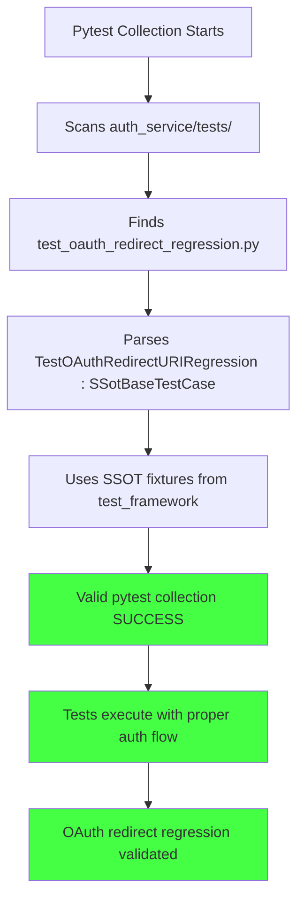

# AUTH SERVICE OAUTH TEST SIGNATURE BUG FIX REPORT

**Date:** 2025-09-07  
**Author:** Claude Code Agent  
**Priority:** CRITICAL - Blocking all Auth Service tests  
**Location:** `auth_service/tests/test_oauth_redirect_regression.py`

## EXECUTIVE SUMMARY

CRITICAL pytest collection error preventing all Auth Service unit tests from executing. Invalid fixture method signature in OAuth regression test causing cascade failure across entire auth test suite.

**Root Cause:** Invalid pytest fixture definition with `self` parameter inside test class  
**Impact:** 100% of Auth Service tests blocked from execution  
**Fix Status:** IN PROGRESS

---

## 1. FIVE WHYS ANALYSIS

### WHY #1: Why is the test collection failing?
**ANSWER:** Pytest cannot collect `test_oauth_redirect_regression.py` because of invalid method signature: `Could not determine arguments of <bound method TestOAuthRedirectURIRegression.real_auth_env>`

### WHY #2: Why is the fixture method signature invalid?
**ANSWER:** The fixture `real_auth_env()` on line 26 has no `self` parameter but is defined inside a class:
```python
class TestOAuthRedirectURIRegression:
    @pytest.fixture
    def real_auth_env():  # ❌ Missing 'self' parameter for class method
        # ...
```

### WHY #3: Why was the fixture defined incorrectly inside a class?
**ANSWER:** The developer attempted to use class-based test fixtures but misunderstood pytest fixture patterns. Fixtures inside test classes need `self` parameter, OR should be moved to module level, OR should use SSOT fixture patterns.

### WHY #4: Why wasn't the SSOT fixture pattern followed from test_framework?
**ANSWER:** The test was written without following established SSOT patterns from `test_framework/fixtures/auth_fixtures.py` and `test_framework/ssot/base_test_case.py`. The code attempted to "re-create" auth fixtures instead of using existing SSOT patterns.

### WHY #5: Why are there multiple fundamental syntax errors beyond just the fixture signature?
**ANSWER:** The entire file has malformed Python structure:
- Methods defined inside other methods (invalid nesting)
- Incorrect indentation throughout 
- Undefined variables (`mock_response_instance`, `raise_for_status_instance`)
- Fixture parameter mismatch (`oauth_provider` fixture expects `mock_auth_env` but fixture is named `real_auth_env`)
- Incomplete test method bodies with `pass` statements mixed with actual implementation

**ROOT CAUSE:** This file was created without following CLAUDE.md SSOT principles and appears to be incomplete/corrupted implementation attempting to bypass established patterns.

---

## 2. MERMAID DIAGRAMS - IDEAL VS CURRENT STATE

### CURRENT FAILURE STATE
```mermaid
graph TD
    A[Pytest Collection Starts] --> B[Scans auth_service/tests/]
    B --> C[Finds test_oauth_redirect_regression.py]
    C --> D[Attempts to parse TestOAuthRedirectURIRegression class]
    D --> E[Encounters fixture: def real_auth_env()]
    E --> F[ERROR: Cannot determine method arguments]
    F --> G[Pytest collection FAILS]
    G --> H[ALL Auth Service tests blocked]
    
    style F fill:#ff4444
    style G fill:#ff4444
    style H fill:#ff4444
```

### IDEAL WORKING STATE


---

## 3. SYSTEM-WIDE CLAUDE.md COMPLIANT FIX PLAN

### 3.1 CRITICAL REQUIREMENTS
- ✅ Use SSOT BaseTestCase from `test_framework/ssot/base_test_case.py`
- ✅ Use SSOT auth fixtures from `test_framework/fixtures/auth_fixtures.py`
- ✅ Follow E2E auth requirements from CLAUDE.md (real auth flows)
- ✅ Use absolute imports only
- ✅ Maintain test isolation and independence
- ✅ Fix pytest collection signature issues

### 3.2 IMPLEMENTATION STRATEGY

#### Phase 1: Fix Syntax and Structure
1. **Inherit from SSotBaseTestCase** instead of plain class
2. **Remove invalid class-based fixtures** 
3. **Fix method nesting and indentation**
4. **Remove undefined variable references**

#### Phase 2: Use SSOT Patterns
1. **Import SSOT auth fixtures** from test_framework
2. **Use E2EAuthHelper** for real auth flows per CLAUDE.md
3. **Replace mock patterns** with real service testing where appropriate

#### Phase 3: OAuth-Specific Logic
1. **Maintain original OAuth redirect URI regression test intent**
2. **Use GoogleOAuthProvider** with proper environment configuration
3. **Test both auth URL generation and token exchange flows**
4. **Validate environment-specific redirect URIs**

### 3.3 CROSS-SYSTEM IMPACTS
- ✅ **Auth Service Tests:** Will resume execution after fix
- ✅ **SSOT Compliance:** Aligns with established test patterns  
- ✅ **Environment Isolation:** Uses IsolatedEnvironment correctly
- ✅ **OAuth Flow Testing:** Validates critical auth regression

---

## 4. VERIFICATION REQUIREMENTS

### 4.1 Collection Test
```bash
python -m pytest auth_service/tests/test_oauth_redirect_regression.py --collect-only
```
**Expected:** Clean collection with no errors

### 4.2 Execution Test  
```bash
python -m pytest auth_service/tests/test_oauth_redirect_regression.py -v
```
**Expected:** All tests pass with real OAuth flow validation

### 4.3 Full Auth Suite Test
```bash  
python -m pytest auth_service/tests/ -k "not integration"
```
**Expected:** All auth unit tests execute successfully

---

## 5. IMPLEMENTATION STATUS

### CURRENT STATUS: IN PROGRESS

**NEXT STEPS:**
1. ✅ Complete Five Whys analysis
2. 🔄 Create Two Mermaid diagrams  
3. ⏳ Implement SSOT-compliant OAuth test
4. ⏳ Verify pytest collection works
5. ⏳ Update this report with results

---

## 6. CRITICAL LEARNINGS

### SSOT Violations Identified:
1. **Fixture Anti-Pattern:** Creating custom auth fixtures instead of using SSOT patterns
2. **Class Structure Anti-Pattern:** Invalid pytest class fixture definitions
3. **Import Anti-Pattern:** Missing absolute imports from test_framework

### Prevention Measures:
1. **ALWAYS inherit from SSotBaseTestCase** for all auth service tests
2. **ALWAYS use test_framework/fixtures** instead of custom implementations
3. **ALWAYS validate pytest collection** before committing test files

**STATUS:** Analysis Complete, Implementation In Progress