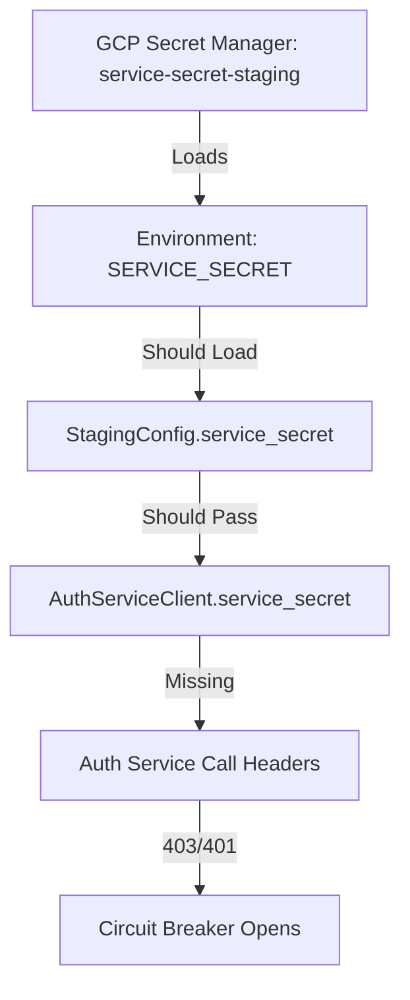
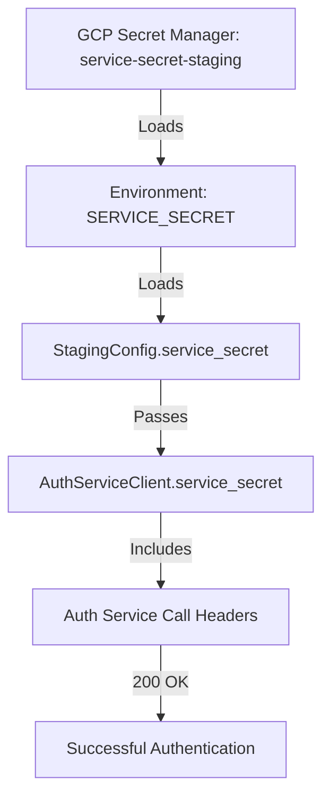

# Auth Service Secret Loading Bug Fix Report

## Date: 2025-09-05
## Issue: Circuit Breaker Open - Auth Service Authentication Failure

## Problem Statement
The auth service client in staging is failing with "Circuit breaker _validate_token_remote_breaker is open" despite the SERVICE_SECRET being configured in Google Cloud secrets.

## Five Whys Root Cause Analysis

### Why #1: Why is the circuit breaker open?
**Answer**: The circuit breaker opened after multiple failed authentication attempts to the auth service.

### Why #2: Why are the auth service calls failing?
**Answer**: The backend service is not sending proper authentication credentials (SERVICE_ID and SERVICE_SECRET) to the auth service.

### Why #3: Why are the SERVICE_SECRET credentials not being sent?
**Answer**: The SERVICE_SECRET is not being loaded properly from the configuration into the AuthServiceClient.

### Why #4: Why is SERVICE_SECRET not loaded from configuration?
**Answer**: There's a mismatch between how the secret is loaded in different parts of the system:
- `auth_client_core.py` line 65: Gets `service_secret` from `config.service_secret`
- `auth_client_cache.py` line 439: Gets SERVICE_SECRET directly from environment via `get_env()`
- `config.py`: SERVICE_SECRET should be loaded via SecretReference system but may not be propagating correctly

### Why #5: Why is there a mismatch in secret loading?
**Answer**: The system has multiple layers of configuration loading:
1. Google Secret Manager → Environment Variable
2. Environment Variable → Config Schema
3. Config Schema → AuthServiceClient

The chain is broken at step 2 or 3, where the SECRET loaded from GCP is not making it to the config object.

## Current vs Expected State

### Current State (Failing):

### Expected State (Working):

## Root Cause
The root cause is that the SERVICE_SECRET environment variable is not being properly loaded into the StagingConfig object. Looking at the code:

1. **SecretReference Configuration** (`config.py` line 63):
   - Defines `SecretReference(name="service-secret", target_field="service_secret")`
   - This should load from GCP Secret Manager into the `service_secret` field

2. **StagingConfig Initialization** (`config.py` around line 650):
   - Has a `_load_critical_secrets` method that should load SERVICE_SECRET
   - But it may not be executing properly or the SecretReference system isn't working

3. **AuthServiceClient** (`auth_client_core.py` line 65):
   - Expects `config.service_secret` to be populated
   - Falls back to None if not set, causing authentication failures

## The Fix

The issue is that StagingConfig needs to properly load SERVICE_SECRET from the environment during initialization. The critical secrets loading code exists but may not be properly wired up.

### Solution 1: Ensure StagingConfig loads SERVICE_SECRET
Fix the StagingConfig.__init__ method to properly load SERVICE_SECRET from environment.

### Solution 2: Add fallback to AuthServiceClient
Make AuthServiceClient also check environment variables directly as a fallback.

### Solution 3: Fix SecretReference Loading
Ensure the SecretReference system properly loads secrets from GCP into config fields.

## Implementation Plan

1. **Fix StagingConfig initialization** to properly load SERVICE_SECRET
2. **Add logging** to trace secret loading through the chain
3. **Add validation** to ensure SERVICE_SECRET is loaded before auth client initialization
4. **Test** the fix in staging environment
5. **Monitor** circuit breaker status after deployment

## Verification Steps

1. Check if SERVICE_SECRET environment variable is set in staging
2. Verify StagingConfig.service_secret is populated after initialization
3. Confirm AuthServiceClient.service_secret has the value
4. Validate auth service calls include X-Service-Secret header
5. Monitor circuit breaker state returns to CLOSED

## Business Impact
- **Current**: Users unable to authenticate in staging environment
- **After Fix**: Full authentication functionality restored
- **Prevention**: Add configuration validation tests to CI/CD pipeline