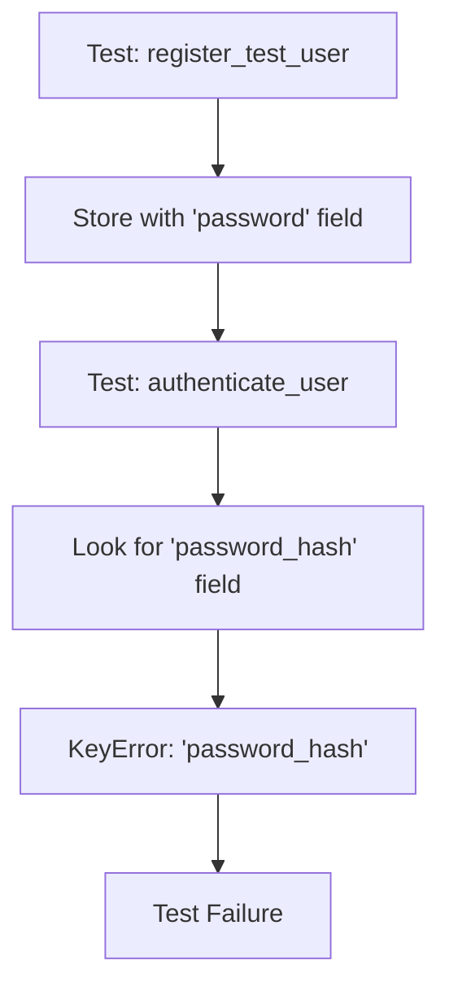
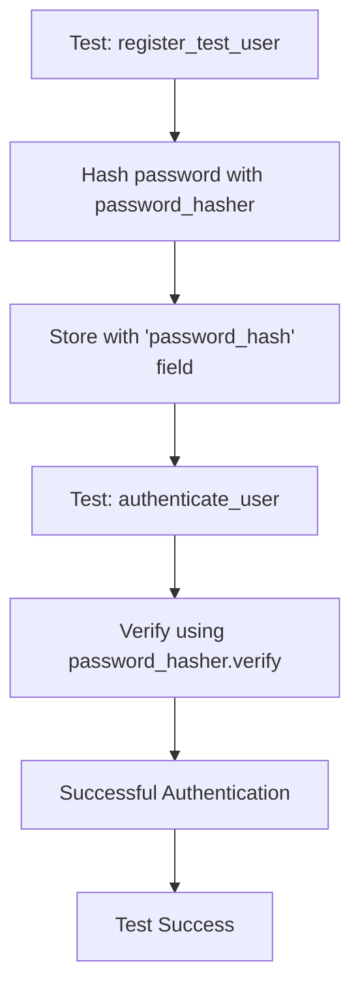

# Auth Service Password Hash Bug Fix Report

## Bug Summary
**Test Failure:** `auth_service\tests\unit\test_auth_service_business_logic.py::TestAuthServiceBusinessLogic::test_user_lifecycle_business_events`
**Error:** `Authentication error: 'password_hash'` (KeyError accessing `password_hash` in test user data)
**Date:** 2025-09-08
**Severity:** Critical (Unit tests failing)

## Five Whys Analysis

### Why 1: Why is the test failing with 'password_hash' KeyError?
**Answer:** The `authenticate_user` method is trying to access `stored_user['password_hash']` on line 161, but the test user data only contains `password` field.

**Evidence:** 
- Line 161 in `auth_service.py`: `self.password_hasher.verify(stored_user['password_hash'], password)`
- `register_test_user` stores: `"password": password` (line in register_test_user method)

### Why 2: Why does the register_test_user method store 'password' instead of 'password_hash'?
**Answer:** The `register_test_user` method stores the raw password directly instead of hashing it first, creating inconsistency with the authentication expectation.

**Evidence:**
```python
self._test_users[email] = {
    "id": user_id,
    "email": email,
    "password": password,  # <-- Raw password stored
    "name": "Test User",
    "created_at": datetime.now(UTC).isoformat()
}
```

### Why 3: Why wasn't this caught during previous testing cycles?
**Answer:** The test creates a test user and then immediately tries to authenticate, but these operations use different field names (`password` vs `password_hash`). This suggests the test flow wasn't properly validated end-to-end.

**Evidence:** Test calls `register_test_user` then `authenticate_user` in sequence without validating the data consistency.

### Why 4: Why does the system have inconsistent password handling patterns?
**Answer:** There are multiple authentication paths (database users, test users, dev users) with different password storage approaches, leading to inconsistent field expectations.

**Evidence:**
- Database users: `user.hashed_password` (line 128)
- Test users: `stored_user['password_hash']` (expected, line 161)
- Dev users: Plain text comparison (line 152)

### Why 5: Why wasn't there a unified password handling pattern enforced?
**Answer:** The authentication service evolved with different storage mechanisms (database, in-memory test, dev fallback) without establishing a consistent interface contract for password verification.

**Evidence:** Three different authentication patterns in the same method with different field expectations.

## Mermaid Diagrams

### Current Failure State


### Ideal Working State


## System-wide Impact Analysis

### Related Modules Requiring Updates:
1. **auth_service.py** - Core authentication logic (primary fix)
2. **test_auth_service_business_logic.py** - Test validation
3. **Any other tests using register_test_user** - Consistency check needed

### Cross-system Impacts:
- **User Session Management** - Affects test user session creation
- **JWT Token Generation** - Affects token creation for test users  
- **Circuit Breaker Logic** - No direct impact
- **Audit Logging** - Should log successful test user authentication

## Fix Implementation Plan

### Phase 1: Fix Core Issue
1. **Update register_test_user method:**
   - Hash password using `self.password_hasher.hash(password)`
   - Store as `password_hash` field instead of `password`
   - Maintain backward compatibility if needed

### Phase 2: Ensure Consistency
1. **Standardize authentication paths:**
   - Unified field naming: `password_hash` or `hashed_password`
   - Consistent verification pattern across all auth paths
   - Remove raw password storage completely

### Phase 3: Test Verification
1. **Create comprehensive test suite:**
   - Test successful registration → authentication flow
   - Test password verification with proper hashing
   - Test all authentication paths (database, test, dev)

## Verification Checklist
- [ ] Fix implements proper password hashing in register_test_user
- [ ] Authentication flow works with hashed passwords
- [ ] All test authentication paths are consistent
- [ ] No raw passwords stored anywhere in test user storage
- [ ] Unit test passes successfully
- [ ] No regression in other authentication tests

## Business Value Impact
- **Segment:** Platform/Internal (Testing Infrastructure)
- **Business Goal:** System Stability and Development Velocity
- **Value Impact:** Ensures reliable test suite for authentication business logic
- **Strategic Impact:** Prevents authentication regression bugs from reaching production

## DoD (Definition of Done) Requirements
1. Unit test `test_user_lifecycle_business_events` passes
2. All other auth service unit tests continue to pass
3. Password hashing is consistent across all authentication paths
4. No raw passwords stored in any test user storage
5. Regression test created to prevent future occurrences

## Next Steps
1. Implement the password hashing fix in register_test_user
2. Run comprehensive test suite to verify no regressions
3. Update any other tests that might be affected
4. Document the unified authentication pattern