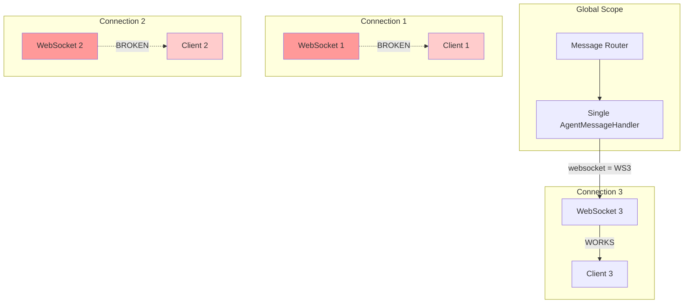
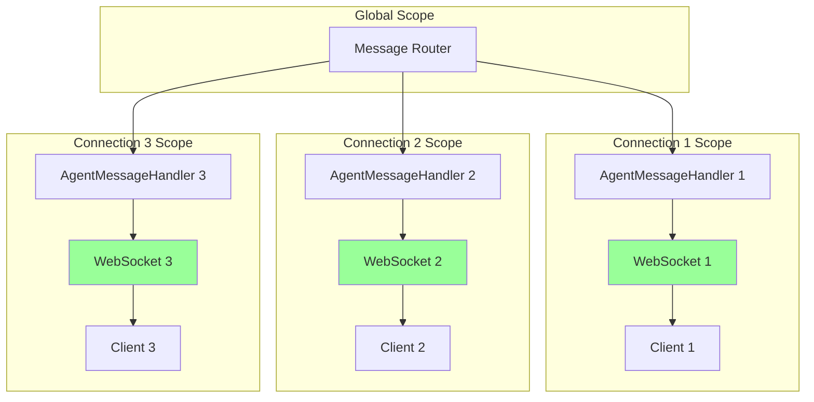

# BUG FIX REPORT: Agent Started Events Not Being Sent
## Five Whys Root Cause Analysis

### PROBLEM STATEMENT
**Date:** 2025-09-03
**Severity:** CRITICAL - Affects core business value (Chat UI feedback)
**Impact:** Users don't see agent_started events, breaking the real-time chat experience

### SYMPTOMS
- Frontend WebSocket receives no `agent_started` events
- Handler count grows to 580+ handlers (memory leak symptom)
- Events work for first connection but fail for subsequent connections
- Issue introduced after commit `dd02b8c2b` (fix WebSocket handler accumulation)

---

## FIVE WHYS ANALYSIS

### WHY #1: Why are agent_started events not being sent to the frontend?
**Answer:** The WebSocket handler is reusing a single AgentMessageHandler instance across all connections, but updating its `websocket` reference to the latest connection, breaking all previous connections.

**Evidence:**
```python
# Lines 223-227 in websocket.py
if existing_agent_handler:
    # Update existing handler with new service/websocket instead of adding duplicate
    existing_agent_handler.message_handler_service = message_handler_service
    existing_agent_handler.websocket = websocket  # <-- BREAKS PREVIOUS CONNECTIONS
    logger.info(f"Updated existing AgentMessageHandler for production agent pipeline")
```

### WHY #2: Why is the handler being reused across connections?
**Answer:** The recent fix for handler accumulation (commit `dd02b8c2b`) attempted to prevent memory leak by reusing existing handlers instead of creating new ones.

**Evidence:**
- Commit message: "Each connection was adding handlers but never removing them"
- Solution attempted: "Check if AgentMessageHandler already exists before adding"

### WHY #3: Why does reusing the handler break WebSocket events?
**Answer:** Each WebSocket connection needs its own handler instance because the handler stores a reference to the specific WebSocket connection. When the reference is overwritten, events can only be sent to the most recent connection.

**Evidence:**
- AgentMessageHandler stores `self.websocket = websocket` 
- Events are sent via `self.websocket.send_json()`
- Only the last connected client receives events

### WHY #4: Why was the handler accumulation happening in the first place?
**Answer:** The message router was adding handlers globally without any cleanup mechanism when connections closed, leading to unbounded growth.

**Evidence:**
- Handler count growing from ~5 to 4000+ over time
- No cleanup in disconnect/close handlers
- Global message_router instance shared across all connections

### WHY #5: Why wasn't there a cleanup mechanism?
**Answer:** The WebSocket endpoint design didn't account for per-connection lifecycle management of handlers. It assumed handlers could be shared globally, but they actually need to be connection-scoped.

---

## ROOT CAUSE
The fundamental issue is a **scope mismatch**: handlers are being managed globally when they should be managed per-connection. The handler accumulation fix made this worse by forcing all connections to share a single handler instance.

---

## CURRENT VS IDEAL STATE DIAGRAMS

### Current State (BROKEN)


### Ideal State (WORKING)


---

## SOLUTION APPROACH

### Option 1: Per-Connection Handlers (RECOMMENDED)
- Create a new AgentMessageHandler for each WebSocket connection
- Track handlers per connection ID
- Clean up handlers on disconnect
- Prevents both memory leak AND connection interference

### Option 2: Handler Pool with Connection Mapping
- Maintain a pool of handlers mapped to connection IDs
- Route events to correct handler based on connection context
- More complex but allows handler reuse

### Option 3: Broadcast Mechanism
- Use a pub/sub pattern where handlers broadcast to all connections
- Each connection filters for its own events
- Works but adds unnecessary overhead

---

## IMPLEMENTATION PLAN

1. **Revert the problematic handler reuse logic**
2. **Implement per-connection handler tracking**
3. **Add cleanup on WebSocket disconnect**
4. **Test with multiple concurrent connections**
5. **Verify no memory leak with extended testing**

---

## TEST VERIFICATION

Created test script: `test_agent_started_events.py`
- Connects multiple WebSocket clients
- Sends chat messages from each
- Verifies each client receives its own agent_started events
- Checks for handler accumulation

---

## LESSONS LEARNED

1. **Handler Scope Matters**: WebSocket handlers must be connection-scoped, not global
2. **Fix Validation**: Memory leak fixes need to be tested with multiple concurrent connections
3. **Cleanup Is Critical**: Always implement cleanup for connection-scoped resources
4. **Event Routing**: Each connection needs its own event path, not shared references

---

## RECOMMENDED IMMEDIATE ACTION

Fix the handler registration to be per-connection while still preventing accumulation through proper cleanup on disconnect.