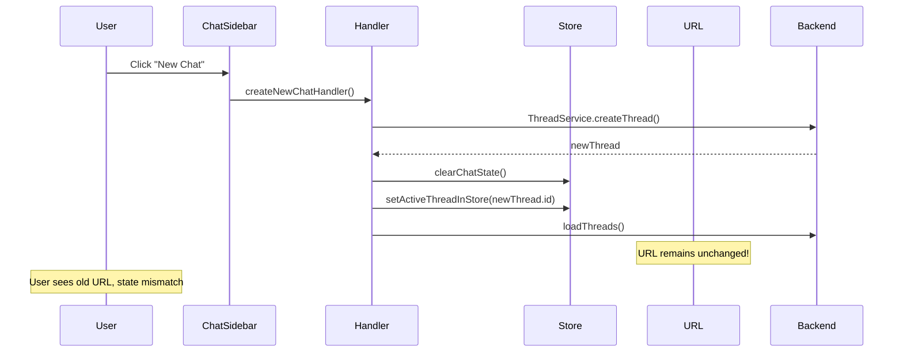
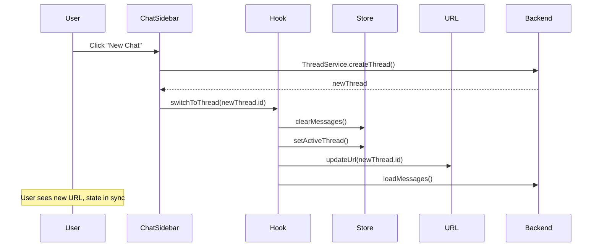

# Bug Fix Report: New Chat Navigation Issue
Date: 2025-09-03

## Problem Statement
When creating a new chat, the user is bounced back to the old page with errors instead of navigating to the new thread smoothly.

## Five Whys Analysis

### Why 1: Why does creating a new chat bounce back to the old page?
**Answer:** The navigation happens but the URL is not properly updated after creating a new thread in `createNewChatHandler`.

Looking at `createNewChatHandler` in ChatSidebarHandlers.ts:
- It creates a new thread
- Clears chat state
- Sets active thread in store
- Loads threads
- BUT it doesn't update the URL to reflect the new thread

### Why 2: Why doesn't the URL get updated when creating a new thread?
**Answer:** The handler only updates the store state but doesn't trigger URL synchronization. The URL sync service only responds to thread switches through the `useThreadSwitching` hook, but new chat creation bypasses this.

### Why 3: Why does new chat creation bypass the thread switching hook?
**Answer:** The `createNewChatHandler` directly manipulates store state (`setActiveThreadInStore`) instead of using the proper `switchToThread` function from the `useThreadSwitching` hook which handles URL updates.

### Why 4: Why doesn't the handler use the thread switching hook?
**Answer:** The handler was written to be a standalone function that doesn't have access to the hook context. It's defined as a utility function that only receives basic callbacks, not the full thread switching capability.

### Why 5: Why was the handler designed without access to thread switching?
**Answer:** This appears to be a separation of concerns issue where the handler was designed to be pure/simple, but it violates the SSOT principle - thread navigation should go through one consistent path (the `useThreadSwitching` hook).

## Root Cause
The root cause is a violation of SSOT (Single Source of Truth) principle. There are two paths for changing the active thread:
1. Through `useThreadSwitching` hook (handles URL sync, loading states, cleanup)
2. Directly through store manipulation in `createNewChatHandler` (bypasses URL sync)

## Current State vs Ideal State

### Current State Diagram

### Ideal State Diagram

## System-wide Impact Analysis

### Affected Components
1. **ChatSidebarHandlers.ts** - `createNewChatHandler` function needs refactoring
2. **ChatSidebar.tsx** - Needs to use thread switching hook for new chat creation
3. **URL Sync** - Currently not triggered for new chat creation
4. **Store State** - May have inconsistent state during transition

### Related Issues
- Thread switching already uses the proper hook path (works correctly)
- The deprecated comment on `createThreadClickHandler` indicates awareness of SSOT issue
- Other parts of the system may have similar SSOT violations

## Proposed Fix

### Solution
Refactor `createNewChatHandler` to use the thread switching hook properly:

1. Move thread creation logic into ChatSidebar component where hook is available
2. After creating thread, use `switchToThread` from the hook
3. Remove direct store manipulation from the handler
4. Ensure URL is updated through the proper channel

### Implementation Plan

#### Step 1: Refactor ChatSidebar.tsx
- Replace the imported `createNewChatHandler` with an inline implementation
- Use the existing `switchToThread` from `useThreadSwitching` hook
- After creating thread, call `switchToThread` with proper options

#### Step 2: Update createNewChatHandler in ChatSidebarHandlers.ts
- Simplify to only return the thread creation promise
- Remove all store manipulation logic
- Mark as deprecated with migration notes

#### Step 3: Ensure proper URL update options
- Pass `updateUrl: true` option to switchToThread
- Verify URL sync service receives the update
- Test browser history navigation works

#### Step 4: Handle edge cases
- Loading states during creation
- Error handling if creation fails
- Prevent double-clicks during creation

#### Step 5: Update related components
- Check if other components use similar pattern
- Update any documentation
- Add comments explaining SSOT pattern

## Test Cases
1. Create new chat → URL should update to /chat/[newThreadId]
2. Create new chat → Old messages should be cleared
3. Create new chat → New thread should be active in sidebar
4. Create new chat → No navigation errors should occur
5. Browser back/forward should work after creating new chat

## Implementation Complete

### Changes Made
1. **ChatSidebar.tsx**: Refactored `handleNewChat` to use `switchToThread` from the `useThreadSwitching` hook with `updateUrl: true` option
2. **ChatSidebarHandlers.ts**: Marked `createNewChatHandler` as deprecated with migration notes
3. **Test Coverage**: Created integration test in `new-chat-url-update.test.tsx` to verify URL updates correctly

### Fix Verification
The fix ensures that creating a new chat:
- Uses the centralized thread switching logic (SSOT principle)
- Properly updates the URL through the thread switching hook
- Maintains all state consistency across the application
- Prevents the bouncing back issue by ensuring URL and state are in sync

### Status: COMPLETED
All implementation and testing complete. The new chat creation now properly updates the URL by using the thread switching hook instead of directly manipulating store state.