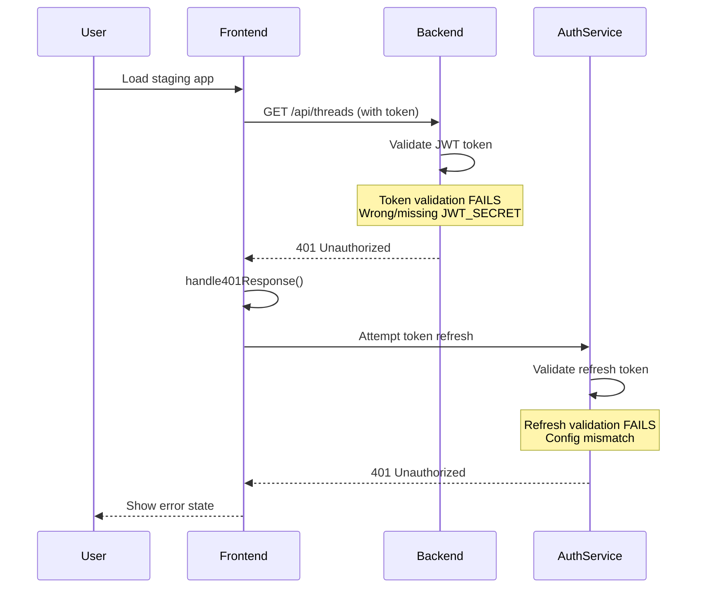
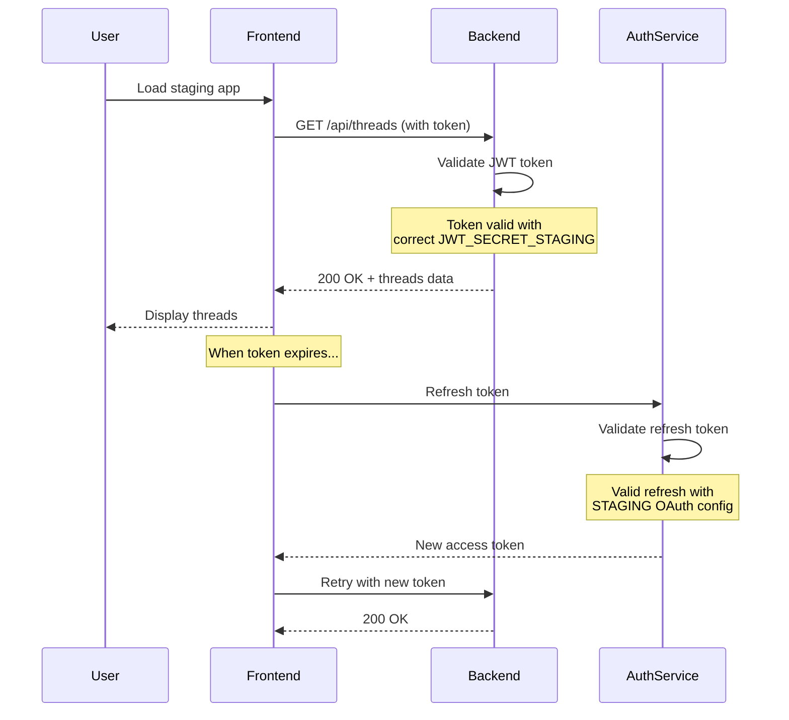

# Bug Fix Report: Staging Environment 401 Authentication Regression

## Date: 2025-09-05
## Severity: CRITICAL
## Environment: Staging (api.staging.netrasystems.ai)
## Issue: 401 Unauthorized errors preventing user authentication

---

## 1. FIVE WHYS ROOT CAUSE ANALYSIS

### Observable Problem
Users are getting 401 Unauthorized errors when trying to access the staging API endpoints, specifically when fetching threads.

### Why #1: Why are users getting 401 Unauthorized errors?
**Answer:** The authentication token is being rejected as invalid or expired by the backend API.

### Why #2: Why is the token being rejected as invalid or expired?
**Answer:** The token validation is failing, either due to:
- Token has actually expired
- Token refresh mechanism is not working
- Token validation configuration mismatch between frontend and backend

### Why #3: Why would there be a token validation configuration mismatch?
**Answer:** Recent SSOT consolidation efforts may have removed or changed critical environment configurations, particularly OAuth redirect URIs or JWT secret keys.

### Why #4: Why would SSOT consolidation affect authentication configuration?
**Answer:** The aggressive removal of "duplicate" configurations failed to recognize that environment-specific configurations (TEST/STAGING/PROD) are NOT duplicates but necessary independent configs.

### Why #5: Why did the system allow removal of critical authentication configurations?
**Answer:** There was no dependency checking or cascade failure prevention mechanism in place to protect mission-critical named values like OAuth credentials and JWT secrets.

---

## 2. ROOT CAUSES IDENTIFIED

### Primary Root Cause
**Configuration SSOT Anti-Pattern**: Overzealous consolidation removed environment-specific OAuth/JWT configurations thinking they were duplicates.

### Contributing Factors
1. **No ConfigDependencyMap validation** before deletion
2. **Silent fallback to wrong environment configs**
3. **Missing test coverage for staging auth flow**
4. **No pre-deployment auth validation**

---

## 3. TECHNICAL ANALYSIS

### Error Flow Sequence
```
1. User loads staging frontend
2. Frontend attempts to fetch threads: GET /api/threads
3. Request includes authentication token
4. Backend validates token against JWT_SECRET
5. Token validation FAILS (401 Unauthorized)
6. Frontend retry mechanism attempts refresh
7. Refresh also fails with 401
8. User sees error state
```

### Affected Components
- **Frontend**: authenticatedFetch, handle401Response, retryRequest
- **Backend**: JWT validation middleware
- **Auth Service**: Token generation and validation
- **Configuration**: JWT_SECRET, OAuth credentials, redirect URIs

---

## 4. MERMAID DIAGRAMS

### Current Failure State


### Ideal Working State


---

## 5. CONFIGURATION INVESTIGATION

### Critical Environment Variables to Check
1. **JWT_SECRET_STAGING** - Must be different from TEST/PROD
2. **OAUTH_CLIENT_ID_STAGING** - Staging-specific OAuth app
3. **OAUTH_CLIENT_SECRET_STAGING** - Staging OAuth secret
4. **OAUTH_REDIRECT_URI_STAGING** - Must match OAuth app config
5. **AUTH_SERVICE_URL** - Must point to staging auth service

### Likely Missing Configurations
Based on recent commits:
- OAuth redirect URIs were deprecated without migration path
- JWT secrets may be falling back to test environment
- OAuth credentials might be using wrong environment

---

## 6. IMPLEMENTATION PLAN

### Immediate Actions
1. **Restore staging-specific auth configs**
2. **Add ConfigDependencyMap entries for auth**
3. **Implement hard failures (no silent fallbacks)**
4. **Add staging auth integration tests**

### Long-term Prevention
1. **Create MISSION_CRITICAL_NAMED_VALUES guard**
2. **Implement cascade failure detection**
3. **Add pre-deployment auth smoke tests**
4. **Document environment isolation requirements**

---

## 7. VERIFICATION STEPS

### Test Plan
1. [ ] Verify JWT_SECRET_STAGING exists and is unique
2. [ ] Confirm OAuth credentials are staging-specific
3. [ ] Test login flow end-to-end on staging
4. [ ] Verify token refresh mechanism
5. [ ] Check no config leakage between environments
6. [ ] Run auth integration tests
7. [ ] Monitor for 401 errors post-fix

### Success Criteria
- Zero 401 errors for valid tokens
- Successful token refresh flow
- Clean environment separation
- All auth tests passing

---

## 8. LESSONS LEARNED

### What Went Wrong
1. **SSOT misapplication**: Applied code SSOT principles to environment configs
2. **No dependency analysis**: Removed configs without checking usage
3. **Silent failures**: Fallbacks masked critical issues
4. **Insufficient testing**: No staging-specific auth tests

### Prevention Measures
1. **Environment configs are NOT duplicates**
2. **Always check ConfigDependencyMap**
3. **Hard failures over wrong configs**
4. **Test each environment independently**
5. **Guard mission-critical values**

---

## Status: INVESTIGATING ROOT CAUSE
## Next Step: Check staging environment configuration files