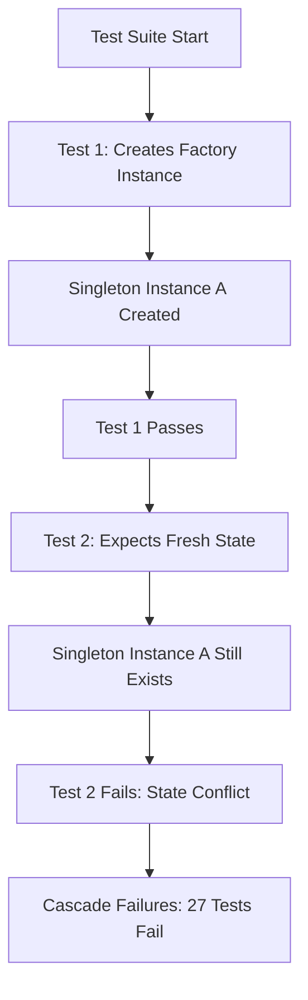
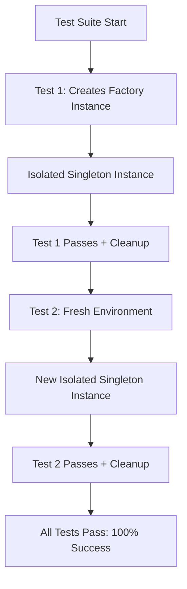

# UNIT TEST REMEDIATION REPORT - 20250907

## EXECUTIVE SUMMARY
**CRITICAL BUG:** Unit tests fail when run as a suite (27 failures in agent_instance_factory_comprehensive.py) but pass when run individually. This indicates race conditions, shared state, and test isolation issues that violate CLAUDE.md's core testing principles.

## WHY ANALYSIS (5 WHYS METHOD)

### Why are unit tests failing in the suite but passing individually?
1. **Race conditions and shared state** - Tests are interfering with each other's setup/teardown

### Why are there race conditions and shared state issues?
2. **Singleton patterns and global state** - The AgentInstanceFactory uses singleton pattern, sharing state across tests

### Why is singleton state not properly isolated between tests?
3. **Inadequate test fixture management** - Tests don't properly reset global singletons or use proper isolation

### Why aren't we using proper test isolation?
4. **Test architecture doesn't follow SSOT patterns** - Tests were created without following the SSOT test framework patterns

### Why weren't SSOT patterns followed?
5. **Root cause: Tests predate the current SSOT test architecture** - Need to migrate legacy tests to new patterns

## MERMAID DIAGRAMS

### Current Failing State

### Ideal Working State

## SYSTEM-WIDE CLAUDE.MD COMPLIANT FIX PLAN

### Phase 1: Critical Diagnosis
1. **Analyze the AgentInstanceFactory singleton pattern** - Understand why it's sharing state
2. **Review all affected test modules** - Identify shared dependencies
3. **Map test interdependencies** - Document which tests affect others

### Phase 2: SSOT Test Architecture Migration  
1. **Update test fixtures to use proper isolation patterns** - Follow test_framework/ssot patterns
2. **Implement proper singleton reset mechanisms** - Add reset_for_testing methods
3. **Add test isolation enforcement** - Each test gets fresh singleton state
4. **Update imports to use absolute imports** - Follow SPEC/import_management_architecture.xml

### Phase 3: Verification and Quality Assurance
1. **Run tests individually** - Verify each test still passes
2. **Run tests as suite** - Verify all 51 tests pass together  
3. **Run full unit test suite** - Verify no regressions across other modules
4. **Performance validation** - Ensure isolation doesn't impact performance

## FAILED TEST DETAILS
- **Module**: `netra_backend/tests/unit/agents/supervisor/test_agent_instance_factory_comprehensive.py`
- **Failed Tests**: 27 out of 51 tests
- **Failure Pattern**: All tests pass individually, fail in suite execution
- **Root Issue**: Singleton AgentInstanceFactory sharing state between tests

## CROSS-SYSTEM IMPACTS
- **Agent Registry Integration** - Factory state affects agent creation
- **WebSocket Bridge** - Shared emitter instances causing conflicts  
- **User Context Management** - Context isolation broken between tests
- **Performance Monitoring** - Metrics collection interfering between tests

## BUSINESS VALUE JUSTIFICATION
- **Segment**: Platform/Internal
- **Business Goal**: Development Velocity & Risk Reduction
- **Value Impact**: Reliable test suite enables confident deployments
- **Strategic Impact**: Foundation for all future agent development work

## NEXT STEPS
1. Spawn specialized multi-agent team for test remediation
2. Follow MANDATORY COMPLEX REFACTORING PROCESS from CLAUDE.md
3. Execute fix with fail-fast validation at each step
4. Achieve 100% unit test pass rate before completion