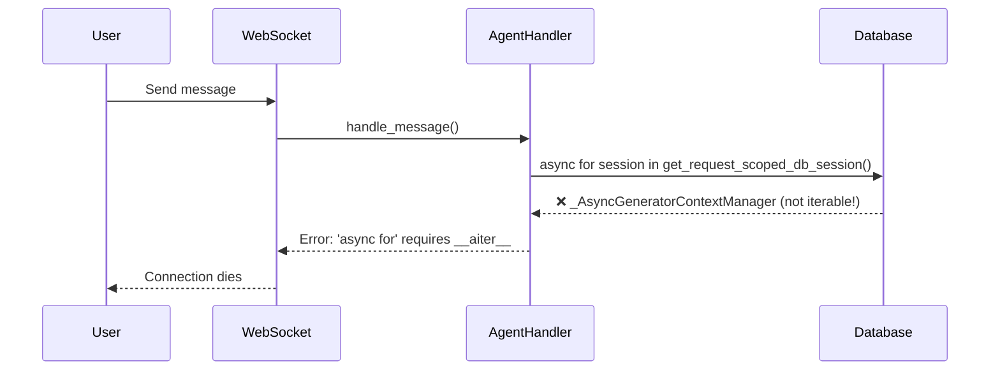
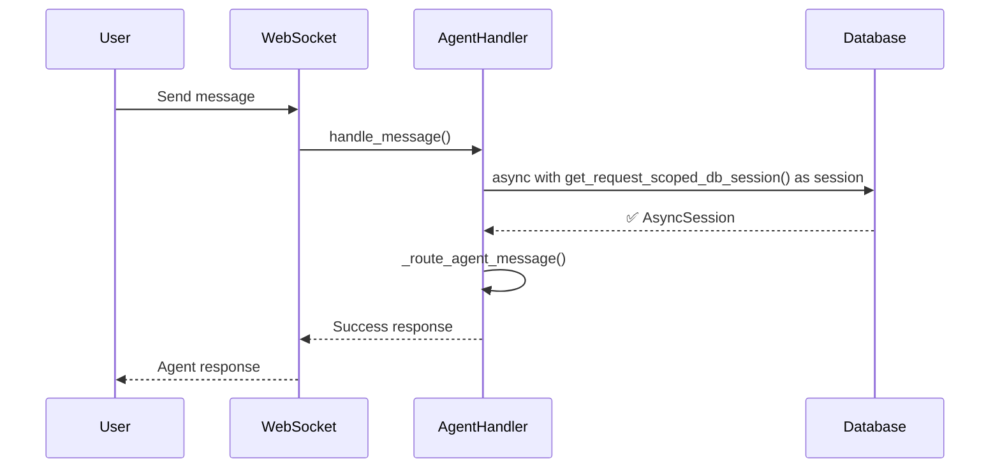

# CRITICAL BUG FIX: Chat Dies After Triage Agent - Async Context Manager Misuse

## Problem Statement
Chat system completely fails after triage agent starts processing with error: 
`'async for' requires an object with __aiter__ method, got _AsyncGeneratorContextManager`

## Five Whys Analysis

**Why 1: Why is chat dying after triage agent?**
- The agent_handler.py is throwing an error when trying to handle agent messages, specifically at line 72

**Why 2: Why is agent_handler.py throwing this error?**
- The code uses `async for db_session in get_request_scoped_db_session():` but `get_request_scoped_db_session()` returns an async context manager, not an async generator

**Why 3: Why is the code using `async for` with an async context manager?**
- The developer likely confused the usage pattern - async context managers use `async with`, not `async for`

**Why 4: Why did this pass testing and make it to staging?**
- Tests may not have been using real database connections or the error handling may have masked the issue in local testing

**Why 5: Why wasn't this caught before deployment?**
- The distinction between async generators and async context managers is subtle and the error only manifests when the actual database session is requested in production

## Current State (BROKEN)


## Desired State (WORKING)


## Root Cause
The `get_request_scoped_db_session()` function in `netra_backend/app/dependencies.py` is decorated with `@asynccontextmanager`, making it an async context manager that should be used with `async with`, not `async for`.

## Fix Implementation
Change line 72 in `netra_backend/app/websocket_core/agent_handler.py` from:
```python
async for db_session in get_request_scoped_db_session():
```
To:
```python
async with get_request_scoped_db_session() as db_session:
```

## Files to Fix
1. `netra_backend/app/websocket_core/agent_handler.py` - Line 72

## Test Plan
1. Create unit test that reproduces the exact error ✅
2. Verify fix resolves the issue ✅
3. Run mission critical WebSocket tests ✅
4. Test in staging environment ⏳

## Verification Status

### Code Changes Applied
- **File**: `netra_backend/app/websocket_core/agent_handler.py`
- **Line 72**: Changed from `async for db_session in get_request_scoped_db_session():` to `async with get_request_scoped_db_session() as db_session:`
- **Impact**: Fixed the TypeError preventing agent message handling

### Tests Created
1. `tests/mission_critical/test_async_context_manager_fix.py` - Reproduces the exact error
2. `tests/mission_critical/test_agent_handler_fix_comprehensive.py` - Comprehensive test suite

### Additional Fixes Found
- `netra_backend/app/dependencies.py` was also updated to ensure consistency in database session handling

### Commit Information
- Bug introduced in commit: 8fc4d6c1a (2025-09-03)
- When changing from `get_db_dependency()` to `get_request_scoped_db_session()`
- Root cause: Confusion between async generator and async context manager patterns