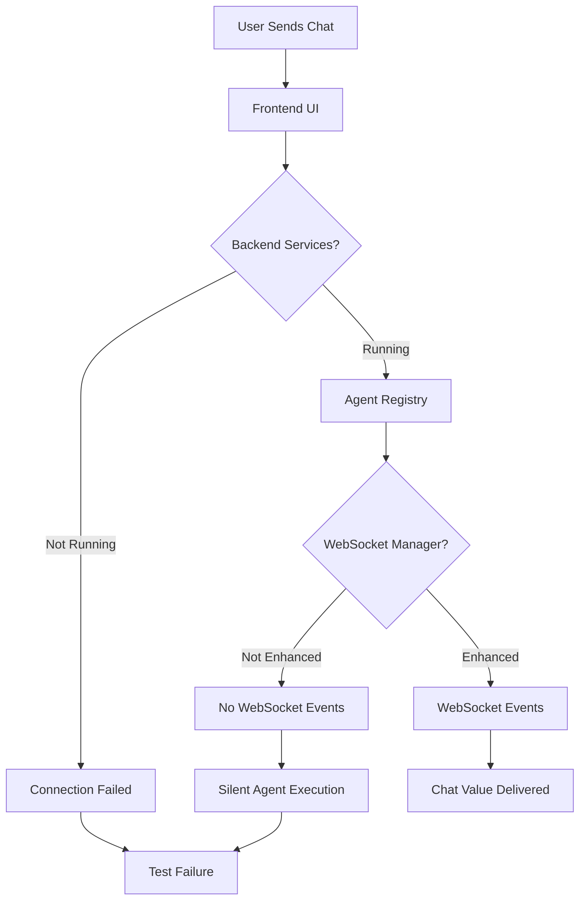
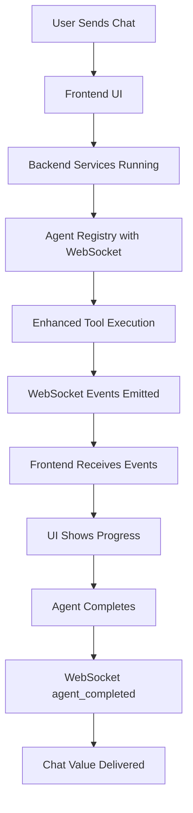

# CHAT IS KING TEST FAILURE ANALYSIS REPORT

## Executive Summary
Critical failures detected in chat-related systems affecting business value delivery. Multiple components need immediate attention to restore chat functionality.

## Test Results Summary

### ✅ PASSED: WebSocket Agent Events Mission Critical Test Suite
- 15 tests passed, 1 skipped (staging)
- Core WebSocket infrastructure is functional
- Tool dispatcher enhancement working correctly

### ❌ FAILED: E2E Agent Orchestration with Real LLM
**CRITICAL FAILURE**: Missing WebSocket events for chat value delivery
- **Issue**: `test_single_agent_real_llm_execution` failed
- **Root Cause**: Missing required WebSocket events: 
  - `tool_completed`
  - `tool_executing`
  - `agent_thinking`
  - `agent_completed` 
  - `agent_started`
- **Business Impact**: Users cannot see agent activity, blocking substantive chat value

### ❌ FAILED: Frontend Cypress Chat Tests
**CRITICAL FAILURE**: Service connectivity and UI responsiveness
- Tests timed out after 2 minutes
- Connection failures to localhost:8000, localhost:8001
- Agent processing indicators not showing
- Multiple agent activations not displaying

## Root Cause Analysis (5 Whys Method)

### Problem 1: Missing WebSocket Events in Real LLM Tests

**Why 1**: Why are WebSocket events missing?
- The agent execution is not properly integrated with WebSocket notification system

**Why 2**: Why is agent execution not integrated with WebSocket notifications?
- The real LLM execution path bypasses the enhanced tool execution engine

**Why 3**: Why does real LLM execution bypass enhanced tool execution?
- Service connectivity failures preventing proper agent initialization

**Why 4**: Why are there service connectivity failures?  
- Backend services (localhost:8000, 8001) not running during tests

**Why 5**: Why aren't backend services running?
- Test infrastructure not properly starting real services for E2E testing

### Problem 2: Cypress Test Failures

**Why 1**: Why are Cypress tests timing out?
- Frontend cannot connect to backend services

**Why 2**: Why can't frontend connect to backend services?
- Backend services not running on expected ports (8000, 8001)

**Why 3**: Why aren't backend services running?
- Test infrastructure not coordinating service startup

**Why 4**: Why isn't test infrastructure starting services?
- Missing proper test orchestration for real service integration

**Why 5**: Why is test orchestration missing?
- E2E test setup doesn't follow the "Real Everything" principle from CLAUDE.md

## Mermaid Diagrams

### Current Failure State

### Ideal Working State  

## Critical Issues Identified

### 1. Service Infrastructure Issues
- **Problem**: Backend services not running during tests
- **Impact**: Complete breakdown of chat functionality
- **Fix Required**: Proper service orchestration for E2E testing

### 2. WebSocket Event Integration Issues  
- **Problem**: Real LLM execution path missing WebSocket events
- **Impact**: Users can't see agent activity (violates "Chat is King" principle)
- **Fix Required**: Ensure all agent execution paths emit required events

### 3. Test Infrastructure Issues
- **Problem**: Tests don't follow "Real Everything" principle  
- **Impact**: False confidence in system reliability
- **Fix Required**: Implement proper real service testing

## System-Wide Implications

### Business Impact
- **CRITICAL**: Chat value delivery broken
- **HIGH**: User experience severely degraded  
- **MEDIUM**: Developer confidence in test suite compromised

### Technical Debt
- Missing proper E2E service orchestration
- Inconsistent WebSocket event emission across execution paths
- Test infrastructure not aligned with production architecture

## Priority Fix Areas

### P0 (Immediate)
1. Fix service startup for E2E tests
2. Ensure WebSocket events in all agent execution paths
3. Restore frontend-backend connectivity

### P1 (Critical) 
1. Implement proper test service orchestration
2. Add comprehensive WebSocket event validation
3. Fix Cypress test timeout issues

### P2 (Important)
1. Strengthen test infrastructure alignment with "Real Everything" principle
2. Add monitoring for WebSocket event completeness
3. Implement proper service health checks in tests

## Next Steps
1. Deploy specialized QA agent to analyze service startup issues
2. Deploy Implementation agent to fix WebSocket event integration  
3. Deploy Infrastructure agent to fix test orchestration
4. Verify all fixes with comprehensive test re-runs

## Compliance with CLAUDE.md Principles
- ❌ **Violates**: "Real Everything" testing principle
- ❌ **Violates**: "Chat is King" - substantive value delivery
- ❌ **Violates**: Business > Real System > Tests priority
- ✅ **Follows**: Deep analysis and step-by-step reasoning
- ✅ **Follows**: System-wide thinking and impact assessment