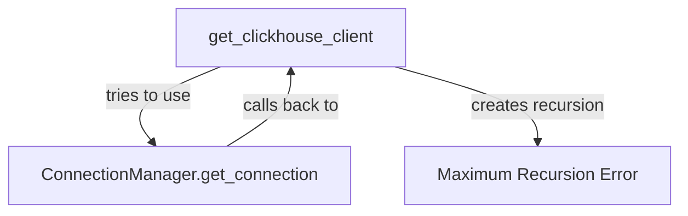

# ClickHouse Architecture Refactor Report
## Eliminating Circular Dependencies for Long-term Stability

**Date:** 2025-09-03  
**Author:** System Architecture Analysis  
**Status:** Proposal for Long-term Solution  
**Current Fix:** Temporary bypass_manager parameter (hacky but functional)

---

## Executive Summary

The current ClickHouse connection architecture suffers from a fundamental circular dependency between the connection manager and the client factory. While the `bypass_manager` parameter provides a working solution, it's a band-aid that indicates deeper architectural issues. This report proposes a clean, maintainable long-term solution.

---

## Current Architecture Problems

### 1. Circular Dependency Chain


### 2. Violations of SOLID Principles
- **Single Responsibility Principle (SRP):** `get_clickhouse_client()` handles both direct connections AND delegating to connection manager
- **Dependency Inversion Principle (DIP):** High-level connection manager depends on low-level client factory
- **Open/Closed Principle:** Adding connection strategies requires modifying existing code

### 3. Code Smells
- **Feature Envy:** Connection manager reaches into client module's responsibilities
- **Inappropriate Intimacy:** Bidirectional dependencies between modules
- **Shotgun Surgery:** Connection changes require updates in multiple places

---

## Proposed Long-term Solution

### Architecture Pattern: Strategy Pattern with Dependency Injection

#### 1. Core Abstraction Layer
```python
# netra_backend/app/db/clickhouse_interfaces.py
from abc import ABC, abstractmethod
from typing import AsyncGenerator, Any, Dict, List, Optional
from contextlib import asynccontextmanager

class IClickHouseConnection(ABC):
    """Abstract interface for ClickHouse connections"""
    
    @abstractmethod
    async def execute(self, query: str, params: Optional[Dict[str, Any]] = None) -> List[Dict[str, Any]]:
        """Execute a query"""
        pass
    
    @abstractmethod
    async def test_connection(self) -> bool:
        """Test if connection is alive"""
        pass
    
    @abstractmethod
    async def disconnect(self) -> None:
        """Close the connection"""
        pass

class IConnectionStrategy(ABC):
    """Abstract strategy for creating connections"""
    
    @abstractmethod
    @asynccontextmanager
    async def create_connection(self) -> AsyncGenerator[IClickHouseConnection, None]:
        """Create a new connection"""
        pass
    
    @abstractmethod
    def get_strategy_name(self) -> str:
        """Get strategy identifier"""
        pass
```

#### 2. Concrete Implementations
```python
# netra_backend/app/db/clickhouse_strategies.py
from netra_backend.app.db.clickhouse_interfaces import IConnectionStrategy, IClickHouseConnection
from netra_backend.app.db.clickhouse_base import ClickHouseDatabase

class DirectConnectionStrategy(IConnectionStrategy):
    """Strategy for direct ClickHouse connections"""
    
    def __init__(self, config):
        self.config = config
    
    @asynccontextmanager
    async def create_connection(self) -> AsyncGenerator[IClickHouseConnection, None]:
        """Create direct connection without any manager"""
        client = ClickHouseDatabase(
            host=self.config.host,
            port=self.config.port,
            database=self.config.database,
            user=self.config.user,
            password=self.config.password,
            secure=self.config.secure
        )
        try:
            await client.test_connection()
            yield client
        finally:
            await client.disconnect()
    
    def get_strategy_name(self) -> str:
        return "direct"

class PooledConnectionStrategy(IConnectionStrategy):
    """Strategy for pooled connections"""
    
    def __init__(self, config, pool_size: int = 5):
        self.config = config
        self.pool_size = pool_size
        self._pool = []
    
    @asynccontextmanager
    async def create_connection(self) -> AsyncGenerator[IClickHouseConnection, None]:
        """Get connection from pool or create new"""
        connection = await self._get_or_create_connection()
        try:
            yield connection
        finally:
            await self._return_to_pool(connection)
    
    async def _get_or_create_connection(self):
        if self._pool:
            return self._pool.pop()
        # Create new using direct strategy (no recursion!)
        strategy = DirectConnectionStrategy(self.config)
        async with strategy.create_connection() as conn:
            return conn
    
    async def _return_to_pool(self, connection):
        if len(self._pool) < self.pool_size:
            self._pool.append(connection)
        else:
            await connection.disconnect()
    
    def get_strategy_name(self) -> str:
        return "pooled"

class MockConnectionStrategy(IConnectionStrategy):
    """Strategy for mock/test connections"""
    
    @asynccontextmanager
    async def create_connection(self) -> AsyncGenerator[IClickHouseConnection, None]:
        """Create mock connection for testing"""
        from test_framework.fixtures.clickhouse_fixtures import MockClickHouseDatabase
        yield MockClickHouseDatabase()
    
    def get_strategy_name(self) -> str:
        return "mock"
```

#### 3. Connection Factory (No Circular Dependencies!)
```python
# netra_backend/app/db/clickhouse_factory.py
from typing import Optional
from contextlib import asynccontextmanager
from netra_backend.app.db.clickhouse_interfaces import IConnectionStrategy
from netra_backend.app.db.clickhouse_strategies import (
    DirectConnectionStrategy,
    PooledConnectionStrategy,
    MockConnectionStrategy
)

class ClickHouseConnectionFactory:
    """Factory for creating ClickHouse connections with different strategies"""
    
    def __init__(self):
        self.strategies = {}
        self._default_strategy = None
    
    def register_strategy(self, name: str, strategy: IConnectionStrategy):
        """Register a connection strategy"""
        self.strategies[name] = strategy
    
    def set_default_strategy(self, name: str):
        """Set the default strategy to use"""
        if name not in self.strategies:
            raise ValueError(f"Strategy {name} not registered")
        self._default_strategy = name
    
    @asynccontextmanager
    async def get_connection(self, strategy_name: Optional[str] = None):
        """Get connection using specified or default strategy"""
        name = strategy_name or self._default_strategy
        if not name or name not in self.strategies:
            raise ValueError(f"No valid strategy available: {name}")
        
        strategy = self.strategies[name]
        async with strategy.create_connection() as conn:
            yield conn

# Global factory instance
_factory = ClickHouseConnectionFactory()

def get_connection_factory() -> ClickHouseConnectionFactory:
    """Get the global connection factory"""
    return _factory

def initialize_factory(config):
    """Initialize factory with available strategies"""
    factory = get_connection_factory()
    
    # Register strategies
    factory.register_strategy("direct", DirectConnectionStrategy(config))
    factory.register_strategy("pooled", PooledConnectionStrategy(config))
    
    if config.environment == "testing":
        factory.register_strategy("mock", MockConnectionStrategy())
        factory.set_default_strategy("mock")
    elif config.environment == "production":
        factory.set_default_strategy("pooled")
    else:
        factory.set_default_strategy("direct")
```

#### 4. Clean Client Interface (No Recursion Possible!)
```python
# netra_backend/app/db/clickhouse.py (refactored)
from contextlib import asynccontextmanager
from netra_backend.app.db.clickhouse_factory import get_connection_factory

@asynccontextmanager
async def get_clickhouse_client(strategy: Optional[str] = None):
    """Get ClickHouse client using factory pattern
    
    Args:
        strategy: Optional strategy name ('direct', 'pooled', 'mock')
    
    Usage:
        async with get_clickhouse_client() as client:  # Uses default
            results = await client.execute("SELECT * FROM events")
        
        async with get_clickhouse_client('direct') as client:  # Force direct
            results = await client.execute("SELECT * FROM events")
    """
    factory = get_connection_factory()
    async with factory.get_connection(strategy) as client:
        yield client
```

#### 5. Connection Manager (Clean, No Circular Deps!)
```python
# netra_backend/app/core/clickhouse_connection_manager.py (refactored)
class ClickHouseConnectionManager:
    """Manages ClickHouse connections with health monitoring"""
    
    def __init__(self, retry_config, pool_config, circuit_breaker_config):
        self.retry_config = retry_config
        self.pool_config = pool_config
        self.circuit_breaker = ClickHouseCircuitBreaker(circuit_breaker_config)
        
        # Use factory with explicit pooled strategy
        self.factory = get_connection_factory()
        
    async def get_connection(self):
        """Get managed connection with circuit breaker"""
        if not self.circuit_breaker.can_execute():
            raise ConnectionError("Circuit breaker is open")
        
        try:
            # Always use pooled strategy from factory - no recursion!
            async with self.factory.get_connection('pooled') as conn:
                yield conn
                self.circuit_breaker.on_success()
        except Exception as e:
            self.circuit_breaker.on_failure()
            raise
```

---

## Migration Plan

### Phase 1: Create Abstraction Layer (Week 1)
1. Create interface definitions (`IClickHouseConnection`, `IConnectionStrategy`)
2. Implement concrete strategies without breaking existing code
3. Add comprehensive unit tests for each strategy

### Phase 2: Implement Factory Pattern (Week 2)
1. Create `ClickHouseConnectionFactory` with strategy registration
2. Initialize factory during application startup
3. Test factory with different strategies

### Phase 3: Refactor Existing Code (Week 3)
1. Update `get_clickhouse_client()` to use factory
2. Refactor connection manager to use factory's pooled strategy
3. Remove circular dependencies and bypass_manager hack

### Phase 4: Testing & Validation (Week 4)
1. Integration testing with all environments
2. Performance testing of pooled connections
3. Load testing with circuit breaker scenarios

### Phase 5: Deployment (Week 5)
1. Deploy to staging environment
2. Monitor for 48 hours
3. Deploy to production with feature flag

---

## Benefits of This Architecture

### 1. **No Circular Dependencies**
- Factory creates connections in one direction only
- Connection manager uses factory, never the reverse
- Clean dependency graph

### 2. **Testability**
- Each strategy can be tested independently
- Mock strategy injection for unit tests
- No need for complex mocking

### 3. **Extensibility**
- Add new connection strategies without modifying existing code
- Support for future requirements (e.g., read replicas, sharding)
- Plugin architecture for custom strategies

### 4. **Maintainability**
- Clear separation of concerns
- Single responsibility for each component
- Easier debugging and troubleshooting

### 5. **Performance**
- Efficient connection pooling
- Circuit breaker prevents cascade failures
- Optimized for different environments

---

## Risk Analysis

### Risks
1. **Migration Complexity:** Refactoring core infrastructure
2. **Testing Coverage:** Need comprehensive test suite
3. **Backwards Compatibility:** Existing code dependencies

### Mitigation
1. **Feature Flags:** Gradual rollout with kill switch
2. **Parallel Running:** Keep old code during transition
3. **Extensive Testing:** Automated test suite for all scenarios

---

## Comparison with Current Solution

| Aspect | Current (bypass_manager) | Proposed (Factory Pattern) |
|--------|-------------------------|---------------------------|
| **Circular Dependencies** | Avoided with hack | Eliminated by design |
| **Code Clarity** | Confusing bypass flag | Clear strategy pattern |
| **Testability** | Requires special handling | Clean mock injection |
| **Extensibility** | Difficult to add features | Easy to add strategies |
| **Maintenance** | Ongoing complexity | Simple and clean |
| **Performance** | Adequate | Optimized pooling |
| **Technical Debt** | Increases over time | Reduces over time |

---

## Recommendation

**Strongly recommend implementing the factory pattern architecture** for the following reasons:

1. **Eliminates technical debt** rather than adding to it
2. **Aligns with SOLID principles** and clean architecture
3. **Provides foundation** for future scaling needs
4. **Reduces complexity** for new developers
5. **Improves system reliability** through proper patterns

The current `bypass_manager` solution works but should be considered a **temporary fix**. The proposed architecture provides a **permanent, scalable solution** that will serve the platform well as it grows.

---

## Implementation Priority

Given the current state of the system:
- **Short-term (Now):** Keep bypass_manager fix to maintain stability
- **Medium-term (Q1 2025):** Implement factory pattern in parallel
- **Long-term (Q2 2025):** Complete migration and remove old code

---

## Conclusion

While the `bypass_manager` parameter solves the immediate recursion problem, it's a symptom of deeper architectural issues. The proposed factory pattern with strategy abstraction provides a clean, maintainable, and extensible solution that eliminates circular dependencies by design rather than working around them.

This investment in proper architecture will pay dividends in:
- Reduced debugging time
- Easier feature additions
- Better system reliability
- Lower maintenance costs
- Improved developer experience

The time to fix architectural issues is before they become entrenched. This proposal provides a clear path forward.