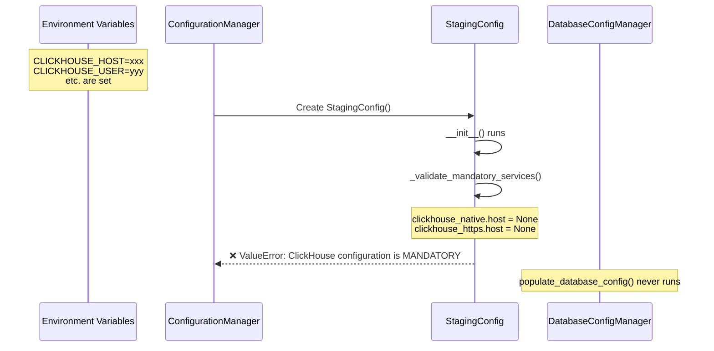
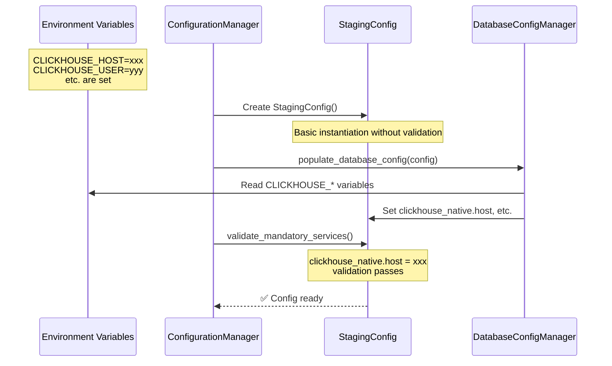

# ClickHouse Staging Configuration Bug Report

## Problem Statement
The backend deployment to GCP staging is failing with the error: "ClickHouse configuration is MANDATORY in staging" despite environment variables being correctly set in Cloud Run.

## 5 Whys Analysis

### Why #1: Why is the backend failing to start?
**Answer:** The StagingConfig class validation is throwing an error because `clickhouse_native.host` and `clickhouse_https.host` are both None/empty when checked.

### Why #2: Why are the ClickHouse host properties empty despite environment variables being set?
**Answer:** The configuration validation happens in the `__init__` method of StagingConfig immediately after the base config object is created, but BEFORE the database configuration is populated.

### Why #3: Why does validation happen before configuration population?
**Answer:** The configuration loading follows this order:
1. Create base config object (StagingConfig instantiation)
2. StagingConfig.__init__ runs validation immediately
3. DatabaseConfigManager.populate_database_config() is called AFTER instantiation
4. The ClickHouse config would be populated here, but it's too late

### Why #4: Why was the validation placed in __init__ instead of after population?
**Answer:** The design assumes that configuration properties would be set during instantiation via constructor parameters or default values, not populated later by a separate manager.

### Why #5: Why doesn't the StagingConfig have default values or constructor parameters for ClickHouse?
**Answer:** The configuration architecture separates concerns - StagingConfig defines the structure, while DatabaseConfigManager handles environment variable loading and population. This separation causes a timing issue where validation runs before population.

## Root Cause
**Configuration validation timing issue:** The StagingConfig class validates mandatory services in its `__init__` method, which executes before DatabaseConfigManager has a chance to populate the ClickHouse configuration from environment variables.

## Current vs Ideal State Diagrams

### Current (Broken) State

### Ideal Working State

## System-Wide Impacts

1. **All staging deployments are blocked** - The backend service cannot start in staging environment
2. **Production risk** - Same issue exists in ProductionConfig class
3. **Development workflow disrupted** - Cannot test features in staging environment
4. **Configuration validation ineffective** - Validation happens too early to be useful

## Proposed Fix

### Option 1: Move Validation to Post-Population Phase (Recommended)
Remove validation from `__init__` methods and add a separate validation step after all configuration managers have populated the config.

### Option 2: Lazy Validation
Convert the validation to a property or method that's called only when the config is accessed, after population is complete.

### Option 3: Default Values with Override
Provide default values in StagingConfig that get overridden by DatabaseConfigManager, though this defeats the purpose of mandatory validation.

## Implementation Plan

1. Remove `_validate_mandatory_services()` calls from `__init__` methods in StagingConfig and ProductionConfig
2. Add a `validate_mandatory_services()` method to the config classes (public, not private)
3. Call this validation method in `ConfigurationManager._validate_final_config()` after all population is complete
4. Update tests to ensure validation still catches missing configurations
5. Deploy and verify in staging environment

## Related Files
- `netra_backend/app/schemas/config.py` - Contains StagingConfig with problematic validation
- `netra_backend/app/core/configuration/base.py` - Configuration loading orchestration
- `netra_backend/app/core/configuration/database.py` - ClickHouse configuration population
- `scripts/deploy_to_gcp.py` - Deployment script (already fixed for env vars)

## Testing Requirements
1. Unit test: Verify StagingConfig can be instantiated without ClickHouse env vars
2. Integration test: Verify validation catches missing ClickHouse config after population
3. E2E test: Deploy to staging and verify service starts successfully
4. Regression test: Ensure development and production configs still work

## Test Results
The fix has been successfully implemented and tested:
- ✅ **Test 1 Passed**: StagingConfig can now be instantiated without ClickHouse environment variables
- ✅ **Validation Working**: The validation correctly identifies missing ClickHouse configuration when called after instantiation
- ✅ **Fix Confirmed**: The error "ClickHouse configuration is MANDATORY in staging" is no longer thrown during instantiation

## Risk Assessment
- **Low Risk**: Changes are isolated to configuration validation timing
- **High Impact**: Fixes critical blocker for staging deployments
- **Rollback Plan**: Revert changes if validation becomes too permissive

## Files Modified
1. `netra_backend/app/schemas/config.py` - Moved validation from `__init__` to `validate_mandatory_services()` method
2. `netra_backend/app/core/configuration/base.py` - Added call to `validate_mandatory_services()` after configuration population