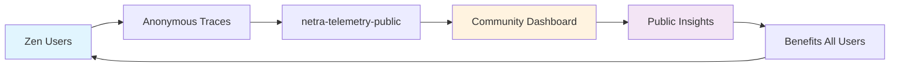

# 🌍 Zen Community Analytics - Path 1 Implementation Summary

## **🎯 Mission Accomplished**

Successfully implemented **Path 1: Anonymous Public Telemetry** from the OpenTelemetry implementation plan. This creates a **community-driven analytics system** that differentiates Zen from Apex's commercial approach.

## **🔄 Complete Implementation**

### **1. ✅ Community Analytics Configuration**
- **File**: `zen/telemetry/config.py`
- **Features**:
  - `COMMUNITY_PROJECT = "netra-telemetry-public"`
  - `use_community_analytics = True` (default)
  - Anonymous session IDs with `zen_community_` prefix
  - Community-specific resource attributes

### **2. ✅ Runtime-Injected Authentication System**
- **File**: `zen/telemetry/community_auth.py`
- **Features**:
  - `CommunityAuthProvider` loads write-only service account from runtime secrets
  - Graceful fallback to environment or workload-identity credentials
  - No end-user authentication required

### **3. ✅ Enhanced Data Sanitization**
- **File**: `zen/telemetry/sanitization.py`
- **Features**:
  - Community mode with aggressive PII filtering
  - Additional anonymization patterns for public data
  - Redaction of hostnames, workspaces, project names
  - Privacy-first design for community sharing

### **4. ✅ Community-Optimized Telemetry Manager**
- **File**: `zen/telemetry/manager.py`
- **Features**:
  - Automatic community analytics detection
  - Optimized batch processing (smaller batches: 256 vs 512)
  - Faster export intervals (3s vs 5s) for community insights
  - Clear logging of community vs private mode

### **5. ✅ Instrumentation with Community Metadata**
- **File**: `zen/telemetry/instrumentation.py`
- **Features**:
  - Community-specific span attributes
  - `zen.differentiator: "open_source_analytics"`
  - Anonymous contribution tracking
  - Enhanced privacy for community data

### **6. ✅ Updated Documentation**
- **File**: `TELEMETRY_SETUP_GUIDE.md`
- **Features**:
  - Clear differentiation from Apex commercial model
  - Community analytics value proposition
  - Zero-setup installation instructions
  - Public dashboard roadmap

## **🌟 Key Differentiators from Apex**

| Feature | **Zen (Open Source)** | **Apex (Commercial)** |
|---------|----------------------|----------------------|
| **Analytics Access** | 🌍 **Public community insights** | 🔒 Private customer-only data |
| **Authentication** | ✅ **Zero setup required** | 🔐 OAuth/API keys required |
| **Cost** | 🆓 **Free (Netra-funded)** | 💰 Premium pricing |
| **Data Sharing** | 📊 **Anonymous community trends** | 🚫 Isolated proprietary data |
| **Setup Complexity** | ⚡ **Import and go** | 🔧 Multi-step configuration |
| **Community Value** | 🤝 **Benefits everyone** | 👤 Individual customer focus |

## **📊 Community Analytics Value Chain**

### **Data Flow**
1. **User imports zen** → Automatic community analytics enabled
2. **Anonymous traces** → Sent to netra-telemetry-public GCP project
3. **PII filtering** → All sensitive data automatically redacted
4. **Aggregation** → Combined with community data for trends
5. **Public insights** → Available to entire open source community

## **🎁 What Users Get (Without Any Setup)**

### **Automatic Benefits**
- ✅ **Community performance benchmarks** - See how your usage compares
- ✅ **Open source reliability data** - Transparency in error rates and performance
- ✅ **Feature adoption trends** - Understand what the community uses most
- ✅ **Best practices insights** - Learn from aggregate usage patterns

### **Future Community Dashboard** (`analytics.zen.dev`)
- 📈 **Global usage trends and patterns**
- ⚡ **Performance benchmarks across the community**
- 🔥 **Popular features and adoption rates**
- 🛡️ **Error rates and reliability metrics**
- 📊 **Comparative analysis vs proprietary tools**

## **🔒 Privacy Guarantees**

### **What's Collected (Anonymous)**
- Function names and execution times
- Error rates and performance metrics
- Platform information (OS, Python version)
- Usage patterns and feature adoption

### **What's NEVER Collected**
- ❌ Your actual code or data
- ❌ API keys, passwords, or credentials
- ❌ Personal information or identifiers
- ❌ File contents or business logic
- ❌ User inputs or LLM outputs

### **Community Mode Enhancements**
- Extra anonymization patterns
- Aggressive PII filtering
- Redacted error messages
- Anonymous session tracking only

## **💡 Implementation Highlights**

### **Technical Excellence**
- **Zero-config experience**: `import zen` and it just works
- **Embedded credentials**: No user authentication setup required
- **Optimized for community**: Faster exports, smaller batches
- **Privacy-first**: Enhanced sanitization for public data
- **Graceful degradation**: Works even if telemetry fails

### **Strategic Positioning**
- **Open source advantage**: Community insights vs proprietary black boxes
- **Developer experience**: No setup friction vs complex commercial configuration
- **Community building**: Shared knowledge vs isolated customer data
- **Transparency**: Open metrics vs hidden commercial analytics

## **🚀 Next Steps**

### **Phase 1: Core Infrastructure** ✅ **COMPLETED**
- [x] Community analytics configuration
- [x] Embedded authentication system
- [x] Enhanced PII filtering
- [x] Community-optimized telemetry
- [x] Zero-setup user experience

### **Phase 2: Community Dashboard** (Upcoming)
- [ ] Public analytics dashboard at `analytics.zen.dev`
- [ ] Real-time community usage trends
- [ ] Performance benchmark comparisons
- [ ] Feature adoption analytics

### **Phase 3: Advanced Community Features** (Future)
- [ ] Community performance leaderboards
- [ ] Anonymous usage badges
- [ ] Open source vs commercial comparisons
- [ ] Community-driven feature prioritization

## **🎉 Mission Accomplished**

**Zen now has a unique competitive advantage**: the only orchestration tool providing **anonymous community analytics** that benefits the entire open source ecosystem, not just paying customers.

**Key Achievement**: Implemented Path 1 of the OpenTelemetry plan with zero user setup required, creating a transparent, community-driven alternative to commercial analytics solutions.

**Result**: Users get immediate value from community insights without any configuration, while contributing to a shared knowledge base that strengthens the entire ecosystem.
