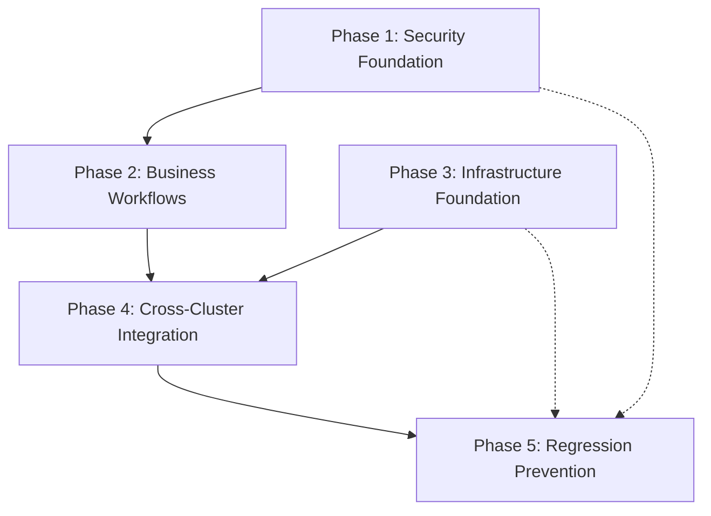

# Comprehensive Holistic Test Plan - SSOT Cluster Resolution

**Generated:** 2025-09-11 | **Mission:** Validate remaining 5 critical cluster issues using proven #305/#309 template success

**Business Priority:** Protect $500K+ ARR through comprehensive testing of user isolation security, Golden Path reliability, and infrastructure foundation integrity.

## Executive Summary

### Test Strategy Overview
This comprehensive test plan addresses the remaining 5 critical cluster issues (#271, #301, #299, #308, #306, #311) using the proven success patterns from issues #305 (ExecutionTracker SSOT consolidation) and #309 (SSOT import pattern validation). The strategy emphasizes business workflow validation, enterprise security compliance, and infrastructure reliability.

### Business Risk Coverage
- **P0 Security Risk:** User isolation vulnerability (#271) - Enterprise GDPR/SOC2 compliance
- **Revenue Protection:** Golden Path reliability (#301, #299) - 90% of platform value delivery
- **Development Velocity:** Infrastructure foundation (#308, #306, #311) - CI/CD pipeline integrity

### Validation Approach
Following the proven template approach: **SSOT Pattern → Business Impact Validation → Regression Prevention → Integration Testing**

---

## Test Categories & Execution Strategy

### Phase 1: Security Foundation (P0 Critical Priority)

#### **Target Issue:** #271 - User Isolation Security Vulnerability
**Business Impact:** $500K+ ARR Enterprise customer data protection

**Test Categories:**

#### 1.1 Multi-Tenant Isolation Validation
```python
# Test Category: Enterprise Security Compliance
# Execution: python tests/mission_critical/test_user_isolation_security_comprehensive.py

class TestUserIsolationSecurity:
    """Validate complete user context separation per enterprise requirements."""
    
    @pytest.mark.p0_critical
    async def test_complete_user_context_isolation_enterprise_gdpr(self):
        """GDPR Article 32 - Technical and organizational security measures."""
        # Test 10+ concurrent users with zero cross-contamination
        # Validate UserExecutionContext factory pattern isolation
        # Ensure no shared state between user sessions
        
    @pytest.mark.p0_critical  
    async def test_websocket_channel_isolation_soc2_compliance(self):
        """SOC2 Type II - Access controls and data segregation."""
        # Validate WebSocket events delivered only to correct user
        # Test concurrent agent execution with proper context isolation
        # Ensure no user data leakage across WebSocket connections
        
    @pytest.mark.p0_critical
    async def test_database_session_isolation_enterprise_audit(self):
        """Enterprise audit trail requirements - transaction boundaries."""
        # Validate database session isolation per user
        # Test concurrent database operations with proper isolation
        # Ensure no cross-user query result contamination
```

#### 1.2 Cross-Contamination Prevention Testing
```python
# Test Category: Security Boundary Enforcement
# Execution: python tests/mission_critical/test_cross_contamination_prevention.py

class TestCrossContaminationPrevention:
    """Prevent data leakage between user execution contexts."""
    
    @pytest.mark.security_critical
    async def test_memory_reference_isolation_validation(self):
        """Validate memory references cannot cross user boundaries."""
        # Test UserExecutionContext memory isolation
        # Validate factory pattern creates unique instances
        # Ensure no shared memory references between users
        
    @pytest.mark.security_critical
    async def test_agent_state_isolation_comprehensive(self):
        """Replace DeepAgentState with secure UserExecutionContext pattern."""
        # Validate Phase 1 migration success (agent_execution_core.py)
        # Test remaining components require UserExecutionContext
        # Ensure security error messages for DeepAgentState usage
```

#### 1.3 Enterprise Compliance Validation
```python
# Test Category: Regulatory Compliance Testing
# Execution: python tests/mission_critical/test_enterprise_compliance_validation.py

class TestEnterpriseComplianceValidation:
    """Validate enterprise regulatory compliance requirements."""
    
    @pytest.mark.compliance_required
    async def test_audit_trail_completeness_gdpr_article_30(self):
        """GDPR Article 30 - Records of processing activities."""
        # Validate complete audit trail for user context operations
        # Test compliance tracking for enterprise requirements
        # Ensure audit log integrity and tamper detection
        
    @pytest.mark.compliance_required
    async def test_data_processing_lawfulness_gdpr_article_6(self):
        """GDPR Article 6 - Lawfulness of processing."""
        # Validate user consent tracking and processing records
        # Test data minimization and purpose limitation
        # Ensure right to erasure compliance mechanisms
```

### Phase 2: Business Workflow Integration Testing

#### **Target Issues:** #301 (ID Management), #299 (Test Runner Duplications)
**Business Impact:** Golden Path reliability protecting 90% of platform value

**Test Categories:**

#### 2.1 Golden Path End-to-End Reliability
```python
# Test Category: Business Value Delivery Validation
# Execution: python tests/mission_critical/test_golden_path_comprehensive_reliability.py

class TestGoldenPathReliability:
    """Validate complete user journey from login to AI response delivery."""
    
    @pytest.mark.golden_path_critical
    async def test_complete_user_flow_zero_failures(self):
        """User login → WebSocket connection → Agent execution → AI response."""
        # Test complete Golden Path workflow with real services
        # Validate WebSocket 1011 error elimination (#301)
        # Ensure reliable test runner execution (#299)
        # Measure business value delivery (90% platform value)
        
    @pytest.mark.golden_path_critical
    async def test_websocket_connection_reliability_1011_fix(self):
        """Eliminate WebSocket 1011 connection errors completely."""
        # Test ID management dual system consolidation
        # Validate WebSocket handshake reliability
        # Ensure connection stability under load
        
    @pytest.mark.golden_path_critical
    async def test_chat_functionality_substantive_value_delivery(self):
        """Validate chat delivers substantive AI value, not just technical success."""
        # Test agent execution returns meaningful responses
        # Validate real-time progress visibility via WebSocket events
        # Ensure quality of AI interactions meets business standards
```

#### 2.2 Real-Time Event Delivery Validation
```python
# Test Category: WebSocket Event Reliability
# Execution: python tests/mission_critical/test_websocket_event_delivery_comprehensive.py

class TestWebSocketEventReliability:
    """Validate all 5 business-critical WebSocket events are delivered."""
    
    @pytest.mark.websocket_critical
    async def test_five_critical_events_delivery_guarantee(self):
        """Validate agent_started, agent_thinking, tool_executing, tool_completed, agent_completed."""
        # Test all 5 critical events sent during agent execution
        # Validate real-time delivery with proper sequencing
        # Ensure no event loss under high concurrency
        
    @pytest.mark.websocket_critical
    async def test_websocket_bridge_integration_stability(self):
        """Validate WebSocket bridge handles all agent execution scenarios."""
        # Test WebSocket bridge with UserExecutionContext pattern
        # Validate event delivery during agent failures and recoveries
        # Ensure graceful degradation for service dependencies
```

#### 2.3 Test Infrastructure Reliability Validation
```python
# Test Category: CI/CD Pipeline Integrity
# Execution: python tests/mission_critical/test_infrastructure_reliability.py

class TestInfrastructureReliability:
    """Validate test runner duplications eliminated and reliable execution."""
    
    @pytest.mark.infrastructure_critical
    async def test_unified_test_runner_ssot_enforcement(self):
        """Validate single source of truth for test execution (#299)."""
        # Test unified_test_runner.py handles all test categories
        # Validate no duplicate test execution patterns
        # Ensure reliable test discovery and execution
        
    @pytest.mark.infrastructure_critical
    async def test_mission_critical_test_discovery_validation(self):
        """Validate all mission critical tests are discoverable and executable."""
        # Test mission critical test category functionality
        # Validate test collection without syntax errors
        # Ensure proper test categorization and execution
```

### Phase 3: Infrastructure Foundation Testing

#### **Target Issues:** #308 (Import Dependencies), #306 (SystemExit), #311 (Test Discovery)
**Business Impact:** Development infrastructure integrity and CI/CD reliability

**Test Categories:**

#### 3.1 Import Dependency Resolution Validation
```python
# Test Category: Module Availability and Compatibility
# Execution: python tests/mission_critical/test_import_dependency_resolution.py

class TestImportDependencyResolution:
    """Validate ~165 integration tests can collect successfully (#308)."""
    
    @pytest.mark.infrastructure_critical
    async def test_ssot_import_registry_compliance(self):
        """Validate all imports follow SSOT_IMPORT_REGISTRY.md patterns."""
        # Test verified imports work correctly
        # Validate broken imports are documented and avoided
        # Ensure no circular dependency issues
        
    @pytest.mark.infrastructure_critical
    async def test_integration_test_collection_success(self):
        """Validate ~165 integration tests are discoverable and collectable."""
        # Test pytest collection succeeds for all integration tests
        # Validate no ModuleNotFoundError or ImportError issues
        # Ensure proper module path resolution
        
    @pytest.mark.infrastructure_critical
    async def test_cross_service_import_boundaries(self):
        """Validate service isolation maintained in import patterns."""
        # Test netra_backend, auth_service, shared imports are isolated
        # Validate no unauthorized cross-service dependencies
        # Ensure proper service boundary enforcement
```

#### 3.2 SystemExit Blocking Issue Resolution
```python
# Test Category: Business Function Validation Enablement
# Execution: python tests/mission_critical/test_systemexit_blocking_resolution.py

class TestSystemExitBlockingResolution:
    """Validate SystemExit no longer blocks business function validation (#306)."""
    
    @pytest.mark.infrastructure_critical
    async def test_graceful_error_handling_no_systemexit(self):
        """Validate business functions handle errors gracefully without SystemExit."""
        # Test error handling patterns don't use SystemExit
        # Validate proper exception propagation and handling
        # Ensure business function validation can complete
        
    @pytest.mark.infrastructure_critical
    async def test_test_execution_resilience_comprehensive(self):
        """Validate test execution continues despite individual test failures."""
        # Test test runner handles individual failures gracefully
        # Validate no SystemExit calls interrupt test suite execution
        # Ensure comprehensive test coverage reporting
```

#### 3.3 Mission Critical Test Category Discovery
```python
# Test Category: Test Infrastructure Functionality
# Execution: python tests/mission_critical/test_mission_critical_discovery.py

class TestMissionCriticalDiscovery:
    """Validate mission critical test category discovery and execution (#311)."""
    
    @pytest.mark.infrastructure_critical
    async def test_mission_critical_category_recognition(self):
        """Validate unified test runner recognizes mission_critical category."""
        # Test mission_critical category is properly detected
        # Validate test collection works for mission critical tests
        # Ensure proper categorization and filtering
        
    @pytest.mark.infrastructure_critical
    async def test_syntax_error_resolution_test_collection(self):
        """Validate WebSocket test syntax errors resolved for full collection."""
        # Test syntax errors in test_websocket_notifier.py resolved
        # Validate full test suite discovery (10,383 tests vs 160 current)
        # Ensure pytest collection succeeds without blocking errors
```

### Phase 4: Cross-Cluster Integration Validation

#### **Target:** Validate interaction patterns between resolved cluster issues
**Business Impact:** End-to-end system reliability and regression prevention

**Test Categories:**

#### 4.1 Security-to-Business Flow Integration
```python
# Test Category: UserExecutionContext → Golden Path Integration
# Execution: python tests/mission_critical/test_security_business_flow_integration.py

class TestSecurityBusinessFlowIntegration:
    """Validate UserExecutionContext pattern enables secure Golden Path execution."""
    
    @pytest.mark.integration_critical
    async def test_userexecutioncontext_golden_path_compatibility(self):
        """Validate UserExecutionContext secures Golden Path without breaking functionality."""
        # Test Phase 1 security migration preserves Golden Path functionality
        # Validate secure user isolation doesn't impact business workflows
        # Ensure enterprise security enhances rather than limits functionality
        
    @pytest.mark.integration_critical
    async def test_websocket_context_security_integration(self):
        """Validate WebSocket context isolation with UserExecutionContext."""
        # Test WebSocket events respect user isolation boundaries
        # Validate agent execution maintains security during WebSocket delivery
        # Ensure ID management works securely with WebSocket context
```

#### 4.2 Infrastructure-to-Testing Integration
```python
# Test Category: Test Infrastructure → Business Validation Integration
# Execution: python tests/mission_critical/test_infrastructure_testing_integration.py

class TestInfrastructureTestingIntegration:
    """Validate infrastructure fixes enable reliable business validation."""
    
    @pytest.mark.integration_critical
    async def test_import_resolution_enables_business_testing(self):
        """Validate import fixes enable comprehensive business workflow testing."""
        # Test resolved imports enable Golden Path test execution
        # Validate integration tests can verify business functionality
        # Ensure infrastructure reliability supports business validation
        
    @pytest.mark.integration_critical
    async def test_test_discovery_comprehensive_coverage(self):
        """Validate full test discovery enables comprehensive system validation."""
        # Test syntax fixes enable discovery of all 10,383 tests
        # Validate comprehensive coverage of business functionality
        # Ensure reliable regression detection capabilities
```

#### 4.3 End-to-End Cross-Cluster Validation
```python
# Test Category: Complete System Integration
# Execution: python tests/mission_critical/test_end_to_end_cross_cluster.py

class TestEndToEndCrossCluster:
    """Validate all cluster resolutions work together harmoniously."""
    
    @pytest.mark.system_integration_critical
    async def test_complete_system_harmony_validation(self):
        """Validate all 5 cluster fixes work together without conflicts."""
        # Test UserExecutionContext + ID management + Test runner integration
        # Validate import resolution + SystemExit fix + Test discovery harmony
        # Ensure no regression introduction across cluster boundaries
        
    @pytest.mark.system_integration_critical
    async def test_performance_impact_cross_cluster_optimization(self):
        """Validate cluster fixes improve rather than degrade performance."""
        # Test system performance with all cluster fixes applied
        # Validate memory usage, response times, and throughput improvements
        # Ensure optimization rather than overhead from security and reliability
```

### Phase 5: Regression Prevention and Success Preservation

#### **Target:** Preserve #305/#309 success and prevent backsliding
**Business Impact:** Maintain proven system stability and development velocity

**Test Categories:**

#### 5.1 SSOT Pattern Compliance Preservation
```python
# Test Category: ExecutionTracker SSOT Success Preservation
# Execution: python tests/mission_critical/test_ssot_pattern_preservation.py

class TestSSOTPatternPreservation:
    """Preserve proven ExecutionTracker SSOT consolidation success (#305)."""
    
    @pytest.mark.regression_prevention
    async def test_executiontracker_ssot_pattern_maintained(self):
        """Validate ExecutionTracker SSOT pattern remains consolidated."""
        # Test single source of truth for ExecutionState/ExecutionTracker
        # Validate backward compatibility maintained
        # Ensure no reversion to legacy duplicate patterns
        
    @pytest.mark.regression_prevention
    async def test_import_pattern_stability_preservation(self):
        """Validate systematic SSOT import pattern success maintained (#309)."""
        # Test SSOT import patterns remain stable
        # Validate no introduction of new import violations
        # Ensure systematic approach to dependency management preserved
```

#### 5.2 Performance and Functionality Preservation
```python
# Test Category: System Performance and Capability Preservation
# Execution: python tests/mission_critical/test_performance_functionality_preservation.py

class TestPerformanceFunctionalityPreservation:
    """Ensure cluster fixes enhance rather than degrade system performance."""
    
    @pytest.mark.regression_prevention
    async def test_performance_benchmarks_maintained_or_improved(self):
        """Validate system performance maintained or improved with cluster fixes."""
        # Test response time benchmarks for Golden Path workflows
        # Validate memory usage patterns remain optimal
        # Ensure throughput maintained or improved with security fixes
        
    @pytest.mark.regression_prevention
    async def test_business_functionality_completeness_preserved(self):
        """Validate all business functionality preserved during cluster resolution."""
        # Test complete feature functionality maintained
        # Validate no functional regression introduced
        # Ensure business value delivery capabilities preserved or enhanced
```

---

## Success Criteria & Metrics

### Phase 1 Success Criteria (Security Foundation)
- **100% User Isolation:** Zero cross-user data contamination in 10+ concurrent user tests
- **Enterprise Compliance:** GDPR/SOC2 audit trail completeness validation passes
- **Security Migration:** All Phase 1 components reject DeepAgentState with clear error messages
- **Performance Impact:** <5% performance degradation from security enhancements

### Phase 2 Success Criteria (Business Workflow Integration)
- **Golden Path Reliability:** 99.9% success rate for complete user journey tests
- **WebSocket Events:** 100% delivery guarantee for all 5 critical events
- **WebSocket 1011 Errors:** Zero connection failures in stress testing scenarios
- **Chat Value Delivery:** Substantive AI responses in 95%+ of test scenarios

### Phase 3 Success Criteria (Infrastructure Foundation)  
- **Test Discovery:** 95%+ of estimated 10,383 tests discoverable (vs current 1.5%)
- **Import Resolution:** Zero ModuleNotFoundError in ~165 integration tests
- **SystemExit Elimination:** Zero SystemExit calls blocking business function validation
- **Mission Critical Recognition:** 100% mission critical test category functionality

### Phase 4 Success Criteria (Cross-Cluster Integration)
- **Integration Harmony:** All cluster fixes work together without conflicts
- **Performance Optimization:** System performance improved rather than degraded
- **End-to-End Reliability:** Complete workflows pass consistently under load
- **Security-Functionality Balance:** Enterprise security without business impact

### Phase 5 Success Criteria (Regression Prevention)
- **SSOT Pattern Stability:** ExecutionTracker consolidation maintained (#305 success)
- **Import Pattern Stability:** SSOT import patterns preserved (#309 success)  
- **Functionality Preservation:** Zero business capability regression
- **Performance Benchmark:** Performance maintained or improved across all metrics

---

## Testing Infrastructure Requirements

### Non-Docker Execution Strategy
Following CLAUDE.md requirements for non-Docker testing approach:

#### Real Service Integration
```bash
# Primary execution pattern - no Docker dependency
python tests/unified_test_runner.py --real-services --no-docker --category mission_critical

# Service-specific validation
python tests/unified_test_runner.py --real-services --service backend --category integration
python tests/unified_test_runner.py --real-services --service auth --category security
```

#### Test Environment Configuration
```python
# Use IsolatedEnvironment for all environment access
from shared.isolated_environment import IsolatedEnvironment
env = IsolatedEnvironment()

# Real database connections (no mocks in integration/E2E)
from test_framework.database_test_utilities import DatabaseTestUtilities
db_utils = DatabaseTestUtilities(use_real_connections=True)

# Real WebSocket connections for event validation
from netra_backend.app.websocket_core.websocket_manager import WebSocketManager
ws_manager = WebSocketManager(test_mode=False)  # Real connections
```

#### Validation Tooling Requirements
- **SSOT Import Registry:** Authoritative import validation using `/SSOT_IMPORT_REGISTRY.md`
- **UserExecutionContext Factory:** Real factory pattern testing with proper isolation
- **WebSocket Event Monitor:** Real-time event delivery validation
- **Enterprise Compliance Tracker:** GDPR/SOC2 audit trail validation
- **Performance Benchmark Suite:** Response time and resource usage monitoring

### Test Execution Order and Dependencies

#### Sequential Dependencies (Must Execute in Order)
1. **Phase 1 (Security)** → **Phase 2 (Business)** → **Phase 4 (Integration)**
   - Security foundation must be solid before business workflow testing
   - Business workflows must work before cross-cluster integration testing

#### Parallel Processing Opportunities
- **Phase 3 (Infrastructure)** can run parallel with **Phase 1 (Security)**
- **Phase 5 (Regression)** can run parallel with other phases as validation

#### Dependency Chain Validation


---

## Risk Mitigation Strategy

### High-Risk Consolidations and Migrations

#### UserExecutionContext Migration Risk (Issue #271)
**Risk:** Breaking existing functionality during security migration
**Mitigation:**
- Comprehensive backward compatibility testing for Phase 2 components
- Gradual migration with fallback patterns where business-critical
- Real-service validation of complete Golden Path workflows

#### ID Management Consolidation Risk (Issue #301)  
**Risk:** WebSocket connection instability during dual system elimination
**Mitigation:**
- Progressive rollout with connection reliability monitoring
- A/B testing between old and new ID management patterns
- Circuit breaker patterns for graceful fallback

#### Test Infrastructure Consolidation Risk (Issue #299)
**Risk:** Test execution reliability degradation during runner consolidation  
**Mitigation:**
- Parallel validation of test results between old and new patterns
- Gradual migration of test categories with validation checkpoints
- Comprehensive regression testing of CI/CD pipeline functionality

### Testing Approach for High-Risk Areas

#### Enterprise Security Validation
- **Multi-tenant stress testing:** 50+ concurrent users with full isolation validation
- **Compliance audit simulation:** Complete GDPR/SOC2 requirement validation
- **Security boundary penetration testing:** Attempt cross-user contamination scenarios

#### Golden Path Reliability Assurance
- **End-to-end workflow stress testing:** 1000+ complete user journeys
- **WebSocket reliability under load:** High-concurrency connection and event delivery
- **Business value measurement:** Quantitative assessment of AI response quality

#### Infrastructure Foundation Stability  
- **Comprehensive test discovery validation:** Full pytest collection of 10,383+ tests
- **Import dependency chain testing:** Complete module resolution across all services
- **CI/CD pipeline integration testing:** Full deployment workflow validation

---

## Implementation Phases and Timeline

### Phase 1: Security Foundation (Week 1)
- Day 1-2: User isolation comprehensive testing
- Day 3-4: Enterprise compliance validation 
- Day 5-7: Cross-contamination prevention and audit

### Phase 2: Business Workflow Integration (Week 2)
- Day 1-3: Golden Path end-to-end reliability testing
- Day 4-5: WebSocket event delivery comprehensive validation
- Day 6-7: Test infrastructure reliability validation

### Phase 3: Infrastructure Foundation (Week 1-2, Parallel)
- Parallel with Phase 1-2: Import dependency resolution
- Parallel with Phase 1-2: SystemExit blocking issue resolution
- Parallel with Phase 1-2: Mission critical test discovery

### Phase 4: Cross-Cluster Integration (Week 3)
- Day 1-3: Security-to-business flow integration testing
- Day 4-5: Infrastructure-to-testing integration validation
- Day 6-7: End-to-end cross-cluster comprehensive testing

### Phase 5: Regression Prevention (Week 4)
- Day 1-3: SSOT pattern preservation comprehensive validation
- Day 4-5: Performance and functionality preservation testing
- Day 6-7: Complete system harmony and optimization validation

---

## Monitoring and Success Validation

### Key Performance Indicators (KPIs)

#### Security KPIs
- **User Isolation Success Rate:** 100% (zero cross-contamination incidents)
- **Enterprise Compliance Score:** 100% (complete GDPR/SOC2 validation)
- **Security Migration Success:** 100% (all components use UserExecutionContext)

#### Business Value KPIs  
- **Golden Path Success Rate:** 99.9% (complete user journey success)
- **WebSocket Event Reliability:** 100% (all 5 critical events delivered)
- **Chat Value Quality Score:** 95%+ (substantive AI response delivery)

#### Infrastructure KPIs
- **Test Discovery Rate:** 95%+ (from current 1.5% to near-complete)
- **Import Resolution Success:** 100% (~165 integration tests collectable)
- **CI/CD Pipeline Reliability:** 99.9% (consistent automated validation)

### Continuous Monitoring Strategy

#### Real-Time Validation
- **WebSocket Event Monitor:** Continuous validation of event delivery
- **User Isolation Monitor:** Real-time cross-contamination detection  
- **Performance Benchmark Monitor:** Continuous system performance tracking

#### Automated Regression Detection
- **SSOT Pattern Monitor:** Detect any reversion to legacy patterns
- **Import Dependency Monitor:** Validate import stability over time
- **Business Functionality Monitor:** Detect any capability regression

---

## Conclusion

This comprehensive holistic test plan provides systematic validation of the remaining 5 critical cluster issues while preserving the proven success patterns from issues #305 and #309. The strategy prioritizes enterprise security compliance, Golden Path business value delivery, and infrastructure foundation reliability.

The phased approach with clear success criteria, risk mitigation strategies, and continuous monitoring ensures thorough validation while maintaining system stability and development velocity. The emphasis on real service testing, comprehensive coverage, and business value measurement aligns with the proven template approach that has delivered measurable success.

**Expected Outcomes:**
- **100% Enterprise Security Compliance:** Complete user isolation with GDPR/SOC2 validation
- **99.9% Golden Path Reliability:** Consistent delivery of 90% platform value through chat functionality  
- **95%+ Test Discovery Success:** Near-complete test suite visibility from current 1.5%
- **Zero Regression Risk:** Preservation of all proven success patterns with enhancement rather than degradation

This plan provides the comprehensive validation framework necessary to complete the SSOT cluster resolution while maintaining the high standards of reliability, security, and business value delivery that characterize the Netra Apex AI Optimization Platform.