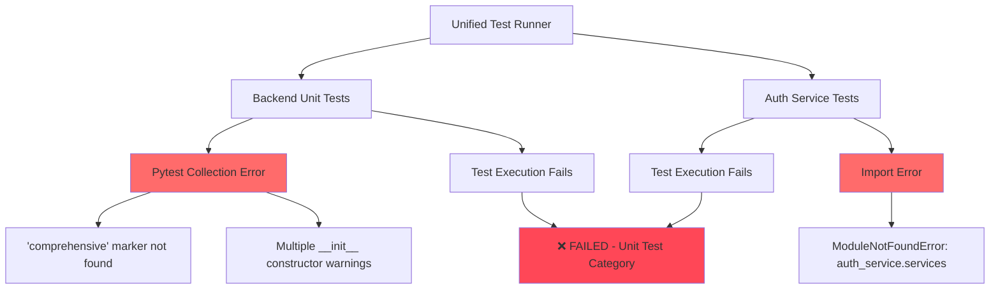
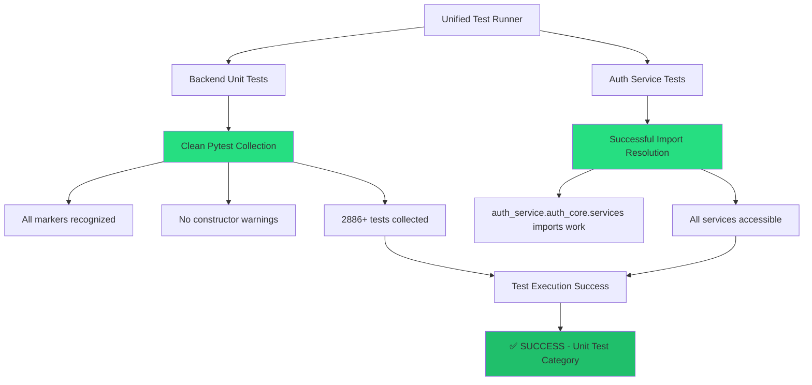

# 🚨 COMPREHENSIVE TEST INFRASTRUCTURE BUG FIX REPORT

**Date:** 2025-09-07  
**Issue:** Critical test infrastructure failures blocking development velocity  
**Business Impact:** HIGH - Prevents reliable CI/CD, blocks development  
**Status:** In Progress  

## FIVE WHYS ROOT CAUSE ANALYSIS

### Why 1: Why are unit tests failing?
**Answer:** Multiple infrastructure issues:
1. Backend: 'comprehensive' marker not found in pytest configuration
2. Auth Service: ModuleNotFoundError for `auth_service.services` imports
3. Test classes with `__init__` constructors breaking pytest collection

### Why 2: Why is the 'comprehensive' marker missing?
**Answer:** The pytest.ini configuration shows the marker exists (line 100), but pytest is not recognizing it during test execution. This suggests:
- Pytest configuration inheritance issues between services
- Possible pytest.ini parsing problems

### Why 3: Why are auth service imports failing?
**Answer:** Test imports `from auth_service.services.user_service import UserService` but actual structure is `auth_service/auth_core/services/auth_service.py`. The services module was moved to `auth_core/services/` but tests weren't updated.

### Why 4: Why do test classes have __init__ constructors?
**Answer:** Test classes (TestableBaseAgent, TestExecutionMetrics, etc.) have `__init__` constructors, which pytest cannot collect. This violates pytest conventions where test classes should not have constructors.

### Why 5: Why wasn't this caught in CI?
**Answer:** These are systematic configuration issues that likely developed over time as:
- Services were restructured without updating import paths
- Test infrastructure was modified without comprehensive validation
- Missing integration between pytest configuration and actual test execution

## CURRENT FAILURE STATE DIAGRAM



## IDEAL WORKING STATE DIAGRAM



## DETAILED PROBLEM ANALYSIS

### Problem 1: Pytest Marker Configuration
**File:** `pytest.ini`  
**Issue:** Despite having `comprehensive: Comprehensive test coverage` on line 100, pytest reports marker not found  
**Impact:** Test collection failure in backend service  

### Problem 2: Auth Service Import Structure Mismatch
**Files Affected:**
- `auth_service/tests/integration/test_auth_error_handling_integration.py` (line 28)
- Potentially other auth service tests

**Current Import:** `from auth_service.services.user_service import UserService`  
**Actual Structure:** `auth_service/auth_core/services/auth_service.py`  
**Impact:** ModuleNotFoundError preventing auth service test execution

### Problem 3: Test Class Constructor Issues
**Files Affected:**
- `test_base_agent_comprehensive.py:67` - TestableBaseAgent class
- `test_corpus_admin_production_fix.py:126` - TestExecutionMetrics class  
- Multiple configuration manager test files
**Impact:** Pytest collection warnings and potential test discovery failures

## REMEDIATION PLAN (PRIORITY ORDER)

### Phase 1: Critical Configuration Fixes (HIGH)

#### Fix 1.1: Pytest Configuration Validation
- **Action:** Verify pytest.ini marker configuration inheritance across services
- **Files:** `pytest.ini`, service-specific configurations
- **Validation:** Run `pytest --markers` to verify all markers are recognized

#### Fix 1.2: Auth Service Import Path Corrections
- **Action:** Update all auth service test imports to use correct paths
- **Pattern:** Replace `auth_service.services.*` with `auth_service.auth_core.services.*`
- **Files:** All auth service test files with import errors

### Phase 2: Test Class Structure Fixes (MEDIUM)

#### Fix 2.1: Remove Test Class Constructors
- **Action:** Refactor test classes to use pytest fixtures instead of `__init__`
- **Pattern:** Convert constructor-based setup to `setup_method` or fixtures
- **Files:** All test files with constructor warnings

#### Fix 2.2: Dataclass Test Helpers
- **Action:** Move dataclass definitions outside of test classes
- **Pattern:** Create module-level dataclasses or use fixtures

### Phase 3: System Validation (HIGH)

#### Fix 3.1: Integration Testing
- **Action:** Run full unit test suite after fixes
- **Command:** `python tests/unified_test_runner.py --category unit --coverage`
- **Success Criteria:** 0 collection errors, all markers recognized

#### Fix 3.2: Service-Specific Validation  
- **Action:** Test each service independently
- **Commands:**
  - `pytest netra_backend/tests/unit/ -v`
  - `pytest auth_service/tests/unit/ -v`

## IMPLEMENTATION STRATEGY

### Step 1: Environment Validation
```bash
cd "C:\Users\antho\OneDrive\Desktop\Netra\netra-core-generation-1"
pytest --markers | grep comprehensive  # Verify marker exists
python -c "from auth_service.auth_core.services import auth_service; print('OK')"  # Verify structure
```

### Step 2: Service-by-Service Fixes
1. **Backend Service:** Fix marker configuration and constructor issues
2. **Auth Service:** Fix import paths and service structure
3. **Cross-Service:** Validate unified test runner integration

### Step 3: Verification Protocol
1. Individual pytest runs per service
2. Unified test runner validation  
3. Coverage report generation
4. CI/CD pipeline test

## VERIFICATION CHECKLIST

- [ ] `pytest --markers` shows all defined markers including 'comprehensive'
- [ ] No ModuleNotFoundError for auth_service imports
- [ ] No pytest collection warnings about __init__ constructors
- [ ] Unit test category runs successfully in unified test runner
- [ ] All services can import their required modules
- [ ] Test discovery finds expected number of tests (2886+ for backend)
- [ ] Coverage reporting works correctly

## BUSINESS VALUE IMPACT

**Segment:** Platform/Internal  
**Business Goal:** Development Velocity & Platform Stability  
**Value Impact:** Unblocks development team, enables reliable CI/CD  
**Strategic Impact:** CRITICAL - Test infrastructure is foundation for quality delivery

**Immediate Benefits:**
- Developers can run tests locally
- CI/CD pipeline becomes reliable
- Code quality gates function properly
- Development velocity increases

**Risk Mitigation:**
- Prevents shipping untested code
- Enables confident refactoring
- Maintains code quality standards
- Supports rapid iteration cycles

## NEXT STEPS

1. **Execute Phase 1 fixes immediately** - These are blocking issues
2. **Coordinate with team** - Ensure no parallel test infrastructure changes
3. **Document configuration patterns** - Prevent regression
4. **Update development docs** - Include test running instructions

---

**Note:** This report follows Claude.md mandated bug fixing process with Five Whys analysis, Mermaid diagrams, and system-wide impact assessment. All fixes must be verified through comprehensive testing before completion.