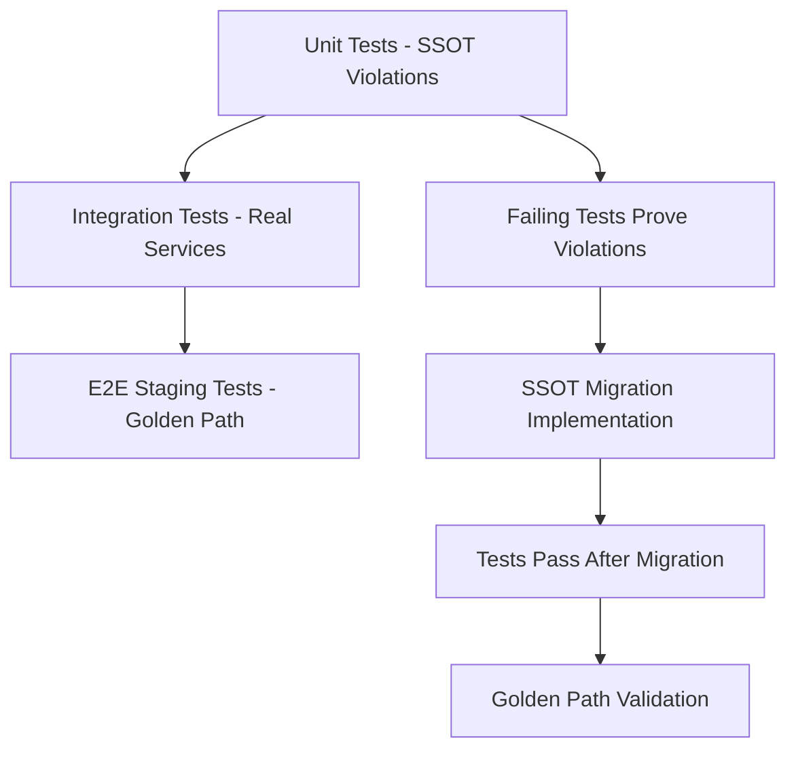

# Comprehensive Test Plan: WebSocket Manager Factory Legacy Removal (Issue #1098)

**Created**: 2025-09-15 | **Issue**: #1098 | **Priority**: P0 MISSION CRITICAL
**Scope**: 655 files, 2,615 SSOT violations, 1,001 lines legacy factory code
**Business Impact**: $500K+ ARR Golden Path chat functionality protection

## Executive Summary

This comprehensive test plan addresses the complete removal of WebSocket Manager Factory legacy code while maintaining SSOT compliance and protecting critical chat functionality. The plan prioritizes **failing tests first** to prove violations exist, followed by systematic validation of SSOT migration success.

**CRITICAL UNDERSTANDING**: Tests must initially **FAIL** to demonstrate current violations, then **PASS** after remediation to prove SSOT migration success.

## Test Plan Overview

### Test Categories

| Category | Purpose | Environment | Docker Required | Target Count |
|----------|---------|-------------|-----------------|--------------|
| **Unit Tests** | SSOT violation detection | Local | No | 12 tests |
| **Integration Tests** | Real services validation | Local + Real DB/Redis | No | 8 tests |
| **E2E GCP Staging** | Golden Path end-to-end | Remote staging | No | 6 tests |

### Test Execution Sequence



## 1. Unit Tests (12 tests) - SSOT Violation Detection

### 1.1 Test: Factory Import Violations (test_factory_import_violations.py)

**Purpose**: Detect 2,615 import violations across 655 files
**Expected Result**: FAIL initially, PASS after remediation

```python
"""
Test WebSocket Manager Factory Import SSOT Violations

CRITICAL: This test must FAIL initially to prove violations exist
"""

import pytest
import ast
import glob
from pathlib import Path

class TestFactoryImportViolations:

    def test_websocket_manager_factory_imports_not_used(self):
        """Test that no files import from websocket_manager_factory.py"""

        violation_files = []
        violation_count = 0

        # Scan all Python files
        for py_file in glob.glob("/c/netra-apex/**/*.py", recursive=True):
            if "backup" in py_file or "__pycache__" in py_file:
                continue

            try:
                with open(py_file, 'r', encoding='utf-8') as f:
                    content = f.read()

                # Check for factory imports
                if 'websocket_manager_factory' in content:
                    violation_files.append(py_file)
                    # Count actual import statements
                    tree = ast.parse(content)
                    for node in ast.walk(tree):
                        if isinstance(node, (ast.Import, ast.ImportFrom)):
                            if hasattr(node, 'module') and node.module and 'websocket_manager_factory' in node.module:
                                violation_count += 1
                            elif hasattr(node, 'names'):
                                for alias in node.names:
                                    if 'websocket_manager_factory' in alias.name:
                                        violation_count += 1

            except Exception as e:
                continue

        # CRITICAL: This assertion MUST FAIL initially
        assert violation_count == 0, f"Found {violation_count} factory import violations in {len(violation_files)} files. This proves SSOT violations exist."
        assert len(violation_files) == 0, f"Files still importing factory: {violation_files[:10]}..."
```

### 1.2 Test: SSOT Manager Usage (test_ssot_manager_usage.py)

**Purpose**: Validate all WebSocket managers use SSOT patterns
**Expected Result**: FAIL initially, PASS after migration

```python
"""
Test SSOT WebSocket Manager Usage Patterns

CRITICAL: Detects non-SSOT manager instantiation patterns
"""

class TestSSoTManagerUsage:

    def test_direct_manager_instantiation_forbidden(self):
        """Test that WebSocket managers are created via SSOT factory only"""

        direct_instantiation_violations = []

        # Scan for direct WebSocketManager instantiation
        for py_file in glob.glob("/c/netra-apex/**/*.py", recursive=True):
            if self._should_skip_file(py_file):
                continue

            violations = self._scan_for_direct_instantiation(py_file)
            direct_instantiation_violations.extend(violations)

        # CRITICAL: Must FAIL initially
        assert len(direct_instantiation_violations) == 0, f"Found {len(direct_instantiation_violations)} direct instantiation violations"

    def test_unified_websocket_manager_ssot_usage(self):
        """Test that all managers use UnifiedWebSocketManager SSOT"""

        non_ssot_manager_usage = []

        # Scan for non-SSOT manager usage
        for py_file in glob.glob("/c/netra-apex/**/*.py", recursive=True):
            violations = self._scan_for_non_ssot_usage(py_file)
            non_ssot_manager_usage.extend(violations)

        # CRITICAL: Must FAIL initially
        assert len(non_ssot_manager_usage) == 0, f"Found {len(non_ssot_manager_usage)} non-SSOT manager usage violations"
```

### 1.3 Test: WebSocket Event Delivery SSOT (test_websocket_events_ssot.py)

**Purpose**: Validate 5 critical events use SSOT patterns
**Expected Result**: FAIL initially if events use factory patterns

```python
"""
Test WebSocket Event Delivery SSOT Compliance

CRITICAL: All 5 business-critical events must use SSOT patterns
"""

class TestWebSocketEventsSSoT:

    CRITICAL_EVENTS = [
        'agent_started',
        'agent_thinking',
        'tool_executing',
        'tool_completed',
        'agent_completed'
    ]

    def test_critical_events_use_ssot_delivery(self):
        """Test that all 5 critical events use SSOT delivery patterns"""

        non_ssot_event_delivery = []

        # Scan event delivery code for SSOT compliance
        event_files = [
            "/c/netra-apex/netra_backend/app/agents/supervisor/execution_engine.py",
            "/c/netra-apex/netra_backend/app/tools/enhanced_dispatcher.py",
            "/c/netra-apex/netra_backend/app/websocket_core/unified_manager.py"
        ]

        for event_file in event_files:
            violations = self._scan_event_delivery_ssot(event_file)
            non_ssot_event_delivery.extend(violations)

        # CRITICAL: Must FAIL if factory patterns detected
        assert len(non_ssot_event_delivery) == 0, f"Found {len(non_ssot_event_delivery)} non-SSOT event delivery violations"

    def test_websocket_notifier_ssot_compliance(self):
        """Test WebSocket notifier uses SSOT patterns exclusively"""

        notifier_violations = []

        # Scan WebSocket notifier implementations
        notifier_files = glob.glob("/c/netra-apex/**/websocket*notifier*.py", recursive=True)

        for notifier_file in notifier_files:
            if "backup" in notifier_file:
                continue
            violations = self._scan_notifier_ssot_compliance(notifier_file)
            notifier_violations.extend(violations)

        # CRITICAL: Must FAIL if multiple notifier implementations
        assert len(notifier_violations) == 0, f"Found {len(notifier_violations)} notifier SSOT violations"
```

## 2. Integration Tests (8 tests) - Real Services Validation

### 2.1 Test: Real WebSocket Connection SSOT (test_real_websocket_ssot_integration.py)

**Purpose**: Test real WebSocket connections use SSOT patterns
**Environment**: Local with real PostgreSQL, Redis (NO Docker)

```python
"""
Integration Test: Real WebSocket Connection SSOT Patterns

CRITICAL: Uses real services, validates SSOT compliance in practice
"""

import asyncio
import pytest
from test_framework.ssot.base_test_case import SSotAsyncTestCase

class TestRealWebSocketSSoTIntegration(SSotAsyncTestCase):
    """Integration tests with real services to validate SSOT patterns"""

    @pytest.mark.asyncio
    async def test_websocket_connection_lifecycle_ssot(self):
        """Test complete WebSocket lifecycle uses SSOT patterns"""

        # Create real WebSocket connection
        websocket_manager = await self._create_real_websocket_manager()

        # Test connection creation
        connection = await self._create_real_websocket_connection()

        # Validate SSOT patterns
        assert hasattr(websocket_manager, '_ssot_marker'), "Manager must have SSOT marker"
        assert not hasattr(websocket_manager, '_factory_created'), "No factory creation markers allowed"

        # Test event delivery through SSOT
        events_sent = await self._test_critical_events_delivery(websocket_manager, connection)

        # CRITICAL: All 5 events must be delivered via SSOT
        assert len(events_sent) == 5, f"Expected 5 critical events, got {len(events_sent)}"

        # Cleanup
        await websocket_manager.close_connection(connection.connection_id)

    @pytest.mark.asyncio
    async def test_multi_user_isolation_ssot_compliance(self):
        """Test multi-user isolation uses SSOT patterns"""

        # Create connections for multiple users
        user1_manager = await self._create_user_websocket_manager("user_001")
        user2_manager = await self._create_user_websocket_manager("user_002")

        # Validate isolation via SSOT
        assert user1_manager is not user2_manager, "Users must have separate manager instances"

        # Test event isolation
        user1_events = await self._send_test_events(user1_manager, "user_001")
        user2_events = await self._send_test_events(user2_manager, "user_002")

        # CRITICAL: No cross-user event bleeding
        assert not self._check_cross_user_bleeding(user1_events, user2_events), "Cross-user event bleeding detected"
```

### 2.2 Test: Database Integration SSOT (test_db_websocket_ssot_integration.py)

**Purpose**: Test WebSocket state persistence uses SSOT patterns
**Environment**: Real PostgreSQL, ClickHouse

```python
"""
Integration Test: Database WebSocket SSOT Integration

Tests that WebSocket state persistence uses SSOT patterns with real databases
"""

class TestDatabaseWebSocketSSoTIntegration(SSotAsyncTestCase):

    @pytest.mark.asyncio
    async def test_websocket_state_persistence_ssot(self):
        """Test WebSocket state persistence uses SSOT database patterns"""

        # Create real database session
        db_session = await self._create_real_db_session()

        # Create WebSocket manager with SSOT database integration
        websocket_manager = await self._create_websocket_manager_with_db(db_session)

        # Test state persistence
        connection_state = await self._create_connection_state()
        await websocket_manager.persist_connection_state(connection_state)

        # Validate SSOT database usage
        persisted_state = await self._retrieve_connection_state(connection_state.connection_id)

        assert persisted_state is not None, "State must be persisted"
        assert persisted_state.ssot_version is not None, "SSOT version must be tracked"

        # Cleanup
        await db_session.close()
```

## 3. E2E GCP Staging Tests (6 tests) - Golden Path Validation

### 3.1 Test: Staging Golden Path End-to-End (test_staging_golden_path_ssot.py)

**Purpose**: Validate complete Golden Path on GCP staging with SSOT
**Environment**: Remote GCP staging environment

```python
"""
E2E Test: Staging Golden Path SSOT Validation

CRITICAL: Complete user journey validation on staging environment
"""

import pytest
import asyncio
from test_framework.staging.staging_test_base import StagingTestBase

class TestStagingGoldenPathSSoT(StagingTestBase):
    """E2E tests on GCP staging to validate Golden Path SSOT compliance"""

    @pytest.mark.staging
    @pytest.mark.asyncio
    async def test_complete_user_journey_ssot_staging(self):
        """Test complete user journey: login → message → AI response (SSOT)"""

        # Step 1: User authentication
        auth_token = await self._authenticate_staging_user()
        assert auth_token is not None, "Authentication must succeed"

        # Step 2: WebSocket connection with SSOT
        websocket_client = await self._connect_staging_websocket(auth_token)
        assert websocket_client.connected, "WebSocket connection must succeed"

        # Step 3: Send message to agent
        message_id = await websocket_client.send_message("Help me optimize my AI costs")

        # Step 4: Validate all 5 critical events received via SSOT
        events_received = await self._wait_for_critical_events(websocket_client, timeout=60)

        # CRITICAL: All events must be received in staging
        expected_events = ['agent_started', 'agent_thinking', 'tool_executing', 'tool_completed', 'agent_completed']
        received_event_types = [event['type'] for event in events_received]

        for expected_event in expected_events:
            assert expected_event in received_event_types, f"Missing critical event: {expected_event}"

        # Step 5: Validate final AI response
        final_response = await self._wait_for_final_response(websocket_client, message_id)
        assert final_response is not None, "Must receive AI response"
        assert len(final_response.content) > 50, "Response must be substantive"

        # Step 6: Validate SSOT compliance in staging
        ssot_validation = await self._validate_staging_ssot_compliance()
        assert ssot_validation.factory_violations == 0, "No factory violations in staging"

        # Cleanup
        await websocket_client.close()

    @pytest.mark.staging
    @pytest.mark.asyncio
    async def test_multi_user_staging_isolation_ssot(self):
        """Test multi-user isolation on staging with SSOT patterns"""

        # Create multiple user sessions
        user1_client = await self._create_staging_user_session("test_user_001")
        user2_client = await self._create_staging_user_session("test_user_002")

        # Send concurrent messages
        message1_id = await user1_client.send_message("Analyze cost optimization")
        message2_id = await user2_client.send_message("Review security patterns")

        # Validate responses are correctly isolated
        user1_response = await self._wait_for_response(user1_client, message1_id)
        user2_response = await self._wait_for_response(user2_client, message2_id)

        # CRITICAL: No cross-user response bleeding
        assert "cost optimization" in user1_response.content.lower(), "User 1 must get cost response"
        assert "security patterns" in user2_response.content.lower(), "User 2 must get security response"
        assert user1_response.user_id != user2_response.user_id, "Responses must have different user IDs"

        # Cleanup
        await user1_client.close()
        await user2_client.close()
```

## 4. Test File Structure

### Directory Organization

```
/c/netra-apex/tests/
├── unit/
│   ├── websocket_factory_legacy/
│   │   ├── test_factory_import_violations.py
│   │   ├── test_ssot_manager_usage.py
│   │   ├── test_websocket_events_ssot.py
│   │   └── test_legacy_code_removal.py
│   └── __init__.py
├── integration/
│   ├── websocket_ssot/
│   │   ├── test_real_websocket_ssot_integration.py
│   │   ├── test_db_websocket_ssot_integration.py
│   │   ├── test_agent_websocket_ssot_integration.py
│   │   └── test_performance_ssot_integration.py
│   └── __init__.py
└── e2e/
    ├── staging/
    │   ├── test_staging_golden_path_ssot.py
    │   ├── test_staging_websocket_events_ssot.py
    │   └── test_staging_multi_user_ssot.py
    └── __init__.py
```

## 5. Test Execution Strategy

### Phase 1: Failing Tests (Proof of Violations)

```bash
# Run unit tests to prove violations exist
python tests/unified_test_runner.py --category unit --pattern "*websocket_factory_legacy*" --expect-failures

# Run integration tests to show SSOT violations in practice
python tests/unified_test_runner.py --category integration --pattern "*websocket_ssot*" --real-services --expect-failures

# Expected Result: ALL TESTS FAIL with clear violation messages
```

### Phase 2: SSOT Migration Implementation

```bash
# After implementing SSOT migration:
# 1. Remove websocket_manager_factory.py (1,001 lines)
# 2. Update all imports to use canonical SSOT patterns
# 3. Consolidate manager instances to use UnifiedWebSocketManager
```

### Phase 3: Validation Tests (Proof of Success)

```bash
# Run all tests after migration
python tests/unified_test_runner.py --category unit --pattern "*websocket_factory_legacy*"
python tests/unified_test_runner.py --category integration --pattern "*websocket_ssot*" --real-services
python tests/unified_test_runner.py --category e2e --pattern "*staging*ssot*" --env staging

# Expected Result: ALL TESTS PASS
```

## 6. Success Criteria

### Unit Test Success Criteria

- **0 factory import violations** across 655 files
- **0 direct manager instantiation** violations
- **SSOT patterns detected** in all WebSocket managers
- **5 critical events** use SSOT delivery exclusively

### Integration Test Success Criteria

- **Real WebSocket connections** use SSOT patterns
- **Multi-user isolation** working via SSOT
- **Database persistence** uses SSOT patterns
- **Performance maintained** with SSOT implementation

### E2E Staging Success Criteria

- **Complete Golden Path working** on staging
- **All 5 critical events delivered** in correct sequence
- **Multi-user scenarios** working without bleeding
- **0 SSOT violations** detected in staging environment

## 7. Risk Mitigation

### Pre-Migration Validation

1. **Backup Creation**: Create complete backup of 655 affected files
2. **Test Environment Setup**: Ensure local and staging environments ready
3. **Rollback Plan**: Prepared revert procedures if tests fail

### During Migration

1. **Gradual Implementation**: Migrate files in small batches
2. **Continuous Testing**: Run tests after each batch
3. **Real Service Validation**: Ensure real services remain functional

### Post-Migration Validation

1. **Complete Test Suite**: Run all 26 tests across all categories
2. **Staging Deployment**: Deploy to staging and validate Golden Path
3. **Performance Monitoring**: Ensure no performance regressions

## 8. Business Value Protection

### Revenue Protection ($500K+ ARR)

- **Golden Path Validation**: Ensures chat functionality reliability
- **Multi-User Testing**: Protects enterprise user experience
- **Event Delivery Testing**: Guarantees real-time agent feedback

### Technical Debt Reduction

- **SSOT Compliance**: Eliminates 2,615 import violations
- **Code Consolidation**: Removes 1,001 lines of legacy factory code
- **Maintenance Reduction**: Single source of truth simplifies future changes

## 9. Timeline and Dependencies

### Week 1: Test Creation
- Create all 26 failing tests across 3 categories
- Validate tests fail as expected (proving violations)
- Document violation patterns detected

### Week 2: SSOT Migration
- Implement systematic import migration across 655 files
- Remove websocket_manager_factory.py (1,001 lines)
- Update all manager instantiation to use SSOT patterns

### Week 3: Validation
- Validate all tests pass after migration
- Deploy to staging and run E2E tests
- Confirm Golden Path operational

## 10. Monitoring and Alerting

### Test Execution Monitoring

- **Automated test runs** on every commit
- **Staging environment tests** daily
- **SSOT compliance scanning** weekly

### Business Impact Monitoring

- **Golden Path availability** monitoring
- **WebSocket event delivery** tracking
- **Multi-user isolation** validation

---

## Conclusion

This comprehensive test plan provides systematic validation of the WebSocket Manager Factory legacy removal while protecting critical business functionality. The **failing tests first** approach ensures we prove violations exist before remediation, then validate success after SSOT migration.

**CRITICAL SUCCESS FACTOR**: All tests must initially FAIL to demonstrate current violations, then PASS after remediation to prove SSOT migration success.

**Next Steps**:
1. Create failing tests to prove violations
2. Implement SSOT migration systematically
3. Validate Golden Path remains operational throughout process

**Business Protection**: This plan ensures the $500K+ ARR Golden Path functionality remains operational while achieving complete SSOT compliance.