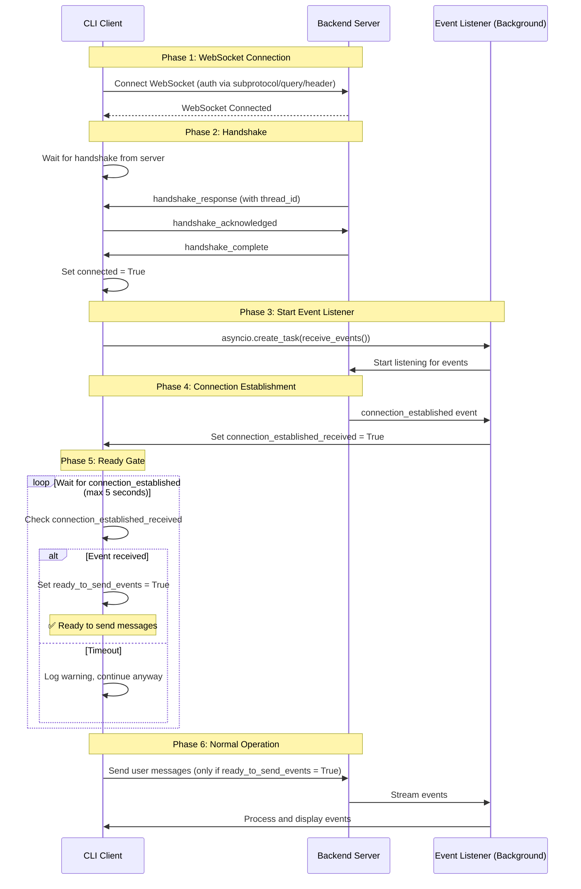

# WebSocket Connection Flow

## Overview
This document describes the linear, gated connection flow for the WebSocket CLI client. The connection process ensures both handshake completion and `connection_established` event receipt before allowing message transmission.

## Connection Flow Diagram



## Flow States

### 1. Initial State
- `connected`: False
- `connection_established_received`: False
- `ready_to_send_events`: False

### 2. After Handshake
- `connected`: True ✅
- `connection_established_received`: False
- `ready_to_send_events`: False

### 3. After connection_established
- `connected`: True ✅
- `connection_established_received`: True ✅
- `ready_to_send_events`: True ✅

## Key Implementation Details

### Linear Flow in `connect()` Method
```python
# Step 1: Perform handshake
handshake_success = await self._perform_handshake()
if handshake_success:
    self.connected = True

    # Step 2: Start event listener immediately
    asyncio.create_task(self.receive_events())

    # Step 3: Wait for connection_established
    timeout = 5.0
    while not self.connection_established_received:
        if timeout_exceeded:
            break
        await asyncio.sleep(0.1)

    # Step 4: Set ready flag
    if self.connection_established_received:
        self.ready_to_send_events = True
```

### Event Listener (`receive_events()`)
- Runs continuously in background after handshake
- Captures `connection_established` event when sent by server
- Sets `connection_established_received = True` flag

### Message Sending Gate
Before sending any message, the CLI checks:
```python
if not self.ready_to_send_events:
    # Wait for connection_established event
    # Or timeout and raise error
```

## Benefits of This Approach

1. **Linear & Simple**: Clear sequential flow without complex branching
2. **No Race Conditions**: Event listener starts before server sends `connection_established`
3. **Gated Access**: Messages can only be sent after full establishment
4. **Timeout Protection**: 5-second timeout prevents indefinite waiting
5. **Clean State Management**: Three boolean flags with clear progression

## Server Requirements

The backend server must:
1. Send `handshake_response` during HANDSHAKING phase
2. Send `connection_established` event after handshake completion
3. Only process user messages after both events are acknowledged

## Error Handling

- If handshake fails: Connection aborts
- If `connection_established` times out: Warning logged, continues with degraded state
- If WebSocket disconnects: All flags reset, must reconnect from beginning