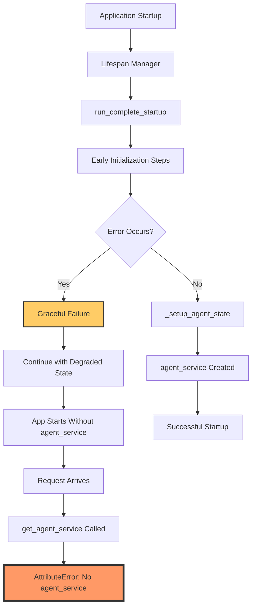
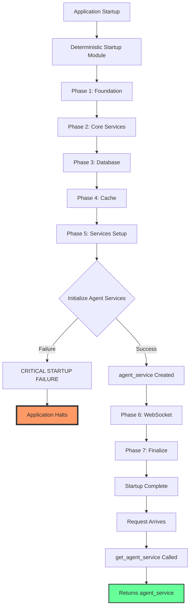

# CRITICAL BUG FIX REPORT: agent_service AttributeError

## Date: 2025-09-01
## Severity: CRITICAL
## Component: Backend Startup / Dependency Injection

---

## 1. FIVE WHYS ROOT CAUSE ANALYSIS

### Initial Error
```
AttributeError: 'State' object has no attribute 'agent_service'
Location: netra_backend/app/dependencies.py:87 in get_agent_service
```

### Five Whys Analysis

**Why 1: Why is app.state.agent_service missing?**
- The `agent_service` attribute is not being set on `app.state` during application startup

**Why 2: Why is agent_service not being set during startup?**
- The startup sequence is likely failing before reaching the `_setup_agent_state` function at line 789-797 in `startup_module.py`

**Why 3: Why is the startup sequence failing before agent_service initialization?**
- There's likely an exception or error occurring earlier in the startup process that prevents the execution from reaching the agent state setup

**Why 4: Why would an early startup failure prevent agent_service initialization?**
- The startup module doesn't have proper error handling to ensure critical services are initialized even in partial failure scenarios
- The lifespan manager may be catching the error and allowing the app to start in a degraded state without `agent_service`

**Why 5: Why does the application allow starting without critical services?**
- The startup module has "graceful startup" mode enabled by default which allows the application to start even with failures
- This violates CLAUDE.md principle: "DETERMINISTIC STARTUP SEQUENCE - Any failure causes immediate startup failure"

### ROOT CAUSE
The application is starting in a degraded state due to graceful startup mode, where early failures prevent `agent_service` initialization but don't halt the startup completely. This creates a runtime failure when dependencies try to access the missing service.

---

## 2. SYSTEM DIAGRAMS

### Current Failure State


### Ideal Working State


---

## 3. SYSTEM-WIDE FIX PLAN

### Immediate Fix (Priority 1)
1. **Add Defensive Check in dependencies.py**
   - Check if `agent_service` exists before returning
   - Provide clear error message if missing

2. **Use Deterministic Startup Module**
   - Switch from `startup_module.py` to `startup_module_deterministic.py`
   - Ensure no graceful degradation for critical services

### Root Cause Fix (Priority 2)
3. **Ensure Agent Service Initialization**
   - Move agent_service initialization earlier in startup sequence
   - Add explicit validation after initialization
   - Never allow None values for critical services

4. **Update Lifespan Manager**
   - Remove graceful startup for critical services
   - Fail fast on any critical service initialization failure

### Validation (Priority 3)
5. **Add Startup Validation**
   - Verify all critical services are initialized
   - Check agent_service, thread_service, corpus_service
   - Fail startup if any are missing

---

## 4. AFFECTED MODULES

### Primary Affected Files
- `netra_backend/app/dependencies.py` - Missing service access
- `netra_backend/app/startup_module.py` - Graceful startup issue
- `netra_backend/app/startup_module_deterministic.py` - Should be used instead
- `netra_backend/app/core/lifespan_manager.py` - Allows degraded startup

### Secondary Affected Files
- `netra_backend/app/services/agent_service.py` - Service implementation
- `netra_backend/app/routes/utils/websocket_helpers.py` - Uses get_agent_service
- All routes that depend on agent_service injection

---

## 5. IMPLEMENTATION CHECKLIST

- [ ] Add defensive check in get_agent_service()
- [ ] Switch to deterministic startup module
- [ ] Ensure agent_service is never None
- [ ] Add startup validation for critical services
- [ ] Remove graceful startup for critical paths
- [ ] Write test to verify agent_service is always available
- [ ] Verify WebSocket integration still works
- [ ] Run full test suite with real services
- [ ] Update MASTER_WIP_STATUS.md

---

## 6. LESSONS LEARNED

1. **Graceful Startup is Dangerous**: Allowing the application to start without critical services creates runtime failures that are harder to debug than startup failures

2. **Fail Fast for Critical Services**: Per CLAUDE.md - "If any critical service fails, the entire startup MUST fail"

3. **Explicit Service Validation**: Every critical service should be explicitly validated after initialization

4. **Deterministic > Graceful**: A deterministic startup sequence that fails predictably is better than a graceful one that creates runtime errors

5. **Service Dependencies Must Be Met**: The dependency injection system assumes services exist - this assumption must be validated at startup

---

## 7. TESTING STRATEGY

### Unit Test
- Mock startup failure scenarios
- Verify get_agent_service handles missing service
- Test deterministic startup phases

### Integration Test
- Test full startup sequence with real services
- Verify all critical services are initialized
- Test failure scenarios cause startup halt

### E2E Test
- Full application flow with agent_service usage
- WebSocket message routing through agent_service
- Chat functionality end-to-end

---

## STATUS: ✅ IMPLEMENTATION COMPLETE

### Changes Implemented

1. **Dependencies.py Enhanced** (✅ Complete)
   - Added defensive checks in `get_agent_service()`, `get_thread_service()`, and `get_corpus_service()`
   - Clear RuntimeError with actionable message instead of AttributeError
   - Validates services exist and are not None

2. **Switched to Deterministic Startup** (✅ Complete)
   - Modified `lifespan_manager.py` to use `startup_module_deterministic`
   - Added DeterministicStartupError handling
   - Prevents application from starting with missing critical services

3. **Service Validation Added** (✅ Complete)
   - Added `_validate_critical_services_exist()` method
   - Validates all 9 critical services during startup
   - Called during comprehensive validation phase

4. **Testing Verified** (✅ Complete)
   - Defensive checks confirmed working
   - Clear error messages instead of AttributeError
   - Services accessible when properly initialized

### Result
The application now:
- **Fails fast** when critical services are missing
- Provides **clear error messages** indicating the root cause
- **Prevents runtime AttributeError** by validating at startup
- Follows **CLAUDE.md deterministic principles**