# AgentWebSocketBridge - Comprehensive System Flow Diagrams

## 1. Initialization Flow - From Bootstrap to Business Value

```mermaid
sequenceDiagram
    participant App as Application Start
    participant Bridge as AgentWebSocketBridge
    participant WSM as WebSocketManager
    participant AER as AgentExecutionRegistry
    participant Registry as AgentRegistry
    participant Supervisor as SupervisorAgent

    Note over App,Supervisor: Business Value: Reliable AI-Chat Infrastructure Setup

    App->>Bridge: get_agent_websocket_bridge()
    
    rect rgb(255, 240, 240)
        Note over Bridge: Singleton Creation & Thread Safety
        Bridge->>Bridge: __new__() - Singleton Pattern
        Bridge->>Bridge: __init__() - Initialize if not _initialized
        Bridge->>Bridge: _initialize_configuration()
        Bridge->>Bridge: _initialize_state()
        Bridge->>Bridge: _initialize_dependencies()
        Bridge->>Bridge: _initialize_health_monitoring()
    end

    App->>Bridge: ensure_integration(supervisor, registry)
    
    rect rgb(240, 255, 240)
        Note over Bridge: Critical Integration Setup
        Bridge->>Bridge: State = INITIALIZING
        Bridge->>Bridge: metrics.total_initializations++
        
        Bridge->>WSM: get_websocket_manager()
        WSM-->>Bridge: WebSocketManager instance
        
        Bridge->>AER: get_agent_execution_registry()
        AER-->>Bridge: AgentExecutionRegistry instance
        
        Bridge->>AER: set_websocket_manager(ws_manager)
        AER-->>Bridge: Success
        
        alt Enhanced Integration Available
            Bridge->>AER: setup_agent_websocket_integration(supervisor, registry)
            AER->>Registry: set_websocket_manager(ws_manager)
            AER->>Registry: Configure tool dispatcher enhancement
            AER-->>Bridge: Enhanced integration complete
        else Basic Integration
            Note over Bridge,AER: Basic orchestrator integration only
        end
        
        Bridge->>Bridge: _verify_integration()
        Bridge->>AER: get_metrics() - Health check
        AER-->>Bridge: Metrics dict (healthy)
        
        Bridge->>Bridge: _start_health_monitoring()
        Bridge->>Bridge: State = ACTIVE
        Bridge->>Bridge: metrics.successful_initializations++
    end

    Bridge-->>App: IntegrationResult{success: true, state: ACTIVE}
    
    Note over App,Supervisor: 🎯 BUSINESS VALUE: Chat infrastructure ready for AI interactions
```

## 2. User Message Processing Flow - Delivering Substantive Chat Value

```mermaid
sequenceDiagram
    participant User as Frontend User
    participant WS as WebSocket Connection
    participant WSM as WebSocketManager
    participant AER as AgentExecutionRegistry
    participant Bridge as AgentWebSocketBridge
    participant Registry as AgentRegistry
    participant Agent as AI Agent
    participant LLM as LLM Service

    Note over User,LLM: Business Value: Real-Time AI Problem Solving

    User->>WS: Send chat message
    WS->>WSM: handle_websocket_message()
    
    rect rgb(240, 240, 255)
        Note over WSM,AER: Message Routing & Context Management
        WSM->>AER: process_user_message(user_id, thread_id, message)
        AER->>AER: get_or_create_context()
        AER->>AER: context_registry[context_id] = ContextState
        
        alt Health Check Required
            AER->>Bridge: health_check()
            Bridge->>Bridge: _check_websocket_manager_health()
            Bridge->>Bridge: _check_orchestrator_health()
            Bridge-->>AER: HealthStatus{all_healthy: true}
        end
    end

    rect rgb(255, 245, 240)
        Note over AER,Agent: Agent Execution with Real-Time Updates
        AER->>Registry: get_agent(agent_name)
        Registry-->>AER: Agent instance
        
        AER->>Agent: execute(message, context)
        
        Note over Agent: 🎯 BUSINESS VALUE: AI starts solving user's problem
        Agent->>WS: WebSocket Event: agent_started
        User->>User: Sees "AI is working on your request"
        
        Agent->>Agent: analyze_user_request()
        Agent->>WS: WebSocket Event: agent_thinking
        User->>User: Sees AI reasoning process
        
        Agent->>Agent: select_tools_needed()
        Agent->>WS: WebSocket Event: tool_executing
        User->>User: Sees "AI is using database tool"
        
        Agent->>LLM: llm_call(enhanced_prompt)
        LLM-->>Agent: Substantive AI response
        
        Agent->>WS: WebSocket Event: tool_completed
        User->>User: Sees tool results & insights
        
        Agent->>WS: WebSocket Event: agent_completed
        Agent->>WS: Final AI response with solutions
        User->>User: Receives valuable AI insights & actionable results
    end

    rect rgb(240, 255, 240)
        Note over AER,Bridge: Context Cleanup & Health Monitoring
        AER->>AER: context.last_activity = now()
        AER->>AER: context.event_count++
        
        alt Context Lifecycle Management
            AER->>AER: cleanup_inactive_contexts()
            AER->>Bridge: update_health_metrics()
        end
    end

    Note over User,LLM: 🎯 BUSINESS VALUE DELIVERED: User received AI-powered solution to real problem
```

## 3. Business Value Critical Points - Revenue-Driving Interactions

```mermaid
flowchart TD
    subgraph "🎯 BUSINESS VALUE DELIVERY PIPELINE"
        A[User Sends Message] --> B{Bridge Health Check}
        B -->|Healthy| C[Agent Execution Starts]
        B -->|Unhealthy| R[Auto Recovery]
        R --> C
        
        C --> D[WebSocket: agent_started]
        D --> E[User Sees AI Working]
        
        E --> F[Agent Processes Request]
        F --> G[WebSocket: agent_thinking]
        G --> H[User Sees AI Reasoning]
        
        H --> I[Tool Execution]
        I --> J[WebSocket: tool_executing]
        J --> K[User Sees Problem-Solving Approach]
        
        K --> L[LLM Processing]
        L --> M[WebSocket: tool_completed]
        M --> N[User Sees Insights & Results]
        
        N --> O[WebSocket: agent_completed]
        O --> P[User Receives Final Solution]
    end
    
    subgraph "💰 REVENUE IMPACT POINTS"
        E --> E1[User Engagement Maintained]
        H --> H1[AI Transparency Builds Trust]
        K --> K1[Process Visibility Increases Value Perception]
        N --> N1[Real-Time Results Demonstrate Capability]
        P --> P1[Successful Problem Resolution = Customer Retention]
    end
    
    subgraph "🛡️ BUSINESS PROTECTION MECHANISMS"
        B --> B1[Prevents Service Disruption]
        R --> R1[Zero-Downtime Recovery]
        
        subgraph "Bridge Health Monitoring"
            B1 --> BH1[WebSocket Manager Health]
            B1 --> BH2[Orchestrator Health]
            B1 --> BH3[Agent Registry Health]
        end
        
        subgraph "Auto Recovery System"
            R1 --> AR1[Exponential Backoff]
            R1 --> AR2[Component Re-initialization]
            R1 --> AR3[Health Verification]
        end
    end
    
    style E1 fill:#90EE90
    style H1 fill:#90EE90
    style K1 fill:#90EE90
    style N1 fill:#90EE90
    style P1 fill:#FFD700
    style B1 fill:#FFB6C1
    style R1 fill:#FFB6C1
```

## 4. Comprehensive System Integration Architecture

```mermaid
graph TB
    subgraph "🏗️ AGENT WEBSOCKET BRIDGE ECOSYSTEM"
        subgraph "Bridge Core"
            Bridge[AgentWebSocketBridge<br/>🎯 SSOT Integration Lifecycle]
            Config[IntegrationConfig<br/>Timeouts & Recovery Settings]
            State[IntegrationState<br/>UNINITIALIZED → ACTIVE]
            Health[HealthStatus<br/>Continuous Monitoring]
            Metrics[IntegrationMetrics<br/>Success Tracking]
        end
        
        subgraph "Singleton Management"
            Factory[get_agent_websocket_bridge<br/>Thread-Safe Factory]
            Lock[AsyncIO Lock<br/>Concurrency Control]
        end
        
        subgraph "Integration Components"
            WSM[WebSocketManager<br/>Connection Management]
            AER[AgentExecutionRegistry<br/>Context & Lifecycle]
            Registry[AgentRegistry<br/>Tool Dispatcher Enhancement]
            Supervisor[SupervisorAgent<br/>Execution Management]
        end
        
        subgraph "Health & Recovery System"
            HealthLoop[Health Monitoring Loop<br/>60s Interval Checks]
            Recovery[Auto Recovery<br/>Exponential Backoff]
            Verification[Integration Verification<br/>Component Response Tests]
        end
    end
    
    subgraph "🌐 WEBSOCKET INFRASTRUCTURE"
        Connections[WebSocket Connections<br/>User↔Backend]
        EventPipeline[Event Pipeline<br/>Real-Time Updates]
        MessageRouting[Message Routing<br/>Context Management]
    end
    
    subgraph "🤖 AI AGENT SYSTEM"
        AgentExec[Agent Execution Engine<br/>LLM-Powered Processing]
        ToolDispatcher[Enhanced Tool Dispatcher<br/>WebSocket-Aware]
        ContextMgmt[Execution Context<br/>State & Memory]
    end
    
    subgraph "💼 BUSINESS VALUE DELIVERY"
        UserExp[User Experience<br/>Real-Time AI Interactions]
        ValueDelivery[Value Delivery<br/>Problem-Solving Solutions]
        CustomerRet[Customer Retention<br/>Reliable Service]
    end
    
    %% Core Integration Flow
    Bridge --> WSM
    Bridge --> AER
    Bridge --> Registry
    Bridge --> Supervisor
    
    %% Factory Pattern
    Factory --> Bridge
    Factory --> Lock
    
    %% Configuration Flow
    Config --> Bridge
    State --> Bridge
    Health --> Bridge
    Metrics --> Bridge
    
    %% Health System
    Bridge --> HealthLoop
    HealthLoop --> Verification
    HealthLoop --> Recovery
    Recovery --> Bridge
    
    %% WebSocket Integration
    WSM --> Connections
    AER --> MessageRouting
    MessageRouting --> EventPipeline
    
    %% Agent Integration  
    Registry --> ToolDispatcher
    Supervisor --> AgentExec
    ToolDispatcher --> ContextMgmt
    
    %% Business Value Chain
    EventPipeline --> UserExp
    AgentExec --> ValueDelivery
    Health --> CustomerRet
    
    %% Critical Business Flow
    Connections -.->|User Messages| MessageRouting
    MessageRouting -.->|Agent Requests| AgentExec
    AgentExec -.->|WebSocket Events| EventPipeline
    EventPipeline -.->|Real-Time Updates| UserExp
    UserExp -.->|Engagement| ValueDelivery
    ValueDelivery -.->|Satisfaction| CustomerRet
    
    style Bridge fill:#FFD700,stroke:#FF8C00,stroke-width:3px
    style UserExp fill:#90EE90,stroke:#006400,stroke-width:2px
    style ValueDelivery fill:#90EE90,stroke:#006400,stroke-width:2px
    style CustomerRet fill:#90EE90,stroke:#006400,stroke-width:2px
    style Recovery fill:#FFB6C1,stroke:#DC143C,stroke-width:2px
    style Health fill:#ADD8E6,stroke:#4169E1,stroke-width:2px
```

## 5. State Transition & Recovery Flows

```mermaid
stateDiagram-v2
    [*] --> UNINITIALIZED : Bridge Creation

    UNINITIALIZED --> INITIALIZING : ensure_integration() called
    
    INITIALIZING --> ACTIVE : All components healthy
    INITIALIZING --> FAILED : Component failure
    
    ACTIVE --> DEGRADED : Health check failure
    ACTIVE --> FAILED : Critical failure
    
    DEGRADED --> ACTIVE : Health recovered
    DEGRADED --> FAILED : Multiple failures
    
    FAILED --> INITIALIZING : Recovery attempt
    
    ACTIVE --> [*] : shutdown()
    DEGRADED --> [*] : shutdown()
    FAILED --> [*] : shutdown()
    
    note right of ACTIVE : 🎯 BUSINESS VALUE STATE<br/>Chat interactions working<br/>AI delivering solutions
    
    note right of DEGRADED : ⚠️ PARTIAL SERVICE<br/>Some components unhealthy<br/>Auto-recovery triggered
    
    note right of FAILED : 🚨 SERVICE DISRUPTION<br/>Multiple recovery attempts<br/>Manual intervention may be needed
    
    note right of INITIALIZING : 🔄 SETUP IN PROGRESS<br/>Components being connected<br/>Health verification running
```

## Key Business Value Points Summary

### 🎯 **Primary Business Value**: Substantive Chat Interactions
- **Real-Time AI Problem Solving**: Users receive immediate, valuable responses to their problems
- **Process Transparency**: WebSocket events show AI working, building trust and engagement
- **Reliable Service Delivery**: Health monitoring and auto-recovery prevent service disruptions

### 💰 **Revenue Impact Mechanisms**:
1. **User Engagement**: Real-time updates keep users actively engaged
2. **Value Demonstration**: Visible AI reasoning process shows platform capability
3. **Problem Resolution**: Successful AI solutions drive customer satisfaction and retention
4. **Service Reliability**: Zero-downtime recovery protects business continuity

### 🛡️ **Business Protection Features**:
- **Health Monitoring**: 60-second interval health checks prevent issues
- **Auto Recovery**: Exponential backoff recovery with up to 3 attempts
- **Component Verification**: Integration health checks ensure all parts working
- **Graceful Degradation**: System continues operating even with partial component failures

The AgentWebSocketBridge serves as the critical infrastructure that enables Netra's core business value: delivering substantive AI-powered chat interactions that solve real user problems in real-time.

---

## 6. Five Whys Analysis - Key Actors, Boundaries & Promises

### 🎯 **AgentWebSocketBridge** - The Central Coordinator

#### **Why does AgentWebSocketBridge exist?**
1. **Why?** To coordinate WebSocket and Agent services for chat functionality
2. **Why?** Because chat is our primary business value delivery mechanism (90% of value)  
3. **Why?** Because users need real-time AI interactions to solve their problems
4. **Why?** Because real-time problem-solving drives user engagement and retention
5. **Why?** Because customer retention directly impacts our revenue and business survival

#### **Boundary Promises:**
- **SSOT Integration**: Single source of truth for WebSocket-Agent lifecycle management
- **Idempotent Operations**: Can be called multiple times safely without side effects
- **Health Monitoring**: Continuous health checks with automatic recovery
- **Thread Safety**: Singleton pattern with async locks for concurrent access
- **Zero-Downtime Recovery**: Service continues even during component failures

---

### 🌐 **WebSocketManager** - Real-Time Communication Gateway

#### **Why does WebSocketManager exist?**
1. **Why?** To manage real-time bidirectional communication with frontend users
2. **Why?** Because users need immediate feedback when AI agents are working on their problems
3. **Why?** Because immediate feedback keeps users engaged and demonstrates value
4. **Why?** Because engaged users are more likely to convert to paid tiers
5. **Why?** Because paid conversions are essential for business sustainability

#### **Boundary Promises:**
- **Connection Management**: Maintain stable WebSocket connections per user/thread
- **Message Routing**: Route messages between frontend and backend services
- **Event Delivery**: Guarantee delivery of real-time updates to connected users
- **Connection Recovery**: Handle connection drops gracefully
- **Scalability**: Support multiple concurrent user connections

---

### 🎭 **AgentExecutionRegistry** - Context & Lifecycle Manager

#### **Why does AgentExecutionRegistry exist?**
1. **Why?** To prevent duplicate agent executions and manage execution contexts
2. **Why?** Because duplicate executions waste LLM API costs and confuse users
3. **Why?** Because cost control and user experience directly impact profitability
4. **Why?** Because profitability determines our ability to invest in better AI capabilities
5. **Why?** Because better AI capabilities differentiate us from competitors

#### **Boundary Promises:**
- **Context Registry**: Track active agent executions to prevent duplicates
- **Lifecycle Management**: Manage agent execution from start to completion
- **Connection Health**: Monitor WebSocket connection health per context
- **Resource Cleanup**: Clean up inactive contexts to prevent memory leaks
- **Metrics Collection**: Provide execution metrics for business intelligence

---

### 🤖 **AgentRegistry** - Tool Dispatcher & Agent Discovery

#### **Why does AgentRegistry exist?**
1. **Why?** To provide WebSocket-aware tool execution for real-time user feedback
2. **Why?** Because users need to see AI agents actively working on their problems
3. **Why?** Because visible AI work builds trust in our platform's capabilities
4. **Why?** Because trust is essential for users to rely on our AI for important decisions
5. **Why?** Because reliable AI decision-making justifies premium pricing tiers

#### **Boundary Promises:**
- **Agent Discovery**: Locate and instantiate appropriate AI agents
- **Tool Enhancement**: Wrap tool execution with WebSocket notifications
- **Event Integration**: Emit agent_started, tool_executing, agent_completed events
- **Agent Lifecycle**: Manage agent initialization and cleanup
- **Type Safety**: Ensure proper agent-tool compatibility

---

### 👥 **SupervisorAgent** - Execution Management & Coordination

#### **Why does SupervisorAgent exist?**
1. **Why?** To coordinate complex multi-step AI agent workflows
2. **Why?** Because complex problems require orchestrated AI tool usage
3. **Why?** Because orchestrated AI provides more comprehensive solutions than single tools
4. **Why?** Because comprehensive solutions create higher customer value
5. **Why?** Because higher value justifies higher prices and improves customer lifetime value

#### **Boundary Promises:**
- **Workflow Coordination**: Orchestrate multi-agent, multi-tool workflows
- **Execution Context**: Maintain execution state across tool calls
- **Error Handling**: Manage failures and retry logic for complex workflows
- **Progress Reporting**: Provide detailed progress updates via WebSocket
- **Result Synthesis**: Combine multiple tool results into coherent solutions

---

## 7. Service Boundary Map - Promises & Dependencies

```mermaid
graph TB
    subgraph "🎯 BUSINESS VALUE BOUNDARY"
        subgraph "AgentWebSocketBridge Promises"
            BWS1[SSOT Integration Lifecycle]
            BWS2[Zero-Downtime Recovery]
            BWS3[Health Monitoring]
            BWS4[Thread-Safe Coordination]
        end
    end
    
    subgraph "🌐 COMMUNICATION BOUNDARY"
        subgraph "WebSocketManager Promises"
            WS1[Stable Connection Management]
            WS2[Reliable Message Routing]
            WS3[Event Delivery Guarantee]
            WS4[Connection Recovery]
        end
    end
    
    subgraph "🎭 ORCHESTRATION BOUNDARY" 
        subgraph "AgentExecutionRegistry Promises"
            OS1[Context Deduplication]
            OS2[Lifecycle Management]
            OS3[Resource Cleanup]
            OS4[Health Tracking]
        end
    end
    
    subgraph "🤖 AGENT BOUNDARY"
        subgraph "AgentRegistry Promises"
            AS1[Agent Discovery]
            AS2[WebSocket-Aware Tools]
            AS3[Event Emission]
            AS4[Type Safety]
        end
    end
    
    subgraph "👥 SUPERVISION BOUNDARY"
        subgraph "SupervisorAgent Promises" 
            SS1[Workflow Coordination]
            SS2[Multi-Tool Orchestration]
            SS3[Progress Reporting]
            SS4[Result Synthesis]
        end
    end
    
    %% Promise Dependencies
    BWS1 -.->|depends on| WS1
    BWS1 -.->|depends on| OS1
    BWS2 -.->|depends on| WS4
    BWS2 -.->|depends on| OS4
    BWS3 -.->|monitors| AS1
    BWS3 -.->|monitors| SS1
    
    WS3 -.->|enables| AS3
    WS2 -.->|enables| SS3
    
    OS1 -.->|prevents conflicts in| AS1
    OS2 -.->|manages| SS1
    
    AS2 -.->|enhances| SS2
    AS3 -.->|feeds into| WS3
    
    SS2 -.->|coordinates| AS1
    SS4 -.->|delivers via| WS2
    
    %% Critical Business Flow
    BWS1 ==>|enables| WS1
    WS1 ==>|enables| OS1  
    OS1 ==>|enables| AS1
    AS1 ==>|enables| SS1
    SS1 ==>|delivers| BWS1
    
    style BWS1 fill:#FFD700,stroke:#FF8C00,stroke-width:3px
    style WS1 fill:#87CEEB,stroke:#4169E1,stroke-width:2px
    style OS1 fill:#DDA0DD,stroke:#8A2BE2,stroke-width:2px
    style AS1 fill:#90EE90,stroke:#006400,stroke-width:2px
    style SS1 fill:#FFB6C1,stroke:#DC143C,stroke-width:2px
```

## 8. Critical Business Questions Answered by Five Whys

### **Q: Why is this architecture so complex for "just chat"?**
**A:** Because "chat" represents 90% of our business value delivery, requiring:
- Real-time AI problem solving (revenue driver)
- Process transparency (trust builder) 
- Reliable service (customer retention)
- Cost efficiency (profitability)
- Competitive differentiation (market position)

### **Q: Why singleton patterns everywhere?**
**A:** Because coordination failures create:
- Duplicate LLM API calls (cost increase)
- Conflicting agent executions (user confusion)
- Resource leaks (system instability)
- Inconsistent user experience (churn risk)
- Business reputation damage (market loss)

### **Q: Why so much health monitoring?**
**A:** Because service disruptions cause:
- Immediate user frustration (engagement loss)
- Trust erosion in AI capabilities (value perception drop)
- Competitive advantage loss (users try alternatives)
- Revenue impact from service credits/refunds
- Long-term customer lifetime value reduction

### **Q: Why WebSocket-specific tool enhancement?**
**A:** Because invisible AI work appears broken to users:
- No feedback = perceived system failure
- Users abandon incomplete requests 
- Abandoned requests = lost conversion opportunities
- Lost conversions = direct revenue impact
- Revenue impact = business sustainability risk

The Five Whys analysis reveals that every architectural decision ultimately traces back to business survival and revenue generation through reliable, transparent AI-powered problem solving.