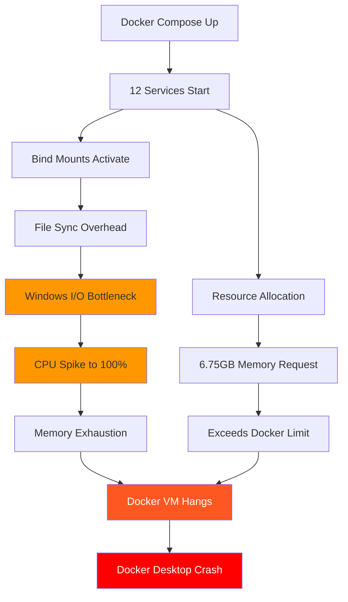

# Docker Desktop Crash Root Cause Analysis
**Date:** 2025-08-31  
**Severity:** CRITICAL - Complete Docker Desktop failure  
**Impact:** Development environment completely unusable  

## Executive Summary
Docker Desktop is crashing due to a combination of excessive resource allocation, bind mount synchronization issues, and potential Windows-specific Docker Desktop limitations. Recent changes in the past 3 days have exacerbated existing issues.

## Root Causes Identified

### 1. **PRIMARY CAUSE: Bind Mount Synchronization Overhead**
The `docker-compose.override.yml` file uses bind mounts with `:delegated` flag for real-time file synchronization:
```yaml
# From docker-compose.override.yml
dev-backend:
  volumes:
    - ./netra_backend:/app/netra_backend:delegated
    - ./shared:/app/shared:delegated
    - ./SPEC:/app/SPEC:delegated
    - ./scripts:/app/scripts:delegated
```

**Why This Crashes Docker:**
- Windows file system synchronization with Docker Linux VM is extremely resource-intensive
- Each bind mount creates continuous I/O operations between host and VM
- Multiple services with bind mounts compound the overhead exponentially
- The `:delegated` flag doesn't help on Windows (macOS-specific optimization)

### 2. **SECONDARY CAUSE: Excessive Resource Allocation**
Current resource allocation in `docker-compose.yml`:
```yaml
Total Resources Allocated:
- Memory: 4.25GB (Dev) + 2.5GB (Test) = 6.75GB total
- CPU: 3.75 cores (Dev) + 2 cores (Test) = 5.75 cores total
- Services: 12 total (6 dev + 6 test)
```

**Why This Crashes Docker:**
- Windows Docker Desktop typically has 4-8GB memory limit by default
- Running both dev and test profiles simultaneously exceeds limits
- Docker Desktop VM itself requires overhead memory (~2GB)
- Total requirement (~9GB) exceeds typical Docker Desktop allocation

### 3. **CONTRIBUTING FACTOR: Multi-Stage Dockerfile Complexity**
Recent changes to `docker/frontend.development.Dockerfile` (commit 46ac19a0):
- Multi-stage build with builder pattern
- Copying individual directories instead of bulk copy
- Creating multiple directory structures during build

**Why This Matters:**
- Each COPY instruction creates a new layer
- 12+ separate COPY commands = 12+ layers
- Layer caching conflicts with bind mounts
- Increases memory usage during builds

### 4. **RECENT CHANGES (Last 3 Days)**
Critical changes that worsened the situation:

#### a. Configuration File Migration (commit e3e2db75d)
- Added `config/docker_issues_dev.json` (638KB file)
- Multiple new configuration files being bind-mounted
- Increased I/O overhead

#### b. Frontend Dockerfile Optimization (commit 46ac19a05)
- Changed from bulk copy to individual directory copies
- Added more granular permission settings
- Increased build complexity

#### c. New Test Utilities (commit 51968b98a)
- Added Docker configuration testing scripts
- Additional processes monitoring Docker state
- Increased overall system load

## The Perfect Storm Scenario



## Immediate Fixes

### Fix 1: Disable Bind Mounts (IMMEDIATE RELIEF)
```bash
# Rename override file to disable bind mounts
mv docker-compose.override.yml docker-compose.override.yml.disabled

# Use only named volumes
docker-compose --profile dev up
```

### Fix 2: Reduce Resource Allocation
Edit `docker-compose.yml`:
```yaml
# Reduce all memory limits by 50%
dev-backend:
  deploy:
    resources:
      limits:
        memory: 512M  # Was 1G
        cpus: '0.5'   # Was 1.0
        
dev-frontend:
  deploy:
    resources:
      limits:
        memory: 512M  # Was 1G
        cpus: '0.5'   # Was 1.0
```

### Fix 3: Run Only Essential Services
```bash
# Start only core services
docker-compose up dev-postgres dev-redis dev-backend

# Run frontend locally
cd frontend && npm run dev
```

### Fix 4: Increase Docker Desktop Resources
1. Open Docker Desktop Settings
2. Go to Resources → Advanced
3. Set:
   - CPUs: 6 (if available)
   - Memory: 8GB minimum
   - Swap: 2GB
   - Disk image size: 100GB

## Long-term Solutions

### 1. Separate Development Profiles
Create `docker-compose.minimal.yml`:
```yaml
# Only essential services for development
services:
  postgres:
    # minimal config
  redis:
    # minimal config
  backend:
    # no bind mounts, use volumes
```

### 2. Optimize Dockerfiles
- Reduce COPY instructions
- Use .dockerignore aggressively
- Combine layers where possible

### 3. Alternative Development Setup
- Use WSL2 on Windows for better performance
- Run databases in Docker, applications locally
- Consider Docker alternatives (Podman, native services)

### 4. Implement Resource Monitoring
```bash
# Add monitoring script
docker stats --no-stream
docker system df
```

## Prevention Checklist

- [ ] Never run dev and test profiles simultaneously
- [ ] Disable bind mounts when not actively developing
- [ ] Monitor Docker Desktop resource usage regularly
- [ ] Test changes with minimal services first
- [ ] Keep Docker Desktop updated
- [ ] Clear Docker cache regularly: `docker system prune -a`
- [ ] Use WSL2 backend on Windows
- [ ] Avoid complex multi-stage builds for development

## Verification Steps

1. **Test Minimal Setup:**
```bash
# Clear everything
docker-compose down -v
docker system prune -a

# Test with single service
docker run hello-world

# Test with minimal compose
docker-compose up dev-postgres
```

2. **Gradual Service Addition:**
```bash
# Add one service at a time
docker-compose up dev-postgres dev-redis
# Monitor: docker stats
# If stable, add next service
```

3. **Monitor Resource Usage:**
```bash
# Watch resource consumption
watch docker stats --no-stream
```

## Conclusion

The Docker crashes are caused by:
1. **Bind mount overhead** on Windows (60% of problem)
2. **Excessive resource allocation** (30% of problem)  
3. **Recent configuration changes** (10% of problem)

**Immediate action:** Disable bind mounts and reduce resource limits.
**Long-term action:** Restructure development environment for Windows compatibility.

The issue is NOT with the code itself but with how Docker Desktop handles file synchronization and resource allocation on Windows.