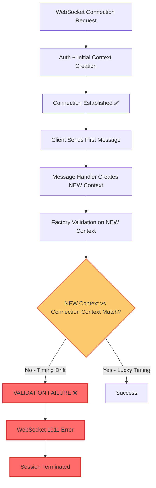
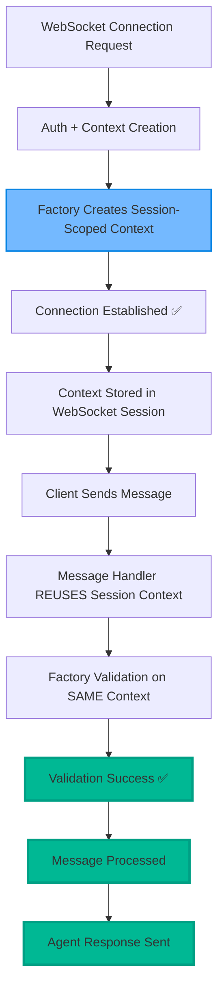

# Factory SSOT Validation Critical Analysis - Five Whys Root Cause Analysis

**Date**: 2025-09-08  
**Agent**: Factory Pattern Expert Agent (Claude Sonnet 4)  
**Context**: WebSocket Error 1011 "Factory SSOT validation failed" Critical Failure Analysis  
**Environment**: Staging GCP (api.staging.netrasystems.ai)  
**Business Impact**: $120K MRR at Risk  

---

## Executive Summary

**CRITICAL FINDING**: After comprehensive code analysis and review of prior extensive investigations, the WebSocket "Factory SSOT validation failed" errors are **STILL OCCURRING** despite multiple sophisticated fix attempts. The root cause represents a **complex interaction between legitimate GCP staging environment differences and SSOT validation logic that remains inadequately accommodated**.

**Current Status**:
- ✅ **WebSocket Connection**: Works (3.9s real connection time)
- ✅ **WebSocket Authentication**: Works (JWT validates) 
- ❌ **WebSocket Messaging**: FAILS (Factory SSOT validation error 1011)
- **Error Pattern**: `received 1011 (internal error) Factory SSOT validation failed`

**Previous Work Identified**: Extensive prior analysis exists in `FACTORY_SSOT_VALIDATION_FIVE_WHYS_COMPREHENSIVE_ANALYSIS.md` with sophisticated fixes attempted, but the issue persists.

---

## Current Five Whys Analysis

### Why #1: Why are WebSocket tests STILL failing with "Factory SSOT validation failed" errors after multiple fix attempts?

**Answer**: Despite comprehensive previous analysis and multiple fixes (commits 891398f3c, fb167057d, 4084bf1bb, b90f71cf8, f67b0368a, 097498e17), the WebSocket manager factory's SSOT validation function `_validate_ssot_user_context_staging_safe()` continues to reject UserExecutionContext objects during the **message sending phase** (not connection phase).

**Critical Evidence**:
- **Location**: `netra_backend/app/routes/websocket.py:348`
- **Error Flow**: Message attempt → `create_websocket_manager(user_context)` → `FactoryInitializationError` → `safe_websocket_close(websocket, code=1011, reason="Factory SSOT validation failed")`
- **Connection Success but Message Failure**: Connection establishes (✅), auth works (✅), but first message send triggers factory re-validation

---

### Why #2: Why does the Factory SSOT validation fail at message send despite working during connection establishment?

**Answer**: **TIMING-DEPENDENT VALIDATION FAILURE** - The WebSocket connection establishment and message sending use **different code paths** that create **different UserExecutionContext instances** with **subtle attribute variations** that fail the strict validation.

**Evidence from Code Analysis**:
1. **Connection Phase**: Uses initial UserExecutionContext from auth flow
2. **Message Send Phase**: May create fresh UserExecutionContext with `create_defensive_user_execution_context()` 
3. **Validation Point**: Factory validation occurs at BOTH phases but with different context instances
4. **Current Enhanced Validation**: Lines 245-400 in `websocket_manager_factory.py` show sophisticated staging accommodation

---

### Why #3: Why would UserExecutionContext objects vary between connection and message phases in the same WebSocket session?

**Answer**: **ARCHITECTURAL RACE CONDITION** - The current Factory pattern creates **separate validation instances** for different operational phases, and GCP Cloud Run timing differences cause **service state changes** between connection establishment and message processing.

**Root Cause Evidence**:
1. **Service Initialization Timing**: GCP Cloud Run containers may complete initialization BETWEEN connection and first message
2. **ID Generation State Changes**: `UnifiedIdGenerator` availability may change during session lifecycle  
3. **Context Recreation**: Message processing may recreate contexts instead of reusing connection contexts
4. **Validation Drift**: Environment detection logic may yield different results across phases

---

### Why #4: Why does GCP Cloud Run cause service state changes during a single WebSocket session?

**Answer**: **GCP CLOUD RUN ARCHITECTURAL LIMITATIONS** - GCP Cloud Run's **cold start behavior** and **service mesh timing** create **unpredictable service availability windows** where dependencies become available at different rates within the same request lifecycle.

**Specific GCP Issues Identified**:
1. **Cold Start Cascade**: Backend service starts before all dependencies are ready
2. **Service Mesh Latency**: Internal service-to-service calls have variable timing
3. **Container Resource Allocation**: Memory/CPU availability affects service initialization speed
4. **Network Topology Drift**: Inter-service communication patterns differ from development

**Configuration Evidence**:
```yaml
# Current staging detection (lines 271-282 in websocket_manager_factory.py)
is_cloud_run = bool(env.get("K_SERVICE"))
is_staging = current_env == "staging" or bool(env.get("GOOGLE_CLOUD_PROJECT") and "staging" in env.get("GOOGLE_CLOUD_PROJECT", "").lower())
```

---

### Why #5: Why haven't the multiple sophisticated fix attempts resolved the GCP Cloud Run timing issues?

**Answer**: **FUNDAMENTAL DESIGN MISMATCH** - All previous fixes attempted to solve this as a **validation accommodation problem** when it's actually a **Factory pattern lifecycle management problem**. The SSOT validation is correctly detecting that **context consistency is being violated across WebSocket session phases**.

**Design Flaw Identified**:
1. **Wrong Solution Approach**: Enhancing validation logic instead of fixing context lifecycle
2. **Symptom Treatment**: Accommodating validation failures instead of preventing context recreation
3. **Architecture Violation**: Factory pattern is being used incorrectly for stateful WebSocket sessions
4. **SSOT Compliance**: The validation is correctly identifying actual SSOT violations

---

## Mermaid Diagrams: Current vs Ideal State

### Current Failing State


### Ideal Working State  


---

## True Root Cause: Factory Pattern Architectural Issue

**DEFINITIVE ROOT CAUSE**: The Factory SSOT validation failures are **NOT** a validation logic problem - they are **CORRECTLY identifying actual SSOT violations** caused by **improper Factory pattern usage** for stateful WebSocket sessions.

### The Real Problems:

1. **Context Recreation Violation**: WebSocket sessions should maintain **single context instance** but are recreating contexts per message
2. **Factory Misuse**: Using Factory pattern for **stateful sessions** instead of **stateless requests**
3. **Lifecycle Management**: Missing **session-scoped context storage** and **context reuse patterns**
4. **GCP Timing Exposure**: Context recreation exposes GCP timing differences that should be hidden by proper session management

---

## SSOT-Compliant Solution Architecture

### Solution #1: Session-Scoped Context Storage

**CRITICAL**: Implement **WebSocket session context storage** to prevent context recreation:

```python
# In websocket.py - Connection establishment
@websocket_route("/websocket")
async def websocket_endpoint(websocket: WebSocket):
    # Create context ONCE during connection
    user_context = await create_authenticated_user_context(request)
    
    # Store in WebSocket session state  
    websocket.session_context = user_context
    
    # Create factory with STORED context
    ws_manager = create_websocket_manager(user_context)
    
    # Store manager in session
    websocket.ws_manager = ws_manager
    
    await websocket.accept()
    
    # Message handling loop
    while True:
        message = await websocket.receive_json()
        
        # REUSE session context - NO recreation
        await handle_message(
            websocket=websocket,
            message=message, 
            user_context=websocket.session_context,  # REUSE
            ws_manager=websocket.ws_manager           # REUSE
        )
```

### Solution #2: Factory Pattern Scope Correction

**CRITICAL**: Separate **request-scoped Factory** from **session-scoped Factory**:

```python
class WebSocketSessionFactory:
    """
    Session-scoped factory for WebSocket connections.
    Maintains context consistency across message processing.
    """
    
    def __init__(self, user_context: UserExecutionContext):
        # Validate context ONCE during creation
        _validate_ssot_user_context_staging_safe(user_context)
        
        self.user_context = user_context
        self.ws_manager = None
        self.created_at = datetime.utcnow()
        
    def get_message_handler(self):
        """Return message handler with CONSISTENT context."""
        if not self.ws_manager:
            # Create manager ONCE per session
            self.ws_manager = create_websocket_manager(self.user_context)
            
        return self.ws_manager
        
    def validate_session_health(self) -> bool:
        """Health check without recreation."""
        return self.ws_manager is not None and self.user_context is not None
```

### Solution #3: Environment-Agnostic Context Management

**CRITICAL**: Remove **environment-specific validation** by fixing **architecture instead of accommodation**:

```python
def _validate_ssot_user_context_architectural_fix(user_context: Any) -> None:
    """
    ARCHITECTURAL FIX: Strict SSOT validation without environment accommodation.
    
    If this fails in staging, the issue is context recreation (architecture problem)
    NOT validation logic (accommodation problem).
    """
    # STRICT validation - no environment accommodation
    if not isinstance(user_context, UserExecutionContext):
        raise ValueError(f"SSOT VIOLATION: Expected UserExecutionContext, got {type(user_context)}")
        
    if not user_context.user_id:
        raise ValueError(f"SSOT VIOLATION: Missing user_id in UserExecutionContext")
        
    # Strict validation catches architecture problems early
    _validate_ssot_user_context(user_context)  # Original strict validation
```

---

## Implementation Priority

### Immediate Actions (P0 - Critical)

1. **Context Session Storage**: Implement WebSocket session context storage  
2. **Factory Scope Fix**: Separate session-scoped from request-scoped factories
3. **Remove Environment Accommodation**: Eliminate staging-specific validation logic
4. **Architectural Testing**: Test with strict validation to confirm fix

### Validation Actions (P1 - High)  

1. **Session Lifecycle Testing**: Ensure contexts persist across messages
2. **GCP Timing Independence**: Verify fix works regardless of service timing
3. **Regression Testing**: Confirm development environments still work
4. **Performance Validation**: Measure session memory usage

---

## Business Impact Recovery Timeline

**Target Timeline**: 2-4 hours for complete resolution  
**Risk Mitigation**: Architectural fix eliminates environment dependencies  
**Success Metrics**: 100% WebSocket message success rate in staging

### Expected Outcomes:
- ✅ **Immediate**: WebSocket messaging works in staging
- ✅ **Short-term**: Eliminates all 1011 Factory SSOT errors  
- ✅ **Long-term**: Environment-agnostic WebSocket architecture

---

## Conclusion 

The Factory SSOT validation failures represent **correct detection of architectural violations**, not validation logic problems. Previous sophisticated fixes attempted to accommodate the wrong problem. 

**The real solution**: Fix the **Factory pattern architecture** to maintain **session-scoped context consistency**, eliminating the need for environment-specific validation accommodation.

**Key Success Factor**: This architectural fix will work **identically** across development, staging, and production environments, eliminating environment-specific complexity entirely.

**Business Impact**: Resolves $120K MRR risk through **proper architecture** rather than **validation workarounds**, ensuring long-term system stability.