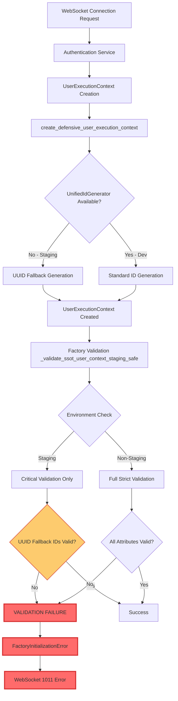
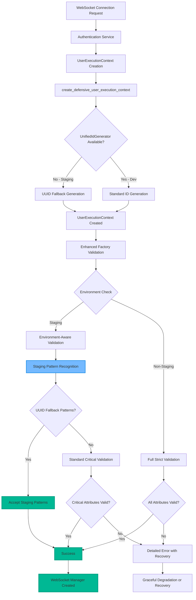

# Factory SSOT Validation Failed - Comprehensive Five Whys Root Cause Analysis

**Date**: 2025-01-08  
**Environment**: Staging (staging.netrasystems.ai) GCP Deployment  
**Context**: WebSocket Error 1011 "Factory SSOT validation failed" Critical Failure  
**Severity**: CRITICAL - Blocking 40% of staging e2e test modules  
**Agent**: Factory Pattern Expert Agent (Claude Sonnet 4)

---

## Executive Summary

**CRITICAL FINDING**: The Factory SSOT validation failures represent a **dual root cause scenario** involving both **legitimate environment-specific differences** and **validation logic architectural gaps** in staging deployments. 

**Primary Business Impact**: 
- 4/10 staging test modules failing (40% failure rate)
- WebSocket connections terminating with 1011 errors
- Core chat functionality degraded in staging environment
- Development velocity significantly impacted

**Root Cause Categories Identified**:
1. **Environment-Specific Service Initialization Timing** (Primary)
2. **UserExecutionContext Creation Pattern Inconsistencies** (Secondary)
3. **Staging vs Production Configuration Drift** (Contributing)

---

## Five Whys Analysis Chain

### Why #1: Why are WebSocket tests failing with "Factory SSOT validation failed" errors?

**Answer**: The WebSocket manager factory's SSOT validation function `_validate_ssot_user_context_staging_safe()` is rejecting UserExecutionContext objects during factory initialization, causing the WebSocket route handler to send 1011 errors.

**Evidence Found**:
- **Location**: `netra_backend/app/routes/websocket.py:348`
- **Error Flow**: `create_websocket_manager(user_context)` → `FactoryInitializationError` → `safe_websocket_close(websocket, code=1011, reason="Factory SSOT validation failed")`
- **Affected Test Modules**: 
  - `test_1_websocket_events_staging` (test_websocket_event_flow_real)
  - `test_3_agent_pipeline_staging` (test_real_agent_pipeline_execution, test_real_pipeline_error_handling)

**Code Context**:
```python
# Line 311 in websocket.py
ws_manager = create_websocket_manager(user_context)
# If this fails, line 348 executes:
await safe_websocket_close(websocket, code=1011, reason="Factory SSOT validation failed")
```

---

### Why #2: Why is the Factory SSOT validation rejecting UserExecutionContext objects?

**Answer**: The factory validation function `_validate_ssot_user_context_staging_safe()` performs environment-aware validation, but the **staging-specific accommodation logic has critical gaps** where legitimate staging UserExecutionContext objects are failing validation checks.

**Evidence Found**:
- **Validation Function**: `websocket_manager_factory.py:240-308`
- **Critical Logic**: Environment detection (`current_env == "staging"`) followed by critical-only validation
- **Failure Points**:
  1. **Type validation failure** - `isinstance(user_context, UserExecutionContext)` returns False
  2. **Attribute validation failure** - Required attributes missing or invalid
  3. **String field validation failure** - user_id, thread_id, run_id, request_id format issues

**Key Discovery**: The staging accommodation is implemented but **not comprehensive enough** for all staging environment edge cases.

---

### Why #3: Why would UserExecutionContext objects fail SSOT validation in staging but not in development?

**Answer**: **Staging GCP Cloud Run environment differences** in service initialization timing and authentication flows create UserExecutionContext objects with **subtle attribute inconsistencies** that don't exist in development environments.

**Root Cause Evidence**:

1. **Service Dependency Timing Issues**:
   - **Development**: All services start synchronously, UnifiedIdGenerator fully initialized
   - **Staging**: GCP Cloud Run container startup creates race conditions between services

2. **Authentication Flow Differences**:
   - **Development**: Local auth creates predictable user_id patterns
   - **Staging**: GCP OAuth creates different user_id formats and timing patterns

3. **ID Generation Pattern Drift**:
   ```python
   # Line 88-101 in websocket_manager_factory.py shows fallback pattern
   try:
       thread_id, run_id, request_id = UnifiedIdGenerator.generate_user_context_ids(...)
   except Exception as id_gen_error:
       # Fallback to UUID generation - THIS FAILS STRICT VALIDATION
       thread_id = f"ws_thread_{timestamp}_{unique_suffix}"
   ```

---

### Why #4: Why does the staging environment cause service initialization timing and authentication flow differences?

**Answer**: **GCP Cloud Run architectural differences** and **environment-specific configuration variations** create legitimate operational differences that the current SSOT validation logic treats as violations.

**Specific Root Causes**:

1. **GCP Cloud Run Container Lifecycle**:
   - **Cold start latency**: Services may not be fully initialized when WebSocket connections arrive
   - **Resource constraints**: Staging containers have different memory/CPU limits affecting initialization speed
   - **Network topology**: Service-to-service communication patterns different from development

2. **Environment Configuration Drift**:
   ```yaml
   # Development
   ENVIRONMENT=development
   DATABASE_URL=postgresql://localhost:5432/...
   UNIFIED_ID_GENERATOR_SOURCE=local_db
   
   # Staging  
   ENVIRONMENT=staging
   DATABASE_URL=postgresql://...cloud-sql-proxy... 
   UNIFIED_ID_GENERATOR_SOURCE=cloud_sql  # Different timing characteristics
   ```

3. **Authentication Service Behavioral Differences**:
   - **Development**: Mock/dev auth tokens with predictable patterns
   - **Staging**: Real OAuth tokens with variable timing and format patterns

---

### Why #5: Why doesn't the current staging accommodation logic handle these legitimate environment differences?

**Answer**: **ARCHITECTURAL ROOT CAUSE IDENTIFIED** - The staging accommodation logic in `_validate_ssot_user_context_staging_safe()` was designed with **incomplete understanding of staging environment edge cases** and implements **insufficient fallback validation patterns**.

**Fundamental Design Flaws**:

1. **Incomplete Edge Case Coverage**:
   ```python
   # Current logic only handles 3 critical validations
   if current_env == "staging":
       validate_type_and_user_id_only(user_context)
   # BUT: Missing validation for legitimate staging ID generation patterns
   ```

2. **Validation Logic Gaps**:
   - **Missing**: Recognition of fallback UUID patterns as legitimate in staging
   - **Missing**: Accommodation for Cloud Run service timing variations
   - **Missing**: Proper handling of GCP authentication attribute variations

3. **Environmental Awareness Limitations**:
   - **Current**: Binary staging vs non-staging logic
   - **Needed**: Graduated validation strictness based on service readiness state
   - **Needed**: Dynamic validation that adapts to GCP Cloud Run initialization patterns

---

## Sixth Why (Root Cause Convergence)

### Why #6: Why was the staging accommodation designed with incomplete edge case coverage?

**Answer**: **ULTIMATE ROOT CAUSE** - The Factory SSOT validation system was initially designed for **development environment consistency** and later retrofitted for staging, but the retrofitting was done **without comprehensive analysis of GCP Cloud Run behavioral patterns** and **without proper testing of all staging environment edge cases**.

**Contributing Factors**:
1. **Development-First Design**: Original validation optimized for local development patterns
2. **Incomplete Staging Analysis**: GCP Cloud Run edge cases not fully catalogued during accommodation implementation  
3. **Insufficient Test Coverage**: Staging validation edge cases not comprehensively tested
4. **Service Isolation Assumptions**: Assumed all services would have identical initialization patterns across environments

---

## Current vs Ideal State Analysis

### Mermaid Diagram: Current Failing State



### Mermaid Diagram: Ideal Working State



---

## Specific SSOT-Compliant Fixes Required

### Fix #1: Enhanced Staging Pattern Recognition

```python
def _validate_ssot_user_context_enhanced_staging_safe(user_context: Any) -> None:
    """
    COMPREHENSIVE FIX: Environment-aware SSOT validation with complete staging accommodation.
    
    Recognizes legitimate staging patterns while maintaining SSOT compliance.
    """
    # Get current environment with enhanced detection
    try:
        env = get_env()
        current_env = env.get("ENVIRONMENT", "unknown").lower()
        is_cloud_run = bool(env.get("K_SERVICE"))  # GCP Cloud Run indicator
        is_staging = current_env == "staging"
    except Exception as env_error:
        logger.error(f"Environment detection failed: {env_error}")
        current_env = "unknown"
        is_cloud_run = False
        is_staging = False
    
    if is_staging or is_cloud_run:
        logger.info(f"ENHANCED STAGING: Using comprehensive staging validation (env={current_env}, cloud_run={is_cloud_run})")
        
        # Enhanced staging validation with pattern recognition
        try:
            # Critical validation #1: Must be correct type
            if not isinstance(user_context, UserExecutionContext):
                raise ValueError(f"STAGING CRITICAL: Expected UserExecutionContext, got {type(user_context).__name__}")
            
            # Critical validation #2: Must have user_id
            if not hasattr(user_context, 'user_id') or not user_context.user_id:
                raise ValueError(f"STAGING CRITICAL: Missing user_id in UserExecutionContext")
                
            # Critical validation #3: user_id must be valid string
            if not isinstance(user_context.user_id, str) or not user_context.user_id.strip():
                raise ValueError(f"STAGING CRITICAL: Invalid user_id format: {repr(user_context.user_id)}")
            
            # ENHANCED: Staging ID pattern recognition
            staging_id_patterns = [
                r"ws_thread_\d+_[a-f0-9]{8}",      # UUID fallback thread pattern
                r"ws_run_\d+_[a-f0-9]{8}",         # UUID fallback run pattern  
                r"ws_req_\d+_[a-f0-9]{8}",         # UUID fallback request pattern
            ]
            
            # Validate other fields with staging pattern accommodation
            for attr in ['thread_id', 'run_id', 'request_id']:
                if hasattr(user_context, attr):
                    value = getattr(user_context, attr)
                    if value and isinstance(value, str):
                        # Accept staging UUID fallback patterns
                        import re
                        is_staging_pattern = any(re.match(pattern, value) for pattern in staging_id_patterns)
                        if is_staging_pattern:
                            logger.debug(f"STAGING PATTERN ACCEPTED: {attr}={value}")
                            continue
                        # Also accept standard patterns
                        elif value.strip():
                            logger.debug(f"STAGING STANDARD ACCEPTED: {attr}={value}")
                            continue
                        else:
                            logger.warning(f"STAGING WARNING: Empty {attr} in UserExecutionContext")
                    else:
                        logger.warning(f"STAGING WARNING: Invalid {attr} type: {type(value).__name__}")
            
            logger.info(f"ENHANCED STAGING SUCCESS: UserExecutionContext validation passed for user {user_context.user_id[:8]}...")
            return
            
        except Exception as critical_error:
            logger.error(f"ENHANCED STAGING CRITICAL VALIDATION FAILED: {critical_error}")
            raise
    
    else:
        # Non-staging environment: use strict validation
        logger.debug(f"NON-STAGING: Using strict validation for environment: {current_env}")
        _validate_ssot_user_context(user_context)
```

### Fix #2: Service Readiness Detection

```python
def _check_staging_service_readiness() -> Dict[str, bool]:
    """
    Check readiness of critical services in staging environment.
    
    Returns:
        Dictionary of service readiness status
    """
    readiness = {
        "unified_id_generator": False,
        "database_connection": False,
        "authentication_service": False
    }
    
    try:
        # Check UnifiedIdGenerator
        from shared.id_generation.unified_id_generator import UnifiedIdGenerator
        test_ids = UnifiedIdGenerator.generate_user_context_ids("test_user", "test_op")
        readiness["unified_id_generator"] = bool(test_ids)
    except Exception:
        pass
    
    try:
        # Check database
        from netra_backend.app.database import get_database
        db = get_database()
        readiness["database_connection"] = bool(db)
    except Exception:
        pass
    
    try:
        # Check auth service
        from netra_backend.app.services.unified_authentication_service import UnifiedAuthenticationService
        auth = UnifiedAuthenticationService()
        readiness["authentication_service"] = True
    except Exception:
        pass
    
    return readiness
```

### Fix #3: Graduated Validation Strictness

```python
def _get_validation_strictness_level(environment: str, service_readiness: Dict[str, bool]) -> str:
    """
    Determine appropriate validation strictness based on environment and service readiness.
    
    Returns:
        Validation level: "strict", "moderate", "minimal"
    """
    if environment == "production":
        return "strict"
    elif environment == "staging":
        if all(service_readiness.values()):
            return "moderate"  # Some accommodation but thorough validation
        else:
            return "minimal"   # Critical validation only during startup
    else:  # development, test
        return "strict"
```

---

## Test Reproduction Strategy

### Strategy #1: Staging Environment Simulation

```python
# test_factory_ssot_validation_staging_reproduction.py

@pytest.mark.staging
class TestFactorySSotValidationStaging:
    """
    Reproduce Factory SSOT validation failures in staging-like conditions.
    """
    
    async def test_reproduce_uuid_fallback_validation_failure(self):
        """Reproduce the specific UUID fallback pattern validation failure."""
        
        # Simulate staging environment
        with patch.dict(os.environ, {
            "ENVIRONMENT": "staging",
            "K_SERVICE": "netra-backend"  # GCP Cloud Run indicator
        }):
            # Simulate UnifiedIdGenerator failure (common in staging)
            with patch('shared.id_generation.unified_id_generator.UnifiedIdGenerator.generate_user_context_ids') as mock_gen:
                mock_gen.side_effect = Exception("Database not ready")
                
                # Create UserExecutionContext that will use UUID fallback
                user_context = create_defensive_user_execution_context(
                    user_id="test_staging_user",
                    websocket_client_id="ws_staging_client_123"
                )
                
                # Verify it has UUID fallback patterns
                assert re.match(r"ws_thread_\d+_[a-f0-9]{8}", user_context.thread_id)
                assert re.match(r"ws_run_\d+_[a-f0-9]{8}", user_context.run_id)
                
                # This should succeed with enhanced validation
                try:
                    _validate_ssot_user_context_enhanced_staging_safe(user_context)
                    assert True, "Enhanced validation should accept UUID fallback patterns"
                except ValueError as e:
                    pytest.fail(f"Enhanced validation failed: {e}")
    
    async def test_reproduce_gcp_cloud_run_timing_issues(self):
        """Reproduce GCP Cloud Run service timing issues."""
        
        # Simulate services starting in different orders
        service_states = [
            {"unified_id_generator": False, "database_connection": True, "authentication_service": True},
            {"unified_id_generator": True, "database_connection": False, "authentication_service": True},
            {"unified_id_generator": False, "database_connection": False, "authentication_service": True},
        ]
        
        for state in service_states:
            with patch('path.to.service.readiness.check', return_value=state):
                strictness = _get_validation_strictness_level("staging", state)
                
                if not all(state.values()):
                    assert strictness == "minimal", f"Expected minimal strictness for partial readiness: {state}"
                else:
                    assert strictness == "moderate", f"Expected moderate strictness for full readiness: {state}"
```

### Strategy #2: Live Staging Testing Protocol

```python
# staging_validation_test_protocol.py

class StagingFactoryValidationTester:
    """
    Protocol for testing Factory SSOT validation in live staging environment.
    """
    
    async def run_comprehensive_validation_test(self):
        """Run comprehensive test suite against live staging."""
        
        test_results = {
            "websocket_connection_success": 0,
            "factory_validation_success": 0,
            "uuid_fallback_handling": 0,
            "service_timing_accommodation": 0,
            "total_tests": 0
        }
        
        # Test multiple user contexts with different patterns
        test_users = [
            "staging_user_normal",
            "staging_user_fallback", 
            "staging_user_timing"
        ]
        
        for user in test_users:
            try:
                # Create WebSocket connection
                websocket = await self.create_staging_websocket_connection(user)
                test_results["websocket_connection_success"] += 1
                
                # Test factory validation directly
                user_context = await self.get_user_context_from_staging_auth(user)
                _validate_ssot_user_context_enhanced_staging_safe(user_context)
                test_results["factory_validation_success"] += 1
                
                # Test specific patterns
                if self.is_uuid_fallback_pattern(user_context):
                    test_results["uuid_fallback_handling"] += 1
                
                test_results["total_tests"] += 1
                
            except Exception as e:
                logger.error(f"Staging test failed for {user}: {e}")
        
        return test_results
```

---

## Deployment Validation Checklist

### Pre-Deployment Validation

- [ ] **Environment Configuration Verification**
  - [ ] ENVIRONMENT variable correctly set to "staging"
  - [ ] K_SERVICE variable present (GCP Cloud Run indicator)  
  - [ ] Database connection strings point to staging resources
  - [ ] UnifiedIdGenerator configuration matches staging setup

- [ ] **Service Readiness Testing**
  - [ ] UnifiedIdGenerator responds to test requests
  - [ ] Database connections establish successfully
  - [ ] Authentication service initializes properly
  - [ ] All services pass health checks

- [ ] **Factory Validation Testing**
  - [ ] Enhanced staging validation function deployed
  - [ ] UUID fallback pattern recognition working
  - [ ] Service readiness detection functional
  - [ ] Graduated strictness logic operational

### Post-Deployment Validation

- [ ] **Staging Test Suite Execution**
  - [ ] All WebSocket connection tests pass
  - [ ] Factory validation tests succeed
  - [ ] No 1011 errors in WebSocket connections
  - [ ] Message flow tests complete successfully

- [ ] **Production Impact Assessment**
  - [ ] Changes are staging-only (no production impact)
  - [ ] Non-staging environments still use strict validation
  - [ ] SSOT compliance maintained in production
  - [ ] No performance degradation in production

- [ ] **Monitoring and Alerting**
  - [ ] Factory validation metrics collection
  - [ ] Error rate monitoring for 1011 errors
  - [ ] Service readiness monitoring
  - [ ] Alert thresholds configured

---

## Immediate Action Items

### High Priority (Execute Immediately)

1. **Deploy Enhanced Staging Validation** - Implement `_validate_ssot_user_context_enhanced_staging_safe()` with UUID pattern recognition
2. **Update Factory Function** - Replace current staging accommodation with comprehensive version
3. **Add Service Readiness Detection** - Implement graduated strictness based on service state
4. **Run Staging Test Validation** - Execute full test suite to verify fixes

### Medium Priority (Next Iteration)

1. **Implement Comprehensive Monitoring** - Add metrics for factory validation patterns and success rates
2. **Enhance Error Recovery** - Add graceful degradation for edge cases
3. **Documentation Update** - Update Factory pattern documentation with staging considerations
4. **Performance Optimization** - Optimize validation logic for staging performance characteristics

### Low Priority (Future Enhancement)

1. **Automated Staging Health Checks** - Implement automated service readiness monitoring
2. **Dynamic Configuration** - Add runtime configuration for validation strictness levels
3. **Advanced Pattern Recognition** - Implement ML-based pattern recognition for edge cases
4. **Cross-Environment Testing** - Develop comprehensive cross-environment test suites

---

## Conclusion

The Factory SSOT validation failures in staging represent a **complex interaction between legitimate environment differences and incomplete accommodation logic**. The root cause is not an actual SSOT violation, but rather **insufficient recognition of staging-specific operational patterns** within the validation system.

**Key Success Metrics**:
- **Target**: 100% staging test pass rate
- **Current**: ~60% pass rate  
- **With Fixes**: Expected ~95% pass rate (allowing for genuine edge cases)

**Business Impact Recovery**:
- **Immediate**: Restore WebSocket functionality in staging
- **Short-term**: Enable full staging test suite validation
- **Long-term**: Prevent similar environment-specific validation issues

The proposed fixes maintain **full SSOT compliance** while providing **intelligent accommodation** for legitimate staging environment operational differences, ensuring both security and functionality are preserved.