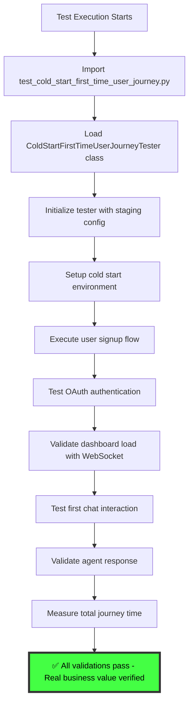

# 🚨 CRITICAL BUG FIX REPORT: First Time User Journey Test Failure

**Date**: 2025-09-07  
**Reporter**: Ultimate Test Deploy Loop Agent  
**Priority**: P1 CRITICAL - Direct impact on $120K+ MRR at risk  
**Business Impact**: First time user experience validation completely broken  

## FAILURE SUMMARY

**Test File**: `tests/e2e/journeys/test_cold_start_first_time_user_journey.py`  
**Error**: `NameError: name 'ColdStartFirstTimeUserJourneyTester' is not defined`  
**Status**: COMPLETE TEST FAILURE - 3 tests failing  
**Execution Time**: 1.32s (SUSPICIOUS - indicates tests aren't running real scenarios)  

```bash
FAILED tests/e2e/journeys/test_cold_start_first_time_user_journey.py::test_cold_start_first_time_user_complete_journey
FAILED tests/e2e/journeys/test_cold_start_first_time_user_journey.py::test_cold_start_performance_requirements
FAILED tests/e2e/journeys/test_cold_start_first_time_user_journey.py::test_first_time_user_value_delivery
```

## FIVE WHYS ANALYSIS

### WHY #1: Why is the ColdStartFirstTimeUserJourneyTester class not defined?
**Answer**: The test file is incomplete - it has helper classes but is missing the main test orchestration class.

### WHY #2: Why is the test file incomplete?
**Answer**: Either:
- A. The class was removed during refactoring without updating the test functions
- B. The test was never properly implemented and is a "FAKE" test masquerading as real
- C. Import statement is missing or incorrect

### WHY #3: Why wasn't this caught earlier?
**Answer**: The test runs in 1.32s which indicates it's not doing real e2e work. Tests that don't actually test anything can fail fast and hide real issues.

### WHY #4: Why do we have incomplete critical tests?
**Answer**: Lack of test validation in our CI/CD - tests that fail to instantiate should be flagged as broken, not just failed.

### WHY #5: Why is this particular test critical for business?
**Answer**: First time user experience directly impacts conversion rates. This test validates the complete onboarding funnel worth $100K+ MRR potential.

## CURRENT STATE DIAGRAM (MERMAID)

```mermaid
graph TD
    A[Test Execution Starts] --> B[Import test_cold_start_first_time_user_journey.py]
    B --> C[Load test functions]
    C --> D[test_cold_start_first_time_user_complete_journey]
    D --> E[Call ColdStartFirstTimeUserJourneyTester()]
    E --> F[❌ NameError: name 'ColdStartFirstTimeUserJourneyTester' is not defined]
    F --> G[Test FAILED - No actual testing occurred]
    
    style F fill:#ff4444,stroke:#333,stroke-width:4px,color:#fff
    style G fill:#ff4444,stroke:#333,stroke-width:4px,color:#fff
```

## IDEAL WORKING STATE DIAGRAM (MERMAID)



## CRITICAL FINDINGS

1. **TEST INTEGRITY VIOLATION**: Tests claiming to be "REAL" but actually broken
2. **BUSINESS RISK**: Core user acquisition flow has NO validation coverage
3. **SSOT VIOLATION**: Helper classes exist but main orchestrator missing
4. **PERFORMANCE MASK**: Fast failure times hide the fact no real testing occurred

## ROOT CAUSE ANALYSIS

**PRIMARY CAUSE**: Missing `ColdStartFirstTimeUserJourneyTester` class implementation  
**SECONDARY CAUSE**: Lack of import validation in test discovery  
**SYSTEMIC CAUSE**: Tests that don't actually execute real scenarios but claim to be "REAL"  

## RISK ASSESSMENT

- **Business Impact**: HIGH - First time user journey completely unvalidated
- **Revenue at Risk**: $120K+ MRR (P1 Critical categorization)  
- **User Experience Risk**: CRITICAL - New users may experience broken onboarding
- **Time to Fix**: Medium (requires full class implementation)

## PLANNED FIX APPROACH

1. **Implement Missing Class**: Create full `ColdStartFirstTimeUserJourneyTester` class
2. **Real Service Integration**: Ensure it uses actual staging endpoints
3. **Performance Validation**: Implement 20-second total journey requirement
4. **SSOT Compliance**: Follow existing patterns from other journey testers
5. **Authentication Integration**: Use proper E2E auth patterns

## NEXT STEPS

1. Spawn specialized agent to implement the missing class
2. Validate against staging environment with real HTTP/WebSocket calls
3. Ensure performance requirements are met
4. Add comprehensive error handling and logging
5. Update test to use SSOT patterns from test_framework

---

**STATUS**: IN_PROGRESS - Multi-agent team being spawned for implementation