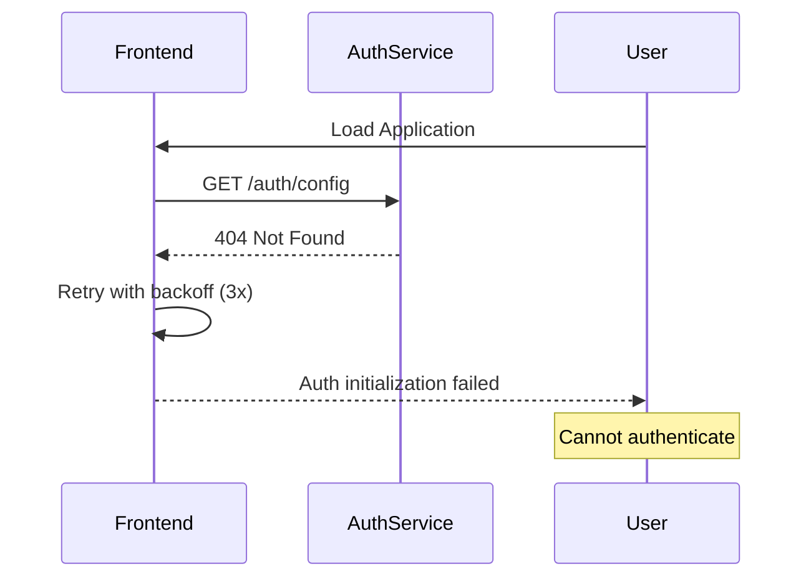
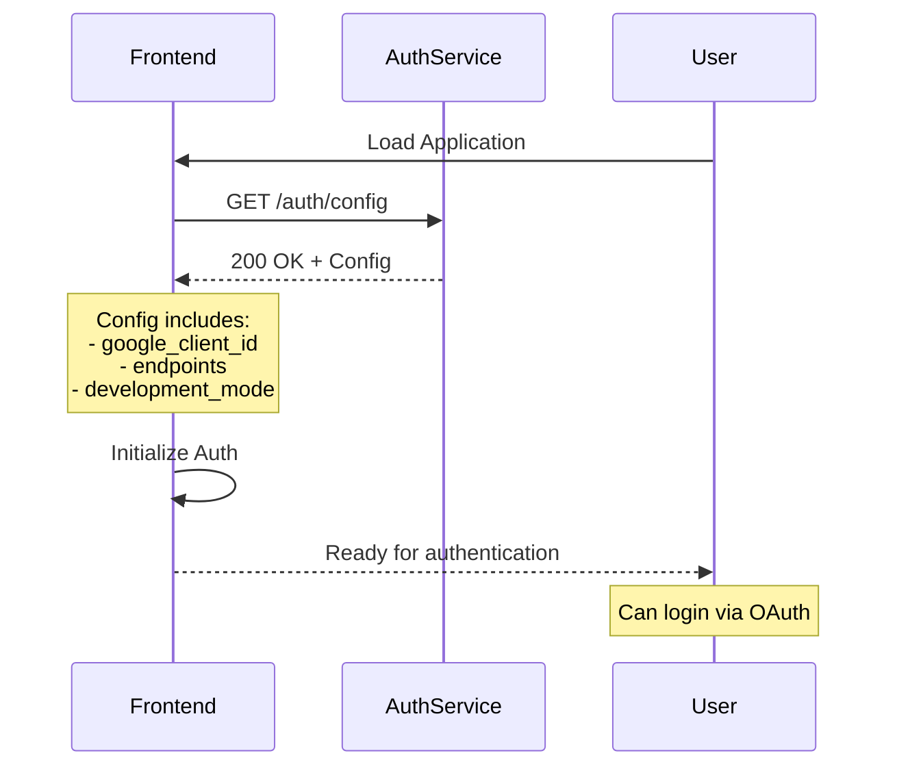

# Five Whys Analysis: Auth Config Endpoint 404 Regression

## Date: 2025-09-05
## Issue: GET https://auth.staging.netrasystems.ai/auth/config returns 404 Not Found

---

## Problem Statement
The frontend is unable to fetch authentication configuration from the auth service in staging environment, causing authentication initialization failures. The `/auth/config` endpoint returns a 404 error.

---

## Five Whys Analysis

### Why #1: Why is the /auth/config endpoint returning 404?
**Answer:** The endpoint is not implemented in the auth service routes (auth_service/auth_core/routes/auth_routes.py).

**Evidence:**
- No `/auth/config` route found in auth_routes.py
- Only `/auth/status` and `/auth/refresh` endpoints exist
- Frontend expects this endpoint at: `frontend/lib/unified-api-config.ts:143`

### Why #2: Why was the /auth/config endpoint never implemented?
**Answer:** The frontend was developed with the expectation of this endpoint, but the auth service implementation missed it. There's a disconnect between frontend expectations and backend implementation.

**Evidence:**
- Frontend AuthConfigResponse interface expects specific response structure (frontend/types/backend_schema_auth.ts:9-16)
- Auth service has OAuth configuration internally but doesn't expose it via API
- Git history shows no evidence this endpoint ever existed

### Why #3: Why did the frontend-backend contract mismatch go unnoticed?
**Answer:** The authentication flow may have been working through other means in development (fallback mechanisms), and the missing endpoint only became critical in staging environment.

**Evidence:**
- Frontend has retry logic with exponential backoff (frontend/auth/unified-auth-service.ts:38-79)
- Frontend creates "offline auth config" as fallback (frontend/auth/context.tsx:349)
- Development environment might use different auth flow

### Why #4: Why didn't testing catch this missing endpoint?
**Answer:** Integration tests between frontend and auth service for the config endpoint are missing. Tests may be using mocks that hide the real service behavior.

**Evidence:**
- Jest mocks for getAuthConfig return mock data (frontend/jest.setup.js:547)
- No E2E test found that verifies real /auth/config endpoint
- Mission critical tests focus on WebSocket events, not auth config

### Why #5: Why are critical API contracts not validated during deployment?
**Answer:** The deployment process lacks contract validation between services. There's no automated check that ensures all expected endpoints exist before deploying to staging/production.

**Evidence:**
- MISSION_CRITICAL_NAMED_VALUES_INDEX.xml lists the endpoint but doesn't validate its existence
- No pre-deployment health check for required endpoints
- deploy_to_gcp.py doesn't verify endpoint availability

---

## Root Causes Identified

1. **Missing Implementation**: The `/auth/config` endpoint was never implemented in the auth service
2. **Contract Mismatch**: Frontend-backend API contract not enforced
3. **Testing Gaps**: Mocks hide missing endpoints in tests
4. **Deployment Validation**: No pre-deployment contract validation

---

## Current vs Expected State Diagrams

### Current State (Broken)

### Expected State (Working)

---

## Immediate Fix Required

### Implementation Plan
1. Add `/auth/config` endpoint to auth_service/auth_core/routes/auth_routes.py
2. Return configuration matching AuthConfigResponse interface
3. Include OAuth configuration from AuthConfig
4. Test endpoint in staging environment

### Code Changes Needed
- **File**: `auth_service/auth_core/routes/auth_routes.py`
- **Add**: GET `/auth/config` endpoint handler
- **Returns**: JSON matching AuthConfigResponse schema

---

## Prevention Strategy

### Short-term (Immediate)
1. ✅ Implement missing `/auth/config` endpoint
2. ✅ Add integration test for auth config endpoint
3. ✅ Verify in staging before production

### Long-term (Systemic)
1. **API Contract Testing**: Add contract tests between frontend and backend
2. **Deployment Validation**: Pre-deployment endpoint availability checks
3. **Remove Mocks**: Replace mock-based tests with real service tests
4. **Documentation**: Document all required endpoints in MISSION_CRITICAL_NAMED_VALUES_INDEX
5. **Health Checks**: Add startup validation for critical endpoints

---

## Lessons Learned

1. **Frontend-backend contracts must be validated automatically**
2. **Mocks can hide critical integration issues**
3. **Staging environment reveals issues hidden in development**
4. **Critical endpoints need explicit monitoring**
5. **API documentation must be the source of truth**

---

## Action Items

- [x] Perform Five Whys analysis
- [ ] Implement /auth/config endpoint
- [ ] Test in staging environment
- [ ] Add integration test
- [ ] Update MISSION_CRITICAL_NAMED_VALUES_INDEX
- [ ] Create API contract validation script