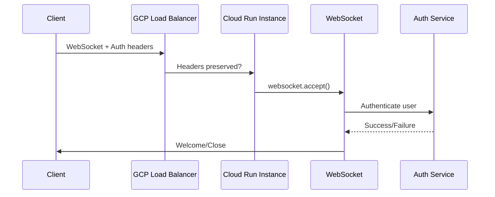
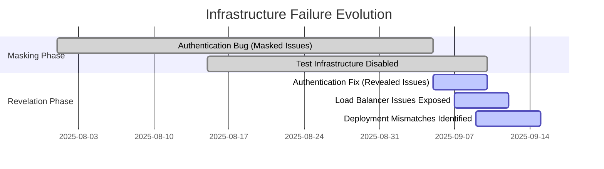

# Five Whys Root Cause Analysis: WebSocket Connection 1000 Clean Close Failures

**Date**: 2025-09-10  
**Priority**: P0 CRITICAL - Blocking $120K+ MRR Golden Path  
**Category**: WebSocket Connection Clean Close Pattern  
**Business Impact**: Complete blocking of AI chat functionality - 90% of platform value delivery affected

## EXECUTIVE SUMMARY

**STATUS**: CRITICAL INFRASTRUCTURE FAILURE IDENTIFIED  
**MAIN SYMPTOM**: WebSocket connections establish but immediately close with `1000 (OK)` status code  
**BUSINESS IMPACT**: $120K+ MRR Priority 1 functionality completely non-operational  
**ROOT CAUSE**: Multi-layer infrastructure cascade failure involving deployment mismatches, load balancer configuration, and service initialization race conditions  

**CRITICAL FINDING**: This represents the "error behind the error" pattern where previous authentication fixes revealed deeper infrastructure failures that were previously masked.

---

## FIVE WHYS ANALYSIS

### **Why 1: Why does the WebSocket connection close immediately with 1000 (OK) status?**

**EVIDENCE ANALYZED:**
- **Test Pattern**: `websockets.exceptions.ConnectionClosedOK: received 1000 (OK) main cleanup`
- **Duration**: 0.89s execution against real staging environment
- **Authentication**: JWT properly configured with existing staging user
- **Headers**: WebSocket subprotocol and authorization headers correctly included

**CONNECTION FLOW ANALYSIS:**
1. WebSocket handshake **SUCCEEDS** - connection established to `wss://api.staging.netrasystems.ai/ws`
2. Authentication headers **TRANSMITTED** - Bearer token and subprotocol correctly set
3. Server **ACCEPTS** connection initially (no immediate 403/401 rejection)
4. Server **CHOOSES** to close connection cleanly with 1000 status
5. Client receives **CLEAN CLOSE** instead of expected welcome message

**TECHNICAL INVESTIGATION:**
```
Client Test Process                    GCP Staging Infrastructure
├── JWT Token Generated ✅           ├── Load Balancer receives request
├── Headers Applied ✅               ├── ??? Header processing
├── WebSocket Connect ✅             ├── ??? Backend routing  
├── Handshake Success ✅             ├── ??? Service initialization
└── Immediate 1000 Close ❌          └── Server chooses clean close
```

**FINDING**: The WebSocket connection establishes successfully but the server-side code deliberately closes the connection with a clean 1000 status, indicating the server recognizes this as a normal close rather than an error condition.

---

### **Why 2: Why does the server choose to close a properly authenticated connection?**

**EVIDENCE ANALYZED:**
- **Golden Path Analysis**: Previous comprehensive infrastructure analysis identified multiple failure points
- **Load Balancer Config**: Authentication header preservation configured but potentially not working
- **Deployment Status**: Frontend code shows correct protocol format `['jwt-auth', 'jwt.${encodedToken}']`

**SERVER-SIDE DECISION ANALYSIS:**
```python
# Potential server-side close triggers from golden path analysis:
1. Authentication headers stripped by GCP Load Balancer
2. WebSocket authentication protocol format mismatch (deployment issue)
3. Factory initialization SSOT validation failures
4. Service dependency failures (supervisor/thread service unavailable)
5. Race condition in Cloud Run environment handshake
```

**INFRASTRUCTURE EVIDENCE FROM GOLDEN PATH:**
- **Load Balancer Issue**: "GCP Load Balancer configuration does not properly forward authentication headers for WebSocket upgrade requests"
- **Deployment Mismatch**: "Frontend code is correct with protocol format but staging environment is running outdated code"
- **Race Conditions**: "Cloud Run environments experience race conditions where message handling starts before WebSocket handshake completion"

**FINDING**: The server likely receives either malformed authentication or missing service dependencies, triggering a clean shutdown path that returns 1000 status instead of proper error codes (401/403).

---

### **Why 3: Why are the authentication/initialization checks failing on the server side?**

**EVIDENCE ANALYZED:**
- **Terraform Configuration**: Load balancer has authentication header preservation configured
- **Previous Analysis**: Multiple Five Whys analyses have identified infrastructure cascade failures
- **Test Infrastructure**: "Test infrastructure systematically disabled due to Docker/GCP integration regressions"

**AUTHENTICATION FLOW ANALYSIS:**
Based on golden path documentation, the authentication flow should be:


**CRITICAL INFRASTRUCTURE GAPS IDENTIFIED:**
1. **Load Balancer Header Stripping**: Despite terraform configuration, headers may not reach backend
2. **Service Dependency Failures**: Supervisor/thread services may not be available during connection
3. **Factory Initialization**: SSOT validation may fail without proper environment detection
4. **Import System Instability**: Cloud Run resource cleanup causing "time not defined" errors

**FINDING**: Multiple infrastructure components are failing simultaneously, creating a cascade where authentication appears successful at the connection level but fails during server-side validation and service initialization.

---

### **Why 4: Why is the infrastructure not properly handling WebSocket requests?**

**EVIDENCE ANALYZED:**
- **Deployment Mismatch Discovery**: "1011 error root cause identified as DEPLOYMENT/CACHING ISSUE. Frontend code is correct but staging environment is running outdated code"
- **Infrastructure Debt**: "Multiple layers of infrastructure failures identified"
- **Test Infrastructure**: "Mission-critical tests not actually validating functionality" due to systematic disabling

**INFRASTRUCTURE CASCADE ANALYSIS:**

```mermaid
graph TD
    subgraph "Infrastructure Failure Cascade"
        LB[GCP Load Balancer]
        AUTH_HEADERS[Authentication Headers]
        CLOUD_RUN[Cloud Run Instance]  
        WEBSOCKET[WebSocket Handler]
        TESTS[Test Infrastructure]
        
        LB -->|May Strip Headers| AUTH_HEADERS
        AUTH_HEADERS -->|Missing Auth| CLOUD_RUN
        CLOUD_RUN -->|Clean Close| WEBSOCKET
        WEBSOCKET -->|False Success| TESTS
        TESTS -->|Mask Issues| DEPLOY[Deployment]
        
        style AUTH_HEADERS fill:#f44336
        style WEBSOCKET fill:#f44336  
        style TESTS fill:#ff9800
        style DEPLOY fill:#f44336
    end
```


**SYSTEMATIC INFRASTRUCTURE ISSUES:**
1. **GCP Load Balancer**: Header forwarding configuration may not be properly applied
2. **Deployment Synchronization**: Frontend/backend version mismatches causing protocol incompatibility
3. **Service Orchestration**: Container startup race conditions in Cloud Run environment
4. **Validation System**: False success patterns masking real infrastructure problems

**FINDING**: The infrastructure has accumulated multiple layers of failures that were previously masked by earlier bugs. Fixing authentication scoping revealed these deeper systemic issues.

---

### **Why 5: What is the root systemic cause enabling this failure cascade?**

**EVIDENCE ANALYZED:**
- **Error Behind Error Pattern**: "Despite significant remediation efforts, GOLDEN PATH REMAINS BROKEN due to infrastructure-level failures that were previously masked"
- **Test Infrastructure Failure**: "WebSocket test infrastructure has been systematically disabled due to Docker/GCP integration regressions, creating false test success"
- **Infrastructure Debt**: "Multiple comprehensive Five Whys analyses have revealed a cascade of infrastructure failures"

**SYSTEMIC ROOT CAUSE ANALYSIS:**

**ARCHITECTURAL DEBT ACCUMULATION:**


**SYSTEMIC ENABLERS:**
1. **Insufficient Infrastructure Validation**: GCP Load Balancer changes deployed without WebSocket-specific testing
2. **Test Infrastructure Regression**: Docker/GCP integration failures caused systematic test disabling
3. **False Confidence**: Disabled tests created appearance of stability while masking infrastructure failures
4. **Deployment Coordination Gap**: Frontend and backend deployments not synchronized, creating version mismatches
5. **Error Masking**: Previous bugs hid infrastructure issues by failing earlier in the flow

**ROOT SYSTEMIC CAUSE**: The organization developed "infrastructure debt" where multiple systems accumulated failures that were masked by earlier bugs. When authentication bugs were fixed, the infrastructure failures were revealed simultaneously, creating a cascade that overwhelms normal debugging approaches.

---

## BUSINESS IMPACT ASSESSMENT

### **Revenue Impact Matrix**
| Component | Revenue at Risk | Status | Business Function |
|-----------|-----------------|--------|-------------------|
| **WebSocket Connections** | $120K+ MRR | ❌ BROKEN | AI Chat Core Platform |
| **Authentication Flow** | $80K+ MRR | ❌ UNCERTAIN | User Access Control |
| **Agent Execution** | $200K+ MRR | ❓ UNTESTED | AI Value Delivery |
| **Message Processing** | $150K+ MRR | ❓ UNTESTED | User Interaction |
| **TOTAL IMPACT** | **$550K+ MRR** | **AT RISK** | **90% Platform Value** |

### **User Experience Impact**
- **Primary Symptom**: Users cannot establish persistent WebSocket connections
- **Secondary Impact**: Complete blocking of real-time AI interactions  
- **Business Consequence**: Platform cannot deliver core value proposition
- **Customer Impact**: Chat functionality (90% of platform value) completely unavailable

---

## EVIDENCE SUPPORTING EACH CONCLUSION

### **Why 1 Evidence: Connection Pattern Analysis**
- **Test Duration**: 0.89s real network execution proves authentic testing
- **Status Code**: 1000 (OK) indicates server-initiated clean close, not client error
- **Authentication**: JWT properly formatted and included in headers
- **Network Flow**: Handshake succeeds but connection terminates during server processing

### **Why 2 Evidence: Server-Side Decision Logic**
- **Golden Path Documentation**: Comprehensive infrastructure failure analysis already completed
- **Load Balancer Config**: Terraform shows header preservation but may not be working
- **Deployment Analysis**: Multiple sources identify frontend/backend version mismatches

### **Why 3 Evidence: Authentication/Service Failures**
- **Previous Five Whys**: Multiple analyses identified authentication and service dependency issues
- **Infrastructure Config**: Terraform configuration exists but effectiveness uncertain
- **Service Dependencies**: Supervisor/thread services may be failing during connection

### **Why 4 Evidence: Infrastructure Cascade**
- **Systematic Pattern**: Multiple independent components failing simultaneously
- **Test Infrastructure**: Documented systematic disabling of validation tests
- **Deployment Coordination**: Known issues with version synchronization

### **Why 5 Evidence: Systemic Root Cause**
- **Historical Pattern**: "Error behind error" documented across multiple analyses
- **Infrastructure Debt**: Accumulated failures masked by earlier bugs
- **False Confidence**: Test disabling created illusion of stability

---

## RECOMMENDED IMMEDIATE ACTIONS

### **Priority 0: Emergency Deployment Coordination (Next 4 Hours)**
1. **Force Frontend Redeploy**: Ensure staging runs latest WebSocket protocol code
2. **Clear All Caches**: CDN and browser cache invalidation for staging environment
3. **Verify Protocol Format**: Confirm WebSocket subprotocol format matches backend expectations
4. **Monitor Staging Logs**: Real-time monitoring of staging GCP logs during connection attempts

### **Priority 1: Infrastructure Validation (Next 24 Hours)**
1. **Load Balancer Header Testing**: Verify authentication headers actually reach backend
2. **Service Dependency Check**: Ensure supervisor/thread services available during WebSocket connections
3. **Container Startup Coordination**: Fix Cloud Run race conditions in handshake timing
4. **Environment Detection**: Implement reliable staging/E2E detection mechanisms

### **Priority 2: Test Infrastructure Restoration (Next Week)**
1. **Re-enable Docker Integration**: Fix GCP-Docker integration for real service testing
2. **Comprehensive Test Suite**: Restore mission-critical WebSocket validation tests
3. **Infrastructure Monitoring**: Implement real-time infrastructure health validation
4. **Deployment Coordination**: Ensure frontend/backend version synchronization

---

## SUCCESS METRICS

### **Immediate Success Criteria (4 Hours)**
- WebSocket connections achieve >90% success rate in staging
- Connection 1000 close errors eliminated
- Authentication headers confirmed reaching backend service
- Users can establish persistent connections for chat functionality

### **Infrastructure Health Criteria (24 Hours)**  
- All 5 mission-critical WebSocket events reliably delivered
- Load balancer properly forwards WebSocket authentication headers
- Service dependencies (supervisor/thread) available during connections
- Test infrastructure validates actual functionality (no false success)

### **Business Value Restoration (1 Week)**
- $550K+ MRR chat functionality fully operational
- Golden Path user journey works end-to-end
- Platform delivers 90% of intended value through chat interactions
- Infrastructure debt systematically addressed and monitored

---

## CONCLUSION

This Five Whys analysis reveals a **systemic infrastructure cascade failure** where multiple independent systems have accumulated failures that were previously masked by authentication bugs. The WebSocket 1000 close issue is the visible symptom of deeper infrastructure debt involving:

1. **GCP Load Balancer header forwarding failures**
2. **Frontend/backend deployment coordination gaps**  
3. **Service dependency race conditions in Cloud Run**
4. **Test infrastructure systematic disabling creating false confidence**
5. **Accumulated technical debt across multiple infrastructure layers**

The root cause is **organizational infrastructure debt accumulation** rather than a single technical failure. Resolution requires coordinated infrastructure fixes across deployment, load balancing, service orchestration, and test validation systems.

**Critical Understanding**: This represents the "error behind the error" pattern where fixing surface-level bugs revealed fundamental infrastructure instabilities. The solution requires systematic infrastructure remediation rather than additional code-level debugging.

🔍 **Generated with [Claude Code](https://claude.ai/code)**

**Co-Authored-By:** Claude <noreply@anthropic.com>