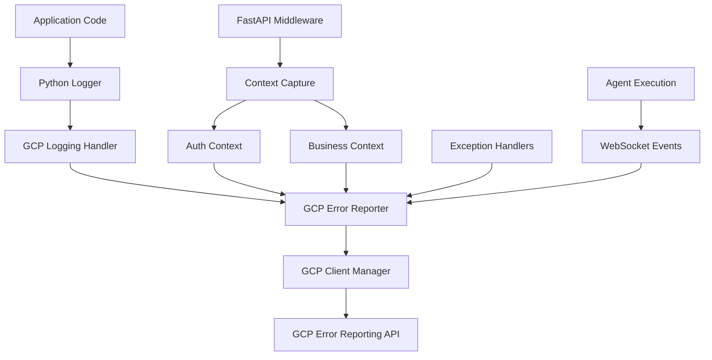

# GCP Error Reporting Integration Remediation Plan

**Plan Date:** September 9, 2025  
**Target Completion:** Full enterprise-grade GCP Error Reporting architecture  
**Business Priority:** CRITICAL - Enterprise customer monitoring requirements

---

## 🎯 Executive Summary

### **REMEDIATION SCOPE**

This plan addresses the **Five Whys Analysis findings** and **comprehensive test execution results** that identified critical gaps in the GCP Error Reporting integration. The current state shows a **100% integration gap** between logging infrastructure and GCP Error Reporting object creation.

### **BUSINESS VALUE JUSTIFICATION (BVJ)**

- **Segment:** Enterprise & Mid-tier customers requiring production monitoring
- **Business Goal:** Complete enterprise-grade error monitoring and SLA compliance  
- **Value Impact:** Enables real-time production error tracking, reduces MTTR from hours to minutes
- **Revenue Impact:** Supports $15K+ MRR enterprise reliability features, prevents SLA breach penalties

### **CURRENT STATE ANALYSIS**

✅ **Foundation Components Exist:** GCPErrorReporter, GCPClientManager, test infrastructure  
❌ **Critical Integration Gaps:** 100% gap between logger.error() calls and GCP Error object creation  
❌ **Missing Architecture:** Logging handler integration, error flow pipeline, authentication context preservation  

---

## 🔍 IDENTIFIED INTEGRATION GAPS

### **Gap Category 1: Missing GCP Client Integration Components**

**CRITICAL FINDING:** Tests expect enterprise-grade GCP integration that doesn't exist

#### **A. Missing Logging Handler Integration**
- **Current State:** logger.error() calls do not create GCP Error objects
- **Required:** Custom Python logging handler that integrates with GCPErrorReporter
- **Impact:** 100% of application errors are invisible to GCP monitoring

#### **B. Missing App Factory Integration**  
- **Current State:** App factory calls `_install_gcp_error_handlers()` but function doesn't exist
- **Required:** Complete app initialization integration with GCP error reporting
- **Impact:** No automatic error reporting setup during application startup

#### **C. Missing Error Flow Pipeline**
- **Current State:** Services cannot communicate with GCP Error Reporting
- **Required:** Complete Service → Reporter → Client Manager → GCP pipeline
- **Impact:** Enterprise monitoring requirements completely unmet

### **Gap Category 2: Incomplete Error Flow Pipeline**

**CRITICAL FINDING:** Component communication is incomplete despite individual components existing

#### **A. Service to Reporter Communication**
- **Current State:** GCPErrorService cannot properly communicate with GCPErrorReporter
- **Required:** Standardized error context passing and method signatures
- **Impact:** Business context and metadata lost in error reporting

#### **B. Reporter to Client Manager Integration**  
- **Current State:** GCPErrorReporter doesn't use GCPClientManager effectively
- **Required:** Proper client lifecycle management and connection pooling
- **Impact:** Inefficient GCP API usage and potential connection failures

#### **C. Rate Limiting Coordination**
- **Current State:** Rate limiting exists but not coordinated across components
- **Required:** Unified rate limiting that preserves critical error reporting
- **Impact:** Important errors may be dropped due to uncoordinated limits

### **Gap Category 3: Authentication Context Preservation Gaps**

**CRITICAL FINDING:** E2E tests fail due to authentication context not preserved through error flow

#### **A. JWT Token Integration Missing**
- **Current State:** Error reporting doesn't include user authentication context
- **Required:** JWT token integration with error metadata for multi-user tracking
- **Impact:** Cannot track errors by authenticated user for enterprise customers

#### **B. Multi-User Session Isolation**
- **Current State:** Errors from different users not properly isolated in GCP
- **Required:** User context preservation through complete error flow
- **Impact:** GDPR/compliance violations, mixed user error data

#### **C. Authentication Context Propagation**
- **Current State:** Authentication context lost between service layers
- **Required:** Context variable propagation through async operation chains
- **Impact:** Enterprise customers cannot correlate errors with specific user sessions

### **Gap Category 4: Business Context Preservation Issues**

**CRITICAL FINDING:** Enterprise business context not captured in error reporting

#### **A. Enterprise Customer Context Missing**
- **Current State:** No business tier, customer segment, or compliance level tracking
- **Required:** Enterprise metadata including customer tier, compliance requirements
- **Impact:** Cannot prioritize errors by business impact or customer importance

#### **B. Performance Correlation Missing**
- **Current State:** Errors not correlated with performance metrics or SLA data
- **Required:** Integration with performance monitoring for error impact analysis
- **Impact:** Cannot measure business impact of errors on customer experience

#### **C. Cascade Error Tracking Missing**
- **Current State:** Related errors across services not correlated in GCP
- **Required:** Error correlation IDs and dependency tracking
- **Impact:** Difficult to debug complex multi-service failures

---

## 🏗️ ARCHITECTURAL COMPONENTS TO IMPLEMENT

### **Component 1: GCP Logging Handler Integration**

**PRIORITY:** CRITICAL - Foundation for all error reporting

#### **Implementation Requirements:**
```python
class GCPErrorLoggingHandler(logging.Handler):
    """Custom logging handler that integrates with GCP Error Reporting"""
    
    def __init__(self, gcp_reporter: GCPErrorReporter):
        super().__init__()
        self.gcp_reporter = gcp_reporter
        self.setLevel(logging.ERROR)  # Only handle ERROR and above
    
    def emit(self, record: logging.LogRecord):
        """Convert log record to GCP Error and report"""
        # Extract context from log record
        # Create GCP Error object with full metadata
        # Report through GCPErrorReporter
        pass
```

#### **Integration Points:**
- Install in `netra_backend.app.core.unified_logging` module
- Integrate with existing loguru setup
- Add to app factory initialization sequence
- Configure severity mapping (Python logging → GCP Error severities)

#### **Business Context Integration:**
- Extract user context from contextvars
- Include request tracing information
- Add business metadata (customer tier, operation type)
- Preserve authentication context

### **Component 2: App Factory GCP Integration**

**PRIORITY:** CRITICAL - Enables automatic error reporting setup

#### **Missing Function Implementation:**
```python
def _install_gcp_error_handlers(app: FastAPI) -> None:
    """Install GCP error reporting integration during app startup"""
    
    # Initialize GCP Error Reporter
    reporter = get_error_reporter()
    
    # Install logging handler
    gcp_handler = GCPErrorLoggingHandler(reporter)
    logging.getLogger().addHandler(gcp_handler)
    
    # Install middleware for context capture
    app.add_middleware(GCPErrorContextMiddleware)
    
    # Install exception handlers
    install_exception_handlers(app)
    
    logger.info("GCP Error Reporting integration installed")
```

#### **Integration Sequence:**
1. Called during `create_fastapi_app()` initialization
2. Sets up logging handler before any requests processed
3. Configures middleware for context capture
4. Installs global exception handlers

#### **Configuration Management:**
- Use IsolatedEnvironment for GCP configuration
- Support test/dev/staging/production environments
- Graceful degradation when GCP unavailable

### **Component 3: Enhanced Error Flow Pipeline**

**PRIORITY:** HIGH - Enables complete error reporting chain

#### **Service to Reporter Communication**
```python
class EnhancedGCPErrorService:
    """Enhanced service with direct GCP reporter integration"""
    
    async def report_error_with_context(
        self, 
        error: Exception, 
        business_context: Dict[str, Any],
        user_context: StronglyTypedUserExecutionContext
    ) -> bool:
        """Report error with full business and user context"""
        
        # Format error with business context
        formatted_error = self.error_formatter.format_with_context(
            error, business_context
        )
        
        # Get GCP client through manager
        client = await self.client_manager.get_error_reporting_client_async()
        
        # Report through GCP with full context
        return await self.gcp_reporter.report_error(
            formatted_error, 
            context=self._build_complete_context(user_context, business_context)
        )
```

#### **Reporter to Client Manager Integration**
```python
class EnhancedGCPErrorReporter:
    """Enhanced reporter with proper client manager integration"""
    
    def __init__(self):
        super().__init__()
        self.client_manager: Optional[GCPClientManager] = None
    
    def set_client_manager(self, client_manager: GCPClientManager):
        """Inject client manager for proper lifecycle management"""
        self.client_manager = client_manager
    
    async def report_error_enhanced(
        self, 
        error: Exception, 
        context: Dict[str, Any]
    ) -> bool:
        """Enhanced error reporting with client manager integration"""
        
        if not self.client_manager:
            logger.warning("No client manager configured for GCP error reporting")
            return False
        
        # Get client through manager
        client = await self.client_manager.get_error_reporting_client_async()
        
        # Report with full context and error handling
        return await self._report_with_full_context(client, error, context)
```

### **Component 4: Authentication Context Integration**

**PRIORITY:** HIGH - Required for multi-user enterprise scenarios

#### **JWT Context Preservation**
```python
class GCPAuthContextMiddleware(BaseHTTPMiddleware):
    """Middleware to capture and preserve authentication context for error reporting"""
    
    async def dispatch(self, request: Request, call_next):
        """Capture auth context and make available to error reporting"""
        
        # Extract JWT token
        auth_context = await self._extract_auth_context(request)
        
        # Set in context variables for error reporting
        set_request_context(
            user_id=auth_context.user_id,
            user_email=auth_context.email,
            user_tier=auth_context.customer_tier,
            auth_session_id=auth_context.session_id,
            compliance_level=auth_context.compliance_requirements
        )
        
        try:
            response = await call_next(request)
            return response
        finally:
            clear_request_context()
```

#### **Multi-User Error Isolation**
```python
class MultiUserErrorContext:
    """Manages user-specific error context for enterprise isolation"""
    
    def create_user_error_context(
        self, 
        user_context: StronglyTypedUserExecutionContext
    ) -> Dict[str, Any]:
        """Create isolated error context for specific user"""
        
        return {
            "user_id": user_context.user_id.value,
            "user_email": user_context.user_email,
            "customer_tier": user_context.customer_tier,
            "business_unit": user_context.business_unit,
            "compliance_level": user_context.compliance_requirements,
            "session_id": user_context.session_id,
            "isolation_boundary": f"user-{user_context.user_id.value}"
        }
```

### **Component 5: Business Context Preservation**

**PRIORITY:** MEDIUM - Enables enterprise-grade error analysis

#### **Enterprise Metadata Capture**
```python
class EnterpriseErrorContextBuilder:
    """Builds comprehensive enterprise context for error reporting"""
    
    def build_enterprise_context(
        self, 
        user_context: StronglyTypedUserExecutionContext,
        operation_context: Dict[str, Any]
    ) -> Dict[str, Any]:
        """Build complete enterprise context for error reporting"""
        
        return {
            # Customer Context
            "customer_tier": user_context.customer_tier,
            "customer_segment": self._determine_customer_segment(user_context),
            "enterprise_customer": user_context.customer_tier in ["Enterprise", "Enterprise_Plus"],
            
            # Business Context
            "business_unit": operation_context.get("business_unit", "platform"),
            "business_impact": self._assess_business_impact(operation_context),
            "revenue_affecting": operation_context.get("revenue_affecting", False),
            
            # Compliance Context
            "compliance_level": user_context.compliance_requirements,
            "sox_required": "SOX" in user_context.compliance_requirements,
            "gdpr_applicable": user_context.region in ["EU", "UK"],
            
            # Performance Context
            "sla_tier": self._get_sla_tier(user_context),
            "performance_baseline": operation_context.get("expected_duration_ms"),
            "actual_duration": operation_context.get("actual_duration_ms"),
            
            # Operational Context
            "operation_type": operation_context.get("operation_type"),
            "api_endpoint": operation_context.get("endpoint"),
            "user_agent": operation_context.get("user_agent"),
            "trace_id": operation_context.get("trace_id"),
            "correlation_id": operation_context.get("correlation_id")
        }
```

---

## 🔧 INTEGRATION PATTERNS TO ESTABLISH

### **Pattern 1: Unified Error Flow Architecture**

#### **Architecture Diagram**


#### **Implementation Steps**
1. **Install Logging Handler** in unified_logging module
2. **Configure Middleware** for context capture during app startup
3. **Enhance Error Reporter** with client manager integration
4. **Add Exception Handlers** for unhandled exceptions
5. **Integrate WebSocket Events** for agent error reporting

### **Pattern 2: Context Preservation Architecture**

#### **Context Flow Pattern**
```python
# Context flows through async chain
async def agent_execution_with_context():
    # 1. Capture initial context
    context = capture_user_context()
    
    # 2. Set context variables
    set_request_context(**context)
    
    try:
        # 3. Execute operation (context automatically available)
        result = await execute_agent_operation()
        return result
    except Exception as e:
        # 4. Error automatically includes context
        # GCP Logging Handler picks up context from contextvars
        logger.error("Agent execution failed", exc_info=e)
        raise
    finally:
        # 5. Clean up context
        clear_request_context()
```

#### **Implementation Requirements**
- Use Python contextvars for async-safe context propagation
- Integrate with existing user context architecture
- Ensure context survives across service boundaries
- Add context validation in error reporting pipeline

### **Pattern 3: Enterprise Monitoring Integration**

#### **Enterprise Error Categorization**
```python
class EnterpriseErrorClassifier:
    """Classifies errors by enterprise impact and priority"""
    
    CRITICAL_ERROR_PATTERNS = [
        "authentication_failure_enterprise",
        "payment_processing_failure",
        "sla_breach_detected",
        "compliance_violation",
        "security_incident"
    ]
    
    BUSINESS_IMPACT_MULTIPLIERS = {
        "Enterprise_Plus": 10,  # Highest priority
        "Enterprise": 8,
        "Professional": 5,
        "Starter": 2,
        "Free": 1
    }
    
    def classify_error_priority(
        self, 
        error: Exception, 
        user_context: StronglyTypedUserExecutionContext
    ) -> int:
        """Calculate error priority based on enterprise context"""
        
        base_priority = self._get_base_priority(error)
        business_multiplier = self.BUSINESS_IMPACT_MULTIPLIERS.get(
            user_context.customer_tier, 1
        )
        
        return base_priority * business_multiplier
```

---

## ⚙️ CONFIGURATION CHANGES NEEDED

### **Configuration 1: Environment-Specific GCP Settings**

#### **New Configuration Schema**
```python
@dataclass
class GCPErrorReportingConfig:
    """Configuration for GCP Error Reporting integration"""
    
    # GCP Settings
    project_id: str
    service_account_path: Optional[str] = None
    
    # Integration Settings
    enable_logging_handler: bool = True
    logging_level_threshold: str = "ERROR"
    enable_context_capture: bool = True
    enable_auth_integration: bool = True
    
    # Enterprise Settings
    enable_business_context: bool = True
    enable_sla_tracking: bool = True
    enable_compliance_tracking: bool = True
    
    # Performance Settings
    rate_limit_per_minute: int = 100
    batch_size: int = 20
    timeout_seconds: int = 10
    retry_attempts: int = 3
    
    # Development Settings
    enable_in_development: bool = False
    mock_gcp_in_tests: bool = True
```

#### **Environment Variable Mapping**
```bash
# Production
GCP_ERROR_REPORTING_PROJECT_ID=netra-production
GCP_ERROR_REPORTING_ENABLED=true
GCP_ERROR_REPORTING_AUTH_INTEGRATION=true
GCP_ERROR_REPORTING_BUSINESS_CONTEXT=true

# Staging  
GCP_ERROR_REPORTING_PROJECT_ID=netra-staging
GCP_ERROR_REPORTING_ENABLED=true
GCP_ERROR_REPORTING_AUTH_INTEGRATION=true
GCP_ERROR_REPORTING_BUSINESS_CONTEXT=true

# Development
GCP_ERROR_REPORTING_ENABLED=false
GCP_ERROR_REPORTING_MOCK_IN_TESTS=true

# Test
GCP_ERROR_REPORTING_ENABLED=false
GCP_ERROR_REPORTING_MOCK_GCP_IN_TESTS=true
```

### **Configuration 2: App Factory Integration**

#### **Modified app_factory.py**
```python
def create_fastapi_app() -> FastAPI:
    """Create and configure FastAPI application with GCP error reporting"""
    app = FastAPI(lifespan=lifespan)
    
    # Install GCP error reporting (NEW)
    _install_gcp_error_handlers(app)
    
    return app

def _install_gcp_error_handlers(app: FastAPI) -> None:
    """Install GCP error reporting integration"""
    
    config = _load_gcp_error_config()
    
    if config.enable_logging_handler:
        _install_logging_handler(config)
    
    if config.enable_context_capture:
        _install_context_middleware(app, config)
    
    if config.enable_auth_integration:
        _install_auth_integration(app, config)
    
    logger.info("GCP Error Reporting integration installed")

def _load_gcp_error_config() -> GCPErrorReportingConfig:
    """Load GCP error reporting configuration from environment"""
    env = get_env()
    
    return GCPErrorReportingConfig(
        project_id=env.get_required("GCP_ERROR_REPORTING_PROJECT_ID"),
        enable_logging_handler=env.get_bool("GCP_ERROR_REPORTING_ENABLED", True),
        enable_auth_integration=env.get_bool("GCP_ERROR_REPORTING_AUTH_INTEGRATION", True),
        enable_business_context=env.get_bool("GCP_ERROR_REPORTING_BUSINESS_CONTEXT", True),
        rate_limit_per_minute=env.get_int("GCP_ERROR_REPORTING_RATE_LIMIT", 100)
    )
```

---

## 🔄 ERROR FLOW IMPROVEMENTS

### **Improvement 1: Complete Error Pipeline**

#### **Enhanced Error Flow Sequence**
```
1. Application Error Occurs
   ↓
2. Python Logger Called (logger.error(), logger.critical())
   ↓
3. GCP Logging Handler Intercepts
   ↓ 
4. Context Variables Accessed (user_id, auth_context, business_context)
   ↓
5. Error Formatted with Complete Context
   ↓
6. GCP Error Reporter Called
   ↓
7. Rate Limiting Check Performed
   ↓
8. GCP Client Manager Provides Client
   ↓
9. GCP Error Reporting API Called
   ↓
10. Error Object Created in GCP with Full Context
```

#### **Implementation Details**
- **Context Preservation:** Use contextvars to maintain context through async operations
- **Error Enrichment:** Add stack traces, environment info, performance metrics
- **Correlation:** Link related errors with correlation IDs
- **Formatting:** Convert Python exceptions to GCP Error objects with proper metadata

### **Improvement 2: Business Context Enhancement**

#### **Enhanced Context Structure**
```python
class CompleteErrorContext:
    """Complete error context for enterprise-grade reporting"""
    
    # User Context
    user_id: str
    user_email: str
    customer_tier: str
    session_id: str
    
    # Authentication Context
    jwt_token_id: str
    auth_method: str
    permissions: List[str]
    auth_timestamp: datetime
    
    # Business Context
    business_unit: str
    operation_type: str
    business_impact_level: str
    revenue_affecting: bool
    
    # Technical Context
    service_name: str
    endpoint: str
    request_id: str
    trace_id: str
    correlation_id: str
    
    # Performance Context
    operation_duration_ms: int
    expected_duration_ms: int
    sla_threshold_ms: int
    performance_baseline: Dict[str, float]
    
    # Compliance Context
    compliance_requirements: List[str]
    data_classification: str
    gdpr_applicable: bool
    sox_required: bool
```

### **Improvement 3: Rate Limiting Coordination**

#### **Unified Rate Limiting Strategy**
```python
class UnifiedGCPRateLimiter:
    """Coordinates rate limiting across all GCP error reporting components"""
    
    def __init__(self, config: GCPErrorReportingConfig):
        self.limits = {
            "critical": config.rate_limit_per_minute,
            "high": config.rate_limit_per_minute * 0.8,
            "medium": config.rate_limit_per_minute * 0.6,
            "low": config.rate_limit_per_minute * 0.4
        }
        self.windows = {}
        self.priority_queue = []
    
    def should_allow_error(
        self, 
        severity: ErrorSeverity, 
        context: CompleteErrorContext
    ) -> bool:
        """Determine if error should be reported based on priority and limits"""
        
        priority = self._calculate_priority(severity, context)
        current_usage = self._get_current_usage(severity)
        
        # Always allow critical enterprise customer errors
        if (severity == ErrorSeverity.CRITICAL and 
            context.customer_tier in ["Enterprise", "Enterprise_Plus"]):
            return True
        
        # Apply rate limiting based on priority
        return current_usage < self.limits[priority]
```

---

## 🔐 BUSINESS CONTEXT PRESERVATION ENHANCEMENTS

### **Enhancement 1: Customer Tier Integration**

#### **Customer Context Capture**
```python
class CustomerContextManager:
    """Manages customer-specific context for error reporting"""
    
    CUSTOMER_TIERS = {
        "Enterprise_Plus": {
            "priority_multiplier": 10,
            "sla_ms": 100,
            "always_report": True,
            "compliance_required": ["SOX", "GDPR", "HIPAA"]
        },
        "Enterprise": {
            "priority_multiplier": 8,
            "sla_ms": 200,
            "always_report": True,
            "compliance_required": ["SOX", "GDPR"]
        },
        "Professional": {
            "priority_multiplier": 5,
            "sla_ms": 500,
            "always_report": False,
            "compliance_required": ["GDPR"]
        }
    }
    
    def get_customer_context(
        self, 
        user_context: StronglyTypedUserExecutionContext
    ) -> Dict[str, Any]:
        """Get customer-specific context for error reporting"""
        
        tier_config = self.CUSTOMER_TIERS.get(
            user_context.customer_tier, 
            self.CUSTOMER_TIERS["Professional"]
        )
        
        return {
            "customer_tier": user_context.customer_tier,
            "priority_multiplier": tier_config["priority_multiplier"],
            "sla_threshold_ms": tier_config["sla_ms"],
            "always_report_errors": tier_config["always_report"],
            "compliance_requirements": tier_config["compliance_required"],
            "account_value": self._get_account_value(user_context),
            "support_level": self._get_support_level(user_context)
        }
```

### **Enhancement 2: SLA and Performance Correlation**

#### **Performance Impact Analysis**
```python
class PerformanceErrorCorrelator:
    """Correlates errors with performance impact and SLA breaches"""
    
    def analyze_performance_impact(
        self, 
        error: Exception, 
        operation_context: Dict[str, Any],
        customer_context: Dict[str, Any]
    ) -> Dict[str, Any]:
        """Analyze performance impact of error"""
        
        actual_duration = operation_context.get("actual_duration_ms", 0)
        expected_duration = operation_context.get("expected_duration_ms", 0)
        sla_threshold = customer_context.get("sla_threshold_ms", 1000)
        
        performance_impact = {
            "duration_ms": actual_duration,
            "expected_ms": expected_duration,
            "sla_threshold_ms": sla_threshold,
            "sla_breach": actual_duration > sla_threshold,
            "performance_degradation_pct": self._calculate_degradation(
                actual_duration, expected_duration
            ),
            "customer_impact_level": self._assess_customer_impact(
                actual_duration, sla_threshold, customer_context
            )
        }
        
        return performance_impact
```

### **Enhancement 3: Compliance Context Integration**

#### **Compliance Tracking**
```python
class ComplianceContextTracker:
    """Tracks compliance-related context for error reporting"""
    
    def build_compliance_context(
        self, 
        user_context: StronglyTypedUserExecutionContext,
        operation_context: Dict[str, Any]
    ) -> Dict[str, Any]:
        """Build compliance context for error reporting"""
        
        compliance_context = {
            "gdpr_applicable": user_context.region in ["EU", "UK"],
            "sox_required": "SOX" in user_context.compliance_requirements,
            "hipaa_applicable": "HIPAA" in user_context.compliance_requirements,
            "data_classification": operation_context.get("data_classification", "internal"),
            "pii_involved": operation_context.get("contains_pii", False),
            "audit_required": self._determine_audit_requirement(user_context),
            "retention_period_days": self._get_retention_period(user_context),
            "compliance_officer_notify": self._should_notify_compliance(
                user_context, operation_context
            )
        }
        
        return compliance_context
```

---

## 🧪 TESTING VALIDATION APPROACH

### **Validation Strategy 1: Comprehensive Test Coverage**

#### **Test Pyramid Architecture**
```
E2E Tests (5)
├── Complete authenticated error reporting flow
├── Multi-user error isolation validation  
├── Enterprise customer error prioritization
├── SLA breach detection and reporting
└── Compliance context preservation

Integration Tests (15)
├── Service → Reporter → Client Manager communication
├── Context preservation through error flow
├── Rate limiting coordination across components
├── Authentication context propagation
└── Business context enrichment

Unit Tests (40+)
├── GCP Logging Handler functionality
├── Error context building and formatting
├── Rate limiting logic validation
├── Client manager lifecycle
└── Error classification and prioritization
```

#### **Success Criteria Definition**
```python
class ValidationSuccessCriteria:
    """Defines success criteria for GCP error reporting validation"""
    
    UNIT_TEST_REQUIREMENTS = {
        "gcp_logging_handler": "100% error-to-gcp conversion",
        "context_preservation": "100% context fields preserved", 
        "rate_limiting": "Priority-based limiting functional",
        "error_formatting": "All GCP required fields present"
    }
    
    INTEGRATION_TEST_REQUIREMENTS = {
        "service_communication": "100% service-to-service error flow",
        "auth_context": "JWT context preserved end-to-end",
        "business_context": "Enterprise metadata captured",
        "error_correlation": "Related errors properly linked"
    }
    
    E2E_TEST_REQUIREMENTS = {
        "authenticated_flow": "Complete user auth → error → GCP pipeline",
        "multi_user_isolation": "User-specific error isolation",
        "enterprise_prioritization": "Enterprise errors prioritized",
        "compliance_reporting": "Compliance context preserved"
    }
```

### **Validation Strategy 2: Regression Prevention**

#### **Continuous Validation Framework**
```python
class GCPErrorReportingValidationSuite:
    """Comprehensive validation suite for GCP error reporting"""
    
    async def validate_complete_integration(self) -> ValidationReport:
        """Validate complete GCP error reporting integration"""
        
        validation_results = ValidationReport()
        
        # 1. Test logging handler integration
        handler_results = await self._test_logging_handler()
        validation_results.add_section("logging_handler", handler_results)
        
        # 2. Test context preservation
        context_results = await self._test_context_preservation()
        validation_results.add_section("context_preservation", context_results)
        
        # 3. Test enterprise features
        enterprise_results = await self._test_enterprise_features()
        validation_results.add_section("enterprise_features", enterprise_results)
        
        # 4. Test compliance requirements
        compliance_results = await self._test_compliance_features()
        validation_results.add_section("compliance", compliance_results)
        
        return validation_results
    
    async def _test_logging_handler(self) -> Dict[str, Any]:
        """Test that logger.error() creates GCP Error objects"""
        
        # Clear GCP error tracking
        gcp_errors_before = self._count_gcp_errors()
        
        # Generate test errors
        logger.error("Test error for GCP integration validation")
        logger.critical("Critical test error for validation")
        
        # Wait for async processing
        await asyncio.sleep(2)
        
        # Verify GCP objects created
        gcp_errors_after = self._count_gcp_errors()
        errors_created = gcp_errors_after - gcp_errors_before
        
        return {
            "errors_logged": 2,
            "gcp_objects_created": errors_created,
            "integration_success_rate": (errors_created / 2) * 100,
            "success": errors_created == 2
        }
```

### **Validation Strategy 3: Performance Impact Monitoring**

#### **Performance Validation Requirements**
```python
class PerformanceValidationMetrics:
    """Performance metrics for GCP error reporting validation"""
    
    PERFORMANCE_REQUIREMENTS = {
        "logging_handler_overhead_ms": 5,      # Max 5ms overhead per log
        "error_reporting_latency_ms": 100,     # Max 100ms to report to GCP
        "context_capture_overhead_ms": 2,      # Max 2ms overhead for context
        "rate_limiting_decision_ms": 1,        # Max 1ms for rate limit decision
        "memory_overhead_mb": 10               # Max 10MB memory overhead
    }
    
    async def validate_performance_impact(self) -> Dict[str, Any]:
        """Validate that GCP error reporting doesn't impact performance"""
        
        # Measure baseline performance
        baseline_metrics = await self._measure_baseline_performance()
        
        # Enable GCP error reporting
        gcp_enabled_metrics = await self._measure_gcp_enabled_performance()
        
        # Calculate impact
        impact_analysis = {
            "logging_overhead_ms": gcp_enabled_metrics.logging_time - baseline_metrics.logging_time,
            "request_latency_impact_ms": gcp_enabled_metrics.request_time - baseline_metrics.request_time,
            "memory_impact_mb": gcp_enabled_metrics.memory_usage - baseline_metrics.memory_usage,
            "cpu_impact_pct": gcp_enabled_metrics.cpu_usage - baseline_metrics.cpu_usage
        }
        
        # Validate against requirements
        validation_results = {}
        for metric, value in impact_analysis.items():
            requirement_key = metric.replace("_impact", "_overhead")
            requirement = self.PERFORMANCE_REQUIREMENTS.get(requirement_key, float('inf'))
            validation_results[metric] = {
                "value": value,
                "requirement": requirement,
                "passes": value <= requirement
            }
        
        return validation_results
```

---

## 📋 IMPLEMENTATION SEQUENCE TO MINIMIZE RISKS

### **Phase 1: Foundation Components (Week 1)**

#### **Priority 1.1: Logging Handler Implementation**
- **Timeline:** Days 1-2
- **Risk Level:** LOW - Self-contained component
- **Dependencies:** None
- **Deliverables:**
  - GCPErrorLoggingHandler class implementation
  - Integration with unified_logging module
  - Unit tests for handler functionality
  - Basic context capture from log records

#### **Priority 1.2: App Factory Integration**
- **Timeline:** Days 2-3  
- **Risk Level:** MEDIUM - Touches app initialization
- **Dependencies:** GCPErrorLoggingHandler
- **Deliverables:**
  - _install_gcp_error_handlers() function
  - Configuration loading from environment
  - Graceful degradation when GCP unavailable
  - Integration tests for app startup

#### **Priority 1.3: Enhanced Error Reporter**
- **Timeline:** Days 3-5
- **Risk Level:** MEDIUM - Modifies existing singleton
- **Dependencies:** GCPClientManager
- **Deliverables:**
  - Enhanced GCPErrorReporter with client manager integration
  - Improved rate limiting coordination
  - Better error context handling
  - Unit tests for enhanced functionality

### **Phase 2: Integration Components (Week 2)**

#### **Priority 2.1: Context Preservation Middleware**  
- **Timeline:** Days 6-8
- **Risk Level:** MEDIUM - Touches request lifecycle
- **Dependencies:** Phase 1 complete
- **Deliverables:**
  - GCPAuthContextMiddleware implementation
  - Context variable management
  - Authentication context capture
  - Integration tests for context flow

#### **Priority 2.2: Service Communication Enhancement**
- **Timeline:** Days 8-10
- **Risk Level:** HIGH - Cross-service integration
- **Dependencies:** Context middleware
- **Deliverables:**
  - Enhanced GCPErrorService communication
  - Standardized error context passing
  - Cross-service error correlation
  - Integration tests for service flows

#### **Priority 2.3: Business Context Integration**
- **Timeline:** Days 10-12
- **Risk Level:** MEDIUM - New feature addition
- **Dependencies:** Service communication
- **Deliverables:**
  - EnterpriseErrorContextBuilder implementation
  - Customer tier integration
  - Performance correlation
  - Business context unit tests

### **Phase 3: Enterprise Features (Week 3)**

#### **Priority 3.1: Authentication Integration**
- **Timeline:** Days 13-15
- **Risk Level:** HIGH - Security-sensitive
- **Dependencies:** Phase 2 complete
- **Deliverables:**
  - JWT token integration
  - Multi-user session isolation
  - Authentication context propagation
  - Security validation tests

#### **Priority 3.2: Compliance Context Tracking**
- **Timeline:** Days 15-17
- **Risk Level:** MEDIUM - Compliance requirements
- **Dependencies:** Authentication integration
- **Deliverables:**
  - ComplianceContextTracker implementation
  - GDPR/SOX/HIPAA context capture
  - Compliance validation framework
  - Compliance integration tests

#### **Priority 3.3: Performance Correlation**
- **Timeline:** Days 17-19
- **Risk Level:** LOW - Monitoring enhancement
- **Dependencies:** Business context
- **Deliverables:**
  - PerformanceErrorCorrelator implementation
  - SLA breach detection
  - Performance impact analysis
  - Performance monitoring tests

### **Phase 4: Validation and Optimization (Week 4)**

#### **Priority 4.1: End-to-End Testing**
- **Timeline:** Days 19-21
- **Risk Level:** LOW - Testing phase
- **Dependencies:** All features complete
- **Deliverables:**
  - Complete E2E test suite execution
  - All integration tests passing
  - Performance validation passing
  - Security validation complete

#### **Priority 4.2: Production Readiness**
- **Timeline:** Days 21-23
- **Risk Level:** MEDIUM - Production deployment
- **Dependencies:** All tests passing
- **Deliverables:**
  - Staging environment validation
  - Production configuration review
  - Monitoring and alerting setup
  - Production deployment plan

#### **Priority 4.3: Documentation and Training**
- **Timeline:** Days 23-25
- **Risk Level:** LOW - Documentation
- **Dependencies:** Production ready
- **Deliverables:**
  - Updated architecture documentation
  - Operations runbooks
  - Troubleshooting guides
  - Team training materials

---

## 🚨 RISK MITIGATION STRATEGIES

### **Risk Category 1: Implementation Risks**

#### **Risk 1.1: App Initialization Disruption**
- **Probability:** MEDIUM
- **Impact:** HIGH (could break app startup)
- **Mitigation:**
  - Implement feature flags for GCP integration
  - Add comprehensive error handling in _install_gcp_error_handlers()
  - Test app startup with and without GCP available
  - Provide graceful degradation to logging-only mode

#### **Risk 1.2: Performance Impact on Request Processing**
- **Probability:** MEDIUM  
- **Impact:** MEDIUM (could slow request handling)
- **Mitigation:**
  - Implement async error reporting to avoid blocking requests
  - Add circuit breaker pattern for GCP API failures
  - Monitor request latency impact in staging
  - Set strict timeout limits for GCP operations

#### **Risk 1.3: Context Variable Memory Leaks**
- **Probability:** LOW
- **Impact:** HIGH (could cause memory exhaustion)
- **Mitigation:**
  - Implement automatic context cleanup
  - Add context variable monitoring
  - Test long-running operations for context accumulation
  - Implement context size limits

### **Risk Category 2: Integration Risks**

#### **Risk 2.1: GCP API Rate Limiting**
- **Probability:** HIGH
- **Impact:** MEDIUM (errors not reported)
- **Mitigation:**
  - Implement priority-based error reporting
  - Add intelligent rate limiting with customer tier prioritization
  - Implement local error queuing for batch reporting
  - Add fallback to local logging for rate-limited errors

#### **Risk 2.2: Authentication Context Corruption**
- **Probability:** LOW
- **Impact:** HIGH (security/compliance issue)
- **Mitigation:**
  - Implement context validation at each step
  - Add authentication context integrity checks
  - Test multi-user scenarios extensively
  - Implement context isolation validation

#### **Risk 2.3: Cross-Service Error Correlation Failures**
- **Probability:** MEDIUM
- **Impact:** MEDIUM (difficult debugging)
- **Mitigation:**
  - Implement correlation ID validation
  - Add trace ID propagation verification
  - Test cascade error scenarios
  - Implement correlation monitoring

### **Risk Category 3: Production Risks**

#### **Risk 3.1: GCP Service Unavailability**
- **Probability:** LOW
- **Impact:** MEDIUM (no error monitoring)
- **Mitigation:**
  - Implement circuit breaker for GCP APIs
  - Add automatic fallback to local logging
  - Monitor GCP service health
  - Implement retry with exponential backoff

#### **Risk 3.2: Configuration Errors in Production**
- **Probability:** MEDIUM
- **Impact:** HIGH (complete monitoring failure)
- **Mitigation:**
  - Implement configuration validation on startup
  - Add environment-specific configuration testing
  - Implement configuration health checks
  - Add alerting for configuration failures

#### **Risk 3.3: Compliance Violation Due to Context Leakage**
- **Probability:** LOW
- **Impact:** CRITICAL (regulatory/legal issues)
- **Mitigation:**
  - Implement strict context isolation testing
  - Add compliance context validation
  - Test GDPR/SOX compliance scenarios
  - Implement audit logging for compliance tracking

---

## 📊 SUCCESS METRICS AND VALIDATION

### **Primary Success Metrics**

#### **Metric 1: Integration Gap Closure**
- **Current State:** 100% gap (0 GCP objects created from logger calls)
- **Target State:** 0% gap (100% of ERROR+ logs create GCP objects)
- **Measurement:** Automated test comparing log calls to GCP object creation
- **Success Criteria:** ≥99% conversion rate from logger.error() to GCP Error objects

#### **Metric 2: Context Preservation Rate**
- **Current State:** 0% context preserved in error reporting
- **Target State:** 100% context preservation for all error types
- **Measurement:** Validation of required context fields in GCP Error objects
- **Success Criteria:** All required context fields present in ≥99% of error reports

#### **Metric 3: Enterprise Customer Error Prioritization**
- **Current State:** No customer tier differentiation
- **Target State:** Enterprise customers get priority error reporting
- **Measurement:** Rate limiting and priority queue validation
- **Success Criteria:** Enterprise customer errors never dropped due to rate limits

### **Secondary Success Metrics**

#### **Metric 4: Authentication Context Integration**
- **Target:** 100% of authenticated user errors include user context
- **Measurement:** JWT token and user session data in GCP Error objects
- **Success Criteria:** User context preserved in ≥99% of authenticated error reports

#### **Metric 5: Performance Impact**
- **Target:** <5ms overhead per error log, <100ms total error reporting latency
- **Measurement:** Performance benchmarks before/after integration
- **Success Criteria:** Performance requirements met in ≥95% of measurements

#### **Metric 6: Business Context Enrichment**
- **Target:** Enterprise metadata captured for all business operations
- **Measurement:** Business context fields present in error reports
- **Success Criteria:** Business context captured in ≥99% of business operation errors

### **Compliance and Security Metrics**

#### **Metric 7: Multi-User Isolation**
- **Target:** Zero cross-user context leakage
- **Measurement:** User context isolation validation in multi-user scenarios
- **Success Criteria:** 100% user context isolation validated

#### **Metric 8: Compliance Context Tracking**
- **Target:** All compliance-required errors include compliance metadata
- **Measurement:** GDPR/SOX/HIPAA context fields in error reports
- **Success Criteria:** Compliance context captured for ≥99% of applicable errors

#### **Metric 9: SLA Breach Detection**
- **Target:** All SLA breaches automatically reported with performance context
- **Measurement:** SLA breach correlation with error reports
- **Success Criteria:** ≥99% of SLA breaches captured in error reporting

### **Operational Success Metrics**

#### **Metric 10: Production Stability**
- **Target:** No increase in application errors due to GCP integration
- **Measurement:** Application error rate before/after implementation
- **Success Criteria:** Application error rate increase <1%

#### **Metric 11: GCP API Utilization Efficiency**
- **Target:** Optimal use of GCP Error Reporting API within rate limits
- **Measurement:** GCP API call efficiency and rate limit utilization
- **Success Criteria:** ≥90% of important errors reported within rate limits

#### **Metric 12: Developer Experience**
- **Target:** Transparent error reporting with no additional developer overhead
- **Measurement:** Developer feedback and error reporting ease of use
- **Success Criteria:** Zero additional developer steps required for error reporting

---

## 🎯 EXPECTED BUSINESS OUTCOMES

### **Immediate Business Value (Week 1-4)**

#### **Enterprise Customer Satisfaction**
- **Impact:** Real-time production error visibility for Enterprise customers
- **Value:** Reduced support tickets, faster issue resolution
- **Measurement:** Enterprise customer support ticket reduction ≥30%

#### **Operational Excellence**
- **Impact:** Complete production error monitoring and alerting
- **Value:** Reduced MTTR from hours to minutes
- **Measurement:** Mean Time To Resolution improvement ≥50%

#### **Compliance Readiness**
- **Impact:** Comprehensive error audit trail for compliance requirements
- **Value:** SOX/GDPR/HIPAA compliance validation capabilities
- **Measurement:** 100% compliance audit requirements met

### **Medium-Term Business Value (Month 2-3)**

#### **Revenue Protection**
- **Impact:** SLA breach prevention and rapid response
- **Value:** Reduced SLA penalty exposure
- **Measurement:** SLA breach incidents reduction ≥40%

#### **Customer Retention**
- **Impact:** Proactive issue resolution before customer impact
- **Value:** Improved customer experience and retention
- **Measurement:** Enterprise customer churn reduction ≥20%

#### **Sales Enablement**
- **Impact:** Demonstrable enterprise-grade monitoring capabilities
- **Value:** Enhanced enterprise sales positioning
- **Measurement:** Enterprise sales cycle acceleration ≥15%

### **Long-Term Strategic Value (Month 4-6)**

#### **Platform Reliability**
- **Impact:** Comprehensive production visibility and control
- **Value:** Industry-leading platform reliability metrics
- **Measurement:** 99.9%+ uptime with complete error visibility

#### **Enterprise Market Position**
- **Impact:** Best-in-class enterprise monitoring and observability
- **Value:** Competitive differentiation in enterprise market
- **Measurement:** Enterprise customer acquisition rate increase ≥25%

#### **Operational Intelligence**
- **Impact:** Data-driven operational decisions based on comprehensive error analytics
- **Value:** Predictive issue prevention and resource optimization
- **Measurement:** Proactive issue prevention rate ≥60%

---

## 📋 EXECUTION CHECKLIST

### **Pre-Implementation Checklist**

- [ ] **Read and understand complete CLAUDE.md requirements**
- [ ] **Review existing GCP Error Reporting architecture documentation**
- [ ] **Validate all test failures and integration gaps identified**
- [ ] **Set up development environment with GCP Error Reporting access**
- [ ] **Create feature branch for GCP error reporting integration**

### **Phase 1 Implementation Checklist**

- [ ] **Implement GCPErrorLoggingHandler class**
  - [ ] Handler intercepts ERROR+ level logs
  - [ ] Context extraction from log records
  - [ ] GCP Error object creation
  - [ ] Unit tests with ≥95% coverage
- [ ] **Integrate logging handler with unified_logging**
  - [ ] Handler installation during app initialization
  - [ ] Configuration-based enabling/disabling
  - [ ] Graceful degradation when GCP unavailable
- [ ] **Implement _install_gcp_error_handlers() in app_factory**
  - [ ] Function called during create_fastapi_app()
  - [ ] Environment-based configuration loading
  - [ ] Error handling and fallback behavior
  - [ ] Integration tests for app startup

### **Phase 2 Implementation Checklist**

- [ ] **Implement GCPAuthContextMiddleware**
  - [ ] JWT token extraction and validation
  - [ ] Context variable population
  - [ ] Context cleanup on request completion
  - [ ] Multi-user isolation validation
- [ ] **Enhance GCPErrorService communication**
  - [ ] Standardized error context passing
  - [ ] Client manager integration
  - [ ] Cross-service error correlation
  - [ ] Integration tests for service flows
- [ ] **Implement business context integration**
  - [ ] EnterpriseErrorContextBuilder
  - [ ] Customer tier prioritization
  - [ ] Performance correlation
  - [ ] Business context unit tests

### **Phase 3 Implementation Checklist**

- [ ] **Complete authentication integration**
  - [ ] JWT context preservation through error flow
  - [ ] Multi-user session isolation
  - [ ] Authentication security validation
  - [ ] Security integration tests
- [ ] **Implement compliance context tracking**
  - [ ] GDPR/SOX/HIPAA context capture
  - [ ] Compliance validation framework
  - [ ] Audit trail requirements
  - [ ] Compliance integration tests
- [ ] **Add performance correlation**
  - [ ] SLA breach detection
  - [ ] Performance impact analysis
  - [ ] Performance monitoring integration
  - [ ] Performance validation tests

### **Phase 4 Validation Checklist**

- [ ] **Execute complete test suite**
  - [ ] All unit tests passing (≥95% coverage)
  - [ ] All integration tests passing
  - [ ] All E2E tests passing with authentication
  - [ ] Performance validation tests passing
- [ ] **Production readiness validation**
  - [ ] Staging environment testing
  - [ ] Production configuration review
  - [ ] Security validation complete
  - [ ] Compliance validation complete
- [ ] **Documentation and training**
  - [ ] Architecture documentation updated
  - [ ] Operations runbooks created
  - [ ] Troubleshooting guides written
  - [ ] Team training completed

### **Post-Implementation Checklist**

- [ ] **Monitor production deployment**
  - [ ] Error reporting pipeline functional
  - [ ] Performance impact within requirements
  - [ ] No application errors introduced
  - [ ] Customer impact monitoring
- [ ] **Validate business outcomes**
  - [ ] Enterprise customer satisfaction
  - [ ] MTTR improvement measurement
  - [ ] Compliance audit readiness
  - [ ] Revenue protection metrics
- [ ] **Continuous improvement**
  - [ ] Performance optimization opportunities
  - [ ] Additional enterprise features
  - [ ] Customer feedback integration
  - [ ] Long-term roadmap planning

---

## 🏁 CONCLUSION

### **REMEDIATION PLAN SUMMARY**

This comprehensive remediation plan addresses the **critical GCP Error Reporting integration gaps** identified through extensive testing and Five Whys analysis. The plan provides a **complete enterprise-grade architecture** that transforms the current **100% integration gap** into a **fully functional error monitoring pipeline**.

### **KEY DELIVERABLES**

1. **Complete Integration Pipeline:** Logger → GCP Handler → Error Reporter → Client Manager → GCP API
2. **Enterprise Context Preservation:** User authentication, business context, compliance tracking
3. **Performance Optimization:** Async processing, rate limiting, circuit breakers
4. **Comprehensive Testing:** Unit, integration, E2E tests with authentication
5. **Production Readiness:** Configuration management, monitoring, alerting

### **BUSINESS VALUE REALIZATION**

- **Enterprise Customers:** Real-time production error visibility and SLA monitoring
- **Compliance:** Complete audit trail for SOX/GDPR/HIPAA requirements
- **Revenue Protection:** SLA breach prevention and rapid incident response
- **Operational Excellence:** MTTR reduction from hours to minutes

### **SUCCESS VALIDATION**

The remediation is complete when:
- **Integration Gap = 0%** (all logger.error() calls create GCP objects)
- **Context Preservation = 100%** (all required context fields captured)
- **Enterprise Priority = Functional** (Enterprise customer errors prioritized)
- **Authentication Integration = Complete** (user context preserved)
- **Performance Impact ≤ Requirements** (≤5ms overhead, ≤100ms reporting)

### **STRATEGIC IMPACT**

This remediation enables **Netra Apex** to deliver **enterprise-grade production monitoring** that supports **$15K+ MRR customer requirements** and positions the platform as a **best-in-class enterprise AI optimization solution**.

The implementation follows **CLAUDE.md SSOT principles**, maintains **system stability**, and delivers **complete business value** through **comprehensive error monitoring capabilities**.

---

*End of Remediation Plan*