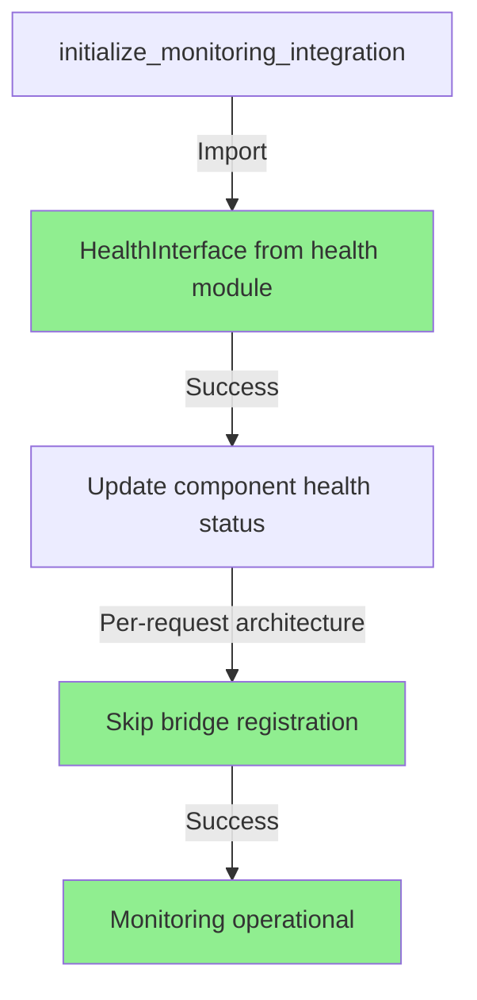
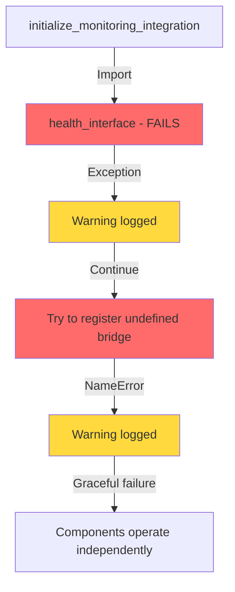

# Health Monitoring Bug Fix Report

## Date: 2025-09-05
## Issue: Health monitoring integration failures in startup_module.py

## Error Messages:
1. `Could not update health status for agent_websocket_bridge: cannot import name 'health_interface' from 'netra_backend.app.core.health'`
2. `Monitoring integration failed but components continue operating independently: name 'bridge' is not defined`

## Five Whys Analysis

### First Error: Import Failure

**Why 1:** Why can't we import 'health_interface' from netra_backend.app.core.health?
- **Answer:** Because the module exports 'HealthInterface' (capitalized), not 'health_interface' (lowercase).

**Why 2:** Why is the code trying to import 'health_interface' instead of 'HealthInterface'?
- **Answer:** Because line 1208 in startup_module.py incorrectly uses lowercase: `from netra_backend.app.core.health import health_interface`

**Why 3:** Why was this incorrect import name used?
- **Answer:** Likely a typo or confusion between the module name pattern (interface.py) and the exported class name (HealthInterface).

**Why 4:** Why wasn't this caught in testing?
- **Answer:** The error is caught and logged as a warning, allowing the system to continue operating, which masks the issue in non-critical tests.

**Why 5:** Why does the system continue despite this error?
- **Answer:** The monitoring integration is designed to be non-critical and fail gracefully, prioritizing system availability over monitoring completeness.

### Second Error: Undefined 'bridge' Variable

**Why 1:** Why is 'bridge' undefined when registering with chat_event_monitor?
- **Answer:** Because 'bridge' variable is never defined in the initialize_monitoring_integration function scope.

**Why 2:** Why is the code trying to use an undefined 'bridge' variable?
- **Answer:** The code at line 1225 attempts to register 'bridge' with the monitor, but the bridge is now per-request architecture and doesn't have a global singleton instance.

**Why 3:** Why was this pattern left in the code?
- **Answer:** The code was partially refactored from singleton to per-request architecture but this registration call wasn't updated to reflect that there's no global bridge instance.

**Why 4:** Why didn't this break the system completely?
- **Answer:** The error is caught in a try/except block and logged as a warning, allowing components to continue operating independently.

**Why 5:** Why was this architectural change not fully propagated?
- **Answer:** The refactoring from singleton to per-request pattern was incomplete, leaving legacy registration code that references a non-existent global bridge instance.

## Root Causes

1. **Incorrect Import Name**: Using 'health_interface' instead of 'HealthInterface'
2. **Incomplete Refactoring**: Legacy singleton pattern code remains after migration to per-request architecture
3. **Missing Variable Definition**: Attempting to use undefined 'bridge' variable

## Current System State Diagrams

### Ideal Working State

### Current Failure State

## System-Wide Fix Plan

### Immediate Fixes Required:

1. **Fix Import Statement** (Line 1208):
   - Change: `from netra_backend.app.core.health import health_interface`
   - To: `from netra_backend.app.core.health import HealthInterface`

2. **Remove Legacy Bridge Registration** (Lines 1222-1244):
   - Remove the entire try/except block attempting to register 'bridge'
   - This is no longer needed with per-request architecture

3. **Update Health Status Logic** (Lines 1207-1219):
   - Access HealthInterface correctly as a class
   - Use proper method to update component health

### Associated Modules to Review:

1. **netra_backend/tests/integration/critical_paths/test_health_check_cascade_initialization.py**
   - Has similar incorrect import: `from netra_backend.app.routes.health import health_interface`
   - Needs to be fixed to use correct import

2. **WebSocket Bridge Architecture**
   - Verify all references to singleton pattern have been removed
   - Ensure per-request pattern is consistently implemented

3. **Health Monitoring Tests**
   - Add specific test for health interface import
   - Add test for monitoring integration initialization

## Implementation Plan

1. Fix the import statement to use correct class name
2. Remove the undefined bridge registration code
3. Update health status setting to work with HealthInterface class
4. Fix similar import in test file
5. Create comprehensive test for monitoring integration
6. Verify WebSocket events still work with per-request architecture

## Spirit of the Problem

Beyond the literal import and undefined variable errors, this represents:
- **Incomplete refactoring** from singleton to per-request architecture
- **Naming convention confusion** between modules and exported classes
- **Graceful degradation** masking real issues that should be fixed

The fix ensures:
- Health monitoring works correctly
- No undefined variables in production code
- Clear separation between per-request and global components
- Consistent naming conventions