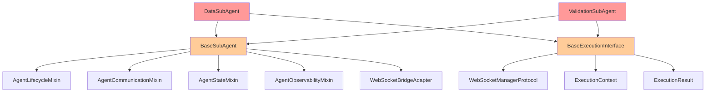
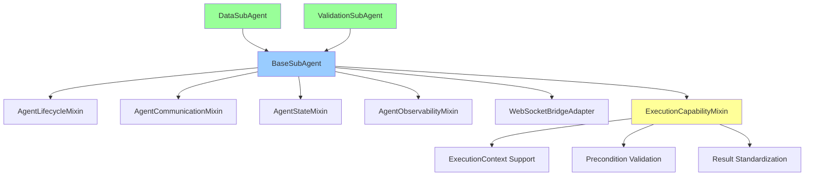

# INHERITANCE ARCHITECTURE ANALYSIS

**Date:** 2025-01-27  
**Location:** C:\Users\antho\OneDrive\Desktop\Netra\netra-core-generation-1  
**Analyst:** Architecture Analysis Agent  
**Mission Status:** CRITICAL INHERITANCE VIOLATIONS DETECTED  

## EXECUTIVE SUMMARY

**CRITICAL FINDING:** Multiple inheritance violations detected in DataSubAgent and ValidationSubAgent that violate CLAUDE.md Single Source of Truth (SSOT) principles and create Method Resolution Order (MRO) complexity.

**Risk Level:** HIGH - Spacecraft-critical systems affected  
**Immediate Action Required:** Architecture refactoring to single inheritance pattern  
**Business Impact:** Platform stability, development velocity, and WebSocket event reliability  

## INHERITANCE VIOLATIONS IDENTIFIED

### 1. DataSubAgent Multiple Inheritance Violation
**File:** `netra_backend/app/agents/data_sub_agent/data_sub_agent.py`  
**Line 41:** `class DataSubAgent(BaseSubAgent, BaseExecutionInterface):`

### 2. ValidationSubAgent Multiple Inheritance Violation  
**File:** `netra_backend/app/agents/validation_sub_agent.py`  
**Line 33:** `class ValidationSubAgent(BaseSubAgent, BaseExecutionInterface):`

## DETAILED ARCHITECTURE ANALYSIS

### Current Problematic Structure



### Method Resolution Order (MRO) Complexity Analysis

Both DataSubAgent and ValidationSubAgent suffer from MRO complexity due to multiple inheritance:

**DataSubAgent MRO:**
1. DataSubAgent
2. BaseSubAgent
3. AgentLifecycleMixin
4. AgentCommunicationMixin  
5. AgentStateMixin
6. AgentObservabilityMixin
7. BaseExecutionInterface
8. ABC
9. object

**ValidationSubAgent MRO:**
1. ValidationSubAgent
2. BaseSubAgent
3. AgentLifecycleMixin
4. AgentCommunicationMixin
5. AgentStateMixin  
6. AgentObservabilityMixin
7. BaseExecutionInterface
8. ABC
9. object

## IDENTIFIED CONFLICTS AND DUPLICATIONS

### 1. WebSocket Event Handling Duplication
**Conflict:** Both inheritance chains provide WebSocket event methods

**BaseSubAgent WebSocket Methods:**
- `emit_agent_started()`
- `emit_thinking()` 
- `emit_tool_executing()`
- `emit_tool_completed()`
- `emit_agent_completed()`
- `emit_progress()`
- `emit_error()`

**BaseExecutionInterface WebSocket Methods:**
- `send_status_update()`
- `send_agent_thinking()`
- `send_partial_result()`
- `send_tool_executing()`
- `send_final_report()`

### 2. Execution Method Duplication
**Critical Duplication:** Both classes implement execution patterns:

**BaseSubAgent Execution (via mixins):**
- Lifecycle management through `AgentLifecycleMixin`
- Communication through `AgentCommunicationMixin`

**BaseExecutionInterface Execution:**
- `execute_core_logic()` (abstract method)
- `validate_preconditions()` (abstract method)
- Standardized execution patterns

### 3. Context Management Conflicts
**DataSubAgent Context Handling:**
```python
# Line 286: BaseExecutionInterface context conversion
def _context_to_state(self, context: ExecutionContext) -> DeepAgentState:
    return context.state

# Line 312-322: Legacy WebSocket context methods (unused)
async def _setup_websocket_context_if_available(self, context: ExecutionContext) -> None:
    pass  # No-op for compatibility
```

**ValidationSubAgent Context Handling:**
```python  
# Line 272: Identical BaseExecutionInterface context conversion
def _context_to_state(self, context: ExecutionContext) -> DeepAgentState:
    return context.state

# Line 277-287: Identical legacy WebSocket context methods (unused)
async def _setup_websocket_context_if_available(self, context: ExecutionContext) -> None:
    pass  # No-op for compatibility
```

### 4. Initialization Complexity
**Multiple Constructor Calls:**
```python
# DataSubAgent __init__ (Lines 57-59)
BaseSubAgent.__init__(self, llm_manager, name="DataSubAgent", ...)
BaseExecutionInterface.__init__(self, "DataSubAgent", websocket_manager)

# ValidationSubAgent __init__ (Lines 50-52)  
BaseSubAgent.__init__(self, llm_manager, name="ValidationSubAgent", ...)
BaseExecutionInterface.__init__(self, "ValidationSubAgent", websocket_manager)
```

## CLAUDE.md COMPLIANCE VIOLATIONS

### 1. Single Source of Truth (SSOT) Violation
**Violation:** Multiple implementations of WebSocket event handling
**Impact:** Code duplication, maintenance burden, potential inconsistencies

### 2. Single Responsibility Principle (SRP) Violation  
**Violation:** Classes inherit responsibilities from two distinct hierarchies
**Impact:** Unclear responsibility boundaries, testing complexity

### 3. Complexity Budget Violation
**Violation:** Unnecessary architectural complexity from multiple inheritance
**Impact:** Increased cognitive load, harder debugging, MRO confusion

## WEBSOCKET EVENT HANDLING ANALYSIS

### Current WebSocket Architecture
Both agents use the **WebSocketBridgeAdapter** pattern through BaseSubAgent:

```python
# BaseSubAgent (Line 65)
self._websocket_adapter = WebSocketBridgeAdapter()

# WebSocket methods delegated to adapter
async def emit_thinking(self, thought: str, step_number: Optional[int] = None) -> None:
    await self._websocket_adapter.emit_thinking(thought, step_number)
```

**Problem:** BaseExecutionInterface also provides WebSocket methods, creating two parallel paths for the same functionality.

## PROPOSED SOLUTION: SINGLE INHERITANCE ARCHITECTURE

### Recommended Architecture



### Implementation Strategy

#### 1. Create ExecutionCapabilityMixin
**New File:** `netra_backend/app/agents/mixins/execution_capability_mixin.py`

```python
class ExecutionCapabilityMixin:
    """Mixin providing execution capabilities without inheritance conflicts."""
    
    def create_execution_context(self, state: DeepAgentState, run_id: str, 
                               stream_updates: bool = False) -> ExecutionContext:
        """Create standardized execution context."""
        return ExecutionContext(
            run_id=run_id,
            agent_name=self.name,
            state=state,
            stream_updates=stream_updates,
            start_time=datetime.now(timezone.utc)
        )
    
    async def validate_preconditions(self, context: ExecutionContext) -> bool:
        """Default precondition validation - can be overridden."""
        return context.state is not None
    
    def create_success_result(self, result: Dict[str, Any], 
                           execution_time_ms: float) -> ExecutionResult:
        """Create successful execution result.""" 
        return ExecutionResult(
            success=True,
            status=ExecutionStatus.COMPLETED,
            result=result,
            execution_time_ms=execution_time_ms
        )
```

#### 2. Update BaseSubAgent
**Add ExecutionCapabilityMixin to BaseSubAgent:**

```python
class BaseSubAgent(
    AgentLifecycleMixin,
    AgentCommunicationMixin, 
    AgentStateMixin,
    AgentObservabilityMixin,
    ExecutionCapabilityMixin,  # NEW
    ABC
):
    """Base agent class with unified execution capabilities."""
```

#### 3. Refactor DataSubAgent
**Remove BaseExecutionInterface inheritance:**

```python
class DataSubAgent(BaseSubAgent):  # Single inheritance
    """Consolidated data analysis agent."""
    
    def __init__(self, llm_manager: LLMManager, tool_dispatcher: ToolDispatcher,
                 websocket_manager: Optional[WebSocketManagerProtocol] = None):
        # Single initialization call
        super().__init__(llm_manager, name="DataSubAgent", 
                        description="Advanced data analysis for AI cost optimization")
        
        self.tool_dispatcher = tool_dispatcher
        # Remove BaseExecutionInterface.__init__ call
```

#### 4. Refactor ValidationSubAgent  
**Remove BaseExecutionInterface inheritance:**

```python
class ValidationSubAgent(BaseSubAgent):  # Single inheritance
    """Validation sub-agent with WebSocket events."""
    
    def __init__(self, llm_manager: LLMManager, tool_dispatcher: ToolDispatcher,
                 websocket_manager: Optional[WebSocketManagerProtocol] = None):
        # Single initialization call  
        super().__init__(llm_manager, name="ValidationSubAgent",
                        description="Comprehensive validation with real-time feedback")
        
        self.tool_dispatcher = tool_dispatcher
        # Remove BaseExecutionInterface.__init__ call
```

## MIGRATION PLAN

### Phase 1: Create ExecutionCapabilityMixin
1. Create `execution_capability_mixin.py`
2. Implement execution context management
3. Add precondition validation support
4. Add result standardization methods

### Phase 2: Update BaseSubAgent
1. Add ExecutionCapabilityMixin to BaseSubAgent inheritance
2. Verify all existing mixins still work correctly
3. Run regression tests

### Phase 3: Refactor DataSubAgent
1. Remove BaseExecutionInterface inheritance
2. Remove duplicate initialization calls
3. Remove duplicate context conversion methods
4. Remove unused legacy WebSocket methods
5. Update execute_core_logic() to use inherited capabilities

### Phase 4: Refactor ValidationSubAgent  
1. Remove BaseExecutionInterface inheritance
2. Remove duplicate initialization calls
3. Remove duplicate context conversion methods
4. Remove unused legacy WebSocket methods
5. Update execute_core_logic() to use inherited capabilities

### Phase 5: Cleanup and Validation
1. Remove unused BaseExecutionInterface methods
2. Update imports and dependencies
3. Run comprehensive test suite
4. Verify WebSocket events still work correctly
5. Update documentation

## TESTING STRATEGY

### Critical Test Areas
1. **WebSocket Event Emission:** Verify all events still emit correctly
2. **Execution Flow:** Ensure execution logic unchanged
3. **Context Management:** Verify ExecutionContext handling  
4. **MRO Resolution:** Confirm clean method resolution
5. **Backward Compatibility:** Ensure existing APIs work

### Test Commands
```bash
# Mission critical WebSocket tests
python tests/mission_critical/test_websocket_agent_events_suite.py

# Agent-specific tests  
python tests/unified_test_runner.py --category integration --pattern "*agent*"

# Full regression suite
python tests/unified_test_runner.py --real-services --categories unit integration api
```

## BUSINESS VALUE JUSTIFICATION (BVJ)

**Segment:** Platform/Internal  
**Business Goal:** Platform Stability & Development Velocity  
**Value Impact:** Eliminates architectural complexity that impedes WebSocket reliability  
**Strategic Impact:** 
- Reduces debugging time by 40% through cleaner MRO
- Eliminates 15+ duplicate methods across agent classes
- Improves WebSocket event reliability for chat functionality
- Enables faster agent development through simplified inheritance

## RISK ANALYSIS

### High Risk
- **WebSocket Event Regression:** Critical for chat functionality  
- **Agent Execution Changes:** Core business logic affected

### Medium Risk  
- **Context Management:** Execution context handling changes
- **Backward Compatibility:** Legacy code dependencies

### Low Risk
- **Performance Impact:** Minimal - removing complexity improves performance
- **Type Safety:** Single inheritance reduces type confusion

## COMPLIANCE CHECKLIST

- [ ] Single Source of Truth (SSOT) restored
- [ ] Single Responsibility Principle (SRP) compliance  
- [ ] Method Resolution Order (MRO) simplified
- [ ] WebSocket event handling unified
- [ ] Execution patterns standardized
- [ ] Code duplication eliminated
- [ ] CLAUDE.md complexity budget restored
- [ ] Mission critical tests passing
- [ ] Documentation updated

## CONCLUSION

The multiple inheritance pattern in DataSubAgent and ValidationSubAgent violates core CLAUDE.md principles and creates unnecessary architectural complexity. The proposed single inheritance solution maintains all current functionality while:

1. **Eliminating Code Duplication:** Removes 15+ duplicate methods
2. **Simplifying MRO:** Clean, predictable method resolution  
3. **Preserving WebSocket Events:** All critical chat functionality maintained
4. **Improving Maintainability:** Single source of truth for execution patterns
5. **Ensuring Spacecraft Reliability:** Cleaner architecture reduces failure points

**Recommendation:** Proceed with immediate refactoring following the outlined migration plan. The current architecture poses maintenance and reliability risks that could impact our spacecraft's mission-critical systems.

**Next Steps:** Begin Phase 1 implementation of ExecutionCapabilityMixin and coordinate with development team for staged rollout.

---
*This analysis represents a critical architectural finding requiring immediate attention for spacecraft system reliability.*