# Netra Apex Platform - Investor Overview Diagrams

## 1. Business Value Architecture - Revenue Generation Model

```mermaid
graph TB
    subgraph "Customer Segments & Revenue Streams"
        Free["🆓 Free Tier<br/>• Basic AI spend tracking<br/>• Limited insights<br/>• 1 user"]
        Early["🌱 Early Stage<br/>$99-499/mo<br/>• Advanced analytics<br/>• 5 users<br/>• Basic optimization"]
        Mid["🚀 Mid-Market<br/>$500-2999/mo<br/>• Full optimization<br/>• 25 users<br/>• Custom agents"]
        Enterprise["🏢 Enterprise<br/>$3000+/mo<br/>• Unlimited users<br/>• Custom deployment<br/>• SLA guarantees"]
    end

    subgraph "Value Capture Mechanism"
        AISpend["Customer AI Spend<br/>$10K-1M+/mo"]
        Optimization["Cost Optimization<br/>15-40% savings"]
        ValueCapture["Netra Revenue<br/>10-20% of savings"]
    end

    subgraph "Platform Capabilities"
        Analytics["Real-time Analytics"]
        Agents["Multi-Agent AI System"]
        DataPlatform["Unified Data Platform"]
        Insights["Actionable Insights"]
    end

    Free -->|"Conversion 15%"| Early
    Early -->|"Expansion 30%"| Mid
    Mid -->|"Growth 20%"| Enterprise
    
    AISpend --> Optimization
    Optimization --> ValueCapture
    
    Analytics --> Insights
    Agents --> Insights
    DataPlatform --> Insights
    Insights --> Optimization

    style Free fill:#e1f5fe
    style Early fill:#c8e6c9
    style Mid fill:#fff9c4
    style Enterprise fill:#ffccbc
    style ValueCapture fill:#d4edda,stroke:#28a745,stroke-width:3px
```

## 2. Core Platform Architecture - Multi-Agent AI System

```mermaid
graph LR
    subgraph "User Interface Layer"
        WebUI["Web Interface<br/>Real-time Chat"]
        API["REST API"]
        WebSocket["WebSocket<br/>Live Updates"]
    end

    subgraph "AI Agent Orchestration"
        Supervisor["🧠 Supervisor Agent<br/>• Request routing<br/>• Context management<br/>• Quality control"]
        
        subgraph "Specialized Agents"
            Triage["🎯 Triage Agent<br/>Intent Detection"]
            Data["📊 Data Agent<br/>Analytics & Metrics"]
            Optimization["⚡ Optimization Agent<br/>Cost Reduction"]
            Corpus["📚 Corpus Agent<br/>Knowledge Base"]
            Discovery["🔍 Discovery Agent<br/>Tool Selection"]
        end
    end

    subgraph "Data Infrastructure"
        PostgreSQL["PostgreSQL<br/>Transactional Data"]
        ClickHouse["ClickHouse<br/>Time-series Analytics"]
        Redis["Redis<br/>Caching & Sessions"]
        VectorDB["Vector DB<br/>Semantic Search"]
    end

    subgraph "External Integrations"
        LLMProviders["LLM Providers<br/>• OpenAI<br/>• Anthropic<br/>• Google"]
        CloudProviders["Cloud Platforms<br/>• AWS<br/>• GCP<br/>• Azure"]
        MonitoringTools["Monitoring<br/>• DataDog<br/>• New Relic"]
    end

    WebUI --> WebSocket
    WebSocket --> Supervisor
    API --> Supervisor
    
    Supervisor --> Triage
    Triage --> Data
    Triage --> Optimization
    Triage --> Corpus
    Triage --> Discovery
    
    Data --> PostgreSQL
    Data --> ClickHouse
    Optimization --> Redis
    Corpus --> VectorDB
    
    Supervisor --> LLMProviders
    Data --> CloudProviders
    Optimization --> MonitoringTools

    style Supervisor fill:#fff3e0,stroke:#ff6f00,stroke-width:3px
    style WebSocket fill:#e8eaf6,stroke:#3f51b5,stroke-width:2px
```

## 3. Competitive Advantage - Technology Differentiators

```mermaid
graph TD
    subgraph "Unique Technology Stack"
        MultiAgent["🤖 Multi-Agent Architecture<br/>• Parallel processing<br/>• Specialized expertise<br/>• 10x faster analysis"]
        
        RealTime["⚡ Real-time Processing<br/>• WebSocket streaming<br/>• Sub-second latency<br/>• Live optimization"]
        
        AIFactory["🏭 AI Factory Pattern<br/>• Request isolation<br/>• Multi-tenant safety<br/>• Infinite scalability"]
        
        SelfHealing["🔧 Self-Healing System<br/>• Circuit breakers<br/>• Auto-recovery<br/>• 99.9% uptime"]
    end

    subgraph "Market Differentiators"
        Speed["10x Faster<br/>than competitors"]
        Cost["50% Lower TCO<br/>via optimization"]
        Scale["1000+ concurrent<br/>users supported"]
        Accuracy["95% prediction<br/>accuracy"]
    end

    subgraph "Competitive Moat"
        DataMoat["📊 Data Network Effects<br/>More users = Better models"]
        AgentMoat["🧠 Agent Training<br/>Proprietary algorithms"]
        IntegrationMoat["🔌 Deep Integrations<br/>150+ tool connectors"]
    end

    MultiAgent --> Speed
    RealTime --> Speed
    AIFactory --> Scale
    SelfHealing --> Scale
    
    Speed --> DataMoat
    Cost --> AgentMoat
    Scale --> IntegrationMoat
    Accuracy --> DataMoat

    style MultiAgent fill:#e3f2fd,stroke:#1976d2,stroke-width:2px
    style DataMoat fill:#f3e5f5,stroke:#7b1fa2,stroke-width:3px
```

## 4. Scalability & Growth Architecture

```mermaid
graph TB
    subgraph "Current Scale"
        Users1["100 Users"]
        Revenue1["$50K MRR"]
        Data1["1TB Data"]
    end

    subgraph "6 Month Target"
        Users2["1,000 Users"]
        Revenue2["$500K MRR"]
        Data2["10TB Data"]
    end

    subgraph "12 Month Vision"
        Users3["10,000 Users"]
        Revenue3["$5M MRR"]
        Data3["100TB Data"]
    end

    subgraph "Technical Scaling"
        Horizontal["Horizontal Scaling<br/>• Kubernetes orchestration<br/>• Auto-scaling pods<br/>• Load balancing"]
        Database["Database Sharding<br/>• Partition by tenant<br/>• Read replicas<br/>• Connection pooling"]
        Caching["Multi-layer Caching<br/>• Redis clusters<br/>• CDN distribution<br/>• Edge computing"]
    end

    Users1 -->|"10x growth"| Users2
    Users2 -->|"10x growth"| Users3
    Revenue1 -->|"10x growth"| Revenue2
    Revenue2 -->|"10x growth"| Revenue3
    Data1 -->|"10x growth"| Data2
    Data2 -->|"10x growth"| Data3

    Users2 --> Horizontal
    Revenue2 --> Database
    Data2 --> Caching

    style Users3 fill:#c8e6c9,stroke:#2e7d32,stroke-width:3px
    style Revenue3 fill:#fff9c4,stroke:#f57c00,stroke-width:3px
```

## 5. Security & Compliance Architecture

```mermaid
graph LR
    subgraph "Security Layers"
        Auth["🔐 Authentication<br/>• OAuth 2.0<br/>• JWT tokens<br/>• MFA support"]
        Isolation["🛡️ Tenant Isolation<br/>• Request scoping<br/>• Data segregation<br/>• Context boundaries"]
        Encryption["🔒 Encryption<br/>• AES-256 at rest<br/>• TLS 1.3 in transit<br/>• Key rotation"]
    end

    subgraph "Compliance"
        SOC2["SOC2 Type II<br/>(In Progress)"]
        GDPR["GDPR Compliant<br/>Data privacy"]
        HIPAA["HIPAA Ready<br/>(Roadmap)"]
    end

    subgraph "Monitoring"
        Audit["Audit Logging<br/>All actions tracked"]
        Anomaly["Anomaly Detection<br/>ML-based threats"]
        Alerts["Real-time Alerts<br/>Security incidents"]
    end

    Auth --> Isolation
    Isolation --> Encryption
    
    Encryption --> SOC2
    Encryption --> GDPR
    Encryption --> HIPAA
    
    Audit --> Anomaly
    Anomaly --> Alerts
    
    Isolation --> Audit

    style Auth fill:#ffebee,stroke:#c62828,stroke-width:2px
    style SOC2 fill:#e8f5e9,stroke:#2e7d32,stroke-width:2px
```

## 6. Data Flow & Intelligence Pipeline

```mermaid
graph TD
    subgraph "Data Ingestion"
        APIs["API Integrations<br/>• 150+ connectors<br/>• Real-time sync<br/>• Batch processing"]
        Streaming["Event Streaming<br/>• Kafka/Kinesis<br/>• WebSocket feeds<br/>• Webhooks"]
    end

    subgraph "Processing Layer"
        ETL["ETL Pipeline<br/>• Data validation<br/>• Transformation<br/>• Enrichment"]
        ML["ML Processing<br/>• Anomaly detection<br/>• Pattern recognition<br/>• Predictive models"]
    end

    subgraph "Intelligence Generation"
        Analytics["Analytics Engine<br/>• Cost analysis<br/>• Usage patterns<br/>• Performance metrics"]
        Recommendations["AI Recommendations<br/>• Optimization strategies<br/>• Cost savings<br/>• Efficiency gains"]
    end

    subgraph "Value Delivery"
        Dashboard["Executive Dashboard<br/>Real-time KPIs"]
        Reports["Automated Reports<br/>Daily/Weekly/Monthly"]
        Alerts["Smart Alerts<br/>Threshold breaches"]
        Actions["Automated Actions<br/>Cost optimization"]
    end

    APIs --> ETL
    Streaming --> ETL
    ETL --> ML
    ML --> Analytics
    Analytics --> Recommendations
    
    Recommendations --> Dashboard
    Recommendations --> Reports
    Recommendations --> Alerts
    Recommendations --> Actions

    style Recommendations fill:#fff3e0,stroke:#ff6f00,stroke-width:3px
    style Actions fill:#e8f5e9,stroke:#4caf50,stroke-width:2px
```

## 7. Go-to-Market Strategy & Customer Journey

```mermaid
graph LR
    subgraph "Acquisition"
        Marketing["Marketing<br/>• Content/SEO<br/>• Product-led growth<br/>• Developer communities"]
        Trial["Free Trial<br/>14 days full access"]
    end

    subgraph "Activation"
        Onboarding["Onboarding<br/>• 5-min setup<br/>• Auto-discovery<br/>• Instant value"]
        FirstValue["First Value<br/>• Cost visibility<br/>• Quick wins<br/>• Aha moment"]
    end

    subgraph "Revenue"
        Convert["Conversion<br/>• Usage limits<br/>• Feature gates<br/>• Value demonstration"]
        Expand["Expansion<br/>• Seat growth<br/>• Feature upsell<br/>• Usage increase"]
    end

    subgraph "Retention"
        Success["Customer Success<br/>• Quarterly reviews<br/>• Best practices<br/>• Training"]
        Community["Community<br/>• User forums<br/>• Feature requests<br/>• Case studies"]
    end

    Marketing --> Trial
    Trial --> Onboarding
    Onboarding --> FirstValue
    FirstValue --> Convert
    Convert --> Expand
    Expand --> Success
    Success --> Community
    Community -->|"Referrals"| Marketing

    style FirstValue fill:#e3f2fd,stroke:#1976d2,stroke-width:2px
    style Convert fill:#c8e6c9,stroke:#4caf50,stroke-width:3px
```

## Key Investment Highlights

### 🚀 **Market Opportunity**
- **$15B** AI infrastructure management market by 2025
- **45% CAGR** in AI spending optimization tools
- **Critical need** as companies scale AI usage

### 💎 **Competitive Advantages**
1. **Multi-Agent AI Architecture** - 10x faster than traditional solutions
2. **Real-time Processing** - Sub-second insights vs batch processing
3. **Network Effects** - More users improve ML models for everyone
4. **Deep Integrations** - 150+ pre-built connectors

### 📈 **Traction & Growth**
- **100 active customers** across free and paid tiers
- **$50K MRR** with 30% month-over-month growth
- **15% free-to-paid conversion** rate
- **120% net revenue retention** from expansions

### 🎯 **Use of Funds**
- **40%** Engineering (scale multi-agent system)
- **30%** Sales & Marketing (enterprise go-to-market)
- **20%** Customer Success (ensure retention)
- **10%** Operations & Infrastructure

### 🏆 **Why Now?**
1. **AI spending explosion** - Companies need cost control
2. **Technology maturity** - LLMs enable intelligent automation
3. **Market timing** - Early in the optimization tool adoption curve
4. **Team expertise** - Deep experience in AI, enterprise software, and scaling