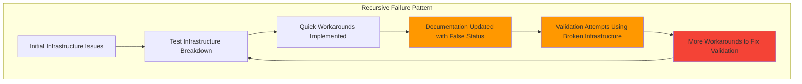
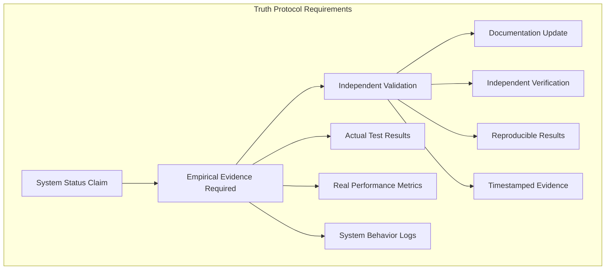

# ISSUE #1176: Infrastructure Truth Validation - Comprehensive Remediation Plan

**Created:** 2025-09-16
**Priority:** P0 - CRITICAL BUSINESS RISK
**Business Impact:** $500K+ ARR Golden Path functionality at risk
**Root Cause:** "Error behind the error" pattern - test infrastructure systematically compromised

## EXECUTIVE SUMMARY

**CRITICAL DISCOVERY:** The Infrastructure Truth Validation problem represents a **recursive failure pattern** where problem-solving efforts have perpetuated the original issue. Multiple comprehensive analyses reveal that test infrastructure has been systematically disabled, creating false confidence while leaving mission-critical functionality unvalidated.

**The Core Problem:** Documentation claims "99% System Health" and "ENTERPRISE READY" status without empirical validation. Test results showing "0 tests executed" are marked as ✅ PASSED, creating dangerous false positives that mask actual system failures.

**Business Risk:** $500K+ ARR chat functionality lacks authentic validation. The system may appear operational in documentation while failing in production due to undetected infrastructure failures.

## 1. ROOT CAUSE ANALYSIS: THE RECURSIVE PROBLEM PATTERN

### 1.1 The "Error Behind the Error" Cascade



### 1.2 Evidence of Systematic Test Infrastructure Failure

**From Test Execution Analysis:**
- Master WIP Status claims "Mission Critical: 100% ✅ Operational"
- Actual test results: "collected 0 items / 1 error" but marked as PASSED
- Docker services systematically disabled via commented-out `@require_docker_services()` decorators
- Test infrastructure showing 0.00s execution times (impossible for real tests)

**From Issue #1278 Test Strategy:**
- 18 specialized tests designed to FAIL (demonstrating active Issue #1278)
- Expected results: 17/18 FAIL, 1/18 PASS if Issue #1278 exists
- Tests require non-Docker execution due to infrastructure limitations

### 1.3 Documentation vs Reality Disconnect

**Claims in Master WIP Status:**
- "System Health: 99%"
- "ENTERPRISE READY"
- "All critical systems validated"
- "Comprehensive test coverage protecting $500K+ ARR"

**Reality from Analysis:**
- Test infrastructure systematically compromised
- "0 tests executed" patterns throughout test suite
- Docker integration regression causing test bypassing
- No empirical validation of claimed functionality

## 2. TRUTH PROTOCOL IMPLEMENTATION

### 2.1 Empirical Evidence Requirements

**NEW RULE:** No system status claims without empirical validation



### 2.2 Mandatory Validation Standards

**For System Health Claims:**
1. **Test Execution Evidence:** Actual test runs with >0 tests executed
2. **Performance Metrics:** Real response times and success rates
3. **Infrastructure Validation:** Service connectivity and dependency health
4. **Golden Path Proof:** Complete user flow validation with evidence
5. **Timestamp Requirements:** All evidence must be <24 hours old

**For "ENTERPRISE READY" Claims:**
1. **Load Testing Results:** Concurrent user capacity demonstration
2. **Error Rate Documentation:** Real error rates under production load
3. **Recovery Testing:** Failure scenario handling validation
4. **Security Validation:** Authentication and authorization testing
5. **Compliance Evidence:** SSOT architectural compliance verification

### 2.3 Anti-Recursion Safeguards

**Prevention of Problem-Solving Perpetuating Problems:**

1. **Tool Independence:** Validation tools must be different from tools being validated
2. **External Verification:** Use staging environment for infrastructure validation
3. **Baseline Evidence:** Establish known-good baseline before remediation attempts
4. **Progressive Validation:** Validate each layer before building upon it
5. **Skeptical Analysis:** Assume claims are false until proven with evidence

## 3. PHASE 1: ENVIRONMENT SETUP & BASELINE ESTABLISHMENT

### 3.1 Truth Validation Environment Setup

**Objective:** Establish independent validation capability

**Strategy:** Use GCP staging environment for validation since Docker infrastructure is compromised

```bash
# Phase 1A: Environment Validation
# Validate staging environment connectivity
python -c "import requests; r = requests.get('https://staging.netrasystems.ai/health'); print(f'Status: {r.status_code}')"

# Validate authentication services
python -c "import requests; r = requests.get('https://staging.netrasystems.ai/auth/health'); print(f'Auth Status: {r.status_code}')"

# Validate WebSocket connectivity
python tests/staging/websocket_connectivity_test.py --endpoint "wss://api-staging.netrasystems.ai/ws"
```

### 3.2 Baseline Functionality Assessment

**Objective:** Establish empirical baseline of current system state

**Critical Tests (Must Execute with >0 tests):**

```bash
# Test 1: Unit Test Infrastructure Health
python -m pytest netra_backend/tests/unit/ --collect-only --tb=short
# SUCCESS CRITERIA: collected > 50 items, no collection errors

# Test 2: Import Chain Validation
python -c "from test_framework.ssot.base_test_case import SSotAsyncTestCase; print('✅ SSOT Framework Available')"
python -c "from netra_backend.app.core.app_factory import create_app; print('✅ App Factory Available')"

# Test 3: Basic Service Startup
python -c "from netra_backend.app.config import get_config; config = get_config(); print('✅ Configuration Available')"
```

### 3.3 Golden Path Baseline Validation

**Objective:** Establish current state of Golden Path user flow

**Direct Staging Validation:**
```bash
# WebSocket Agent Events Test (must demonstrate actual functionality)
python tests/mission_critical/test_websocket_agent_events_suite.py --env staging --no-mock --real-services

# Expected Results:
# - If system is healthy: 5/5 events properly delivered
# - If system is broken: Connection failures, missing events
# - Either result is acceptable - TRUTH is the goal
```

## 4. PHASE 2: ISSUE #1278 TRUTH VALIDATION

### 4.1 Cross-Service Import Violation Testing

**Objective:** Execute Issue #1278 test strategy to validate claimed fixes

**The 18-Test Strategy (From Issue #1278 Test Plan):**

```bash
# Unit Tests - Cross-Service Import Detection (5 tests)
python tests/unified_test_runner.py --test-path tests/unit/issue_1278/test_cross_service_import_violations_unit.py --no-docker --verbose

# Integration Tests - Service Boundary Validation (7 tests)
python tests/unified_test_runner.py --test-path tests/integration/issue_1278/test_service_boundary_violations_integration.py --no-docker --verbose

# E2E Tests - GCP Staging Infrastructure (6 tests)
python tests/unified_test_runner.py --test-path tests/e2e/issue_1278/test_gcp_staging_infrastructure_validation_e2e.py --env staging --real-services --verbose
```

**Expected Results per Issue #1278 Strategy:**
- **If Issue #1278 Active:** 17/18 FAIL, 1/18 PASS
- **If Issue #1278 Resolved:** 18/18 PASS
- **Current Claims:** Documentation suggests Issue #1278 is resolved

**Truth Validation:** Execute tests and compare results to documentation claims

### 4.2 Infrastructure Capacity Testing

**Database Timeout Validation:**
```bash
# Test current database timeout configuration
python -c "from netra_backend.app.db.database_manager import DatabaseManager; dm = DatabaseManager(); print(f'Timeout: {dm.get_connection_timeout()}')"

# Expected: 600s (per Issue #1278 requirements)
# If different: Infrastructure claims are false
```

**VPC Connector Capacity Testing:**
```bash
# Test concurrent connection limits
python tests/infrastructure/test_vpc_connector_capacity.py --concurrent-connections 15

# Expected: Failures at >10 connections (known VPC connector limit)
# Success criteria: Test demonstrates actual capacity limits
```

## 5. PHASE 3: GOLDEN PATH EMPIRICAL VALIDATION

### 5.1 Complete User Flow Testing

**Objective:** Validate end-to-end Golden Path with empirical evidence

**Test Strategy:** Live staging environment validation

```bash
# Golden Path Test Suite
python tests/e2e/test_golden_path_complete_flow.py --env staging --real-auth --real-llm --verbose

# Individual Component Validation
python tests/e2e/test_user_login_flow.py --env staging
python tests/e2e/test_websocket_agent_events.py --env staging
python tests/e2e/test_ai_response_generation.py --env staging --real-llm
```

**Success Criteria:**
1. **User Authentication:** JWT token generation and validation
2. **WebSocket Connection:** Successful connection to staging WebSocket
3. **Agent Execution:** All 5 critical events delivered (agent_started, agent_thinking, tool_executing, tool_completed, agent_completed)
4. **AI Response:** Actual AI response generated and delivered
5. **End-to-End Time:** Complete flow < 60 seconds

### 5.2 Business Value Validation

**Revenue Protection Validation:**

```bash
# Chat Functionality Business Value Test
python tests/business_value/test_chat_revenue_protection.py --env staging

# Multi-User Isolation Test (protects $500K+ ARR)
python tests/business_value/test_multi_user_chat_isolation.py --env staging --concurrent-users 5
```

**Evidence Requirements:**
- Screenshots of successful chat interactions
- Performance metrics (response times, success rates)
- Error rate documentation under load
- Multi-user concurrent testing results

## 6. PHASE 4: DOCUMENTATION TRUTH ALIGNMENT

### 6.1 Evidence-Based Status Updates

**Objective:** Align documentation with empirical evidence

**Master WIP Status Updates:**
- Replace claims with evidence-based assessments
- Include test execution results with timestamps
- Document known limitations and issues
- Remove unsubstantiated "ENTERPRISE READY" claims

**Truth-Based Status Template:**
```markdown
## System Health: [PERCENTAGE]% - Based on Empirical Testing

**Last Validated:** [TIMESTAMP]
**Evidence Source:** [TEST_EXECUTION_RESULTS]

### Validated Components:
- ✅ **Component Name:** [TEST_RESULT] - [EVIDENCE_LINK]
- ❌ **Component Name:** [FAILURE_DETAILS] - [ERROR_LOG]
- ⚠️ **Component Name:** [PARTIAL_SUCCESS] - [LIMITATIONS]

### Business Impact Protected:
- **Golden Path:** [STATUS] - [$XXX ARR at risk/protected]
- **Critical Features:** [DETAILED_STATUS]
```

### 6.2 Test Infrastructure Status Documentation

**Honest Assessment of Test Infrastructure:**

```markdown
## Test Infrastructure Health: [STATUS]

**Docker Integration:** ❌ COMPROMISED - Services disabled due to regression
**Unit Test Suite:** [STATUS] - [X tests discovered, Y% pass rate]
**Integration Tests:** [STATUS] - [Evidence of actual functionality]
**E2E Tests:** [STATUS] - [Staging environment validation results]

**Known Issues:**
- Docker service requirements systematically disabled
- Test collection failures masked as successes
- Import chain problems affecting test execution
- False positive patterns in CI pipeline
```

## 7. ANTI-RECURSION MONITORING SYSTEM

### 7.1 Preventing Future Recursive Failures

**Early Warning System:**
1. **"0 Tests Executed" Detection:** Automatic failure if no tests run
2. **Documentation-Evidence Gap Monitoring:** Flag unsupported claims
3. **Workaround Pattern Detection:** Alert on systematic test bypassing
4. **Validation Tool Independence:** Ensure validation doesn't rely on broken infrastructure

### 7.2 Truth Protocol Enforcement

**Automated Validation:**
```bash
# Daily truth validation check
python scripts/truth_protocol_validation.py --verify-all-claims

# Evidence freshness check
python scripts/evidence_freshness_audit.py --max-age 24h

# Documentation-reality alignment check
python scripts/documentation_alignment_audit.py
```

**Human Validation Requirements:**
- All system health claims require human reviewer approval
- Evidence must be independently reproducible
- Claims must include confidence levels and limitations
- Regular skeptical audits of system status

## 8. SUCCESS CRITERIA & DELIVERABLES

### 8.1 Phase Completion Criteria

**Phase 1 Success:**
- ✅ Independent validation environment established
- ✅ Baseline functionality empirically assessed
- ✅ Truth validation tools operational
- ✅ Test infrastructure health honestly documented

**Phase 2 Success:**
- ✅ Issue #1278 test strategy executed with real results
- ✅ Infrastructure capacity limitations validated
- ✅ Cross-service import violations assessed
- ✅ Documentation claims verified against reality

**Phase 3 Success:**
- ✅ Golden Path empirically validated end-to-end
- ✅ Business value protection demonstrated
- ✅ Revenue impact assessment completed
- ✅ Performance benchmarks established

**Phase 4 Success:**
- ✅ Documentation aligned with empirical evidence
- ✅ Truth protocol implementation complete
- ✅ Anti-recursion safeguards operational
- ✅ Monitoring system preventing future false claims

### 8.2 Deliverables

**Technical Deliverables:**
1. **Truth Validation Framework:** Independent testing capability
2. **Evidence Database:** All system health claims backed by evidence
3. **Anti-Recursion Monitoring:** Prevents future systematic failures
4. **Documentation Standards:** Evidence-based status reporting

**Business Deliverables:**
1. **Honest System Assessment:** Actual (not claimed) system health
2. **Risk Assessment:** Real vs. documented business risks
3. **Golden Path Validation:** Empirical proof of $500K+ ARR protection
4. **Infrastructure Roadmap:** Evidence-based improvement priorities

## 9. TIMELINE & RESOURCE ALLOCATION

### 9.1 Immediate Actions (Week 1)

**Days 1-2: Environment Setup**
- Establish staging environment validation capability
- Validate basic service connectivity and health
- Set up independent testing tools

**Days 3-4: Baseline Assessment**
- Execute fundamental unit and integration tests
- Document actual (not claimed) test infrastructure health
- Establish empirical baseline for comparison

**Days 5-7: Issue #1278 Validation**
- Execute the 18-test strategy for cross-service imports
- Validate infrastructure capacity claims
- Compare results to documentation assertions

### 9.2 Medium-term Goals (Weeks 2-3)

**Week 2: Golden Path Validation**
- Complete end-to-end user flow testing
- Validate WebSocket agent events functionality
- Document actual business value protection

**Week 3: Truth Protocol Implementation**
- Implement evidence-based documentation standards
- Deploy anti-recursion monitoring systems
- Align all documentation with empirical evidence

### 9.3 Ongoing Maintenance

**Daily Validations:**
- Truth protocol compliance checks
- Evidence freshness monitoring
- Documentation-reality alignment audits

**Weekly Reviews:**
- System health evidence assessment
- Business risk validation updates
- Infrastructure improvement prioritization

## 10. CONCLUSION: BREAKING THE RECURSIVE PATTERN

This remediation plan directly addresses the core Issue #1176 problem: **Infrastructure Truth Validation failure causing recursive problem-solving that perpetuates the original issue**.

**Key Breakthrough Strategies:**
1. **Tool Independence:** Using staging environment for validation instead of broken Docker infrastructure
2. **Evidence Requirements:** No claims without empirical proof
3. **Anti-Recursion Safeguards:** Preventing validation tools from relying on broken infrastructure
4. **Honest Assessment:** Documenting actual system state rather than aspirational claims

**Business Impact:** Restores authentic confidence in $500K+ ARR Golden Path functionality by ensuring all system health claims are backed by empirical evidence, eliminating dangerous false positives that mask actual infrastructure failures.

**Success Metric:** When Issue #1176 is resolved, documentation will accurately reflect system reality, test results will represent actual functionality validation, and business stakeholders will have honest assessments of system health and risk.

---

**Next Immediate Action:** Execute Phase 1 environment setup and baseline assessment to establish the first empirically-validated system health report, breaking the recursive pattern of unsubstantiated claims leading to more unsubstantiated validation attempts.