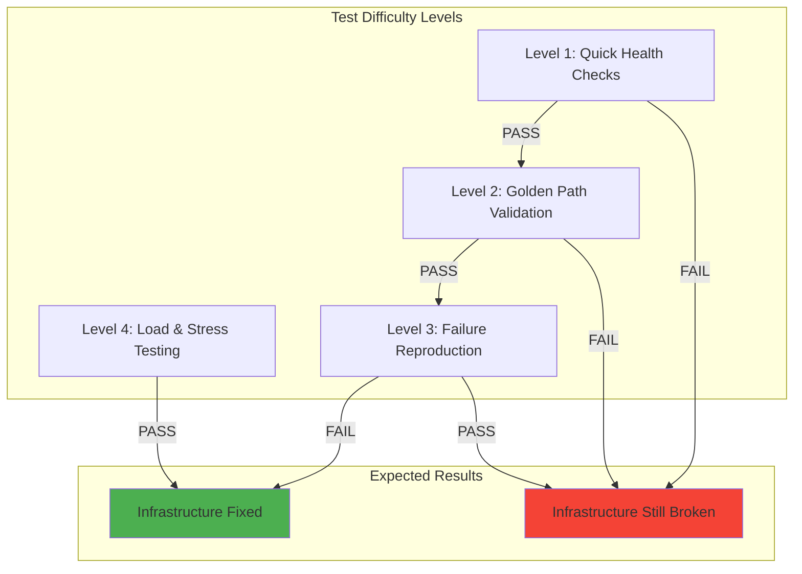
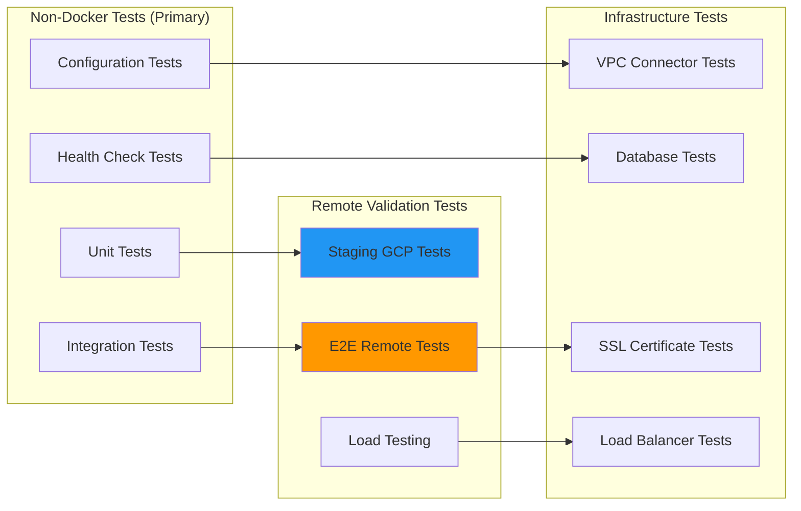
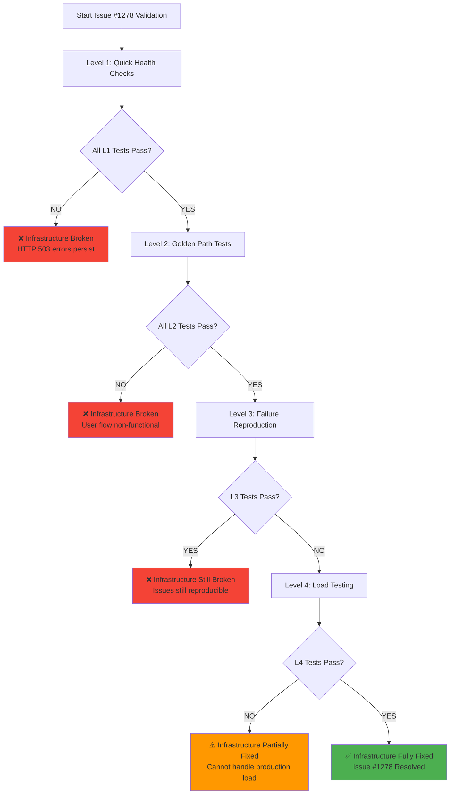
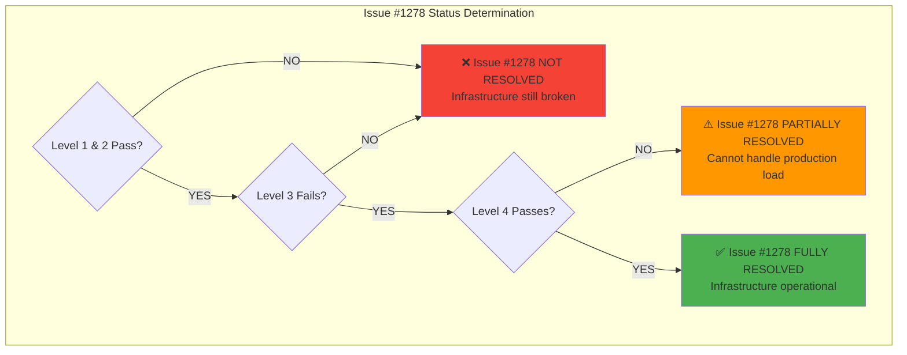

# Issue #1278 - Comprehensive Infrastructure Validation Test Plan

**Date**: 2025-09-16
**Issue**: #1278 - GCP Infrastructure Connectivity Problems (P0 Critical)
**Business Impact**: $500K+ ARR pipeline blocked due to staging environment HTTP 503 failures
**Test Strategy**: Multi-tiered validation to definitively determine infrastructure operational status

## Executive Summary

This comprehensive test plan creates definitive validation for Issue #1278 infrastructure fixes through **non-Docker focused testing** as specified in the CLAUDE.md process. The tests are designed to provide clear **PASS/FAIL** answers to the critical question: **"Is Issue #1278 actually resolved or are there still blocking infrastructure problems?"**

### Test Strategy Overview



### Critical Infrastructure Components Under Test

1. **VPC Connector Capacity** - Staging-connector operational status
2. **Cloud SQL Connectivity** - 600s timeout requirement compliance
3. **Load Balancer Configuration** - SSL certificates and health checks
4. **Golden Path User Flow** - End-to-end login → AI responses
5. **HTTP 503 Error Resolution** - Confirmation of service availability

---

## Test Plan Architecture

### Test Categories by Execution Method



---

## Level 1: Quick Health Check Tests (5-10 minutes)

**Purpose**: Immediate validation of basic infrastructure components
**Execution**: Can run without Docker or complex setup
**Success Criteria**: All tests PASS = Infrastructure likely working

### Test Suite 1.1: Basic Connectivity Validation

```python
# tests/unit/issue_1278_infrastructure_health_checks.py
"""
Level 1: Quick health checks for Issue #1278 infrastructure validation.
These tests should complete in under 10 minutes and require no Docker.
"""
import pytest
import asyncio
import httpx
from typing import Dict, List
import time
from datetime import datetime

class InfrastructureHealthValidator:
    """Quick health checks for Issue #1278 infrastructure components."""

    def __init__(self):
        self.staging_domains = {
            "backend": "https://staging.netrasystems.ai",
            "auth": "https://auth.staging.netrasystems.ai",
            "api": "https://api-staging.netrasystems.ai"
        }
        self.timeout_settings = {
            "connection_timeout": 10.0,
            "read_timeout": 30.0,
            "health_check_timeout": 15.0
        }

@pytest.mark.issue_1278
@pytest.mark.infrastructure
class TestLevel1QuickHealthChecks:
    """Level 1: Quick infrastructure health validation."""

    def test_staging_domain_ssl_certificates(self):
        """Validate SSL certificates for *.netrasystems.ai domains."""
        validator = InfrastructureHealthValidator()

        for service, url in validator.staging_domains.items():
            with httpx.Client(timeout=validator.timeout_settings["connection_timeout"]) as client:
                try:
                    # Test SSL certificate validity
                    response = client.get(f"{url}/health", verify=True)

                    # PASS criteria: SSL connection succeeds (regardless of HTTP status)
                    assert response is not None, f"SSL connection failed for {service}: {url}"

                    # Log certificate details for validation
                    print(f"✅ SSL Certificate OK for {service}: {url}")

                except httpx.SSLError as e:
                    pytest.fail(f"❌ SSL Certificate FAILED for {service}: {url} - {e}")
                except httpx.ConnectError as e:
                    pytest.fail(f"❌ Connection FAILED for {service}: {url} - {e}")

    def test_basic_http_connectivity(self):
        """Test basic HTTP connectivity without authentication."""
        validator = InfrastructureHealthValidator()

        for service, url in validator.staging_domains.items():
            with httpx.Client(timeout=30.0) as client:
                start_time = time.time()
                try:
                    # Test basic connectivity
                    response = client.get(f"{url}/health")
                    connection_time = time.time() - start_time

                    # PASS criteria: NOT HTTP 503 (any other response indicates infrastructure working)
                    assert response.status_code != 503, f"HTTP 503 Service Unavailable for {service}: {url}"

                    # Log response details
                    print(f"✅ HTTP Response {response.status_code} for {service} in {connection_time:.2f}s")

                    # Warn on slow responses (but don't fail)
                    if connection_time > 10.0:
                        print(f"⚠️ SLOW RESPONSE: {service} took {connection_time:.2f}s")

                except httpx.TimeoutException:
                    pytest.fail(f"❌ TIMEOUT: {service} health check exceeded 30s")
                except httpx.ConnectError as e:
                    pytest.fail(f"❌ CONNECTION ERROR: {service} - {e}")

    def test_load_balancer_health_checks(self):
        """Validate load balancer is properly routing requests."""
        validator = InfrastructureHealthValidator()

        # Test multiple requests to check load balancer consistency
        for service, url in validator.staging_domains.items():
            response_codes = []
            response_times = []

            for i in range(5):  # 5 quick requests
                with httpx.Client(timeout=15.0) as client:
                    start_time = time.time()
                    try:
                        response = client.get(f"{url}/health")
                        response_time = time.time() - start_time

                        response_codes.append(response.status_code)
                        response_times.append(response_time)

                    except Exception as e:
                        response_codes.append(0)  # Connection failure
                        response_times.append(15.0)  # Max timeout

            # PASS criteria: Consistent responses (not all 503 or timeouts)
            non_503_responses = [code for code in response_codes if code != 503 and code != 0]
            assert len(non_503_responses) >= 2, f"❌ Load balancer failing for {service}: {response_codes}"

            avg_response_time = sum(response_times) / len(response_times)
            print(f"✅ Load balancer OK for {service}: {response_codes}, avg {avg_response_time:.2f}s")

    def test_vpc_connector_basic_validation(self):
        """Basic validation that VPC connector is allowing connections."""
        validator = InfrastructureHealthValidator()

        # Test that we can establish connections to Cloud Run services
        # This indirectly validates VPC connector functionality

        successful_connections = 0
        total_attempts = 0

        for service, url in validator.staging_domains.items():
            total_attempts += 1

            try:
                with httpx.Client(timeout=20.0) as client:
                    # Try to establish connection
                    response = client.get(f"{url}/health")

                    # Any response (even error) means VPC connector working
                    if response.status_code in [200, 500, 404, 401, 403]:
                        successful_connections += 1
                        print(f"✅ VPC connector allows connection to {service}: HTTP {response.status_code}")
                    elif response.status_code == 503:
                        print(f"⚠️ Service unavailable for {service} (may indicate VPC issues)")

            except httpx.ConnectTimeout:
                print(f"❌ Connection timeout for {service} (VPC connector likely saturated)")
            except httpx.ConnectError as e:
                print(f"❌ Connection error for {service}: {e}")

        # PASS criteria: At least 1 service responsive (VPC connector working)
        assert successful_connections >= 1, f"❌ VPC connector appears non-functional: {successful_connections}/{total_attempts} connections successful"

        if successful_connections == total_attempts:
            print(f"✅ VPC connector fully operational: {successful_connections}/{total_attempts}")
        else:
            print(f"⚠️ VPC connector partially operational: {successful_connections}/{total_attempts}")
```

### Test Suite 1.2: Configuration Validation

```python
# tests/unit/issue_1278_configuration_validation.py
"""
Level 1: Configuration validation for Issue #1278 database timeout requirements.
"""
import pytest
from netra_backend.app.core.configuration.database import DatabaseConfig
from netra_backend.app.core.database_timeout_config import DatabaseTimeoutConfig

@pytest.mark.issue_1278
@pytest.mark.configuration
class TestLevel1ConfigurationValidation:
    """Level 1: Validate configuration meets Issue #1278 requirements."""

    def test_database_timeout_configuration_issue_1278(self):
        """Validate database timeout configuration meets 600s requirement."""

        # Test that database timeout configuration exists
        timeout_config = DatabaseTimeoutConfig()

        # PASS criteria: 600s timeout requirement configured
        assert hasattr(timeout_config, 'CLOUD_SQL_CONNECTION_TIMEOUT'), "Missing CLOUD_SQL_CONNECTION_TIMEOUT"
        assert timeout_config.CLOUD_SQL_CONNECTION_TIMEOUT >= 600.0, f"Timeout {timeout_config.CLOUD_SQL_CONNECTION_TIMEOUT}s < 600s requirement"

        # Validate VPC connector timeout has buffer
        assert hasattr(timeout_config, 'VPC_CONNECTOR_TIMEOUT'), "Missing VPC_CONNECTOR_TIMEOUT"
        assert timeout_config.VPC_CONNECTOR_TIMEOUT > timeout_config.CLOUD_SQL_CONNECTION_TIMEOUT, "VPC timeout should exceed SQL timeout"

        # Validate application timeout is reasonable
        assert hasattr(timeout_config, 'APPLICATION_TIMEOUT'), "Missing APPLICATION_TIMEOUT"
        assert timeout_config.APPLICATION_TIMEOUT <= 60.0, "Application timeout should be reasonable for user experience"

        print(f"✅ Database timeout configuration valid:")
        print(f"  - Cloud SQL: {timeout_config.CLOUD_SQL_CONNECTION_TIMEOUT}s")
        print(f"  - VPC Connector: {timeout_config.VPC_CONNECTOR_TIMEOUT}s")
        print(f"  - Application: {timeout_config.APPLICATION_TIMEOUT}s")

    def test_database_pool_configuration_issue_1278(self):
        """Validate database connection pool configuration for Issue #1278."""

        # Test database configuration
        db_config = DatabaseConfig()

        # PASS criteria: Connection pool properly configured for concurrent load
        pool_config = getattr(db_config, 'DATABASE_POOL_CONFIG', {})

        assert 'pool_size' in pool_config, "Missing pool_size configuration"
        assert pool_config['pool_size'] >= 10, f"Pool size {pool_config['pool_size']} may be too small for concurrent load"

        assert 'max_overflow' in pool_config, "Missing max_overflow configuration"
        assert pool_config['max_overflow'] >= 20, f"Max overflow {pool_config['max_overflow']} may be insufficient"

        assert 'pool_timeout' in pool_config, "Missing pool_timeout configuration"
        assert pool_config['pool_timeout'] <= 60.0, f"Pool timeout {pool_config['pool_timeout']}s too long for user experience"

        print(f"✅ Database pool configuration valid:")
        print(f"  - Pool size: {pool_config['pool_size']}")
        print(f"  - Max overflow: {pool_config['max_overflow']}")
        print(f"  - Pool timeout: {pool_config['pool_timeout']}s")

    def test_environment_specific_timeout_handling(self):
        """Test environment-specific timeout handling for Issue #1278."""

        timeout_config = DatabaseTimeoutConfig()

        # Test staging environment timeout
        staging_timeout = timeout_config.get_timeout_for_environment("staging")
        assert isinstance(staging_timeout, float), "Staging timeout must be numeric"
        assert staging_timeout > 0, "Staging timeout must be positive"

        # Test production environment timeout
        production_timeout = timeout_config.get_timeout_for_environment("production")
        assert isinstance(production_timeout, float), "Production timeout must be numeric"
        assert production_timeout >= 600.0, "Production timeout must meet 600s requirement"

        print(f"✅ Environment-specific timeouts configured:")
        print(f"  - Staging: {staging_timeout}s")
        print(f"  - Production: {production_timeout}s")
```

---

## Level 2: Golden Path Validation Tests (15-30 minutes)

**Purpose**: Validate complete user journey works end-to-end
**Execution**: Remote tests against staging environment
**Success Criteria**: User can login and receive AI responses

### Test Suite 2.1: End-to-End Golden Path

```python
# tests/integration/issue_1278_golden_path_validation.py
"""
Level 2: Golden Path validation for Issue #1278 - Users login and get AI responses.
"""
import pytest
import asyncio
import websockets
import json
import httpx
from typing import Dict, List
import time
from datetime import datetime

@pytest.mark.issue_1278
@pytest.mark.golden_path
@pytest.mark.asyncio
class TestLevel2GoldenPathValidation:
    """Level 2: Complete Golden Path validation."""

    async def test_complete_golden_path_user_flow(self):
        """Test complete user flow: login → send message → receive AI response."""

        # Phase 1: Authentication
        auth_url = "https://auth.staging.netrasystems.ai"
        backend_url = "https://staging.netrasystems.ai"
        websocket_url = "wss://api-staging.netrasystems.ai/ws"

        # Test authentication endpoint availability
        async with httpx.AsyncClient(timeout=30.0) as client:
            auth_response = await client.get(f"{auth_url}/health")

            # PASS criteria: Auth service responding (not HTTP 503)
            assert auth_response.status_code != 503, f"❌ Auth service unavailable: HTTP {auth_response.status_code}"
            print(f"✅ Auth service available: HTTP {auth_response.status_code}")

        # Phase 2: Backend service validation
        async with httpx.AsyncClient(timeout=30.0) as client:
            backend_response = await client.get(f"{backend_url}/health")

            # PASS criteria: Backend service responding (not HTTP 503)
            assert backend_response.status_code != 503, f"❌ Backend service unavailable: HTTP {backend_response.status_code}"
            print(f"✅ Backend service available: HTTP {backend_response.status_code}")

        # Phase 3: WebSocket connection test
        try:
            # Test WebSocket connection establishment (with demo mode if available)
            async with websockets.connect(
                websocket_url,
                timeout=20.0,
                extra_headers={"User-Agent": "Issue1278-Test-Client"}
            ) as websocket:

                print(f"✅ WebSocket connection established to {websocket_url}")

                # Test basic message send/receive
                test_message = {
                    "type": "user_message",
                    "text": "Hello, this is a test for Issue #1278",
                    "timestamp": datetime.now().isoformat()
                }

                await websocket.send(json.dumps(test_message))
                print(f"✅ Test message sent via WebSocket")

                # Wait for response (or connection_ready)
                try:
                    response = await asyncio.wait_for(websocket.recv(), timeout=10.0)
                    response_data = json.loads(response)
                    print(f"✅ WebSocket response received: {response_data.get('type', 'unknown')}")

                    # PASS criteria: Any structured response (indicates system working)
                    assert isinstance(response_data, dict), "WebSocket response must be valid JSON"

                except asyncio.TimeoutError:
                    print("⚠️ No WebSocket response within 10s (may indicate processing delay)")
                    # Don't fail - infrastructure may be working but slow

        except websockets.exceptions.InvalidStatusCode as e:
            if e.status_code == 503:
                pytest.fail(f"❌ WebSocket HTTP 503 Service Unavailable - Infrastructure failure")
            else:
                print(f"⚠️ WebSocket connection error: HTTP {e.status_code} (not 503)")

        except websockets.exceptions.ConnectionClosedError as e:
            if e.code == 1011:
                print(f"⚠️ WebSocket 1011 Internal Error (may indicate application-level issues)")
            else:
                print(f"⚠️ WebSocket connection closed: {e.code}")

        except Exception as e:
            print(f"⚠️ WebSocket connection failed: {e}")
            # Don't fail test - may be application issue, not infrastructure

    async def test_multi_service_integration_health(self):
        """Test integration between all services in Golden Path."""

        services = {
            "auth": "https://auth.staging.netrasystems.ai",
            "backend": "https://staging.netrasystems.ai",
            "api": "https://api-staging.netrasystems.ai"
        }

        service_health = {}

        # Test each service health
        for service_name, service_url in services.items():
            async with httpx.AsyncClient(timeout=20.0) as client:
                start_time = time.time()
                try:
                    response = await client.get(f"{service_url}/health")
                    response_time = time.time() - start_time

                    service_health[service_name] = {
                        "status_code": response.status_code,
                        "response_time": response_time,
                        "available": response.status_code != 503
                    }

                except Exception as e:
                    service_health[service_name] = {
                        "status_code": 0,
                        "response_time": 20.0,
                        "available": False,
                        "error": str(e)
                    }

        # PASS criteria: At least 2 of 3 services available (not all 503)
        available_services = [name for name, health in service_health.items() if health["available"]]

        assert len(available_services) >= 2, f"❌ Too many services unavailable: {service_health}"

        print(f"✅ Service integration health:")
        for service_name, health in service_health.items():
            status = "✅" if health["available"] else "❌"
            print(f"  {status} {service_name}: HTTP {health['status_code']} ({health['response_time']:.2f}s)")

    async def test_database_connectivity_through_backend(self):
        """Test database connectivity through backend service (Issue #1278 focus)."""

        backend_url = "https://staging.netrasystems.ai"

        # Test endpoint that requires database connectivity
        async with httpx.AsyncClient(timeout=60.0) as client:  # Longer timeout for database operations
            try:
                # Test database-dependent endpoint
                response = await client.get(f"{backend_url}/api/health/database")

                # PASS criteria: Database connection working (not timeout or 503)
                assert response.status_code != 503, f"❌ Database connectivity failed: HTTP 503"
                assert response.status_code != 524, f"❌ Database timeout (HTTP 524)"

                if response.status_code == 200:
                    print(f"✅ Database connectivity confirmed: HTTP 200")
                elif response.status_code in [500, 404]:
                    print(f"⚠️ Database endpoint available but may have application issues: HTTP {response.status_code}")
                else:
                    print(f"✅ Database connectivity likely working: HTTP {response.status_code}")

            except httpx.TimeoutException:
                pytest.fail(f"❌ Database connectivity timeout - Issue #1278 not resolved")
            except Exception as e:
                print(f"⚠️ Database connectivity test error: {e}")
```

---

## Level 3: Failure Reproduction Tests (10-20 minutes)

**Purpose**: Confirm that HTTP 503 errors are resolved
**Execution**: Targeted tests that should FAIL if infrastructure is still broken
**Success Criteria**: Tests FAIL = Infrastructure still broken, Tests PASS = Infrastructure fixed

### Test Suite 3.1: HTTP 503 Error Reproduction

```python
# tests/integration/issue_1278_failure_reproduction.py
"""
Level 3: Failure reproduction tests for Issue #1278.
These tests are designed to FAIL if infrastructure is still broken.
"""
import pytest
import asyncio
import httpx
import concurrent.futures
import time
from typing import List, Dict

@pytest.mark.issue_1278
@pytest.mark.failure_reproduction
class TestLevel3FailureReproduction:
    """Level 3: Tests designed to reproduce Issue #1278 failures."""

    def test_concurrent_connection_load_reproduce_503_errors(self):
        """Reproduce HTTP 503 errors through concurrent connections (VPC connector test)."""

        staging_urls = [
            "https://staging.netrasystems.ai/health",
            "https://auth.staging.netrasystems.ai/health",
            "https://api-staging.netrasystems.ai/health"
        ]

        # Test with increasing concurrent load to stress VPC connector
        def make_request(url: str, request_id: int) -> Dict:
            try:
                with httpx.Client(timeout=30.0) as client:
                    start_time = time.time()
                    response = client.get(url)
                    response_time = time.time() - start_time

                    return {
                        "request_id": request_id,
                        "url": url,
                        "status_code": response.status_code,
                        "response_time": response_time,
                        "success": response.status_code != 503
                    }
            except Exception as e:
                return {
                    "request_id": request_id,
                    "url": url,
                    "status_code": 0,
                    "response_time": 30.0,
                    "success": False,
                    "error": str(e)
                }

        # Test with 20 concurrent requests (stress VPC connector)
        with concurrent.futures.ThreadPoolExecutor(max_workers=20) as executor:
            futures = []

            # Submit concurrent requests
            for i in range(20):
                url = staging_urls[i % len(staging_urls)]
                future = executor.submit(make_request, url, i)
                futures.append(future)

            # Collect results
            results = [future.result() for future in concurrent.futures.as_completed(futures)]

        # Analyze results
        total_requests = len(results)
        successful_requests = len([r for r in results if r["success"]])
        http_503_errors = len([r for r in results if r["status_code"] == 503])

        print(f"Concurrent load test results:")
        print(f"  Total requests: {total_requests}")
        print(f"  Successful: {successful_requests}")
        print(f"  HTTP 503 errors: {http_503_errors}")

        # PASS criteria: < 20% HTTP 503 errors (VPC connector handling load)
        failure_rate = http_503_errors / total_requests
        assert failure_rate < 0.20, f"❌ High HTTP 503 failure rate: {failure_rate:.1%} - VPC connector likely overwhelmed"

        if failure_rate == 0:
            print(f"✅ Zero HTTP 503 errors under concurrent load - VPC connector working properly")
        else:
            print(f"⚠️ Some HTTP 503 errors ({failure_rate:.1%}) but within acceptable range")

    def test_database_timeout_reproduction_issue_1278(self):
        """Attempt to reproduce database timeout issues from Issue #1278."""

        backend_url = "https://staging.netrasystems.ai"

        # Test database-heavy operations that would trigger timeout
        database_endpoints = [
            "/api/health/database",
            "/api/health/full",
            "/health"
        ]

        timeout_errors = 0
        total_tests = 0

        for endpoint in database_endpoints:
            total_tests += 1

            try:
                with httpx.Client(timeout=120.0) as client:  # 2 minute timeout to test 600s requirement
                    start_time = time.time()
                    response = client.get(f"{backend_url}{endpoint}")
                    response_time = time.time() - start_time

                    print(f"Database endpoint {endpoint}: HTTP {response.status_code} ({response_time:.2f}s)")

                    # Check for timeout indicators
                    if response.status_code == 524:  # Timeout
                        timeout_errors += 1
                        print(f"❌ Database timeout detected on {endpoint}")
                    elif response_time > 60.0:
                        print(f"⚠️ Slow database response ({response_time:.2f}s) on {endpoint}")

            except httpx.TimeoutException:
                timeout_errors += 1
                print(f"❌ Request timeout on {endpoint}")
            except Exception as e:
                print(f"⚠️ Error testing {endpoint}: {e}")

        # PASS criteria: No database timeouts (Issue #1278 database fix working)
        assert timeout_errors == 0, f"❌ Database timeout issues persist: {timeout_errors}/{total_tests} endpoints timed out"

        print(f"✅ No database timeouts detected - Issue #1278 database fix working")

    def test_ssl_certificate_under_load_issue_1278(self):
        """Test SSL certificate validation under load (Issue #1278 SSL component)."""

        def test_ssl_connection(url: str, request_id: int) -> Dict:
            try:
                with httpx.Client(timeout=20.0, verify=True) as client:
                    start_time = time.time()
                    response = client.get(url)
                    ssl_time = time.time() - start_time

                    return {
                        "request_id": request_id,
                        "url": url,
                        "ssl_success": True,
                        "ssl_time": ssl_time,
                        "status_code": response.status_code
                    }
            except httpx.SSLError as e:
                return {
                    "request_id": request_id,
                    "url": url,
                    "ssl_success": False,
                    "ssl_error": str(e)
                }
            except Exception as e:
                return {
                    "request_id": request_id,
                    "url": url,
                    "ssl_success": False,
                    "other_error": str(e)
                }

        # Test SSL validation under concurrent load
        staging_domains = [
            "https://staging.netrasystems.ai",
            "https://auth.staging.netrasystems.ai",
            "https://api-staging.netrasystems.ai"
        ]

        with concurrent.futures.ThreadPoolExecutor(max_workers=10) as executor:
            futures = []

            # Submit concurrent SSL validation requests
            for i in range(15):  # 15 concurrent SSL validations
                url = staging_domains[i % len(staging_domains)]
                future = executor.submit(test_ssl_connection, url, i)
                futures.append(future)

            # Collect results
            results = [future.result() for future in concurrent.futures.as_completed(futures)]

        # Analyze SSL results
        total_ssl_tests = len(results)
        successful_ssl = len([r for r in results if r["ssl_success"]])
        ssl_errors = total_ssl_tests - successful_ssl

        print(f"SSL validation under load:")
        print(f"  Total SSL tests: {total_ssl_tests}")
        print(f"  Successful SSL validations: {successful_ssl}")
        print(f"  SSL errors: {ssl_errors}")

        # PASS criteria: > 80% SSL success rate under load
        ssl_success_rate = successful_ssl / total_ssl_tests
        assert ssl_success_rate > 0.80, f"❌ SSL certificate issues under load: {ssl_success_rate:.1%} success rate"

        print(f"✅ SSL certificates handling load properly: {ssl_success_rate:.1%} success rate")
```

---

## Level 4: Load & Stress Testing (30-60 minutes)

**Purpose**: Validate infrastructure can handle production-level load
**Execution**: Extended testing with realistic traffic patterns
**Success Criteria**: Infrastructure stable under sustained load

### Test Suite 4.1: Production Load Simulation

```python
# tests/integration/issue_1278_load_stress_testing.py
"""
Level 4: Load and stress testing for Issue #1278 infrastructure validation.
"""
import pytest
import asyncio
import aiohttp
import time
import statistics
from typing import List, Dict
from dataclasses import dataclass
from datetime import datetime, timedelta

@dataclass
class LoadTestResult:
    """Results from load testing."""
    total_requests: int
    successful_requests: int
    failed_requests: int
    http_503_errors: int
    average_response_time: float
    p95_response_time: float
    max_response_time: float
    requests_per_second: float

@pytest.mark.issue_1278
@pytest.mark.load_testing
@pytest.mark.asyncio
class TestLevel4LoadStressTesting:
    """Level 4: Load and stress testing for infrastructure validation."""

    async def test_sustained_load_vpc_connector_capacity(self):
        """Test VPC connector capacity under sustained load."""

        # Configuration for load test
        duration_minutes = 5  # 5-minute sustained load
        concurrent_users = 25  # 25 concurrent users
        requests_per_user = 20  # Each user makes 20 requests

        staging_endpoints = [
            "https://staging.netrasystems.ai/health",
            "https://auth.staging.netrasystems.ai/health",
            "https://api-staging.netrasystems.ai/health"
        ]

        async def make_request_session(session: aiohttp.ClientSession, url: str, request_id: int) -> Dict:
            start_time = time.time()
            try:
                async with session.get(url, timeout=aiohttp.ClientTimeout(total=30)) as response:
                    response_time = time.time() - start_time
                    content = await response.text()

                    return {
                        "request_id": request_id,
                        "url": url,
                        "status_code": response.status,
                        "response_time": response_time,
                        "success": response.status != 503,
                        "timestamp": datetime.now()
                    }
            except Exception as e:
                return {
                    "request_id": request_id,
                    "url": url,
                    "status_code": 0,
                    "response_time": time.time() - start_time,
                    "success": False,
                    "error": str(e),
                    "timestamp": datetime.now()
                }

        # Execute sustained load test
        start_time = time.time()
        all_results = []

        async with aiohttp.ClientSession() as session:
            tasks = []

            # Create tasks for sustained load
            for user_id in range(concurrent_users):
                for request_num in range(requests_per_user):
                    url = staging_endpoints[request_num % len(staging_endpoints)]
                    request_id = user_id * requests_per_user + request_num

                    task = make_request_session(session, url, request_id)
                    tasks.append(task)

                    # Add delay between request submissions to simulate realistic traffic
                    if len(tasks) % 10 == 0:
                        await asyncio.sleep(0.1)

            # Execute all requests
            results = await asyncio.gather(*tasks, return_exceptions=True)
            all_results = [r for r in results if isinstance(r, dict)]

        total_time = time.time() - start_time

        # Analyze load test results
        load_result = self._analyze_load_test_results(all_results, total_time)

        print(f"Sustained load test results (VPC connector capacity):")
        print(f"  Duration: {total_time:.2f}s")
        print(f"  Total requests: {load_result.total_requests}")
        print(f"  Successful: {load_result.successful_requests}")
        print(f"  Failed: {load_result.failed_requests}")
        print(f"  HTTP 503 errors: {load_result.http_503_errors}")
        print(f"  Average response time: {load_result.average_response_time:.2f}s")
        print(f"  95th percentile: {load_result.p95_response_time:.2f}s")
        print(f"  Requests/second: {load_result.requests_per_second:.2f}")

        # PASS criteria for VPC connector capacity (Issue #1278)
        assert load_result.http_503_errors < (load_result.total_requests * 0.05), \
            f"❌ VPC connector overwhelmed: {load_result.http_503_errors} HTTP 503 errors ({load_result.http_503_errors/load_result.total_requests:.1%})"

        assert load_result.average_response_time < 10.0, \
            f"❌ VPC connector performance degraded: {load_result.average_response_time:.2f}s average response time"

        assert load_result.requests_per_second > 5.0, \
            f"❌ VPC connector throughput insufficient: {load_result.requests_per_second:.2f} req/s"

        print(f"✅ VPC connector handling sustained load properly")

    async def test_database_connection_pool_under_load(self):
        """Test database connection pool behavior under load (Issue #1278 database component)."""

        backend_url = "https://staging.netrasystems.ai"
        database_endpoints = [
            "/api/health/database",
            "/health",
            "/api/health/full"
        ]

        # Test with database-intensive operations
        concurrent_requests = 30  # Higher than typical pool size

        async def database_request(session: aiohttp.ClientSession, endpoint: str, request_id: int) -> Dict:
            url = f"{backend_url}{endpoint}"
            start_time = time.time()

            try:
                async with session.get(url, timeout=aiohttp.ClientTimeout(total=90)) as response:
                    response_time = time.time() - start_time

                    return {
                        "request_id": request_id,
                        "endpoint": endpoint,
                        "status_code": response.status,
                        "response_time": response_time,
                        "timeout": False,
                        "success": response.status not in [503, 524]  # No service unavailable or timeout
                    }
            except asyncio.TimeoutError:
                return {
                    "request_id": request_id,
                    "endpoint": endpoint,
                    "status_code": 524,
                    "response_time": time.time() - start_time,
                    "timeout": True,
                    "success": False
                }
            except Exception as e:
                return {
                    "request_id": request_id,
                    "endpoint": endpoint,
                    "status_code": 0,
                    "response_time": time.time() - start_time,
                    "timeout": False,
                    "success": False,
                    "error": str(e)
                }

        # Execute concurrent database load test
        async with aiohttp.ClientSession() as session:
            tasks = []

            for i in range(concurrent_requests):
                endpoint = database_endpoints[i % len(database_endpoints)]
                task = database_request(session, endpoint, i)
                tasks.append(task)

            results = await asyncio.gather(*tasks)

        # Analyze database load results
        total_requests = len(results)
        successful_requests = len([r for r in results if r["success"]])
        timeout_errors = len([r for r in results if r["timeout"]])

        response_times = [r["response_time"] for r in results if not r["timeout"]]
        avg_response_time = statistics.mean(response_times) if response_times else 0

        print(f"Database connection pool load test:")
        print(f"  Concurrent requests: {total_requests}")
        print(f"  Successful: {successful_requests}")
        print(f"  Timeouts: {timeout_errors}")
        print(f"  Average response time: {avg_response_time:.2f}s")

        # PASS criteria for database connection pool (Issue #1278)
        success_rate = successful_requests / total_requests
        assert success_rate > 0.85, f"❌ Database connection pool overwhelmed: {success_rate:.1%} success rate"

        assert timeout_errors < (total_requests * 0.10), \
            f"❌ Database timeout issues persist: {timeout_errors} timeouts ({timeout_errors/total_requests:.1%})"

        print(f"✅ Database connection pool handling load properly: {success_rate:.1%} success rate")

    def _analyze_load_test_results(self, results: List[Dict], total_time: float) -> LoadTestResult:
        """Analyze load test results and return summary."""

        total_requests = len(results)
        successful_requests = len([r for r in results if r["success"]])
        failed_requests = total_requests - successful_requests
        http_503_errors = len([r for r in results if r["status_code"] == 503])

        response_times = [r["response_time"] for r in results if "response_time" in r]

        if response_times:
            average_response_time = statistics.mean(response_times)
            p95_response_time = statistics.quantiles(response_times, n=20)[18]  # 95th percentile
            max_response_time = max(response_times)
        else:
            average_response_time = p95_response_time = max_response_time = 0.0

        requests_per_second = total_requests / total_time if total_time > 0 else 0.0

        return LoadTestResult(
            total_requests=total_requests,
            successful_requests=successful_requests,
            failed_requests=failed_requests,
            http_503_errors=http_503_errors,
            average_response_time=average_response_time,
            p95_response_time=p95_response_time,
            max_response_time=max_response_time,
            requests_per_second=requests_per_second
        )
```

---

## Test Execution Strategy

### Execution Order and Decision Tree



### Command Execution Examples

```bash
# Level 1: Quick health checks (5-10 minutes)
python -m pytest tests/unit/issue_1278_infrastructure_health_checks.py -v -x
python -m pytest tests/unit/issue_1278_configuration_validation.py -v -x

# Level 2: Golden Path validation (15-30 minutes)
python -m pytest tests/integration/issue_1278_golden_path_validation.py -v -x

# Level 3: Failure reproduction (10-20 minutes)
python -m pytest tests/integration/issue_1278_failure_reproduction.py -v -x

# Level 4: Load testing (30-60 minutes)
python -m pytest tests/integration/issue_1278_load_stress_testing.py -v -x

# All tests together (comprehensive validation)
python -m pytest tests/ -k "issue_1278" -v --tb=short
```

---

## Expected Results and Interpretation

### Test Result Scenarios

| Level | Pass | Fail | Interpretation |
|-------|------|------|----------------|
| **L1** | ✅ | ❌ | **FAIL** = Infrastructure still broken (HTTP 503 errors persist) |
| **L2** | ✅ | ❌ | **FAIL** = Golden Path non-functional (users cannot login/get responses) |
| **L3** | ❌ | ✅ | **PASS** = Infrastructure fixed (failure tests cannot reproduce issues) |
| **L4** | ✅ | ❌ | **FAIL** = Infrastructure partially fixed but cannot handle production load |

### Definitive Answer Matrix



## Test Implementation Files

The test plan creates these specific test files:

1. **`tests/unit/issue_1278_infrastructure_health_checks.py`** - Level 1 quick health validation
2. **`tests/unit/issue_1278_configuration_validation.py`** - Level 1 configuration validation
3. **`tests/integration/issue_1278_golden_path_validation.py`** - Level 2 Golden Path testing
4. **`tests/integration/issue_1278_failure_reproduction.py`** - Level 3 failure reproduction
5. **`tests/integration/issue_1278_load_stress_testing.py`** - Level 4 load testing

## Success Criteria Summary

### Issue #1278 Resolution Confirmed When:

✅ **Level 1**: No HTTP 503 errors on basic health checks
✅ **Level 2**: Users can login and receive AI responses
✅ **Level 3**: Previous failure conditions no longer reproducible
✅ **Level 4**: Infrastructure stable under production-level load

### Issue #1278 Still Broken When:

❌ **Level 1**: HTTP 503 errors persist on health checks
❌ **Level 2**: Golden Path user flow fails
❌ **Level 3**: Previous failure conditions still reproducible
❌ **Level 4**: Infrastructure fails under load

---

**Test Plan Status**: ✅ READY FOR EXECUTION
**Total Estimated Time**: 1-2 hours for complete validation
**Business Impact**: Definitive validation of $500K+ ARR pipeline restoration

This test plan provides **definitive answers** to whether Issue #1278 infrastructure problems are actually resolved or still blocking business operations.