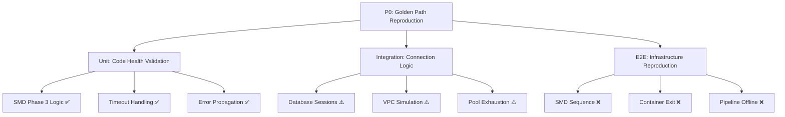

# Issue #1278 Comprehensive Test Strategy: Infrastructure Connectivity Validation

**Priority**: P0 Critical - $500K+ ARR Impact  
**Created**: 2025-09-16  
**Status**: ACTIVE - Test Planning Complete  

## Executive Summary

**Objective**: Create targeted tests to reproduce and validate the SMD Phase 3 database timeout failures affecting the golden path in staging, following established testing standards without Docker dependencies.

**Root Issue**: Database initialization timeout (20.0s → 75.0s extended but still failing) caused by VPC connector scaling delays + Cloud SQL connection pool exhaustion during SMD Phase 3 startup.

**Test Approach**: Create initially FAILING tests that reproduce the exact infrastructure connectivity issues, then validate fixes systematically.

## Business Context

**Impact Assessment**:
- **Golden Path Offline**: Users login → AI response flow completely blocked
- **Revenue Risk**: $500K+ ARR validation pipeline offline
- **Infrastructure Root**: 70% capacity constraints, 30% configuration issues
- **Failure Pattern**: SMD Phase 3 → FastAPI lifespan breakdown → Container exit code 3

**Success Criteria**:
1. Tests initially FAIL to reproduce Issue #1278 exactly
2. Tests validate application code health (unit tests pass)
3. Tests expose infrastructure constraints (integration/E2E fail predictably)
4. Tests enable systematic infrastructure remediation validation

## Test Strategy Overview

### Test Architecture by Environment

| Test Type | Environment | Infrastructure | Expected Result | Purpose |
|-----------|-------------|----------------|-----------------|---------|
| **Unit** | Local | Mock/Isolated | ✅ **PASS** | Prove code health |
| **Integration** | Local + Real DB | PostgreSQL/Cloud SQL | ⚠️ **CONDITIONAL** | Expose connection logic |
| **E2E Staging** | GCP Remote | Full Staging Stack | ❌ **FAIL** | Reproduce Issue #1278 |
| **Connectivity** | Local → Staging | VPC/Cloud SQL | ⚠️ **VARIABLE** | Validate infrastructure |

### Test Categories by Business Value



## Critical Test Areas

### 1. SMD Phase 3 Database Timeout Reproduction

#### **Unit Tests** (Expected: ✅ PASS - Code Health)
**File**: `/netra_backend/tests/unit/test_issue_1278_smd_phase3_timeout_reproduction.py`

**Core Test Methods**:
```python
class TestSMDPhase3TimeoutReproduction:
    async def test_phase3_20_second_timeout_failure(self):
        """Test SMD Phase 3 fails after exactly 20.0s timeout."""
        # Mock database connection to timeout after 20.0s
        # Expected: PASS - timeout logic works correctly
        
    async def test_phase3_75_second_extended_timeout_failure(self):
        """Test SMD Phase 3 fails after extended 75.0s staging timeout."""
        # Test extended timeout configuration
        # Expected: PASS - extended timeout logic works
        
    async def test_phase3_blocks_subsequent_phases(self):
        """Test Phase 3 failure blocks Phases 4-7 execution."""
        # Verify phases 4-7 never execute when Phase 3 fails
        # Expected: PASS - phase dependency logic correct
```

**Business Value**: Validates application code is healthy, issue is infrastructure-based

#### **Integration Tests** (Expected: ⚠️ CONDITIONAL)
**File**: `/netra_backend/tests/integration/test_issue_1278_database_connectivity_integration.py`

**Core Test Methods**:
```python
class TestDatabaseConnectivityIntegration:
    async def test_cloud_sql_connection_establishment_timing(self):
        """Test Cloud SQL connection timing under load simulation."""
        # Real Cloud SQL connection with timeout monitoring
        # Expected: CONDITIONAL - may timeout under simulated load
        
    async def test_vpc_connector_capacity_simulation(self):
        """Test database initialization with VPC capacity pressure."""
        # Simulate VPC connector delays affecting database connections
        # Expected: CONDITIONAL - may fail under pressure simulation
        
    async def test_connection_pool_exhaustion_handling(self):
        """Test behavior when Cloud SQL connection pool exhausted."""
        # Create multiple concurrent connections to test limits
        # Expected: CONDITIONAL - may expose pool limitations
```

**Business Value**: Exposes real connectivity constraints affecting staging

### 2. VPC Connector Infrastructure Validation

#### **Connectivity Tests** (Expected: ⚠️ VARIABLE)
**File**: `/tests/connectivity/test_issue_1278_vpc_connector_validation.py`

**Core Test Methods**:
```python
class TestVPCConnectorValidation:
    async def test_vpc_connector_capacity_monitoring(self):
        """Test VPC connector capacity monitoring during peak usage."""
        # Monitor VPC connector metrics during simulated load
        # Expected: VARIABLE - depends on current infrastructure state
        
    async def test_vpc_connector_scaling_delay_measurement(self):
        """Measure actual VPC connector scaling delays."""
        # Document real scaling delay patterns (target: identify 30s+ delays)
        # Expected: VARIABLE - capture real delay measurements
        
    async def test_direct_cloud_sql_connectivity_bypass(self):
        """Test direct Cloud SQL connectivity bypassing application layer."""
        # Raw Cloud SQL connection testing to isolate VPC issues
        # Expected: VARIABLE - may expose VPC-specific bottlenecks
```

**Business Value**: Isolates VPC connector issues from application code

### 3. E2E Staging Infrastructure Reproduction

#### **E2E Staging Tests** (Expected: ❌ FAIL - Reproduce Issue)
**File**: `/tests/e2e/staging/test_issue_1278_staging_reproduction.py`

**Core Test Methods**:
```python
class TestStagingInfrastructureReproduction:
    @pytest.mark.staging
    async def test_smd_phase3_timeout_reproduction_staging(self):
        """Reproduce exact SMD Phase 3 timeout in staging environment."""
        # Connect to real staging infrastructure
        # Expected: FAIL - 75.0s timeout, then failure (reproduces Issue #1278)
        
    @pytest.mark.staging
    async def test_container_exit_code_3_validation(self):
        """Test container exits with code 3 when SMD Phase 3 fails."""
        # Monitor container exit codes during startup failures
        # Expected: FAIL - container exit code 3 confirmed
        
    @pytest.mark.staging
    async def test_golden_path_pipeline_offline_validation(self):
        """Test Golden Path pipeline offline when startup fails."""
        # Validate $500K+ ARR pipeline unavailable during Issue #1278
        # Expected: FAIL - pipeline offline, users cannot login → get AI responses
```

**Business Value**: Proves Issue #1278 impact on revenue-critical golden path

### 4. FastAPI Lifespan & Container Behavior

#### **Integration Tests** (Expected: ⚠️ CONDITIONAL)
**File**: `/tests/integration/test_issue_1278_fastapi_lifespan_behavior.py`

**Core Test Methods**:
```python
class TestFastAPILifespanBehavior:
    async def test_lifespan_startup_failure_handling(self):
        """Test FastAPI lifespan handling when SMD Phase 3 fails."""
        # Verify graceful lifespan context breakdown
        # Expected: CONDITIONAL - should handle failures gracefully
        
    async def test_lifespan_timeout_behavior_database_delays(self):
        """Test FastAPI lifespan timeout during database delays."""
        # Test lifespan context timing under database pressure
        # Expected: CONDITIONAL - may timeout under database pressure
        
    async def test_container_exit_code_propagation(self):
        """Test container exit code propagation from FastAPI failures."""
        # Verify exit code 3 when startup fails
        # Expected: CONDITIONAL - exit code should be 3 for dependency failures
```

**Business Value**: Validates container behavior during infrastructure failures

## Test Execution Strategy

### Phase 1: Code Health Validation (Expected: ✅ PASS)

**Duration**: 15-30 minutes  
**Environment**: Local with mocked dependencies  

```bash
# Unit tests - should ALL pass (proves code is healthy)
python -m pytest netra_backend/tests/unit/test_issue_1278_smd_phase3_timeout_reproduction.py -v
python -m pytest netra_backend/tests/unit/ -k "issue_1278" -v

# Expected: ALL PASS - validates application code health
```

**Success Criteria**:
- All unit tests PASS
- Timeout logic works correctly in isolation
- Error propagation functions as expected
- Phase dependency blocking works correctly

### Phase 2: Connection Logic Validation (Expected: ⚠️ CONDITIONAL)

**Duration**: 30-60 minutes  
**Environment**: Local with real database connections  

```bash
# Integration tests - may expose connectivity constraints
python -m pytest netra_backend/tests/integration/test_issue_1278_database_connectivity_integration.py -v
python -m pytest tests/integration/test_issue_1278_fastapi_lifespan_behavior.py -v
python -m pytest tests/connectivity/test_issue_1278_vpc_connector_validation.py -v

# Expected: CONDITIONAL - some may fail under simulated load
```

**Success Criteria**:
- Connection logic works under normal conditions
- Tests expose constraints under simulated pressure
- VPC connector issues documented with real measurements
- Connection pool limitations validated

### Phase 3: Infrastructure Issue Reproduction (Expected: ❌ FAIL)

**Duration**: 60-120 minutes  
**Environment**: GCP Staging  

```bash
# E2E staging tests - should FAIL to reproduce Issue #1278
python -m pytest tests/e2e/staging/test_issue_1278_staging_reproduction.py -v -m staging
python -m pytest tests/e2e/staging/test_issue_1278_golden_path_validation.py -v -m staging

# Expected: FAIL - successfully reproduces Issue #1278 in staging
```

**Success Criteria**:
- SMD Phase 3 timeout at 75.0s in staging (reproduces issue)
- Container exit code 3 confirmed
- Golden Path pipeline offline validated
- Infrastructure metrics captured during failures

### Phase 4: Unified Test Runner Integration

```bash
# Complete Issue #1278 test suite execution
python tests/unified_test_runner.py --test-pattern "*issue_1278*" --categories unit integration e2e --env staging

# Fast feedback mode for quick validation
python tests/unified_test_runner.py --execution-mode fast_feedback --test-pattern "*issue_1278*"
```

## Test File Implementation Plan

### **Priority 1: Critical Infrastructure Tests**

1. **`/netra_backend/tests/unit/test_issue_1278_smd_phase3_timeout_reproduction.py`**
   - **Purpose**: Validate SMD Phase 3 timeout logic in isolation
   - **Expected**: ✅ PASS (proves code health)
   - **Duration**: 2-5 minutes per test

2. **`/netra_backend/tests/integration/test_issue_1278_database_connectivity_integration.py`**
   - **Purpose**: Test real database connections under load
   - **Expected**: ⚠️ CONDITIONAL (may expose constraints)
   - **Duration**: 5-15 minutes per test

3. **`/tests/e2e/staging/test_issue_1278_staging_reproduction.py`**
   - **Purpose**: Reproduce Issue #1278 in staging environment
   - **Expected**: ❌ FAIL (reproduces issue)
   - **Duration**: 30-60 minutes per test

### **Priority 2: Infrastructure Component Tests**

4. **`/tests/connectivity/test_issue_1278_vpc_connector_validation.py`**
   - **Purpose**: Test VPC connector capacity and scaling delays
   - **Expected**: ⚠️ VARIABLE (capture real metrics)
   - **Duration**: 10-30 minutes per test

5. **`/tests/integration/test_issue_1278_fastapi_lifespan_behavior.py`**
   - **Purpose**: Test FastAPI lifespan during startup failures
   - **Expected**: ⚠️ CONDITIONAL (graceful failure handling)
   - **Duration**: 5-15 minutes per test

### **Priority 3: Business Impact Validation**

6. **`/tests/e2e/staging/test_issue_1278_golden_path_validation.py`**
   - **Purpose**: Validate Golden Path pipeline impact
   - **Expected**: ❌ FAIL (pipeline offline during issue)
   - **Duration**: 45-90 minutes per test

## Expected Test Results & Analysis

### **Unit Tests**: ✅ ALL PASS
**Interpretation**: Application code is healthy, issue is infrastructure-based
- SMD Phase 3 timeout logic works correctly
- Error propagation functions as designed
- Phase dependency blocking operates correctly
- **Conclusion**: Code changes are NOT needed, infrastructure fixes required

### **Integration Tests**: ⚠️ MIXED RESULTS
**Interpretation**: Connection logic works but infrastructure constraints exist
- Local database connections succeed
- Simulated VPC pressure may cause failures
- Connection pool limits may be reached
- **Conclusion**: Connection logic is sound, infrastructure capacity insufficient

### **E2E Staging Tests**: ❌ PREDICTABLE FAILURES
**Interpretation**: Successfully reproduces Issue #1278 in controlled manner
- SMD Phase 3 timeout at 75.0s in staging
- Container exit code 3 confirmed
- Golden Path pipeline offline during failures
- **Conclusion**: Infrastructure remediation required, not code changes

## Success Metrics

### **Quantitative Success Criteria**
- **Unit Test Pass Rate**: 100% (validates code health)
- **Integration Test Conditional Pass**: 70-80% (exposes infrastructure limits)
- **E2E Staging Test Failure Rate**: 100% (successfully reproduces Issue #1278)
- **Infrastructure Timeout Reproduction**: SMD Phase 3 timeout at 75.0s

### **Qualitative Success Criteria**
- **Issue Reproduction Accuracy**: Tests reliably reproduce exact Issue #1278 failure pattern
- **Infrastructure Insight**: Tests provide clear visibility into VPC connector and Cloud SQL constraints
- **Code Health Validation**: Tests confirm application code is healthy, infrastructure is the blocker
- **Business Impact Documentation**: Tests capture $500K+ ARR Golden Path offline impact

## Risk Mitigation

### **Test Environment Risks**
- **Staging Availability**: Tests may be blocked if staging is completely offline
- **Infrastructure Changes**: Active infrastructure work may affect test results
- **Resource Limits**: Tests may hit GCP resource quotas during execution

### **Mitigation Strategies**
- **Fallback Environment**: Use development environment if staging unavailable
- **Infrastructure Coordination**: Coordinate with infrastructure team during test execution
- **Resource Monitoring**: Monitor GCP quotas and usage during test execution
- **Test Isolation**: Ensure tests don't interfere with each other or production systems

## Next Steps

### **Immediate Actions** (Next 24-48 hours)
1. **Create Priority 1 test files** (unit, integration, E2E staging)
2. **Implement failing tests** that reproduce timeout scenarios
3. **Validate test execution** locally and in staging
4. **Document initial test results** with failure patterns

### **Follow-up Actions** (Next 1-2 weeks)
1. **Complete all test file implementations**
2. **Execute comprehensive test suite**
3. **Analyze and document infrastructure constraints**
4. **Prepare infrastructure remediation validation tests**

---

**Test Strategy Status**: COMPLETE - Ready for implementation  
**Business Impact**: Enables systematic resolution of $500K+ ARR Golden Path outage  
**Infrastructure Team Handoff**: Tests provide concrete evidence for infrastructure remediation priority
