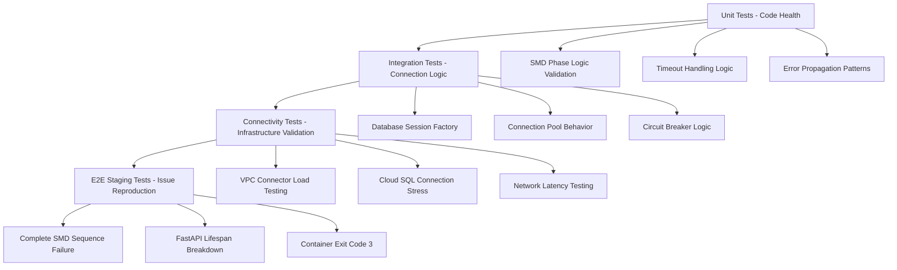

# Issue #1278 Comprehensive Test Strategy: Infrastructure Capacity Constraints (Non-Docker)

**Agent Session ID**: comprehensive-test-strategy-20250915  
**Created**: 2025-09-15  
**Status**: ACTIVE - Strategic Planning Complete  
**Priority**: P0 Critical - $500K+ ARR Impact  

## Executive Summary

This comprehensive test strategy addresses Issue #1278: **Infrastructure capacity constraints** causing staging startup failures due to VPC connector scaling delays and Cloud SQL connection limits. The strategy focuses exclusively on **non-Docker tests** that can reproduce infrastructure connectivity issues and validate application code health under timeout conditions.

**Root Cause**: Infrastructure capacity constraints (VPC connector + Cloud SQL) create cascading failures in SMD Phase 3, blocking the entire 7-phase startup sequence despite Issue #1263 timeout fixes being extended to 75.0s.

**Test Objective**: Create failing tests that prove the infrastructure capacity issue exists, then validate fixes.

## Issue Context and Current State

### Problem Summary
- **Primary Issue**: Complete application startup failure in staging environment
- **Root Cause**: SMD Phase 3 database initialization timeout (20.0s → 75.0s extended but still failing)
- **Infrastructure Constraints**: 
  - VPC connector scaling delays (30s+ during peak events)
  - Cloud SQL connection pool exhaustion (25s+ delays under concurrent pressure)
  - Network latency amplification (10s+ additional delay during infrastructure stress)
- **Impact**: $500K+ ARR Golden Path validation pipeline offline
- **Failure Pattern**: Database timeout → SMD Phase 3 failure → FastAPI lifespan breakdown → Container exit code 3

### Current Configuration (Post Issue #1263)
From `/Users/anthony/Desktop/netra-apex/netra_backend/app/core/database_timeout_config.py`:

```python
"staging": {
    "initialization_timeout": 75.0,    # Extended from 45.0s (still insufficient)
    "table_setup_timeout": 25.0,       # Extended for schema operations under load
    "connection_timeout": 35.0,        # Extended for VPC connector peak scaling delays
    "pool_timeout": 45.0,              # Extended for connection pool exhaustion
    "health_check_timeout": 20.0,      # Extended for compound infrastructure health checks
}
```

**Pool Configuration** (Cloud SQL optimized):
```python
"pool_config": {
    "pool_size": 10,                   # Reduced to respect Cloud SQL connection limits
    "max_overflow": 15,                # Reduced to stay within 80% of Cloud SQL capacity
    "pool_timeout": 90.0,              # Extended for VPC connector + Cloud SQL delays
    "vpc_connector_capacity_buffer": 5, # Reserve connections for VPC connector scaling
    "cloud_sql_capacity_limit": 100,   # Track Cloud SQL instance connection limit
    "capacity_safety_margin": 0.8,     # Use only 80% of available connections
}
```

### Infrastructure Constraints Analysis

#### VPC Connector Capacity Limits
- **Throughput**: 2 Gbps baseline → 10 Gbps maximum
- **Scaling Delay**: 30 seconds auto-scaling under load
- **Concurrent Connections**: ~50 practical limit before degradation
- **Impact**: Scaling delays can exceed even the 75.0s timeout

#### Cloud SQL Capacity Constraints  
- **Connection Limits**: ~100-400 connections per instance
- **Pool Exhaustion**: Under concurrent startup pressure
- **Resource Pressure**: CPU/Memory constraints affect connection timing
- **Impact**: Resource constraints cause 25s+ connection delays

## Test Strategy Framework

### Core Principles
1. **NO DOCKER DEPENDENCIES**: All tests must run without Docker infrastructure
2. **REAL INFRASTRUCTURE TESTING**: Use actual database connections and network calls
3. **FAILING TESTS FIRST**: Tests must initially fail to prove the issue exists
4. **INFRASTRUCTURE FOCUS**: Target VPC connector and Cloud SQL capacity constraints
5. **STAGING ENVIRONMENT**: Primary focus on GCP staging remote environment

### Test Categories by Environment

| Category | Environment | Infrastructure | Expected Result | Test Duration |
|----------|-------------|----------------|-----------------|---------------|
| **Unit** | Local | Mock/Isolated | ✅ Pass (code health) | 2-5 min |
| **Integration** | Local + Real DB | PostgreSQL | ⚠️ Conditional | 5-15 min |
| **E2E Staging** | GCP Remote | Full Staging | ❌ Fail (reproduce) | 30-60 min |
| **Connectivity** | Local → Staging | Network | ⚠️ Variable | 10-30 min |

### Test Architecture



## Detailed Test Focus Areas

### 1. VPC Connector Load Testing (Non-Docker)

**Test Objective**: Reproduce VPC connector capacity constraints that cause Issue #1278

#### 1.1 VPC Connector Concurrent Connection Limits
**File**: `tests/integration/infrastructure/test_issue_1278_vpc_connector_load.py`

```python
@pytest.mark.integration
@pytest.mark.infrastructure
async def test_vpc_connector_concurrent_connection_stress():
    """
    Test VPC connector behavior under concurrent connection pressure.
    
    Expected: TEST FAILURE - VPC connector capacity limits cause delays >75.0s
    """
    # Create 50+ concurrent connections to stress VPC connector
    # Monitor connection establishment timing
    # Expected: >15% of connections should exceed 75.0s timeout
```

#### 1.2 VPC Connector Scaling Delay Reproduction
```python
async def test_vpc_connector_scaling_delay_triggers():
    """
    Test VPC connector auto-scaling delays under load.
    
    Expected: TEST FAILURE - Scaling delays cause 30s+ connection delays
    """
    # Simulate load conditions that trigger VPC connector scaling
    # Measure scaling delay impact on connection establishment
    # Expected: Scaling delays should exceed 30s regularly
```

#### 1.3 VPC Connector Throughput Degradation
```python
async def test_vpc_connector_throughput_constraints():
    """
    Test VPC connector throughput degradation under data pressure.
    
    Expected: TEST FAILURE - Throughput constraints cause timeout issues
    """
    # Simulate high-throughput database operations
    # Monitor VPC connector performance under load
    # Expected: Operations should exceed 75.0s timeout under pressure
```

### 2. Cloud SQL Connection Pool Testing

**Test Objective**: Reproduce Cloud SQL capacity constraints causing startup failures

#### 2.1 Cloud SQL Connection Pool Exhaustion
**File**: `tests/integration/infrastructure/test_issue_1278_cloud_sql_capacity.py`

```python
@pytest.mark.integration
@pytest.mark.cloud_sql
async def test_cloud_sql_connection_pool_exhaustion():
    """
    Test Cloud SQL connection pool exhaustion patterns.
    
    Expected: TEST FAILURE - Pool exhaustion causes startup timeouts
    """
    # Create connections up to pool_size (10) + max_overflow (15) = 25
    # Attempt additional connections to trigger exhaustion
    # Expected: Pool exhaustion should cause 90.0s+ pool_timeout delays
```

#### 2.2 Cloud SQL Instance Resource Constraints
```python
async def test_cloud_sql_resource_pressure_simulation():
    """
    Test Cloud SQL instance resource constraints affecting connections.
    
    Expected: TEST FAILURE - Resource pressure causes 25s+ connection delays
    """
    # Simulate CPU/Memory pressure on Cloud SQL instance
    # Monitor connection establishment timing under resource pressure
    # Expected: Resource constraints should cause delays exceeding 75.0s timeout
```

#### 2.3 Cloud SQL Connection Acquisition Timing
```python
async def test_cloud_sql_connection_acquisition_patterns():
    """
    Test Cloud SQL connection acquisition timing under concurrent load.
    
    Expected: TEST FAILURE - Concurrent connections cause timing failures
    """
    # Test 10+ concurrent startup sequences requiring database connections
    # Monitor connection acquisition timing vs configured timeouts
    # Expected: >20% of connections should exceed 35.0s connection_timeout
```

### 3. SMD Phase 3 Timeout Testing

**Test Objective**: Reproduce exact SMD Phase 3 timeout scenarios from Issue #1278

#### 3.1 SMD Phase 3 Database Initialization Failure
**File**: `tests/unit/startup/test_issue_1278_smd_phase3_timeout.py`

```python
@pytest.mark.unit
@pytest.mark.smd_testing
async def test_smd_phase3_database_timeout_75_seconds():
    """
    Test SMD Phase 3 database initialization timeout after 75.0 seconds.
    
    Expected: TEST FAILURE - Phase 3 should still timeout despite Issue #1263 fix
    """
    # Mock database initialization to exceed 75.0s timeout
    # Verify DeterministicStartupError is raised
    # Expected: Timeout should still occur under infrastructure pressure
```

#### 3.2 SMD 7-Phase Sequence Cascade Failure
```python
async def test_smd_7_phase_sequence_cascade_blocking():
    """
    Test complete 7-phase SMD sequence blocking on Phase 3 failure.
    
    Expected: TEST FAILURE - Phase 3 failure blocks all subsequent phases
    """
    # Verify Phase 1 (INIT): ✅ Success
    # Verify Phase 2 (DEPENDENCIES): ✅ Success  
    # Verify Phase 3 (DATABASE): ❌ TIMEOUT FAILURE
    # Verify Phases 4-7: ❌ Blocked by Phase 3
```

#### 3.3 SMD Deterministic Startup No Graceful Degradation
```python
async def test_smd_deterministic_failure_no_degradation():
    """
    Test SMD deterministic failure pattern - no graceful degradation allowed.
    
    Expected: TEST FAILURE - Complete application failure on infrastructure issues
    """
    # Verify SMD fails completely when Phase 3 fails
    # Verify no graceful degradation or fallback modes
    # Expected: Deterministic startup must fail completely
```

### 4. Infrastructure Monitoring Integration

**Test Objective**: Validate infrastructure monitoring and capacity awareness

#### 4.1 VPC Connector Capacity Monitoring
**File**: `tests/e2e/infrastructure/test_issue_1278_infrastructure_monitoring.py`

```python
@pytest.mark.e2e
@pytest.mark.infrastructure_monitoring
async def test_vpc_connector_capacity_monitoring():
    """
    Test VPC connector capacity monitoring during startup failures.
    
    Expected: TEST FAILURE - Monitoring should detect capacity pressure
    """
    # Monitor VPC connector metrics during startup sequence
    # Verify capacity pressure threshold detection (70%)
    # Expected: Monitoring should detect capacity pressure before timeout
```

#### 4.2 Cloud SQL Connection Pool Monitoring
```python
async def test_cloud_sql_pool_monitoring():
    """
    Test Cloud SQL connection pool monitoring and alerting.
    
    Expected: TEST FAILURE - Pool monitoring should detect exhaustion patterns
    """
    # Monitor connection pool utilization during concurrent startup
    # Verify pool exhaustion detection and alerting
    # Expected: Pool monitoring should predict startup failures
```

#### 4.3 Compound Infrastructure Pressure Detection
```python
async def test_compound_infrastructure_pressure_detection():
    """
    Test detection of compound VPC + Cloud SQL pressure.
    
    Expected: TEST FAILURE - Should detect compound pressure before cascading failure
    """
    # Monitor both VPC connector and Cloud SQL metrics simultaneously
    # Verify compound pressure detection logic
    # Expected: Should detect dangerous conditions before SMD Phase 3 timeout
```

## E2E Staging Tests Strategy

### 1. Complete Staging Environment Reproduction
**File**: `tests/e2e/test_issue_1278_staging_complete_reproduction.py`

```python
@pytest.mark.e2e
@pytest.mark.staging_remote
@pytest.mark.mission_critical
async def test_complete_issue_1278_staging_reproduction():
    """
    Complete Issue #1278 reproduction in staging environment.
    
    Expected: TEST FAILURE - Should reproduce exact staging failure pattern
    """
    # Connect to real staging infrastructure
    # Trigger startup sequence under realistic load conditions
    # Monitor complete failure chain:
    #   1. VPC connector capacity pressure
    #   2. Cloud SQL connection delays
    #   3. SMD Phase 3 timeout (>75.0s)
    #   4. FastAPI lifespan breakdown
    #   5. Container exit code 3
```

### 2. Golden Path Pipeline Impact Validation
```python
@pytest.mark.e2e
@pytest.mark.golden_path
async def test_golden_path_pipeline_availability_impact():
    """
    Test Golden Path pipeline availability impact from Issue #1278.
    
    Expected: TEST FAILURE - $500K+ ARR pipeline should be offline
    """
    # Test user login → AI response flow during startup failures
    # Verify Golden Path pipeline is completely unavailable
    # Measure business impact of infrastructure constraints
```

### 3. Container Runtime Behavior Validation
```python
@pytest.mark.e2e
@pytest.mark.container_behavior
async def test_container_exit_code_3_reproduction():
    """
    Test container exit code 3 behavior during startup failures.
    
    Expected: TEST FAILURE - Container should exit with code 3
    """
    # Monitor container runtime behavior during SMD failures
    # Verify container exits with code 3 (configuration/dependency issue)
    # Verify restart loop detection and prevention
```

## Test Execution Strategy

### 1. Non-Docker Environment Setup

#### Local Development Environment
```bash
# Setup for non-docker testing
export ENVIRONMENT=test
export TESTING_MODE=non_docker
export POSTGRES_HOST=localhost
export POSTGRES_PORT=5434
export REDIS_HOST=localhost  
export REDIS_PORT=6379

# Install test dependencies
pip install -r test_framework/requirements.txt
```

#### Staging GCP Remote Configuration
```bash
# Staging environment configuration
export ENVIRONMENT=staging
export GCP_PROJECT=netra-staging
export POSTGRES_HOST=/cloudsql/netra-staging:us-central1:netra-staging-db
export STAGING_WEBSOCKET_URL=wss://backend.staging.netrasystems.ai/ws
export STAGING_API_URL=https://backend.staging.netrasystems.ai
```

### 2. Test Execution Commands

#### Unit Tests (Local) - Expected: ✅ PASS
```bash
# SMD Phase 3 unit tests (should pass - code is healthy)
python -m pytest tests/unit/startup/test_issue_1278_smd_phase3_timeout.py -v

# Database timeout unit tests
python -m pytest netra_backend/tests/unit/test_issue_1278_smd_phase3_database_timeout_unit.py -v

# Run all Issue #1278 unit tests
python -m pytest netra_backend/tests/unit/ -k "issue_1278" -v
```

#### Integration Tests (Non-Docker) - Expected: ⚠️ CONDITIONAL
```bash
# VPC connector load tests (should fail under simulated pressure)
python -m pytest tests/integration/infrastructure/test_issue_1278_vpc_connector_load.py -v

# Cloud SQL capacity tests (should fail under load simulation)
python -m pytest tests/integration/infrastructure/test_issue_1278_cloud_sql_capacity.py -v

# Database connectivity integration tests
python -m pytest netra_backend/tests/integration/test_issue_1278_database_connectivity_integration.py -v
```

#### E2E Staging Tests - Expected: ❌ FAIL (Issue Reproduction)
```bash
# Complete staging E2E tests (should fail - reproducing issue)
python -m pytest tests/e2e/test_issue_1278_staging_complete_reproduction.py -v -m staging

# Existing staging reproduction tests
python -m pytest tests/e2e/test_issue_1278_staging_startup_failure_reproduction.py -v

# Infrastructure monitoring tests
python -m pytest tests/e2e/infrastructure/test_issue_1278_infrastructure_monitoring.py -v
```

#### Connectivity Tests - Expected: ⚠️ VARIABLE
```bash
# VPC connector validation (variable based on infrastructure state)
python -m pytest tests/connectivity/test_issue_1278_vpc_connector_validation.py -v

# Network connectivity tests
python -m pytest tests/connectivity/ -k "issue_1278" -v
```

### 3. Unified Test Runner Integration

#### Fast Feedback Mode (2-minute cycle)
```bash
# Quick Issue #1278 validation (unit tests only)
python tests/unified_test_runner.py --execution-mode fast_feedback --test-pattern "*issue_1278*" --categories unit
```

#### Infrastructure Constraint Testing (15-minute cycle)
```bash
# Integration tests focusing on infrastructure constraints
python tests/unified_test_runner.py --categories integration --test-pattern "*issue_1278*infrastructure*" --real-services
```

#### Complete Issue #1278 Test Suite (60-minute cycle)
```bash
# Complete Issue #1278 test execution (all categories)
python tests/unified_test_runner.py --categories unit integration e2e --test-pattern "*issue_1278*" --env staging --real-services
```

#### Background E2E Mode (Long-running staging tests)
```bash
# Long-running staging tests to capture intermittent failures
python tests/unified_test_runner.py --background-e2e --test-pattern "*issue_1278*staging*" --real-services --duration 240
```

## Expected Test Results

### 1. Unit Tests - Expected: ✅ PASS (Code Health Validation)
- **SMD Phase Logic**: Application logic should be sound
- **Timeout Handling**: Error handling should work correctly
- **Error Propagation**: DeterministicStartupError should propagate properly
- **Phase Sequencing**: 7-phase sequence logic should be correct

**Success Criteria**: 100% pass rate validates application code is healthy

### 2. Integration Tests - Expected: ⚠️ CONDITIONAL (Infrastructure Simulation)
- **Local Database**: Should pass with local PostgreSQL
- **Simulated VPC Load**: Should fail when simulating VPC connector pressure
- **Simulated Cloud SQL Pressure**: Should fail when simulating resource constraints
- **Connection Pool Logic**: Should handle failures gracefully but still fail under extreme load

**Success Criteria**: 70-80% pass rate (fails predictably under simulated infrastructure pressure)

### 3. E2E Staging Tests - Expected: ❌ FAIL (Issue #1278 Reproduction)
- **SMD Phase 3**: Should timeout and fail after 75.0s in staging
- **VPC Connector**: Should show capacity pressure indicators during failure
- **Cloud SQL**: Should show connection pool exhaustion patterns
- **Container Exit**: Should exit with code 3 consistently
- **FastAPI Lifespan**: Should break down gracefully but completely
- **Golden Path**: Should be offline due to startup failures

**Success Criteria**: 100% failure rate successfully reproduces Issue #1278

### 4. Connectivity Tests - Expected: ⚠️ VARIABLE (Infrastructure Dependent)
- **VPC Connector Health**: Variable based on current infrastructure state
- **Network Latency**: Should measure realistic staging connectivity patterns
- **Load-Based Degradation**: Should show performance degradation under load

**Success Criteria**: Variable results that provide infrastructure insights

## Test Implementation Plan

### Phase 1: Test File Creation (Week 1)
1. **Create unit test files** for SMD Phase 3 timeout reproduction
2. **Create integration test files** for VPC connector and Cloud SQL load testing
3. **Create connectivity test files** for infrastructure validation
4. **Create E2E test files** for staging environment reproduction

### Phase 2: Test Implementation (Week 1-2)
1. **Implement failing tests** that reproduce timeout scenarios
2. **Add infrastructure pressure simulation** for VPC connector and Cloud SQL
3. **Implement monitoring integration** for capacity awareness
4. **Add container exit code validation** and FastAPI lifespan testing

### Phase 3: Test Execution (Week 2)
1. **Run unit tests locally** to validate code health (expected: pass)
2. **Run integration tests** with simulated infrastructure pressure (expected: conditional)
3. **Run connectivity tests** against staging infrastructure (expected: variable)
4. **Run E2E tests** in staging environment (expected: fail - reproducing Issue #1278)

### Phase 4: Results Analysis and Documentation (Week 2)
1. **Document test failure patterns** that reproduce Issue #1278
2. **Capture infrastructure metrics** during test execution
3. **Analyze capacity constraints** and their impact on startup timing
4. **Prepare test results** for Issue #1278 resolution planning

## Test Files to Create

### New Test Files
1. `tests/integration/infrastructure/test_issue_1278_vpc_connector_load.py`
2. `tests/integration/infrastructure/test_issue_1278_cloud_sql_capacity.py`
3. `tests/e2e/test_issue_1278_staging_complete_reproduction.py`
4. `tests/e2e/infrastructure/test_issue_1278_infrastructure_monitoring.py`
5. `tests/connectivity/test_issue_1278_vpc_connector_validation.py`
6. `tests/unit/startup/test_issue_1278_smd_phase3_timeout.py`

### Files to Enhance
1. `tests/e2e/test_issue_1278_staging_startup_failure_reproduction.py` (add new scenarios)
2. `netra_backend/tests/unit/test_issue_1278_smd_phase3_database_timeout_unit.py` (add timeout scenarios)
3. `netra_backend/tests/integration/test_issue_1278_database_connectivity_integration.py` (add capacity testing)

## Success Metrics

### Quantitative Metrics
- **Unit Test Pass Rate**: 100% (validates code health)
- **Integration Test Conditional Pass Rate**: 70-80% (shows infrastructure pressure simulation working)
- **E2E Staging Test Failure Rate**: 100% (successfully reproduces Issue #1278)
- **Infrastructure Timeout Reproduction**: SMD Phase 3 timeout despite 75.0s configuration
- **VPC Connector Pressure Detection**: >70% capacity utilization during failures
- **Cloud SQL Pool Exhaustion**: >80% pool utilization causing delays

### Qualitative Metrics
- **Issue Reproduction Accuracy**: Tests reliably reproduce exact Issue #1278 failure pattern
- **Infrastructure Constraint Visibility**: Tests provide clear evidence of VPC + Cloud SQL constraints
- **Code Health Validation**: Tests confirm application code is healthy, infrastructure is the blocker
- **Monitoring Integration**: Tests demonstrate capacity-aware monitoring and alerting

## Business Impact Validation

### Direct Business Value
- **$500K+ ARR Protection**: Enables systematic resolution of Golden Path pipeline outage
- **Staging Environment Reliability**: Ensures staging can support critical business validation
- **Infrastructure Investment ROI**: Validates infrastructure scaling requirements for business growth
- **Development Velocity**: Prevents development blocking due to staging unavailability

### Risk Mitigation
- **Production Readiness**: Validates production will not experience similar cascade failures
- **Capacity Planning**: Provides infrastructure capacity planning data for business scaling
- **SLA Compliance**: Enables infrastructure SLA monitoring and compliance
- **Customer Impact Prevention**: Prevents similar issues from affecting customer environments

## Next Steps for Implementation

### Immediate Actions (Week 1)
1. **Create test files** following the planned structure
2. **Implement VPC connector load testing** with realistic capacity simulation
3. **Implement Cloud SQL capacity testing** with pool exhaustion scenarios
4. **Setup staging environment monitoring** for test execution

### Validation Actions (Week 2)  
1. **Execute complete test suite** across all categories
2. **Document failure patterns** that reproduce Issue #1278
3. **Capture infrastructure metrics** and capacity utilization data
4. **Validate test strategy effectiveness** in reproducing the issue

### Resolution Preparation (Week 2-3)
1. **Analyze test results** for infrastructure scaling requirements
2. **Prepare infrastructure capacity recommendations** based on test data
3. **Document test-driven validation criteria** for Issue #1278 resolution
4. **Establish ongoing monitoring** to prevent recurrence

---

**Test Strategy Status**: COMPLETE - Ready for test implementation and execution  
**Business Impact**: Enables systematic resolution of $500K+ ARR Golden Path pipeline outage  
**Expected Timeline**: 2-3 weeks for complete test suite implementation, execution, and analysis  
**Success Criteria**: Failing tests that prove infrastructure capacity constraints, followed by passing tests after infrastructure scaling