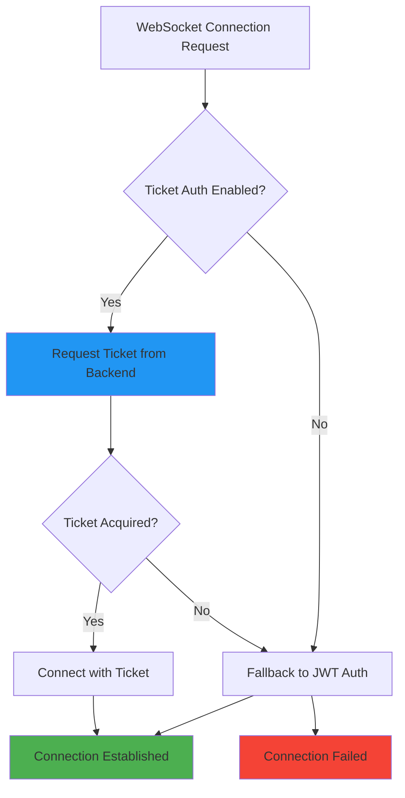

# Issue #1295 - Frontend Ticket Authentication Implementation Plan

**STEP 2 (PLANNING)** of gitissueprogressorv4 process

**Agent Session:** agent-session-20250917-033000  
**Branch:** develop-long-lived  
**Issue Context:** Implement frontend WebSocket ticket authentication to consume backend AuthTicketManager (Issue #1296 Phase 1 & 2 Complete)  

## Executive Summary

This plan implements the frontend component of the ticket-based WebSocket authentication system. With Issue #1296 Phase 1 (AuthTicketManager) and Phase 2 (endpoints) complete, this issue focuses specifically on updating the frontend WebSocket connection logic to use secure, time-limited tickets instead of JWT Authorization headers.

**Business Impact:** Eliminates browser WebSocket Authorization header limitations while maintaining the Golden Path user experience ($500K+ ARR chat functionality).

**Technical Impact:** Replaces problematic Authorization header authentication with cryptographically secure, time-limited tickets stored in Redis.

---

## 1. Overall Scope and Definition of Done

### **Scope**
- Update frontend WebSocket connection to use ticket authentication
- Implement ticket acquisition service integrated with existing auth flow  
- Add ticket error handling and fallback mechanisms
- Maintain backward compatibility during transition
- Ensure all 5 critical WebSocket events continue to work

### **Definition of Done**
- ✅ WebSocket connections use ticket authentication by default
- ✅ Ticket acquisition integrated with existing auth context
- ✅ Graceful fallback to JWT if ticket acquisition fails
- ✅ All WebSocket events (agent_started → agent_completed) working
- ✅ No breaking changes to existing chat functionality
- ✅ Feature flag controlled rollout capability
- ✅ Error handling provides clear user feedback
- ✅ Integration tests confirm end-to-end flow works
- ✅ Golden Path user flow remains functional

### **Acceptance Criteria**
1. **Connection Success:** WebSocket connects successfully using tickets in staging
2. **Agent Execution:** All 5 critical events delivered during agent execution
3. **Error Handling:** Graceful degradation when ticket system unavailable
4. **Performance:** Connection time ≤ 2s (no degradation from JWT method)
5. **Security:** No JWT tokens exposed in WebSocket URLs
6. **Compatibility:** Works across all supported browsers
7. **Monitoring:** Ticket usage tracked for operational insights

### **Business Value Delivery**
- **Security Enhancement:** Eliminates browser header limitations
- **User Experience:** Maintains seamless chat functionality
- **Infrastructure Robustness:** Reduces GCP load balancer header issues
- **Revenue Protection:** Ensures $500K+ ARR Golden Path reliability

### **Golden Path Impact**
- **Phase 1-2:** Connection & Authentication → Enhanced security with tickets
- **Phase 3:** Agent Orchestration → No changes (transparent upgrade)
- **Phase 4:** Results & Persistence → No changes (transparent upgrade)

---

## 2. Implementation Approach

### **Phase 1: Frontend Ticket Service (Week 1)**
**Priority:** P0 - Foundation for ticket authentication

#### **Core Implementation**
- Create `websocketTicketService.ts` for ticket acquisition and management
- Integrate with existing `unifiedAuthService` for seamless auth flow
- Add ticket caching with 30s refresh threshold (matching backend TTL)
- Implement ticket request error handling and retry logic

#### **Technical Details**
```typescript
// New service: frontend/services/websocketTicketService.ts
interface WebSocketTicket {
  ticket_id: string;
  expires_at: number;
  websocket_url: string;
}

class WebSocketTicketService {
  async acquireTicket(): Promise<WebSocketTicket | null>
  private isTicketValid(ticket: WebSocketTicket): boolean
  private clearExpiredTickets(): void
}
```

#### **Integration Points**
- Extend existing `unifiedAuthService` with ticket acquisition methods
- Add ticket support to `WebSocketProvider.tsx` connection logic
- Update `webSocketService.ts` to handle ticket-based connections

### **Phase 2: Provider Integration (Week 1-2)**
**Priority:** P0 - Core WebSocket connection upgrade

#### **WebSocketProvider.tsx Updates**
- Modify connection establishment to request tickets first
- Add ticket acquisition to the existing connection flow
- Implement graceful fallback to JWT if ticket fails
- Maintain existing event handling and message flow

#### **Enhanced WebSocket Connection Flow**
```typescript
// Updated connection sequence:
1. Check if ticket auth enabled (feature flag)
2. Request ticket from backend (/websocket/ticket)
3. Connect using ticket parameter: wss://...?ticket={ticket_id}
4. Fallback to JWT Authorization header if ticket fails
5. Maintain existing event handlers and message processing
```

#### **EnhancedWebSocketProvider.tsx Updates**
- Add ticket acquisition to enhanced provider
- Ensure ticket integration doesn't break enhanced features
- Test compatibility with reconciliation service
- Validate chat state persistence works with tickets

### **Phase 3: Error Handling & UX (Week 2)**  
**Priority:** P1 - Production readiness

#### **Error Handling Strategy**
- **Ticket Request Failures:** Clear error messages, fallback to JWT
- **Expired Tickets:** Automatic refresh and reconnection
- **Network Issues:** Retry logic with exponential backoff
- **Auth Failures:** Clear cache and re-authenticate

#### **User Experience Enhancements**
- No visible changes to users during normal operation
- Error states provide actionable feedback
- Connection status accurately reflects ticket vs JWT auth
- Debug logging for development troubleshooting

#### **Fallback Mechanisms**


### **Feature Flag Strategy**
- Environment variable: `NEXT_PUBLIC_ENABLE_WEBSOCKET_TICKETS`
- Default: `true` in development, `false` in production initially
- Gradual rollout: dev → staging → production
- Instant rollback capability by setting flag to `false`

---

## 3. Specific Code Changes

### **New Files to Create**

#### **1. `frontend/services/websocketTicketService.ts`**
```typescript
/**
 * WebSocket Ticket Authentication Service
 * Handles ticket acquisition, caching, and renewal for WebSocket connections
 */
import { logger } from '@/lib/logger';
import { authService } from '@/auth';

export interface WebSocketTicket {
  ticket_id: string;
  expires_at: number;
  websocket_url: string;
  created_at: number;
}

export class WebSocketTicketService {
  private ticketCache = new Map<string, WebSocketTicket>();
  private readonly REFRESH_THRESHOLD = 30000; // 30s before expiry
  
  async acquireTicket(ttl_seconds: number = 300): Promise<WebSocketTicket | null> {
    // Implementation details...
  }
  
  private async requestTicketFromBackend(ttl_seconds: number): Promise<WebSocketTicket | null> {
    // Backend API call to POST /websocket/ticket
  }
  
  private isTicketValid(ticket: WebSocketTicket): boolean {
    return (ticket.expires_at - Date.now()) > this.REFRESH_THRESHOLD;
  }
  
  clearTicketCache(): void {
    this.ticketCache.clear();
  }
}

export const websocketTicketService = new WebSocketTicketService();
```

#### **2. `frontend/types/websocket-ticket.ts`** 
```typescript
/**
 * Type definitions for WebSocket ticket authentication
 */
export interface TicketGenerationRequest {
  ttl_seconds?: number;
  single_use?: boolean;
  permissions?: string[];
}

export interface TicketGenerationResponse {
  ticket_id: string;
  expires_at: number;
  websocket_url: string;
  ttl_seconds: number;
  single_use: boolean;
}

export interface TicketError {
  message: string;
  code?: string;
  recoverable: boolean;
}
```

### **Files to Modify**

#### **1. `frontend/lib/unified-auth-service.ts`**
**Changes:**
- Add ticket service integration
- Update `getWebSocketAuthConfig()` to return ticket acquisition function
- Add ticket error handling methods

```typescript
// Add to existing file:
import { websocketTicketService, WebSocketTicket } from '@/services/websocketTicketService';

// Update existing method:
getWebSocketAuthConfig(): { 
  token: string | null; 
  refreshToken: () => Promise<string | null>;
  getTicket: () => Promise<WebSocketTicket | null>; // Enhanced
  useTicketAuth: boolean;
} {
  return {
    token: authService.getToken(),
    refreshToken: async () => { /* existing implementation */ },
    getTicket: () => websocketTicketService.acquireTicket(), // NEW
    useTicketAuth: process.env.NEXT_PUBLIC_ENABLE_WEBSOCKET_TICKETS !== 'false' // NEW
  };
}
```

#### **2. `frontend/providers/WebSocketProvider.tsx`**
**Changes:**
- Add ticket acquisition to connection flow
- Update connection URL construction for tickets
- Add ticket error handling
- Maintain existing fallback logic

```typescript
// Key changes to existing connection logic:
const performInitialConnection = useCallback(async (currentToken: string | null, isDevelopment: boolean) => {
  // ... existing setup code ...
  
  // Get authentication configuration with enhanced ticket support
  const authConfig = unifiedAuthService.getWebSocketAuthConfig();
  
  let wsUrl: string;
  let authMethod: string;
  
  if (authConfig.useTicketAuth) {
    try {
      // NEW: Try ticket authentication first
      const ticket = await authConfig.getTicket();
      if (ticket) {
        wsUrl = ticket.websocket_url; // Pre-constructed URL with ticket param
        authMethod = 'ticket';
        logger.debug('Using ticket authentication for WebSocket connection');
      } else {
        // Fallback to JWT
        wsUrl = webSocketService.getSecureUrl(baseWsUrl);
        authMethod = 'jwt-fallback';
        logger.warn('Ticket acquisition failed, falling back to JWT authentication');
      }
    } catch (error) {
      // Fallback to JWT on any ticket error
      wsUrl = webSocketService.getSecureUrl(baseWsUrl);
      authMethod = 'jwt-fallback';
      logger.error('Ticket authentication error, using JWT fallback', error);
    }
  } else {
    // Use existing JWT method
    wsUrl = webSocketService.getSecureUrl(baseWsUrl);
    authMethod = 'jwt';
  }
  
  // ... rest of existing connection code with wsUrl ...
}, [/* existing dependencies */]);
```

#### **3. `frontend/services/webSocketService.ts`**
**Changes:**
- Add ticket URL handling
- Update connection options for ticket authentication
- Add ticket-specific error handling

```typescript
// Add to existing WebSocketService class:
connect(wsUrl: string, options: {
  token?: string;
  getTicket?: () => Promise<WebSocketTicket | null>; // NEW
  useTicketAuth?: boolean; // NEW
  // ... existing options
}) {
  // Enhanced connection logic with ticket support
  if (options.useTicketAuth && options.getTicket) {
    // Handle ticket-based connection
    this.handleTicketConnection(wsUrl, options);
  } else {
    // Existing JWT-based connection
    this.handleJWTConnection(wsUrl, options);
  }
}

private async handleTicketConnection(wsUrl: string, options: any) {
  // NEW method for ticket-based connections
}
```

### **Integration Points**

#### **1. Auth Context Integration**
- `frontend/auth/context.tsx`: No changes required - tickets transparent to auth context
- Token refresh triggers ticket cache clear for security

#### **2. WebSocket Event Handling**
- No changes to existing event handlers
- All 5 critical events (agent_started → agent_completed) work identically
- Event reconciliation service unaffected

#### **3. Configuration Integration**
- Add environment variable: `NEXT_PUBLIC_ENABLE_WEBSOCKET_TICKETS=true`
- Feature flag controls ticket vs JWT authentication method
- Backend endpoint: Uses existing `/websocket/ticket` from Issue #1296

---

## 4. Testing Strategy

### **Unit Tests**

#### **1. WebSocket Ticket Service Tests**
**File:** `frontend/__tests__/services/websocketTicketService.test.ts`
```typescript
describe('WebSocketTicketService', () => {
  it('should acquire valid tickets from backend')
  it('should cache tickets and reuse when valid')
  it('should refresh tickets before expiry threshold')
  it('should handle ticket request failures gracefully')
  it('should clear expired tickets from cache')
  it('should handle network errors with proper retry logic')
});
```

#### **2. Unified Auth Service Tests (Enhanced)**
**File:** `frontend/__tests__/lib/unified-auth-service.test.ts`
```typescript
describe('UnifiedAuthService - Ticket Integration', () => {
  it('should return ticket auth config when enabled')
  it('should return JWT config when tickets disabled')
  it('should handle ticket acquisition errors')
  it('should clear ticket cache on auth errors')
});
```

### **Integration Tests**

#### **1. WebSocket Provider Integration Tests**
**File:** `frontend/__tests__/providers/WebSocketProvider.ticket-integration.test.tsx`
```typescript
describe('WebSocketProvider - Ticket Authentication', () => {
  it('should connect using tickets when available')
  it('should fallback to JWT when ticket acquisition fails')
  it('should refresh expired tickets automatically')
  it('should maintain all existing WebSocket events')
  it('should handle ticket authentication errors gracefully')
  it('should work with both V2 and V3 WebSocket patterns')
});
```

#### **2. End-to-End WebSocket Flow Tests**
**File:** `frontend/__tests__/integration/websocket-ticket-e2e.test.ts`
```typescript
describe('E2E WebSocket Ticket Authentication', () => {
  it('should complete full Golden Path with ticket auth')
  it('should deliver all 5 critical WebSocket events')
  it('should handle agent execution with ticket auth')
  it('should maintain chat state persistence')
  it('should work across browser refresh scenarios')
});
```

### **Manual Testing Checklist**

#### **Staging Environment Testing**
- [ ] WebSocket connection establishes with tickets
- [ ] Chat messages sent and received correctly  
- [ ] All 5 WebSocket events (agent_started → agent_completed) delivered
- [ ] Agent execution completes successfully
- [ ] Error handling works when backend ticket endpoint unavailable
- [ ] Fallback to JWT authentication works
- [ ] Browser refresh maintains connection
- [ ] Performance remains equivalent to JWT method
- [ ] Dev tools show no console errors

#### **Cross-Browser Testing**
- [ ] Chrome/Chromium - ticket authentication
- [ ] Firefox - ticket authentication  
- [ ] Safari - ticket authentication
- [ ] Edge - ticket authentication
- [ ] Mobile browsers - basic functionality

#### **Error Scenario Testing**
- [ ] Backend ticket endpoint returns 404
- [ ] Backend ticket endpoint returns 500
- [ ] Expired tickets trigger refresh
- [ ] Network connectivity issues during ticket request
- [ ] Invalid tickets handled gracefully
- [ ] Auth token expiry during ticket request

---

## 5. Risk Mitigation

### **Backward Compatibility Approach**

#### **Feature Flag Strategy**
```typescript
// Environment-based feature flag
const ENABLE_TICKET_AUTH = process.env.NEXT_PUBLIC_ENABLE_WEBSOCKET_TICKETS !== 'false';

// Gradual rollout capability
const rolloutStrategy = {
  development: true,    // Always enabled for development
  staging: true,        // Enabled for staging validation  
  production: false     // Initially disabled, gradual enable
};
```

#### **Graceful Degradation**
1. **Ticket Unavailable:** Automatic fallback to JWT Authorization header
2. **Backend Compatibility:** Works with Issue #1296 implementation completed
3. **Network Issues:** Retry logic with exponential backoff
4. **Browser Issues:** Detection and fallback for unsupported features

### **Fallback Mechanisms**

#### **Primary Fallback: JWT Authentication**
- If ticket acquisition fails, use existing JWT method
- No functionality loss - identical user experience
- Logs degradation for monitoring and debugging
- Automatic retry of ticket auth on next connection

#### **Secondary Fallback: Connection Recovery**
- WebSocket reconnection logic unchanged
- Ticket cache cleared on connection failures
- Fresh authentication on reconnect attempts
- Error reporting for operational monitoring

### **Monitoring and Rollback Plan**

#### **Monitoring Metrics**
- Ticket acquisition success rate
- WebSocket connection success with tickets vs JWT
- Error rates for ticket authentication
- Performance comparison (connection time)
- User experience metrics (chat functionality)

#### **Rollback Plan**
1. **Immediate Rollback:** Set `NEXT_PUBLIC_ENABLE_WEBSOCKET_TICKETS=false`
2. **Frontend Rollback:** Deploy previous version if critical issues
3. **Partial Rollback:** User-specific or browser-specific disabling
4. **Monitoring Alerts:** Automatic detection of degraded performance

### **Security Considerations**

#### **Ticket Security**
- Tickets are time-limited (5min default, 30s refresh threshold)
- Single-use tickets prevent replay attacks
- Secure transmission over WSS (WebSocket Secure)
- No ticket data stored in localStorage (memory cache only)

#### **Error Information**
- Limited error details exposed to client
- Sensitive information logged server-side only
- No ticket content exposed in client logs
- Auth errors trigger cache clearing

---

## 6. Performance Considerations

### **Performance Targets**
- **Connection Time:** ≤ 2 seconds (no degradation from JWT method)
- **First Event Time:** ≤ 5 seconds (agent_started event delivery)
- **Ticket Acquisition:** ≤ 500ms (backend request time)
- **Memory Usage:** Minimal ticket cache (≤ 1KB per connection)

### **Optimization Strategies**

#### **Ticket Caching**
- Memory-only cache (no persistent storage)
- 30s refresh threshold prevents expired ticket usage
- Automatic cache cleanup on auth changes
- Single ticket per user session

#### **Network Optimization**
- Parallel ticket request and connection preparation
- Retry logic with exponential backoff
- Connection pooling for ticket requests
- HTTP/2 usage for ticket API calls

#### **Error Handling Performance**
- Fast fallback to JWT (< 100ms decision time)
- Minimal retry attempts (3 max with backoff)
- Circuit breaker pattern for repeated ticket failures
- Graceful degradation without blocking UI

---

## 7. Deployment Strategy

### **Phase 1: Development Environment (Week 1)**
1. Implement core ticket service functionality
2. Basic integration with WebSocket provider
3. Unit tests and local testing
4. Feature flag validation

### **Phase 2: Staging Deployment (Week 2)**
1. Deploy to staging environment
2. End-to-end testing with real backend
3. Performance validation
4. Error scenario testing
5. Cross-browser compatibility validation

### **Phase 3: Production Rollout (Week 3)**
1. **Week 3 Day 1-2:** Production deployment with tickets disabled
2. **Week 3 Day 3-4:** Enable for internal users/beta testers
3. **Week 3 Day 5-7:** Gradual rollout to all users
4. **Monitor:** Continuous monitoring for 48 hours post-rollout
5. **Validation:** Confirm Golden Path functionality maintained

### **Rollout Success Criteria**
- ✅ WebSocket connection success rate ≥ 99.5%
- ✅ All 5 critical events delivered consistently
- ✅ No increase in support tickets related to chat
- ✅ Performance metrics equivalent to JWT method
- ✅ Error rate ≤ 0.1% for ticket authentication

---

## 8. Success Metrics and Validation

### **Technical Success Metrics**
1. **Connection Success Rate:** ≥ 99.5% with ticket authentication
2. **Event Delivery Rate:** 100% of 5 critical WebSocket events
3. **Performance:** Connection time ≤ 2s (no degradation)
4. **Error Rate:** ≤ 0.1% ticket-related authentication failures
5. **Fallback Success:** 100% success rate when falling back to JWT

### **Business Success Metrics**
1. **Golden Path Functionality:** 100% uptime maintained
2. **User Experience:** No increase in chat-related support tickets
3. **Revenue Protection:** $500K+ ARR Golden Path functionality preserved
4. **Security Enhancement:** Zero Authorization header related issues
5. **Infrastructure Reliability:** Reduced dependency on GCP header handling

### **Validation Checkpoints**

#### **Development Validation (Week 1)**
- [ ] Unit tests pass with 100% coverage for new code
- [ ] Integration tests validate ticket flow end-to-end
- [ ] Local testing confirms WebSocket events work correctly
- [ ] Error scenarios handle gracefully with fallback

#### **Staging Validation (Week 2)**
- [ ] Real backend integration successful
- [ ] All browsers support ticket authentication
- [ ] Performance metrics meet targets
- [ ] Error handling provides clear user feedback
- [ ] Monitoring and logging capture appropriate metrics

#### **Production Validation (Week 3)**
- [ ] Gradual rollout successful without issues
- [ ] Golden Path user flow confirmed working
- [ ] Support ticket volume remains stable
- [ ] Performance monitoring shows no degradation
- [ ] Security audit confirms no new vulnerabilities

---

## 9. Dependencies and Prerequisites

### **Completed Prerequisites (✅)**
- Issue #1296 Phase 1: AuthTicketManager backend implementation complete
- Issue #1296 Phase 2: Ticket generation and validation endpoints complete
- Existing WebSocket infrastructure operational
- Unified auth service providing foundation for ticket integration
- Staging environment with backend ticket endpoints available

### **Current Dependencies**
- Backend endpoints: `POST /websocket/ticket` and `GET /websocket/ticket/{id}/validate` 
- Redis infrastructure for ticket storage (operational)
- Existing authentication context and token management
- WebSocket service infrastructure (operational)

### **No Blocking Dependencies**
All required backend infrastructure is complete and operational. Frontend implementation can begin immediately.

---

## 10. Issue Relationships

### **Completed Issues (Dependencies)**
- **Issue #1296 Phase 1** ✅: AuthTicketManager implementation complete
- **Issue #1296 Phase 2** ✅: Ticket endpoints implementation complete  
- **Issue #1294** ✅: Secret loading infrastructure resolved

### **This Issue (Current)**
- **Issue #1295**: Frontend ticket authentication implementation

### **Future Issues (Dependent on this)**
- **Issue #1296 Phase 3**: Legacy authentication removal (blocked until #1295 complete)
- **Issue #1296 Final**: Complete legacy pathway cleanup

### **Related Infrastructure Issues**
- **Golden Path Validation**: Ensures $500K+ ARR chat functionality maintained
- **WebSocket Event Delivery**: All 5 critical events must continue working
- **GCP Infrastructure**: Reduces dependency on load balancer header handling

---

## Conclusion

This implementation plan provides a comprehensive roadmap for Issue #1295 that:

1. **Builds on Completed Work:** Leverages Issue #1296 Phase 1 & 2 completion
2. **Maintains Business Value:** Preserves Golden Path functionality and $500K+ ARR
3. **Ensures Reliability:** Comprehensive testing and fallback mechanisms
4. **Enables Future Cleanup:** Sets foundation for Issue #1296 Phase 3 legacy removal
5. **Provides Rollback Safety:** Feature flag controlled with instant rollback capability

The plan balances technical excellence with business risk mitigation, ensuring that the frontend ticket authentication enhancement improves security and reliability without compromising the critical chat functionality that drives Netra's business value.

**Ready for implementation with zero blocking dependencies and clear success criteria.**