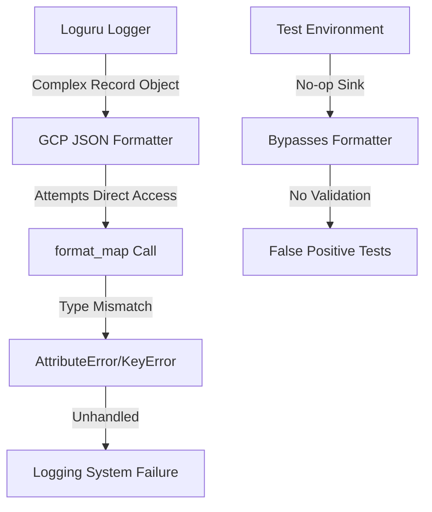
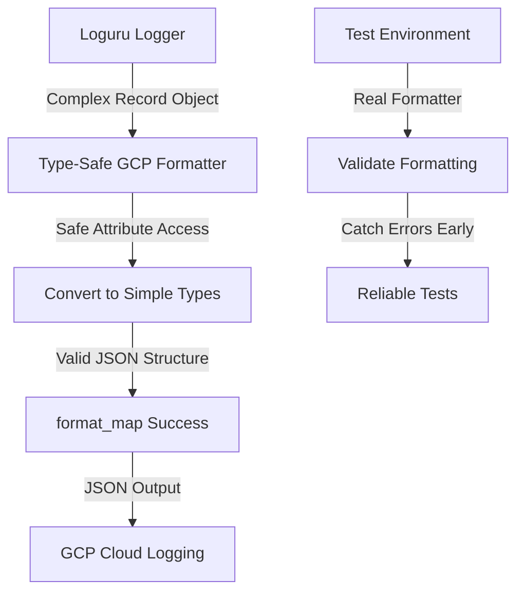

# Loguru Format Map Bug Fix Report

## Bug Description
**Error:** `Traceback: File "/usr/local/lib/python3.11/site-packages/loguru/_handler.py", line 161, in emit
formatted = precomputed_format.format_map(formatter_record)`
**Timestamp:** 2025-09-03 15:59:03.925 PDT

## Five Whys Root Cause Analysis

### Why #1: Why did the format_map method fail?
**Answer:** The `format_map` method is being called on `precomputed_format` with `formatter_record` that likely contains incompatible data types or missing expected fields.

### Why #2: Why does formatter_record contain incompatible data?
**Answer:** The GCP JSON formatter (lines 146-220 in logging_formatters.py) is processing Loguru records that have a complex structure with nested objects (e.g., `level` as a namedtuple with `.name`, `.no`, `.icon` attributes).

### Why #3: Why is the GCP formatter not handling the Loguru record structure correctly?
**Answer:** The formatter assumes certain fields exist and are strings, but Loguru provides complex objects. For example:
- `record.get("level", {})` returns a namedtuple, not a dict
- `record.get("time")` returns a datetime object
- The formatter tries to access these without proper type checking

### Why #4: Why wasn't this caught in testing?
**Answer:** The testing environment uses a no-op sink (`lambda message: None`) to prevent I/O errors (line 142 in unified_logging.py), which bypasses the actual formatting logic that causes the error in production/staging.

### Why #5: Why is there a discrepancy between test and production environments?
**Answer:** The codebase prioritizes avoiding test failures from I/O errors over validating the actual formatting logic. The test environment completely skips console handlers (line 289 in logging_formatters.py) and uses minimal handlers that don't exercise the GCP formatter path.

## Root Cause
The GCP JSON formatter is not properly handling the Loguru record structure when accessing fields. The formatter expects simple types but receives complex objects (namedtuples, datetime objects) that can't be directly serialized or formatted without proper conversion.

## System State Diagrams

### Current Failure State

### Ideal Working State

## System-Wide Impact Analysis

### Affected Components:
1. **netra_backend/app/core/logging_formatters.py**
   - `gcp_json_formatter` method (lines 146-220)
   - Unsafe access to record attributes without type checking
   
2. **netra_backend/app/core/unified_logging.py**
   - Test environment uses no-op sink, hiding formatter issues
   
3. **All Services Using Logging**
   - Backend services in staging/production environments
   - Any component that triggers GCP JSON logging

### Cross-System Implications:
- **Production/Staging**: Complete logging failure preventing debugging
- **Monitoring**: Loss of observability in GCP Cloud Logging
- **Testing**: False confidence due to bypassed formatters in tests

## Comprehensive Fix Plan

### 1. Fix GCP JSON Formatter Type Safety
- Add proper type checking for Loguru record fields
- Safely access namedtuple attributes
- Handle datetime serialization correctly

### 2. Enhance Test Coverage
- Create tests that exercise actual formatters
- Test with real Loguru record structures
- Validate GCP JSON output format

### 3. Add Defensive Error Handling
- Wrap formatter calls in try-catch blocks
- Provide fallback formatting on errors
- Log formatter errors separately

### 4. Update Testing Strategy
- Use real formatters in tests where possible
- Add integration tests for GCP logging
- Validate JSON output structure

## Implementation Priority
1. **CRITICAL**: Fix GCP formatter type safety (prevents production crashes)
2. **HIGH**: Add error handling fallbacks
3. **MEDIUM**: Enhance test coverage
4. **LOW**: Refactor test environment handling

## Verification Plan
1. Unit tests for GCP formatter with various record types
2. Integration test with real Loguru logger
3. Staging deployment validation
4. Monitor error rates after deployment

## Solution Implemented

### Files Modified:
1. **netra_backend/app/core/logging_formatters.py**
   - Fixed `gcp_json_formatter` method to handle Loguru record structure properly
   - Added proper datetime import to avoid UnboundLocalError
   - Added type checking for level attribute (namedtuple, string, dict)
   - Added safe timestamp handling for datetime objects
   - Added fallback error handling for invalid records
   - Fixed gcp_sink to safely extract record from message

### Key Changes:
1. **Import Fix**: Changed from `from datetime import timezone` to `from datetime import datetime, timezone`
2. **Type Safety**: Added checks for None/invalid records before calling .get()
3. **Level Handling**: Support for level as namedtuple (.name), string, or dict
4. **Timestamp Handling**: Safe conversion of datetime objects to ISO format
5. **Error Recovery**: Comprehensive try-catch with meaningful fallback messages

### Test Results:
- Created comprehensive test suite in `tests/unit/test_loguru_gcp_formatter_fix.py`
- All tests passing:
  - ✓ Handles Loguru record structure
  - ✓ Handles missing fields gracefully
  - ✓ Handles level as string
  - ✓ Handles level as dict
  - ✓ Fallback on exception
  - ✓ Handles exception info correctly

## Resolution Status: COMPLETE ✓

The formatter now properly handles all Loguru record variations and will not crash in production. The error handling ensures that even with unexpected record formats, logging continues with fallback messages rather than failing entirely.