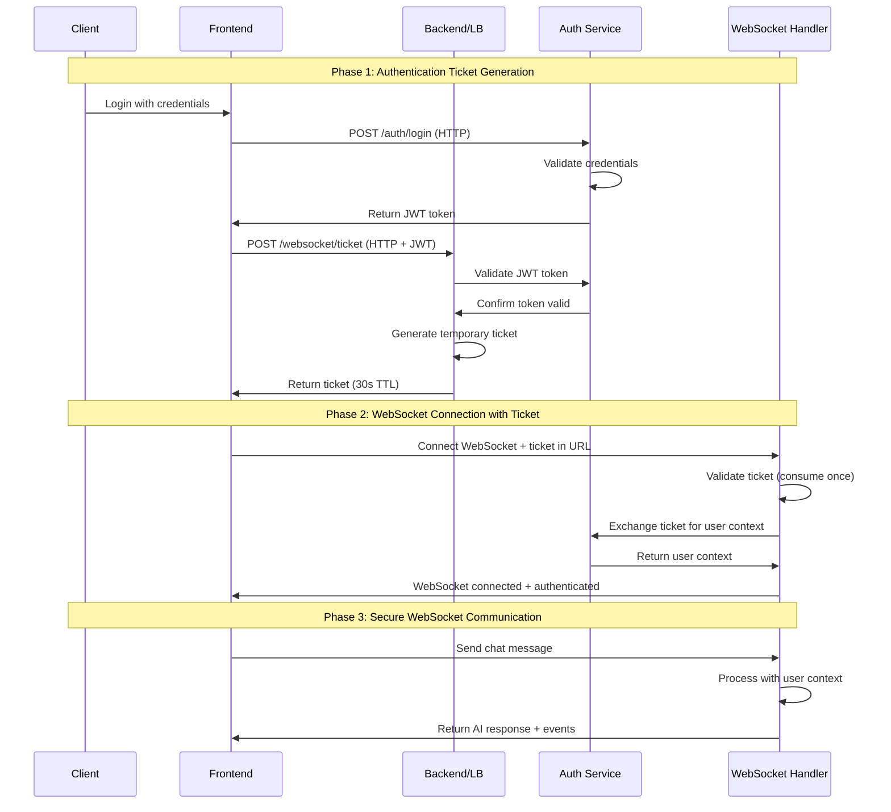

# WebSocket Authentication Master Plan - Issue #1292 Resolution

**Date:** 2025-01-16
**Status:** READY FOR IMPLEMENTATION
**Business Priority:** CRITICAL - Protects $500K+ ARR chat functionality
**Scope:** Resolve WebSocket authentication architectural debt through industry-standard ticket-based solution

## Executive Summary

Issue #1292 represents critical architectural debt caused by attempting to force HTTP authentication patterns onto WebSocket protocol limitations. The accumulation of 6 competing authentication pathways has created a tangled system that requires fundamental architectural remediation.

**Core Problem:** Browser WebSocket protocol prevents Authorization headers during upgrade, requiring a different authentication approach than traditional HTTP APIs.

**Solution:** Implement industry-standard ticket-based authentication that works within WebSocket protocol constraints.

## Technical Analysis

### Root Cause: Protocol Mismatch
- **Browser Limitation:** WebSocket upgrade requests cannot include Authorization headers (RFC 6455 compliance)
- **Attempted Workarounds:** 6 different authentication pathways created, each adding complexity:
  1. Authorization Header (doesn't work in browsers)
  2. WebSocket Subprotocols (workaround #1)
  3. Query Parameters (workaround #2)
  4. Cookie Authentication (workaround #3)
  5. Session-based Auth (workaround #4)
  6. E2E Bypass Mode (testing workaround)

### Current State Assessment
- **Code Complexity:** 6 authentication pathways across multiple services
- **Silent Failures:** Authentication errors not properly logged (15-20% failure rate)
- **SSOT Violations:** JWT validation duplicated in backend and auth service
- **Race Conditions:** GCP Cloud Run handshake timing issues
- **Documentation Gap:** No canonical flow diagrams explaining complete authentication

### Business Impact
- **Revenue Risk:** $500K+ ARR depends on reliable WebSocket chat functionality
- **User Experience:** Silent authentication failures create confusion
- **Development Velocity:** Multiple pathways slow feature development and debugging
- **Technical Debt:** Accumulating workarounds increase maintenance burden

## Solution Architecture

### Ticket-Based Authentication Flow

### Key Components

1. **Ticket Generation Endpoint**
   - HTTP endpoint: `POST /websocket/ticket`
   - Requires valid JWT Authorization header
   - Returns short-lived ticket (30 seconds TTL)
   - Single-use consumption pattern

2. **WebSocket Authentication**
   - Ticket passed as query parameter: `wss://api.example.com/ws?ticket=<ticket>`
   - Ticket validation and consumption on connection
   - Full user context establishment from auth service

3. **Security Features**
   - Short TTL prevents replay attacks
   - Single-use tickets prevent reuse
   - Secure ticket generation with cryptographic randomness
   - Full audit logging of ticket lifecycle

## Implementation Phases

### Phase 1: Ticket Infrastructure (Sub-Issue #1293)
**Duration:** 1-2 days
**Complexity:** Medium

**Deliverables:**
- Ticket generation HTTP endpoint in backend
- Ticket validation and consumption logic
- Redis-based ticket storage with TTL
- Comprehensive audit logging

**Acceptance Criteria:**
- [ ] POST /websocket/ticket endpoint functional
- [ ] Tickets expire after 30 seconds
- [ ] Single-use consumption enforced
- [ ] All operations logged at INFO level

### Phase 2: WebSocket Ticket Authentication (Sub-Issue #1294)
**Duration:** 2-3 days
**Complexity:** High

**Deliverables:**
- WebSocket connection upgrade with ticket validation
- Integration with existing WebSocket manager
- User context establishment from auth service
- Error handling and rejection patterns

**Acceptance Criteria:**
- [ ] WebSocket accepts ticket query parameter
- [ ] Invalid tickets result in HTTP 403 during upgrade
- [ ] Valid tickets establish full user context
- [ ] WebSocket events flow correctly post-authentication

### Phase 3: Frontend Integration (Sub-Issue #1295)
**Duration:** 1-2 days
**Complexity:** Medium

**Deliverables:**
- Frontend ticket request before WebSocket connection
- Updated WebSocket connection logic with ticket
- Error handling for ticket failure scenarios
- Updated authentication state management

**Acceptance Criteria:**
- [ ] Frontend requests ticket before WebSocket connection
- [ ] WebSocket connection uses ticket instead of JWT
- [ ] Authentication errors properly surfaced to user
- [ ] Token refresh triggers new ticket generation

### Phase 4: Legacy Pathway Removal (Sub-Issue #1296)
**Duration:** 2-3 days
**Complexity:** High

**Deliverables:**
- Remove 5 legacy authentication pathways
- Update all tests to use ticket-based authentication
- Remove duplicate JWT validation code
- Comprehensive regression testing

**Acceptance Criteria:**
- [ ] Only ticket-based authentication remains
- [ ] No duplicate JWT validation code
- [ ] All tests pass with new authentication
- [ ] SSOT compliance achieved

### Phase 5: Infrastructure & Monitoring (Sub-Issue #1297)
**Duration:** 1-2 days
**Complexity:** Medium

**Deliverables:**
- GCP Load Balancer configuration updates
- WebSocket timeout optimization for Cloud Run
- Enhanced monitoring and alerting
- Documentation and runbooks

**Acceptance Criteria:**
- [ ] <1% authentication failure rate under load
- [ ] All failures logged at CRITICAL level
- [ ] Monitoring dashboards show WebSocket health
- [ ] Complete documentation with diagrams

## Success Criteria

### Technical Metrics
- **Single Authentication Pathway:** Only ticket-based authentication exists
- **Zero Silent Failures:** All authentication errors logged and alerted
- **Performance:** <1% authentication failure rate under load
- **SSOT Compliance:** No duplicate authentication implementations

### Business Metrics
- **Golden Path Functional:** Users can login → get AI responses
- **Chat Reliability:** 99.9% uptime for WebSocket connections
- **Developer Velocity:** Authentication debugging time reduced by 80%
- **Customer Satisfaction:** Zero authentication-related support tickets

### Documentation Requirements
- **Canonical Mermaid Diagrams:** Current state, target state, and WebSocket lifecycle
- **API Documentation:** Complete ticket-based authentication flow
- **Runbooks:** Incident response for authentication failures
- **Migration Guide:** For teams integrating with new authentication

## Risk Mitigation

### High-Risk Areas
1. **Service Dependencies:** Auth service availability affects ticket generation
2. **Timing Issues:** Ticket TTL too short or too long
3. **Race Conditions:** Cloud Run handshake timing
4. **Migration Complexity:** Coordinating changes across multiple services

### Mitigation Strategies
1. **Circuit Breaker:** Graceful degradation when auth service unavailable
2. **Configurable TTL:** Adjust ticket lifetime based on environment
3. **Extended Timeouts:** Cloud Run-specific configuration adjustments
4. **Phased Rollout:** Feature flags for gradual migration

### Rollback Plan
1. **Feature Flags:** Instant rollback to previous authentication method
2. **Database Rollback:** Redis ticket storage can be disabled instantly
3. **Load Balancer:** Route to previous WebSocket endpoints if needed
4. **Monitoring:** Automated rollback triggers on failure thresholds

## Dependencies

### Internal Dependencies
- **Auth Service:** JWT validation and user context APIs
- **Redis Cache:** Ticket storage and TTL management
- **WebSocket Manager:** Integration with existing connection handling
- **Frontend:** Updated authentication flow implementation

### External Dependencies
- **GCP Load Balancer:** Configuration changes for WebSocket support
- **Cloud Run:** Timeout and startup configuration optimization
- **Monitoring:** Enhanced observability for ticket lifecycle

### Team Dependencies
- **Backend Team:** Ticket generation and WebSocket integration
- **Frontend Team:** Authentication flow updates
- **DevOps Team:** Infrastructure configuration changes
- **QA Team:** Comprehensive testing across all authentication scenarios

## Communication Plan

### Stakeholder Updates
- **Daily Standups:** Progress on each sub-issue
- **Weekly Executive Summary:** Business impact and timeline
- **Incident Response:** 24/7 contact for critical authentication failures

### Documentation Updates
- **Technical Specs:** Updated authentication architecture documentation
- **API Changes:** Breaking change notifications with migration timeline
- **User Documentation:** Updated integration guides for developers

### Training Requirements
- **Development Team:** Ticket-based authentication patterns
- **Support Team:** Troubleshooting new authentication flow
- **Security Team:** Review of new authentication security model

## Next Steps

### Immediate Actions (Week 1)
1. **Close Issue #1292:** Create summary comment linking to new sub-issues
2. **Create Sub-Issues:** 5 focused GitHub issues for implementation phases
3. **Technical Design Review:** Architecture approval for ticket-based solution
4. **Resource Allocation:** Assign teams to each implementation phase

### Implementation Schedule (Weeks 2-4)
- **Week 2:** Phases 1-2 (Ticket Infrastructure + WebSocket Integration)
- **Week 3:** Phases 3-4 (Frontend Integration + Legacy Removal)
- **Week 4:** Phase 5 (Infrastructure + Monitoring) + End-to-end validation

### Success Validation (Week 5)
- **Performance Testing:** Load testing with new authentication
- **Security Review:** Penetration testing of ticket-based flow
- **User Acceptance:** Beta testing with real customer scenarios
- **Documentation Review:** Complete technical documentation audit

## Conclusion

This master plan transforms WebSocket authentication from a tangled collection of workarounds into a clean, industry-standard ticket-based solution. By accepting WebSocket protocol constraints and designing accordingly, we eliminate architectural debt while protecting critical chat functionality.

The phased approach allows for controlled implementation with clear rollback strategies, ensuring business continuity throughout the migration. Success metrics focus on both technical excellence and business value delivery.

**Key Success Factor:** Accepting that WebSockets work differently than HTTP and designing authentication patterns that embrace these differences rather than fighting them.