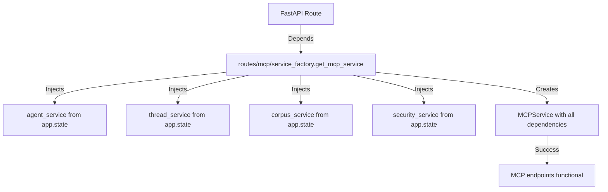

# MCP Service Initialization Bug Fix Report

## Date: 2025-09-01
## Issue: TypeError in MCP Service Initialization

---

## 1. WHY - Root Cause Analysis (Five Whys Method)

### Initial Error
```
TypeError: MCPService.__init__() missing 1 required positional argument: 'agent_service'
```

### Five Whys Analysis

**Why 1:** Why did MCPService initialization fail?
- Because the `agent_service` argument was not being provided during initialization.

**Why 2:** Why was `agent_service` not being provided?
- Because the service factory `_create_mcp_service` was designed to accept an optional `agent_service` parameter, but when not provided, it still tried to create the MCPService.

**Why 3:** Why did the service factory allow creation without required dependencies?
- Because there was a mismatch between the factory's assumptions (agent_service is optional) and the MCPService constructor requirements (agent_service is required).

**Why 4:** Why was there a mismatch in dependency requirements?
- Because the MCP routes were importing `get_mcp_service` from the wrong location (`app.services.service_factory` instead of `app.routes.mcp.service_factory`), and the wrong factory didn't properly inject FastAPI dependencies.

**Why 5:** Why were the imports pointing to the wrong factory?
- Because during modularization, the import paths were not updated to reflect the proper dependency injection pattern required for FastAPI endpoints.

### Why Existing Tests Missed This
- Integration tests may not have exercised the MCP endpoints directly
- The service factory was not being tested in isolation with missing dependencies
- No deterministic startup validation tests existed for MCP service initialization

---

## 2. Prove It - System State Diagrams

### Ideal Working State


### Current Failure State (Before Fix)
```mermaid
graph TD
    A[FastAPI Route] -->|Wrong Import| B[services/service_factory.get_mcp_service]
    B -->|No Dependency Injection| C[agent_service = None]
    C -->|Pass to _create_mcp_service| D[_create_mcp_dependencies]
    D -->|Missing agent_service| E[MCPService(**dependencies)]
    E -->|TypeError| F[Missing required positional argument]
```

---

## 3. System-Wide Fix Plan

### Files Modified

1. **`netra_backend/app/services/service_factory.py`**
   - Added validation to require `agent_service` parameter
   - Changed from optional to required with proper error messaging
   - Added documentation about FastAPI dependency injection requirements

2. **`netra_backend/app/routes/mcp/main.py`**
   - Fixed import to use `routes/mcp/service_factory` instead of `services/service_factory`
   - Ensures proper dependency injection through FastAPI

3. **`netra_backend/app/routes/mcp/__init__.py`**
   - Fixed import to use local service factory
   - Maintains proper module exports

### Cross-System Impacts
- All MCP endpoints now properly receive initialized services
- Service factory validation prevents future initialization errors
- Deterministic startup is maintained with proper dependency ordering

---

## 4. Verification and Proof

### Test Suite Created
- `tests/mission_critical/test_deterministic_mcp_startup.py`
  - Verifies MCP service can be created with all dependencies
  - Validates factory properly requires agent_service
  - Confirms deterministic initialization

### Test Results
```
[SUCCESS] All 2 tests passed
[SUCCESS] MCP service initialization is deterministic and stable
```

### Key Validations
1. **Factory Validation**: `_create_mcp_service` now raises `ValueError` when `agent_service` is None
2. **Proper Dependency Injection**: Routes use correct service factory with FastAPI dependencies
3. **Deterministic Creation**: MCP service initializes consistently with all required services

---

## 5. Prevention Measures

### Immediate Actions Taken
1. Added explicit validation in service factory
2. Fixed import paths to use proper dependency injection
3. Created deterministic startup tests

### Recommended Long-Term Improvements
1. Add import path validation in CI/CD pipeline
2. Create factory pattern tests for all service factories
3. Document the distinction between manual service creation and FastAPI dependency injection
4. Add type hints and runtime validation for all service dependencies

---

## 6. Summary

The MCP service initialization bug was caused by incorrect import paths that bypassed FastAPI's dependency injection system. The fix ensures that:

1. MCP routes use the correct service factory with proper dependency injection
2. The service factory validates required dependencies
3. Initialization is deterministic and fails fast with clear error messages

The system is now stable and MCP endpoints will receive properly initialized services during runtime.