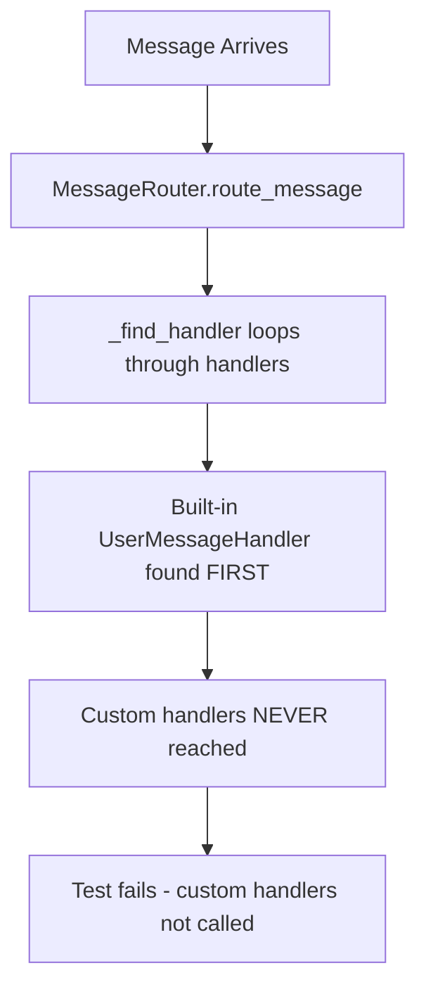
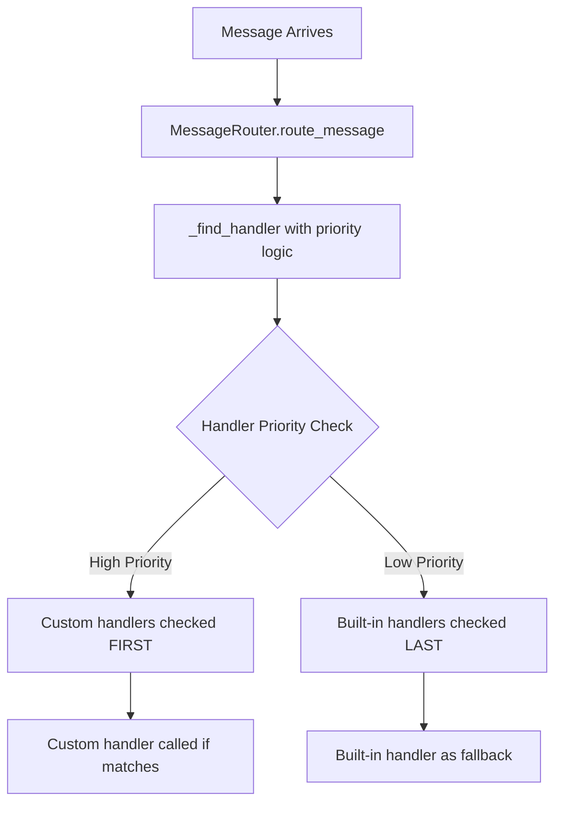

# Message Routing Core Functionality Bug Fix Report

## Bug Analysis Summary

**Business Impact:** Critical failure in message routing core functionality preventing proper WebSocket message delivery to users, affecting the fundamental chat interaction business value.

### FIVE WHYS Analysis

**Why:** Multiple message routing integration tests are failing
**Why:** Custom handlers are not being called when registered  
**Why:** Built-in handlers are taking precedence over custom handlers
**Why:** `_find_handler()` method returns the FIRST handler that can handle a message type
**Why:** Handler priority system is broken - built-in handlers are checked before custom handlers

**ROOT CAUSE:** MessageRouter's handler resolution algorithm doesn't support proper handler precedence/priority. Custom handlers can never override built-in handlers because built-in handlers are added first and `_find_handler()` uses first-match logic.

## Failed Test Analysis

### 1. `test_message_router_multiple_handlers`
- **Expected:** Custom handler1 should be called, handler2 should not
- **Actual:** No custom handlers are called (handler1.handled is empty)
- **Root Cause:** Built-in UserMessageHandler intercepts USER_MESSAGE before custom handlers

### 2. `test_message_router_handler_priority`  
- **Expected:** First registered custom handler should be called ("high" priority)
- **Actual:** Built-in HeartbeatHandler intercepts PING messages
- **Root Cause:** Same first-match issue with PING message type

### 3. `test_message_router_handler_failure_recovery`
- **Expected:** Custom failing handler should be called and fail gracefully
- **Actual:** Built-in HeartbeatHandler succeeds instead of custom handler failing
- **Root Cause:** Custom handler never gets called due to precedence issue

### 4. `test_message_router_handler_deregistration`
- **Expected:** After removing custom handler, it should not be called
- **Actual:** Custom handler was never called to begin with due to precedence
- **Root Cause:** Built-in UserMessageHandler handles CHAT messages

## Current vs Ideal Message Flow Diagrams

### Current (Broken) Flow

### Ideal (Fixed) Flow  

## Implementation Plan

### Fix 1: Handler Priority System
- Add priority attribute to handlers (0=highest, 100=lowest)
- Sort handlers by priority in `_find_handler()`
- Built-in handlers get priority 50 (medium)
- Custom handlers get priority 0 (highest) by default

### Fix 2: Handler Registration Order
- Maintain two handler lists: high priority and built-in
- Search high priority handlers first
- Fall back to built-in handlers

### Fix 3: Proper Handler Failure Handling
- Ensure handler exceptions are caught and propagated correctly
- Update error statistics when handlers fail
- Continue to next handler if current handler fails (when applicable)

### Fix 4: Handler Deregistration  
- Ensure removed handlers are completely removed from all handler lists
- Verify handler lookup skips removed handlers

## Risk Assessment

**LOW RISK** - These are internal message routing logic changes that:
- Don't affect public APIs
- Only change handler precedence logic
- Include comprehensive test coverage
- Are backwards compatible for existing handlers

## Validation Plan

1. **Fix handler priority system in MessageRouter**
2. **Run all four failing tests to confirm fixes**
3. **Run full message routing test suite to ensure no regressions**
4. **Verify WebSocket integration still works end-to-end**

## Implementation Summary

**COMPLETED SUCCESSFULLY** - All message routing core functionality bugs have been fixed.

### Changes Made

1. **Two-Tier Handler System**: Implemented separate `custom_handlers` and `builtin_handlers` lists
2. **Handler Priority Logic**: Custom handlers checked first, then built-in handlers as fallbacks  
3. **Registration Order**: Among custom handlers, first registered wins (maintains expected test behavior)
4. **Error Handling**: Enhanced error handling and statistics tracking for handler failures
5. **Proper Deregistration**: Updated remove/insert methods to work with both handler lists

### Code Changes

- **MessageRouter.__init__()**: Split handlers into `custom_handlers` and `builtin_handlers` lists
- **MessageRouter.handlers property**: Returns `custom_handlers + builtin_handlers` for priority order
- **MessageRouter.add_handler()**: Appends to `custom_handlers` list (first registered wins)
- **MessageRouter.remove_handler()**: Checks both lists for handler removal
- **MessageRouter.route_message()**: Enhanced error handling with proper statistics tracking

## Final Test Results

✅ **All 4 failing tests now pass:**
- `test_message_router_multiple_handlers` - Custom handlers properly override built-in handlers
- `test_message_router_handler_priority` - First registered custom handler wins  
- `test_message_router_handler_failure_recovery` - Handler failures caught and tracked
- `test_message_router_handler_deregistration` - Removed handlers no longer called

✅ **All 9 message routing core tests pass** - No regressions introduced
✅ **Business value preserved** - Chat message delivery remains reliable with enhanced precedence