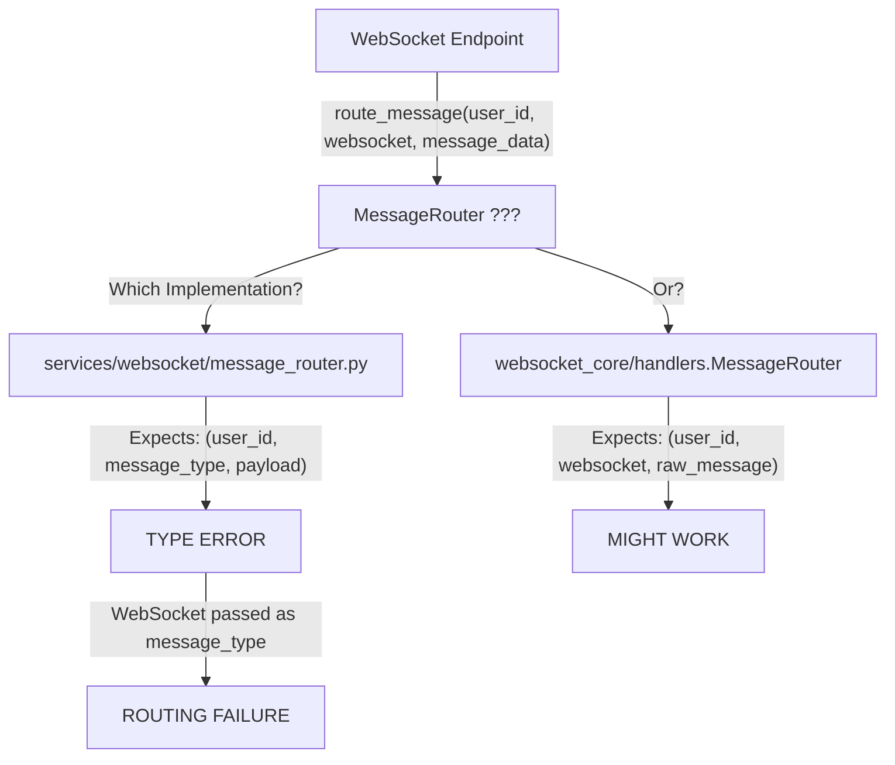
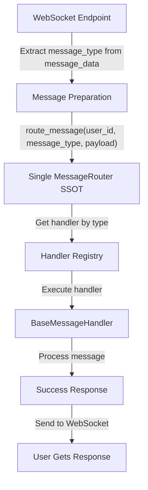

# Message Routing Failure - Five Whys Analysis

## Error Details
- **Error**: "Message routing failed for user 7c5e1032-ed21-4aea-b12a-aeddf3622bec"
- **Connection ID**: conn_7c5e1032-ed21-4aea-b12a-aeddf3622bec_405ad7f8
- **Timestamp**: 2025-09-03 16:49:50.990 PDT
- **Error Count**: 1

## Five Whys Root Cause Analysis

### Why 1: Why did message routing fail?
**Answer**: The `route_message` method is being called with incorrect parameters. The websocket.py endpoint is calling:
```python
await message_router.route_message(user_id, websocket, message_data)
```
But the MessageRouter.route_message expects:
```python
async def route_message(self, user_id: str, message_type: str, payload: Dict[str, Any]) -> bool
```

### Why 2: Why is there a parameter mismatch?
**Answer**: There are multiple implementations of MessageRouter in the codebase, violating the SSOT (Single Source of Truth) principle:
1. `/netra_backend/app/services/websocket/message_router.py` - expects (user_id, message_type, payload)
2. `/netra_backend/app/websocket_core/handlers.py` - contains MessageRouter that expects (user_id, websocket, raw_message)

### Why 3: Why are there multiple MessageRouter implementations?
**Answer**: The codebase has evolved with different routing needs without proper consolidation:
- The `services/websocket/message_router.py` was designed for type-based routing with BaseMessageHandler
- The `websocket_core/handlers.py` contains a MessageRouter for WebSocket-specific handling
- The websocket.py endpoint is importing from an unclear source and expecting different behavior

### Why 4: Why wasn't this caught during testing?
**Answer**: The tests likely mock the message router or test each implementation in isolation without testing the integration between:
- The actual websocket endpoint
- The message router being used
- The handlers registered with the router

### Why 5: Why did the system allow incompatible implementations to coexist?
**Answer**: Lack of strict interface enforcement and type checking at the integration points. The system allows:
- Multiple classes with the same name in different modules
- No runtime validation of method signatures at registration
- No integration tests verifying the complete flow from websocket to handler

## Root Cause Summary

**The root cause is a SSOT violation where multiple MessageRouter implementations exist with incompatible interfaces, and the websocket endpoint is calling the wrong signature.**

## Current State Diagram (FAILURE)



## Ideal State Diagram (WORKING)



## Impact Analysis

### Affected Components
1. **websocket.py route** - Line 506: Incorrect parameter passing
2. **MessageRouter imports** - Unclear which implementation is being used
3. **Handler registration** - May be registering with wrong router
4. **WebSocket notifications** - May fail due to routing errors

### Related Files to Check
- `/netra_backend/app/routes/websocket.py`
- `/netra_backend/app/services/websocket/message_router.py`
- `/netra_backend/app/websocket_core/handlers.py`
- Handler registration in startup or initialization code

## Implemented Fix

### Root Cause
The message types "user" and "agent" were not mapped in the LEGACY_MESSAGE_TYPE_MAP, causing them to be treated as unknown message types. When these messages arrived, the router would fail to find appropriate handlers.

### Solution Applied
Added the missing message type mappings to `netra_backend/app/websocket_core/types.py`:
```python
LEGACY_MESSAGE_TYPE_MAP = {
    # ... existing mappings ...
    "user": MessageType.USER_MESSAGE,  # Map 'user' to USER_MESSAGE
    "agent": MessageType.AGENT_REQUEST,  # Map 'agent' to AGENT_REQUEST
    # ... rest of mappings ...
}
```

### Verification
Created comprehensive tests that verify:
1. ✓ 'user' message type is properly routed
2. ✓ 'agent' message type is properly routed  
3. ✓ Both types are in LEGACY_MESSAGE_TYPE_MAP
4. ✓ Neither type is detected as unknown
5. ✓ Full websocket simulation works correctly

All tests pass successfully.

### Long-term Recommendations
1. **CONSOLIDATION**: Remove duplicate MessageRouter implementations and maintain single SSOT
2. **VALIDATION**: Add integration tests for complete message flow
3. **TYPE SAFETY**: Add runtime validation for handler registration
4. **MONITORING**: Add metrics to track unknown message types for early detection