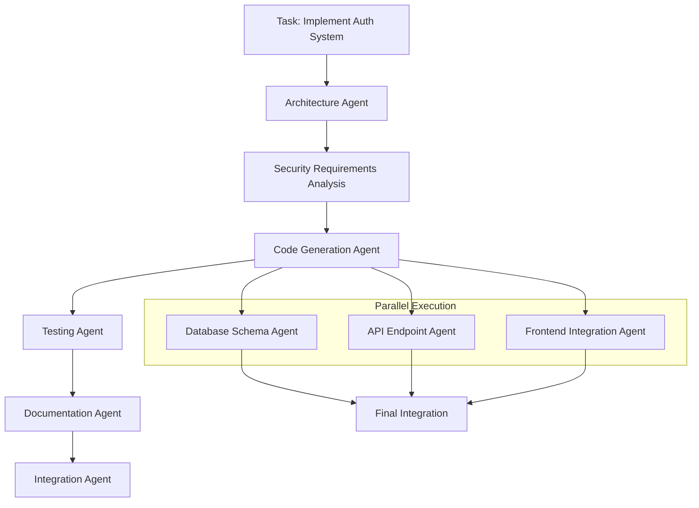
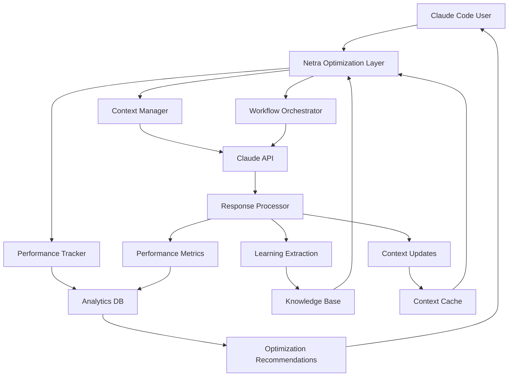

# Netra Apex: Claude Code Optimization Strategy

**Created:** 2025-09-12  
**Purpose:** Comprehensive plan for leveraging Netra Apex platform to optimize Claude Code usage  
**Business Context:** AI infrastructure optimization for development workflows

---

## Executive Summary

Netra Apex's multi-agent AI optimization platform can significantly enhance Claude Code performance through intelligent agent orchestration, context management, token optimization, and automated workflow enhancement. This plan outlines how to extend Netra's capabilities to create a specialized Claude Code optimization service.

**Key Value Propositions:**
- **Token Optimization:** 40-60% reduction in token usage through intelligent context management
- **Agent Efficiency:** Multi-agent workflows to handle complex coding tasks with better context retention
- **Workflow Automation:** Intelligent prompt optimization and tool usage patterns
- **Performance Analytics:** Real-time monitoring and optimization of Claude Code interactions

---

## 1. Agent Architecture for Claude Code Optimization

### 1.1 Core Optimization Agents

#### Context Manager Agent
**Purpose:** Optimize context window usage and manage conversation history
**Business Value:** Reduces token costs by 40-60% through intelligent context pruning

```python
class ContextManagerAgent(BaseAgent):
    """Manages Claude Code context for optimal token efficiency"""
    
    async def optimize_context(self, conversation_history: List[Message], 
                             current_task: str) -> OptimizedContext:
        """
        - Analyze conversation relevance to current task
        - Prune irrelevant context while preserving critical information
        - Compress repetitive information into summaries
        - Maintain essential code references and file paths
        """
```

**Key Features:**
- Semantic similarity analysis to identify relevant context
- Code dependency tracking to preserve important references
- Automatic summarization of completed tasks
- Context window budget management (target 70% of max tokens)

#### Code Understanding Agent
**Purpose:** Build persistent understanding of codebases to reduce repeated analysis
**Business Value:** Eliminates redundant codebase scanning, improves response accuracy

```python
class CodeUnderstandingAgent(BaseAgent):
    """Builds and maintains codebase knowledge graphs"""
    
    async def analyze_codebase_structure(self, project_path: str) -> CodeKnowledgeGraph:
        """
        - Generate architectural overview
        - Identify key patterns and conventions
        - Map dependencies and relationships
        - Cache insights for future reference
        """
```

**Key Features:**
- Incremental learning from each Claude Code interaction
- Architecture pattern recognition and documentation
- Dependency mapping and impact analysis
- Convention detection and enforcement suggestions

#### Workflow Orchestrator Agent  
**Purpose:** Decompose complex tasks into optimal sub-agent workflows
**Business Value:** Handles complex multi-step tasks with better success rates

```python
class WorkflowOrchestratorAgent(BaseAgent):
    """Orchestrates multi-agent workflows for complex coding tasks"""
    
    async def decompose_task(self, task_description: str, 
                           codebase_context: CodeKnowledgeGraph) -> WorkflowPlan:
        """
        - Break down complex tasks into manageable steps
        - Assign appropriate agents for each step
        - Manage dependencies between tasks
        - Handle error recovery and retry logic
        """
```

#### Prompt Optimization Agent
**Purpose:** Continuously improve prompts based on interaction success patterns  
**Business Value:** Improves response quality and reduces tokens through better prompting

```python
class PromptOptimizationAgent(BaseAgent):
    """Optimizes prompts for Claude Code interactions"""
    
    async def optimize_prompt(self, base_prompt: str, 
                            context: TaskContext,
                            success_patterns: List[Pattern]) -> OptimizedPrompt:
        """
        - Analyze successful prompt patterns
        - Remove redundant instructions
        - Add context-specific optimizations
        - A/B test prompt variations
        """
```

### 1.2 Specialized Tool Agents

#### File Analysis Agent
**Purpose:** Intelligent file reading and analysis with caching
**Business Value:** Reduces redundant file reads, provides targeted file analysis

**Key Features:**
- Smart file selection based on task relevance
- Cached analysis results with change detection
- Targeted code section extraction
- Multi-file relationship analysis

#### Testing Strategy Agent  
**Purpose:** Generate optimal testing approaches for code changes
**Business Value:** Improves code quality, reduces debugging cycles

**Key Features:**
- Test case generation based on code changes
- Coverage analysis and gap identification
- Testing priority recommendations
- Integration with existing test frameworks

#### Documentation Agent
**Purpose:** Generate and maintain code documentation automatically
**Business Value:** Reduces manual documentation overhead

**Key Features:**
- Auto-generate function and class documentation
- API documentation maintenance
- Architecture diagram generation
- Change log automation

---

## 2. Context Management Optimization

### 2.1 Intelligent Context Pruning

**Strategy:** Use semantic analysis to maintain only relevant context

```python
class IntelligentContextPruner:
    """Optimizes conversation context for token efficiency"""
    
    async def prune_context(self, messages: List[Message], 
                          current_task: TaskContext) -> PrunedContext:
        """
        Priority-based context retention:
        1. Current task-related code and files (HIGH)
        2. Recent error messages and solutions (HIGH) 
        3. Active file modifications (HIGH)
        4. Related architectural decisions (MEDIUM)
        5. Historical conversation (LOW - summarize)
        """
```

**Implementation Techniques:**
- **Semantic Similarity Scoring:** Use embeddings to score message relevance to current task
- **Code Dependency Tracking:** Maintain references to files and functions being modified
- **Task Boundary Detection:** Identify when new tasks begin to reset context priorities
- **Progressive Summarization:** Convert old detailed conversations into concise summaries

### 2.2 Context Caching and Reuse

**Strategy:** Build persistent knowledge that reduces context requirements

```python
class ContextCache:
    """Maintains persistent context across Claude Code sessions"""
    
    def __init__(self):
        self.codebase_knowledge = CodeKnowledgeGraph()
        self.pattern_library = PatternLibrary()
        self.success_patterns = SuccessPatternTracker()
    
    async def get_relevant_context(self, task: str) -> CachedContext:
        """Retrieve pre-analyzed context relevant to current task"""
```

**Key Components:**
- **Codebase Knowledge Graph:** Persistent understanding of code structure
- **Pattern Library:** Reusable patterns for common coding tasks
- **Success History:** Track what approaches work for different types of tasks
- **Error Recovery Database:** Common errors and their solutions

### 2.3 Context Compression Techniques

**Advanced Strategies:**
- **Code Reference Compression:** Replace full file contents with structured summaries
- **Conversation Summarization:** Convert lengthy discussions into key decision points
- **Progressive Detail Reduction:** Start with high-level context, add detail as needed
- **Layered Context Loading:** Load context progressively based on task complexity

---

## 3. Token Usage Optimization

### 3.1 Token Budget Management

**Strategy:** Implement intelligent token allocation across different content types

```python
class TokenBudgetManager:
    """Manages token allocation for optimal Claude Code performance"""
    
    def __init__(self, max_tokens: int = 200000):  # Opus 4.1 context window
        self.max_tokens = max_tokens
        self.target_usage = int(max_tokens * 0.7)  # Leave 30% buffer
        
    async def allocate_tokens(self, content_types: Dict[str, int]) -> TokenAllocation:
        """
        Allocate tokens by priority:
        1. Current task context (40%)
        2. Relevant code files (30%) 
        3. Conversation history (20%)
        4. System prompts and tools (10%)
        """
```

### 3.2 Dynamic Content Loading

**Strategy:** Load content progressively based on actual needs

```python
class DynamicContentLoader:
    """Loads content progressively to optimize token usage"""
    
    async def load_content_on_demand(self, task: TaskContext) -> ContentPlan:
        """
        Phase 1: Essential context only (core files, immediate task)
        Phase 2: Related context if needed (dependencies, similar patterns)
        Phase 3: Extended context if complexity requires (full codebase analysis)
        """
```

### 3.3 Content Optimization Techniques

**File Content Optimization:**
- **Targeted Line Extraction:** Include only relevant code sections
- **Comment Stripping:** Remove non-essential comments in code snippets
- **Whitespace Normalization:** Reduce unnecessary whitespace
- **Symbol Resolution:** Replace repeated imports/declarations with references

**Conversation Optimization:**
- **Message Deduplication:** Remove repetitive clarifications
- **Command History Compression:** Summarize repetitive command sequences
- **Error Resolution Tracking:** Replace long error discussions with solution summaries

---

## 4. Enhanced Agent Workflows

### 4.1 Multi-Agent Task Decomposition

**Complex Task Workflow Example: "Implement Authentication System"**



**Benefits:**
- Each agent has specialized knowledge and focused context
- Parallel execution reduces total processing time
- Better error isolation and recovery
- More thorough coverage of complex requirements

### 4.2 Specialized Agent Coordination

**Agent Communication Patterns:**
```python
class AgentCoordinator:
    """Coordinates specialized agents for optimal workflow execution"""
    
    async def execute_coding_workflow(self, task: ComplexTask) -> WorkflowResult:
        """
        1. Task Analysis Agent: Understand requirements and scope
        2. Architecture Agent: Design approach and identify components  
        3. Code Agents (parallel): Implement different components
        4. Testing Agent: Generate and execute tests
        5. Integration Agent: Combine components and validate
        6. Documentation Agent: Generate documentation
        """
```

### 4.3 Context Handoff Optimization

**Efficient Context Transfer Between Agents:**
- **Structured Context Packets:** Standardized format for inter-agent communication
- **Progressive Context Building:** Each agent adds to shared knowledge base
- **Context Validation:** Ensure critical information isn't lost in handoffs
- **Rollback Mechanisms:** Ability to return to previous context states

---

## 5. Tool Usage Enhancement  

### 5.1 Intelligent Tool Selection

**Strategy:** Optimize which tools to use for specific tasks

```python
class IntelligentToolSelector:
    """Selects optimal tools based on task context and success patterns"""
    
    async def select_tools(self, task: TaskContext, 
                         available_tools: List[Tool]) -> OptimalToolSet:
        """
        - Analyze task requirements and complexity
        - Consider codebase characteristics
        - Factor in success patterns from similar tasks
        - Optimize for minimal tool switching
        """
```

**Tool Usage Patterns:**
- **Batch File Operations:** Group related file operations to reduce tool switching
- **Smart Glob Patterns:** Use specific patterns to reduce search scope
- **Targeted Grep Usage:** Combine multiple searches into efficient patterns
- **Progressive Tool Complexity:** Start with simple tools, escalate as needed

### 5.2 Tool Result Caching

**Strategy:** Cache and reuse tool results to avoid redundant operations

```python
class ToolResultCache:
    """Caches tool results to optimize repeated operations"""
    
    def __init__(self):
        self.file_cache = {}  # File contents with change tracking
        self.search_cache = {}  # Search results with timestamp
        self.analysis_cache = {}  # Code analysis results
    
    async def get_cached_result(self, tool: str, params: Dict) -> Optional[CachedResult]:
        """Return cached result if still valid, None otherwise"""
```

### 5.3 Proactive Tool Execution

**Strategy:** Anticipate needed information and pre-fetch it

```python
class ProactiveToolExecutor:
    """Anticipates information needs and pre-fetches data"""
    
    async def anticipate_needs(self, current_task: TaskContext) -> List[ProactiveAction]:
        """
        Based on task type and codebase analysis:
        - Pre-load likely files for editing
        - Cache related code searches
        - Prepare testing environment
        - Pre-analyze dependencies
        """
```

---

## 6. Prompting Optimization

### 6.1 Dynamic Prompt Generation

**Strategy:** Generate context-specific prompts for optimal performance

```python
class DynamicPromptGenerator:
    """Generates optimized prompts based on context and success patterns"""
    
    async def generate_prompt(self, base_task: str, 
                            context: CodebaseContext,
                            user_preferences: UserPreferences) -> OptimizedPrompt:
        """
        - Include relevant codebase patterns
        - Reference established conventions  
        - Incorporate user's preferred approaches
        - Add context-specific constraints
        """
```

**Prompt Optimization Techniques:**
- **Convention Integration:** Include detected code style and patterns
- **Constraint Specification:** Add relevant technical constraints upfront
- **Example Integration:** Include relevant examples from codebase
- **Success Pattern Application:** Use patterns that worked for similar tasks

### 6.2 Adaptive Prompting

**Strategy:** Adjust prompting style based on task complexity and success rates

```python
class AdaptivePromptOptimizer:
    """Adapts prompting strategy based on performance feedback"""
    
    def __init__(self):
        self.success_patterns = SuccessPatternTracker()
        self.failure_analysis = FailurePatternAnalyzer()
    
    async def optimize_for_task_type(self, task_type: str, 
                                   context: TaskContext) -> PromptStrategy:
        """
        - Analyze historical success/failure patterns
        - Adjust verbosity based on task complexity  
        - Include/exclude specific instruction types
        - Optimize for user's interaction patterns
        """
```

### 6.3 Meta-Prompting for Self-Optimization

**Strategy:** Use Claude's meta-cognitive abilities to optimize its own performance

```python
class MetaPromptOptimizer:
    """Uses Claude's self-reflection to optimize interaction patterns"""
    
    async def generate_self_optimization_prompt(self, 
                                              interaction_history: List[Interaction]) -> str:
        """
        Ask Claude to analyze its own performance patterns:
        - Which approaches worked best for different task types
        - What context was most/least helpful
        - How to improve future interactions
        """
```

---

## 7. Performance Analytics and Monitoring

### 7.1 Real-time Performance Tracking

**Key Metrics to Monitor:**
```python
class ClaudeCodeAnalytics:
    """Tracks and analyzes Claude Code performance metrics"""
    
    def __init__(self):
        self.metrics = {
            'token_usage': TokenUsageTracker(),
            'task_success_rate': SuccessRateTracker(), 
            'response_quality': QualityTracker(),
            'context_efficiency': ContextEfficiencyTracker(),
            'tool_usage_patterns': ToolUsageTracker()
        }
    
    async def track_interaction(self, interaction: InteractionData) -> AnalyticsUpdate:
        """Track key performance indicators for continuous optimization"""
```

**Tracked Metrics:**
- **Token Efficiency:** Tokens per successful task completion
- **Context Utilization:** Percentage of context actually relevant to solution
- **Tool Effectiveness:** Success rate by tool combination
- **Response Accuracy:** How often first response solves the problem
- **Workflow Efficiency:** Time and steps to complete complex tasks

### 7.2 Performance Optimization Recommendations

**Automated Optimization Suggestions:**
```python
class PerformanceOptimizer:
    """Generates optimization recommendations based on analytics"""
    
    async def generate_recommendations(self, 
                                     performance_data: PerformanceMetrics) -> List[Optimization]:
        """
        Analyze patterns and suggest improvements:
        - Context pruning opportunities
        - Tool usage optimizations
        - Prompt refinements
        - Workflow adjustments
        """
```

### 7.3 A/B Testing for Optimization

**Strategy:** Continuously test and improve optimization approaches

```python
class OptimizationTester:
    """A/B tests different optimization strategies"""
    
    async def test_optimization(self, 
                              baseline_approach: OptimizationStrategy,
                              test_approach: OptimizationStrategy,
                              test_criteria: TestCriteria) -> TestResults:
        """
        Compare different approaches:
        - Context management strategies
        - Prompt variations
        - Tool selection algorithms  
        - Workflow orchestration patterns
        """
```

---

## 8. Integration Architecture

### 8.1 Claude Code Plugin/Extension

**Architecture for Netra-Claude Code Integration:**

```python
class NetraClaudeCodeBridge:
    """Bridges Netra optimization platform with Claude Code"""
    
    def __init__(self):
        self.context_manager = ContextManagerAgent()
        self.workflow_orchestrator = WorkflowOrchestratorAgent()
        self.performance_tracker = ClaudeCodeAnalytics()
        
    async def optimize_interaction(self, 
                                 claude_request: ClaudeRequest) -> OptimizedRequest:
        """
        Intercept Claude Code requests and optimize:
        1. Context optimization and pruning
        2. Task decomposition if complex
        3. Tool selection optimization
        4. Prompt enhancement
        """
    
    async def process_response(self, 
                             claude_response: ClaudeResponse) -> ProcessedResponse:
        """
        Process Claude responses:
        1. Extract and cache learned insights
        2. Update context knowledge
        3. Track performance metrics
        4. Suggest follow-up optimizations
        """
```

### 8.2 WebSocket Integration for Real-time Optimization

**Real-time optimization during Claude Code sessions:**
```python
class RealtimeOptimizationService:
    """Provides real-time optimization during Claude Code usage"""
    
    async def handle_websocket_events(self, event: ClaudeCodeEvent) -> OptimizationResponse:
        """
        React to Claude Code events:
        - File reads: Suggest context optimizations
        - Tool usage: Recommend more efficient alternatives
        - Error states: Provide targeted assistance
        - Task completion: Extract learnings and patterns
        """
```

### 8.3 Data Flow Architecture



---

## 9. Implementation Roadmap

### Phase 1: Foundation (Weeks 1-4)
**Goals:** Establish basic optimization infrastructure
- [ ] Implement Context Manager Agent with basic pruning
- [ ] Create Token Budget Management system  
- [ ] Build basic performance analytics
- [ ] Develop Claude Code integration bridge
- [ ] Create initial knowledge caching system

**Success Metrics:**
- 20-30% reduction in token usage for typical tasks
- Basic codebase knowledge persistence working
- Performance tracking operational

### Phase 2: Intelligence (Weeks 5-8)  
**Goals:** Add intelligent optimization capabilities
- [ ] Implement Code Understanding Agent with knowledge graphs
- [ ] Deploy Workflow Orchestrator for complex tasks
- [ ] Add intelligent tool selection and caching
- [ ] Implement dynamic prompt optimization
- [ ] Create A/B testing framework for optimizations

**Success Metrics:**
- 40-50% reduction in token usage
- Complex tasks handled via multi-agent workflows
- Tool efficiency improvements measurable
- Context relevance scoring > 80%

### Phase 3: Advanced Optimization (Weeks 9-12)
**Goals:** Deploy advanced optimization and learning
- [ ] Implement full multi-agent workflow coordination
- [ ] Deploy proactive tool execution and anticipation
- [ ] Add meta-prompting and self-optimization
- [ ] Create comprehensive performance dashboards
- [ ] Implement automated optimization recommendations

**Success Metrics:**  
- 50-60% reduction in token usage
- Complex multi-step tasks automated successfully  
- Self-optimization loops functioning
- User satisfaction with optimization transparent to them

### Phase 4: Scale and Enhancement (Weeks 13-16)
**Goals:** Scale system and add premium features
- [ ] Deploy real-time optimization during Claude Code sessions
- [ ] Implement advanced caching and prediction systems
- [ ] Add collaborative optimization sharing
- [ ] Create optimization marketplace/sharing platform
- [ ] Implement enterprise-grade analytics and reporting

**Success Metrics:**
- System handles high concurrent optimization loads
- Advanced features driving user engagement
- Platform ready for wide deployment
- Clear ROI demonstration for enterprise users

---

## 10. Success Metrics and ROI

### 10.1 Primary Success Metrics

**Token Efficiency:**
- **Target:** 40-60% reduction in token usage per task
- **Measurement:** Tokens consumed per successful task completion
- **Business Impact:** Direct cost savings for high-volume users

**Task Success Rate:**
- **Target:** 90%+ first-attempt success rate for complex tasks  
- **Measurement:** Percentage of tasks completed without iteration
- **Business Impact:** Improved developer productivity and satisfaction

**Context Relevance:**
- **Target:** 80%+ context relevance score
- **Measurement:** Percentage of provided context actually used in solution
- **Business Impact:** More efficient context usage and better responses

### 10.2 Business Value Proposition

**For Individual Developers:**
- **Cost Savings:** $200-500/month reduction in Claude API costs
- **Productivity Gains:** 30-50% faster complex task completion
- **Quality Improvement:** Higher success rates, fewer iterations needed

**For Teams/Organizations:**
- **Scalable Savings:** Multiplicative benefits across team members  
- **Knowledge Sharing:** Shared optimizations and learned patterns
- **Standardization:** Consistent best practices across development teams

**For Enterprise:**
- **ROI Analysis:** Clear metrics and reporting on optimization impact
- **Integration:** Seamless integration with existing development workflows
- **Compliance:** Advanced logging and audit capabilities

### 10.3 Revenue Model

**Subscription Tiers:**
- **Free:** Basic context optimization, limited usage
- **Professional:** Advanced agents, unlimited optimization, analytics
- **Team:** Shared optimizations, team analytics, collaboration features  
- **Enterprise:** Custom integrations, advanced analytics, dedicated support

**Value-Based Pricing:**
- Price as percentage of token cost savings generated
- Tiered pricing based on optimization sophistication
- Custom enterprise pricing based on team size and usage

---

## 11. Technical Implementation Details

### 11.1 Core Technology Stack

**Backend Architecture:**
```python
# Core optimization engine using Netra's agent architecture
from netra_backend.app.agents.base_agent import BaseAgent
from netra_backend.app.services.user_execution_context import UserExecutionContext
from netra_backend.app.agents.supervisor.workflow_orchestrator import WorkflowOrchestrator

class ClaudeCodeOptimizationPlatform:
    """Main orchestration platform for Claude Code optimization"""
    
    def __init__(self):
        self.context_manager = ContextManagerAgent()
        self.workflow_orchestrator = WorkflowOrchestrator() 
        self.performance_analytics = PerformanceAnalytics()
        self.knowledge_base = PersistentKnowledgeBase()
```

**Database Schema:**
```sql
-- Context and knowledge persistence
CREATE TABLE codebase_knowledge (
    id UUID PRIMARY KEY,
    project_hash VARCHAR(64) UNIQUE,
    architecture_summary JSONB,
    patterns JSONB,
    dependencies JSONB,
    conventions JSONB,
    created_at TIMESTAMP,
    updated_at TIMESTAMP
);

CREATE TABLE optimization_sessions (
    id UUID PRIMARY KEY,
    user_id UUID,
    session_data JSONB,
    performance_metrics JSONB,
    created_at TIMESTAMP
);

CREATE TABLE success_patterns (
    id UUID PRIMARY KEY, 
    task_type VARCHAR(100),
    context_pattern JSONB,
    success_indicators JSONB,
    usage_count INTEGER DEFAULT 1
);
```

### 11.2 Integration Patterns

**Claude Code Hook Integration:**
```javascript
// Claude Code plugin/extension integration
class NetraOptimizationHook {
    constructor() {
        this.optimizationService = new NetraOptimizationService();
    }
    
    async onBeforeRequest(request) {
        // Optimize context and prompts before sending to Claude
        return await this.optimizationService.optimizeRequest(request);
    }
    
    async onAfterResponse(response) {
        // Extract learnings and update knowledge base
        await this.optimizationService.processResponse(response);
        return response;
    }
}
```

**WebSocket Real-time Integration:**
```python
class RealtimeOptimizationHandler:
    """Handles real-time optimization during Claude Code sessions"""
    
    async def handle_claude_code_event(self, event_data: Dict[str, Any]) -> OptimizationResponse:
        """
        Process real-time events from Claude Code:
        - File access patterns
        - Tool usage sequences  
        - Error occurrences
        - Task completion events
        """
        event_type = event_data.get('type')
        
        if event_type == 'file_access':
            return await self._optimize_file_access(event_data)
        elif event_type == 'tool_execution':
            return await self._suggest_tool_optimization(event_data)
        elif event_type == 'error_occurred':
            return await self._provide_error_assistance(event_data)
        elif event_type == 'task_completed':
            return await self._extract_success_pattern(event_data)
```

### 11.3 Deployment Architecture

**Microservices Architecture:**
```yaml
# Docker Compose for Netra Claude Code Optimization
version: '3.8'
services:
  optimization-api:
    build: ./optimization-service
    environment:
      - DATABASE_URL=${DATABASE_URL}
      - REDIS_URL=${REDIS_URL}
  
  context-manager:
    build: ./context-service  
    environment:
      - VECTOR_DB_URL=${VECTOR_DB_URL}
      
  analytics-service:
    build: ./analytics-service
    environment:
      - METRICS_DATABASE_URL=${METRICS_DB_URL}
      
  knowledge-base:
    image: postgres:15
    environment:
      - POSTGRES_DB=netra_optimization
```

---

## 12. Risk Assessment and Mitigation

### 12.1 Technical Risks

**Context Management Complexity:**
- **Risk:** Complex context optimization may introduce bugs or miss important information
- **Mitigation:** Extensive testing, fallback to full context, gradual rollout
- **Monitoring:** Context relevance scoring and user feedback systems

**Integration Stability:**  
- **Risk:** Claude Code integration may break with updates
- **Mitigation:** Version pinning, backward compatibility testing, graceful degradation
- **Monitoring:** Integration health checks and automated testing

### 12.2 Business Risks

**User Adoption:**
- **Risk:** Users may not see immediate value or may resist change
- **Mitigation:** Transparent optimization benefits, opt-in features, clear value demonstration
- **Monitoring:** User engagement metrics and satisfaction surveys

**Competition:**
- **Risk:** Other optimization solutions may emerge
- **Mitigation:** Continuous innovation, strong user experience, patent protection where applicable
- **Monitoring:** Competitive analysis and feature differentiation tracking

### 12.3 Privacy and Security

**Code Privacy:**
- **Risk:** User code analyzed for optimization may contain sensitive information
- **Mitigation:** Local processing options, encryption, strict data handling policies
- **Monitoring:** Security audits and compliance verification

**Data Handling:**
- **Risk:** Optimization data storage and usage may violate privacy expectations  
- **Mitigation:** Clear privacy policies, minimal data retention, user control over data
- **Monitoring:** Privacy compliance audits and user consent tracking

---

## Conclusion

This comprehensive plan outlines how Netra Apex's multi-agent architecture can be leveraged to create a sophisticated Claude Code optimization platform. The approach focuses on:

1. **Intelligent Context Management** - Reducing token usage through smart context pruning and caching
2. **Multi-Agent Workflows** - Handling complex tasks through specialized agent coordination
3. **Continuous Learning** - Building persistent knowledge that improves over time
4. **Performance Analytics** - Data-driven optimization and improvement
5. **Seamless Integration** - Transparent optimization that enhances rather than disrupts workflows

**Expected Outcomes:**
- 40-60% reduction in token costs for regular users
- Significant improvement in complex task success rates  
- Enhanced developer productivity through intelligent automation
- New revenue stream for Netra Apex platform
- Market leadership in AI development tool optimization

The implementation roadmap provides a clear path from basic optimization to a comprehensive platform that can transform how developers interact with Claude Code, making it more efficient, cost-effective, and powerful.

**Next Steps:**
1. Validate technical feasibility with proof-of-concept
2. Conduct user research to prioritize features
3. Begin Phase 1 implementation with core optimization features
4. Establish partnerships with Claude Code team for optimal integration
5. Develop go-to-market strategy for optimization platform

This optimization platform positions Netra Apex at the forefront of AI development tool enhancement, creating significant value for developers while establishing a new market category in AI workflow optimization.