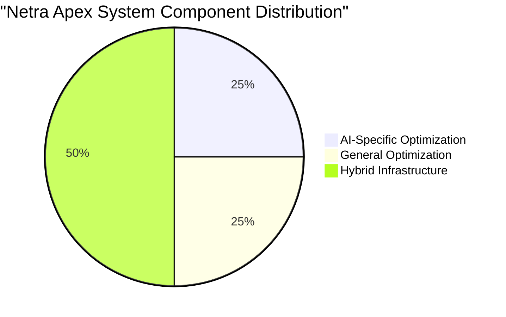
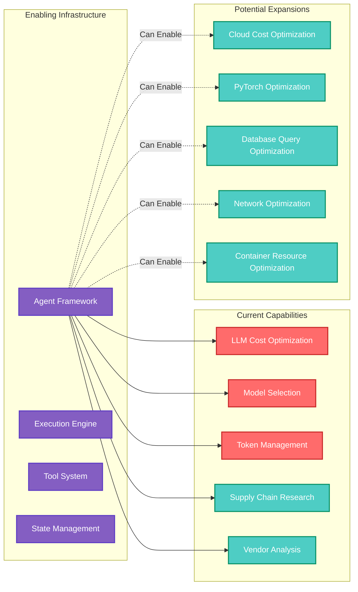

# Netra Apex: AI-Specific vs General Optimization Architecture

## System Optimization Breakdown

```mermaid
graph TB
    %% Define styles
    classDef aiSpecific fill:#ff6b6b,stroke:#c92a2a,stroke-width:3px,color:#fff
    classDef general fill:#4ecdc4,stroke:#099268,stroke-width:3px,color:#fff
    classDef hybrid fill:#845ec2,stroke:#5f3dc4,stroke-width:3px,color:#fff
    classDef platform fill:#ffd43b,stroke:#fab005,stroke-width:2px,color:#000
    
    %% Main Platform
    NETRA[<b>NETRA APEX PLATFORM</b><br/>Multi-Purpose Optimization System]:::platform
    
    %% Three Main Categories
    NETRA --> AI[<b>AI-SPECIFIC OPTIMIZATION</b><br/>~25% of System]:::aiSpecific
    NETRA --> GENERAL[<b>GENERAL OPTIMIZATION</b><br/>~25% of System]:::general
    NETRA --> HYBRID[<b>HYBRID INFRASTRUCTURE</b><br/>~50% of System]:::hybrid
    
    %% AI-Specific Components
    AI --> LLM_COST[<b>LLM Cost Optimization</b><br/>CostCalculatorService]:::aiSpecific
    AI --> MODEL_OPT[<b>Model Routing & Selection</b><br/>OptimizationsCoreSubAgent]:::aiSpecific
    AI --> TOKEN_OPT[<b>Token Management</b><br/>Prompt Engineering]:::aiSpecific
    AI --> AI_CACHE[<b>AI-Specific Caching</b><br/>Context Optimization]:::aiSpecific
    
    LLM_COST --> PROVIDER_PRICING[Provider Pricing<br/>OpenAI, Anthropic, Google]:::aiSpecific
    LLM_COST --> TOKEN_CALC[Token-based Billing<br/>Prompt vs Completion]:::aiSpecific
    
    MODEL_OPT --> QUALITY_TIERS[Quality Tiering<br/>Economy/Balanced/Premium]:::aiSpecific
    MODEL_OPT --> COST_ARB[Cost Arbitrage<br/>Cross-Model Optimization]:::aiSpecific
    
    TOKEN_OPT --> PROMPT_ENG[Prompt Engineering<br/>Context Reduction]:::aiSpecific
    TOKEN_OPT --> BATCH_OPT[Batching Strategies<br/>Request Consolidation]:::aiSpecific
    
    %% General Optimization Components
    GENERAL --> SUPPLY_CHAIN[<b>Supply Chain Research</b><br/>SupplyResearcherAgent]:::general
    GENERAL --> VENDOR_ANALYSIS[<b>Vendor Optimization</b><br/>Contract Analysis]:::general
    GENERAL --> PERF_OPT[<b>System Performance</b><br/>General Metrics]:::general
    GENERAL --> RESOURCE_OPT[<b>Resource Management</b><br/>Infrastructure Optimization]:::general
    
    SUPPLY_CHAIN --> MARKET_RESEARCH[Market Intelligence<br/>Google Deep Research]:::general
    SUPPLY_CHAIN --> SUSTAIN[Sustainability Tracking<br/>ESG Metrics]:::general
    
    VENDOR_ANALYSIS --> CONTRACT[Contract Analysis<br/>Pricing Comparison]:::general
    VENDOR_ANALYSIS --> VENDOR_SCORE[Vendor Scoring<br/>Performance Metrics]:::general
    
    %% Hybrid Infrastructure
    HYBRID --> AGENT_INFRA[<b>Agent Infrastructure</b><br/>BaseAgent Framework]:::hybrid
    HYBRID --> EXEC_ENGINE[<b>Execution Engines</b><br/>Tool Dispatchers]:::hybrid
    HYBRID --> STATE_MGMT[<b>State Management</b><br/>Session & Factory Patterns]:::hybrid
    HYBRID --> OBSERVABILITY[<b>Observability</b><br/>Monitoring & Events]:::hybrid
    
    AGENT_INFRA --> WEBSOCKET[WebSocket Events<br/>Real-time Updates]:::hybrid
    AGENT_INFRA --> RELIABILITY[Reliability Patterns<br/>Circuit Breakers]:::hybrid
    
    EXEC_ENGINE --> TOOL_DISPATCH[Tool Dispatchers<br/>Request Routing]:::hybrid
    EXEC_ENGINE --> PARALLEL_EXEC[Parallel Execution<br/>Async Processing]:::hybrid
    
    STATE_MGMT --> USER_ISO[User Isolation<br/>Multi-tenancy]:::hybrid
    STATE_MGMT --> FACTORY[Factory Patterns<br/>Dynamic Configuration]:::hybrid
    
    %% Business Value Connections
    AI -.->|Enables| AI_VALUE[<b>AI Cost Savings</b><br/>30-70% reduction<br/>in LLM costs]
    GENERAL -.->|Enables| GEN_VALUE[<b>Operational Excellence</b><br/>Supply chain<br/>optimization]
    HYBRID -.->|Enables| PLATFORM_VALUE[<b>Platform Extensibility</b><br/>New optimization<br/>domains]
    
    style AI_VALUE fill:#ffebcd,stroke:#ff6b6b,stroke-width:2px,stroke-dasharray: 5 5
    style GEN_VALUE fill:#e6fffa,stroke:#4ecdc4,stroke-width:2px,stroke-dasharray: 5 5
    style PLATFORM_VALUE fill:#f3e5ff,stroke:#845ec2,stroke-width:2px,stroke-dasharray: 5 5
```

## Component Distribution Analysis

## Optimization Capability Matrix

## Key Insights

### 🎯 Core Finding
**Netra Apex is a hybrid optimization platform** - not purely AI-focused. While it has deep specialization in AI/LLM cost optimization (25%), it's built on infrastructure (50%) that can optimize any measurable system.

### 📊 Component Breakdown

| Category | Percentage | Core Purpose | Business Value |
|----------|------------|--------------|----------------|
| **AI-Specific** | 25% | LLM cost optimization, model routing, token management | Direct AI cost savings (30-70% reduction) |
| **General Optimization** | 25% | Supply chain, vendor analysis, system performance | Operational excellence, market intelligence |
| **Hybrid Infrastructure** | 50% | Execution platform, state management, observability | Platform extensibility, multi-domain optimization |

### 🚀 Platform Extensibility

The hybrid infrastructure enables expansion into:
- **Cloud Cost Optimization**: AWS/GCP/Azure resource optimization
- **ML Framework Optimization**: PyTorch, TensorFlow performance tuning
- **Database Optimization**: Query performance, indexing strategies
- **Network Optimization**: Bandwidth, latency, routing
- **Container Optimization**: Kubernetes resource allocation

### 💡 Strategic Implications

1. **Market Positioning**: Can target both AI-specific and general optimization markets
2. **Value Proposition**: "Start with AI cost optimization, expand to full-stack optimization"
3. **Competitive Advantage**: Unified platform vs point solutions
4. **Growth Path**: Natural expansion from AI to broader optimization domains