# 🚨 ULTRA CRITICAL: Parallel SSOT Refactoring Execution Plan V2
**Project Codename:** Operation SSOT Convergence  
**Date:** 2025-09-04  
**Duration:** 3 Days (72 Hours Total)  
**Teams:** 5 Parallel Agent Teams  
**Objective:** Complete remaining SSOT violations with zero downtime

## 📊 Current State Analysis

### ✅ Already Completed (DO NOT TOUCH)
- **Factory Consolidation**: `agent_instance_factory.py` consolidated with performance config
- **WebSocket Emitter Pool**: `websocket_emitter_pool.py` created for pooling
- **Infrastructure Consolidation**: WebSocket manager scoping, UnifiedIDManager
- **Tool Dispatcher**: Consolidated to `tool_dispatcher_consolidated.py`
- **Execution Engine**: Consolidated to `execution_engine_consolidated.py`

### 🔴 Remaining Critical Violations (P0)
1. **Data Sub-Agent**: 30+ files in `data_sub_agent/` folder need consolidation
2. **Agent Registries**: Multiple registry patterns still exist
3. **Supervisor Patterns**: `supervisor_consolidated.py` needs completion
4. **Legacy Code**: 100+ files marked for deletion still present
5. **Test Consolidation**: Duplicate test infrastructures

## 📊 Parallel Execution Timeline V2

```mermaid
gantt
    title SSOT Refactoring V2 - Parallel Execution Timeline
    dateFormat HH:mm
    axisFormat %H:%M
    
    section Team Alpha (Data Agent)
    Data SubAgent Analysis          :crit, alpha1, 00:00, 4h
    Core Data Agent SSOT           :crit, alpha2, 04:00, 8h
    Module Consolidation           :crit, alpha3, 12:00, 6h
    Integration & Testing          :crit, alpha4, 18:00, 4h
    
    section Team Bravo (Registries)
    Registry Analysis              :bravo1, 00:00, 3h
    Unified Registry Design        :bravo2, 03:00, 5h
    Implementation & Migration     :bravo3, 08:00, 8h
    Validation & Cleanup           :bravo4, 16:00, 6h
    
    section Team Charlie (Supervisor)
    Supervisor Pattern Analysis    :charlie1, 00:00, 4h
    Workflow Consolidation         :charlie2, 04:00, 8h
    Agent Orchestration SSOT       :charlie3, 12:00, 6h
    End-to-End Testing            :charlie4, 18:00, 4h
    
    section Team Delta (Legacy)
    Legacy Code Identification     :delta1, 00:00, 2h
    Safe Deletion Strategy         :delta2, 02:00, 4h
    Phased Removal Execution       :delta3, 06:00, 10h
    Import Cleanup & Validation    :delta4, 16:00, 6h
    
    section Team Echo (Testing)
    Test Infrastructure Audit      :echo1, 00:00, 3h
    Unified Test Framework         :echo2, 03:00, 8h
    Migration & Consolidation      :echo3, 11:00, 8h
    CI/CD Integration              :echo4, 19:00, 3h
```



---

## 🔴 TEAM ALPHA: Data SubAgent SSOT Consolidation

**Priority:** P0 ULTRA CRITICAL  
**Lead Agent:** `DataArchitectureSpecialist`  
**Time:** Day 1, Hours 0-22  
**Dependencies:** None (can start immediately)

### Mission Critical Context
The `data_sub_agent/` folder contains 30+ files with overlapping responsibilities. This is the LARGEST remaining SSOT violation causing:
- Duplicate analysis logic across 5+ files
- Inconsistent data processing patterns
- Memory leaks from multiple cache implementations
- WebSocket event loss in data operations

### Detailed Implementation Plan

```python
# PHASE 1: MRO & Dependency Analysis (Hours 0-4)
"""
MANDATORY per CLAUDE.md Section 3.6:
1. Generate comprehensive MRO report for ALL data_sub_agent classes
2. Document in reports/mro_analysis_data_agent_[date].md
3. Map ALL consumer dependencies
4. Identify method shadowing risks
"""

# PHASE 2: Core Data Agent Architecture (Hours 4-12)
class UnifiedDataAgent:
    """SSOT for all data agent operations"""
    
    def __init__(self, config: DataAgentConfig):
        # Merge functionality from:
        # - agent_data_processing.py
        # - agent_execution.py
        # - analysis_engine.py
        # - anomaly_detection.py
        self.config = config
        self._init_strategies()
    
    def _init_strategies(self):
        """Strategy pattern for different data operations"""
        self.strategies = {
            'corpus': CorpusOperationStrategy(),
            'analysis': AnalysisEngineStrategy(),
            'anomaly': AnomalyDetectionStrategy(),
            'cache': UnifiedCacheStrategy()
        }

# PHASE 3: Module Consolidation (Hours 12-18)
"""
Consolidation targets:
1. agent_cache.py + cache_operations.py → UnifiedCacheStrategy
2. analysis_engine.py + analysis_operations.py → AnalysisEngineStrategy
3. anomaly_detection.py + agent_anomaly_processing.py → AnomalyDetectionStrategy
4. All corpus operations → CorpusOperationStrategy
"""

# PHASE 4: Testing & Validation (Hours 18-22)
"""
Create tests/unit/test_data_agent_consolidation.py:
- Test all legacy functionality preserved
- Test strategy pattern switching
- Test WebSocket event delivery
- Test concurrent data operations
- Test memory management (no leaks)
"""
```

### Files to DELETE After Consolidation
```
netra_backend/app/agents/data_sub_agent/
├── agent_anomaly_processing.py  # DELETE after merge
├── agent_cache.py               # DELETE after merge
├── agent_corpus_operations.py   # DELETE after merge
├── agent_data_processing.py     # DELETE after merge
├── agent_execution.py           # DELETE after merge
├── analysis_operations.py       # DELETE after merge
└── [15+ more duplicates]        # DELETE all redundant files
```

### Success Metrics
- Single `UnifiedDataAgent` class under 1500 lines
- All 30+ files reduced to <5 core files
- Zero regression in data processing capabilities
- <100ms data operation latency maintained

---

## 🟠 TEAM BRAVO: Registry Pattern Unification

**Priority:** P0 CRITICAL  
**Lead Agent:** `RegistryArchitect`  
**Time:** Day 1, Hours 0-22 (Parallel with Alpha)  
**Dependencies:** None

### Current Registry Chaos
```
VIOLATIONS FOUND:
- AgentRegistry + AgentClassRegistry (duplicate)
- UnifiedToolRegistry appears 3 times
- ToolDispatcherRegistry (redundant)
- ServiceRegistry patterns scattered
- 10+ ad-hoc registries in various modules
```

### Implementation Strategy

```python
# PHASE 1: Universal Registry Pattern (Hours 0-8)
class UniversalRegistry(Generic[T]):
    """SSOT for ALL registry needs"""
    
    def __init__(self, category: str):
        self.category = category
        self._items: Dict[str, T] = {}
        self._metadata: Dict[str, RegistryMetadata] = {}
        self._lock = asyncio.Lock()
    
    async def register(self, name: str, item: T, metadata: Optional[Dict] = None):
        """Thread-safe registration with metadata"""
        async with self._lock:
            self._items[name] = item
            self._metadata[name] = RegistryMetadata(
                registered_at=datetime.now(),
                category=self.category,
                custom=metadata or {}
            )
    
    def discover(self, filter_fn: Optional[Callable] = None) -> List[T]:
        """Dynamic discovery with filtering"""
        if filter_fn:
            return [v for k, v in self._items.items() if filter_fn(k, v)]
        return list(self._items.values())

# PHASE 2: Specialized Registries via Composition (Hours 8-16)
class AgentRegistry:
    """Facade for agent registration using UniversalRegistry"""
    def __init__(self):
        self._registry = UniversalRegistry[Type[BaseAgent]]("agents")
        self._init_builtin_agents()
    
    async def register_agent(self, agent_class: Type[BaseAgent]):
        """Register with agent-specific validation"""
        await self._registry.register(
            agent_class.__name__,
            agent_class,
            {"capabilities": agent_class.get_capabilities()}
        )

class ToolRegistry:
    """Facade for tool registration using UniversalRegistry"""
    def __init__(self):
        self._registry = UniversalRegistry[BaseTool]("tools")
        self._init_builtin_tools()

# PHASE 3: Migration & Cleanup (Hours 16-22)
"""
1. Update ALL imports to use new registries
2. DELETE old registry files:
   - agent_class_registry.py
   - tool_dispatcher_registry.py
   - [all duplicate registries]
3. Update dependency injection to use unified registries
"""
```

### Success Metrics
- Single `UniversalRegistry` base class
- 2-3 specialized facades (Agent, Tool, Service)
- 80% reduction in registry code
- Zero lookup performance regression

---

## 🟡 TEAM CHARLIE: Supervisor Pattern Completion

**Priority:** P1 HIGH  
**Lead Agent:** `SupervisorArchitect`  
**Time:** Day 1, Hours 0-22 (Parallel)  
**Dependencies:** Alpha (Hour 12+)

### Current Supervisor Issues
```
supervisor_consolidated.py exists but:
- Incomplete workflow orchestration
- Missing agent coordination logic
- WebSocket events not properly integrated
- Execution order issues (see AGENT_EXECUTION_ORDER_REASONING.md)
```

### Implementation Plan

```python
# PHASE 1: Workflow Pattern Analysis (Hours 0-4)
"""
Review and understand:
1. Current supervisor_consolidated.py state
2. Legacy supervisor patterns to preserve
3. Correct execution order (Data → Optimization)
4. WebSocket event requirements
"""

# PHASE 2: Complete Supervisor SSOT (Hours 4-12)
class UnifiedSupervisor:
    """SSOT for all agent orchestration"""
    
    def __init__(self, factory: AgentInstanceFactory):
        self.factory = factory
        self.workflow_engine = WorkflowEngine()
        self.coordination = CoordinationStrategy()
        self.websocket_notifier = WebSocketNotifier()
    
    async def execute_workflow(self, workflow: WorkflowDefinition, context: RequestContext):
        """Orchestrate multi-agent workflows with proper order"""
        # CRITICAL: Respect execution order from AGENT_EXECUTION_ORDER_REASONING.md
        ordered_agents = self._order_agents(workflow.agents)
        
        for agent_config in ordered_agents:
            # Send WebSocket events at each stage
            await self.websocket_notifier.agent_started(agent_config)
            
            # Execute with isolation
            result = await self._execute_agent(agent_config, context)
            
            # Coordinate results
            await self.coordination.process_result(result, context)
            
            await self.websocket_notifier.agent_completed(agent_config, result)
    
    def _order_agents(self, agents: List[AgentConfig]) -> List[AgentConfig]:
        """Enforce correct execution order"""
        # Data agents MUST run before optimization agents
        priority_map = {
            'DataAgent': 1,
            'AnalysisAgent': 2,
            'OptimizationAgent': 3,
            'ValidationAgent': 4
        }
        return sorted(agents, key=lambda a: priority_map.get(a.type, 99))

# PHASE 3: Integration & Testing (Hours 12-22)
"""
1. Integrate with UnifiedDataAgent from Team Alpha
2. Ensure all WebSocket events fire correctly
3. Test multi-agent workflows
4. Validate execution order
5. Performance benchmarking
"""
```

### Success Metrics
- Complete `UnifiedSupervisor` implementation
- All workflows execute in correct order
- 100% WebSocket event delivery
- <2s workflow initialization time

---

## 🔵 TEAM DELTA: Legacy Code Elimination

**Priority:** P1 HIGH  
**Lead Agent:** `LegacyCodeEliminator`  
**Time:** Day 1, Hours 0-22 (Parallel)  
**Dependencies:** All teams (coordinate deletions)

### Deletion Strategy

```bash
# PHASE 1: Identify all legacy code (Hours 0-2)
python scripts/identify_legacy_code.py \
  --markers "legacy,old,deprecated,backup,temp" \
  --output legacy_files.txt

# PHASE 2: Validate dependencies (Hours 2-6)
for file in $(cat legacy_files.txt); do
  grep -r "from.*$(basename $file .py) import" --include="*.py" | tee -a dependencies.txt
done

# PHASE 3: Safe deletion with verification (Hours 6-16)
python scripts/safe_legacy_deletion.py \
  --file-list legacy_files.txt \
  --verify-imports \
  --run-tests-after-each \
  --rollback-on-failure

# PHASE 4: Import cleanup (Hours 16-22)
python scripts/cleanup_dead_imports.py \
  --fix \
  --verify
```

### Priority Deletion Targets
```
HIGH PRIORITY (DELETE IMMEDIATELY):
1. agent_instance_factory_optimized.py (if still exists)
2. All backup files (__consolidation_backup__.py)
3. Legacy test files in tests/legacy/
4. Old WebSocket implementations
5. Duplicate registry files

MEDIUM PRIORITY:
1. Commented code blocks
2. Unused utility functions
3. Old migration scripts
4. Deprecated API endpoints
```

### Success Metrics
- 100+ legacy files removed
- Zero broken imports
- All tests still passing
- 50% reduction in codebase size

---

## 🟢 TEAM ECHO: Test Infrastructure Unification

**Priority:** P2 MEDIUM  
**Lead Agent:** `TestArchitect`  
**Time:** Day 1-2, Hours 0-22 (Continuous)  
**Dependencies:** All teams

### Test Consolidation Plan

```python
# PHASE 1: Unified Test Framework (Hours 0-11)
class UnifiedTestFramework:
    """SSOT for all test infrastructure"""
    
    def __init__(self):
        self.docker_manager = UnifiedDockerManager()
        self.fixture_factory = FixtureFactory()
        self.assertion_helpers = AssertionHelpers()
        self.performance_monitor = PerformanceMonitor()
    
    async def setup_test_environment(self, config: TestConfig):
        """Unified setup for all test types"""
        # Start required services
        await self.docker_manager.start_services(config.services)
        
        # Create test fixtures
        fixtures = await self.fixture_factory.create(config.fixtures)
        
        # Initialize monitoring
        self.performance_monitor.start()
        
        return TestContext(fixtures=fixtures, monitor=self.performance_monitor)

# PHASE 2: Test Migration (Hours 11-19)
"""
1. Migrate all tests to use UnifiedTestFramework
2. Remove duplicate test helpers
3. Consolidate fixture creation
4. Standardize assertion patterns
"""

# PHASE 3: CI/CD Integration (Hours 19-22)
"""
1. Update CI pipelines to use unified framework
2. Add parallel test execution
3. Implement test result aggregation
4. Set up performance regression detection
"""
```

### Test Categories to Unify
```
CONSOLIDATE:
- Unit tests → tests/unit/
- Integration tests → tests/integration/
- E2E tests → tests/e2e/
- Mission critical → tests/mission_critical/

DELETE:
- tests/legacy/
- tests/old/
- tests/temp/
- Duplicate test files
```

### Success Metrics
- Single test framework for all tests
- 30% faster test execution
- Zero flaky tests
- 100% critical path coverage

---

## 🎯 Overall Success Criteria

### Day 1 Completion (Hour 22)
- [ ] Data SubAgent consolidated to single SSOT
- [ ] All registries unified
- [ ] Supervisor patterns completed
- [ ] 50+ legacy files deleted
- [ ] Test framework design complete

### Day 2 Completion (Hour 44)
- [ ] All consolidations tested and deployed
- [ ] 100+ legacy files deleted
- [ ] All imports cleaned up
- [ ] Test migration 50% complete
- [ ] Zero regression in functionality

### Day 3 Completion (Hour 72)
- [ ] All SSOT violations resolved
- [ ] Codebase reduced by 60%
- [ ] All tests migrated and passing
- [ ] Documentation updated
- [ ] Performance targets met

---

## 🚨 Risk Mitigation

### Critical Risks & Mitigations
1. **Data Agent Breaking Changes**
   - Mitigation: Feature flag for gradual rollout
   - Rollback: Keep backup of old implementation for 48 hours

2. **Registry Migration Failures**
   - Mitigation: Parallel run old and new for validation
   - Rollback: Registry facade can switch backends

3. **Test Infrastructure Disruption**
   - Mitigation: Keep old test runner available
   - Rollback: Git tags for each major change

---

## 💰 Business Value Delivery

### Immediate Benefits (Day 1)
- 50% faster bug fix turnaround
- Eliminated duplicate bug fixes
- Improved developer productivity

### Medium Term (Week 1)
- 90% reduction in "wrong file edited" errors
- 3x faster feature development
- Reduced onboarding time for new developers

### Long Term (Month 1)
- 70% reduction in maintenance costs
- Near-zero regression rate
- Platform stability for 100+ concurrent users

---

## 📋 Execution Commands

### Launch All Teams (Hour 0)
```bash
# Initialize parallel refactoring
python scripts/launch_parallel_refactoring_v2.py \
  --teams alpha,bravo,charlie,delta,echo \
  --mode aggressive \
  --safety-checks enabled \
  --rollback-ready true

# Monitor progress
python scripts/monitor_refactoring_progress.py \
  --dashboard http://localhost:8888 \
  --alerts-enabled true
```

### Validation Checkpoints
```bash
# Hour 8 checkpoint
python tests/mission_critical/test_partial_refactoring.py

# Hour 16 checkpoint  
python tests/integration/test_ssot_compliance.py

# Hour 22 checkpoint
python tests/unified_test_runner.py --real-services --categories all
```

---

## ✅ Final Checklist

### Pre-Execution
- [ ] All teams understand their scope
- [ ] Rollback procedures tested
- [ ] Monitoring dashboard active
- [ ] CLAUDE.md re-read by all teams

### Mid-Execution (Hour 12)
- [ ] No critical failures
- [ ] Teams not blocking each other
- [ ] Performance metrics stable
- [ ] WebSocket events working

### Post-Execution (Hour 72)
- [ ] All SSOT violations resolved
- [ ] Legacy code eliminated
- [ ] Tests passing 100%
- [ ] Documentation updated
- [ ] Performance targets met
- [ ] Business value delivered

---

**Remember:** This is our chance to eliminate years of technical debt. Execute with precision, maintain quality, and deliver business value. ULTRA THINK DEEPLY on every decision.