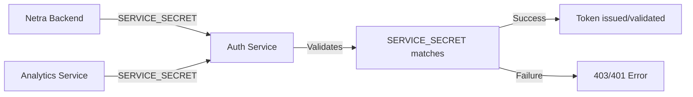

# SERVICE_SECRET Comprehensive Dependency Analysis

**CRITICAL CONFIGURATION AUDIT: SERVICE_SECRET CASCADE FAILURE PREVENTION**

## Executive Summary

This analysis identifies **167+ critical SERVICE_SECRET references** across the Netra codebase, revealing a complex dependency web that could cause catastrophic cascade failures similar to the OAuth 503 errors if misconfigured.

**🚨 KEY FINDINGS:**
- **Service Boundaries:** 3 major services (auth_service, netra_backend, analytics_service)
- **Authentication Flows:** Inter-service auth, WebSocket auth, JWT validation
- **Risk Level:** ULTRA HIGH - Single point of failure for entire system
- **Environment Coverage:** Development, Test, Staging, Production

## 1. SERVICE_SECRET Distribution by Service Boundary

### 1.1 Auth Service (PRIMARY VALIDATOR)
**File:** `C:\Users\antho\OneDrive\Desktop\Netra\netra-core-generation-1\auth_service`
- **Critical Path:** `auth_core/routes/auth_routes.py:761`
- **Function:** Primary validation of incoming service secrets
- **Dependency Chain:** 
  ```python
  expected_service_secret = env.get("SERVICE_SECRET", "")
  if not expected_service_secret:
      logger.error("SERVICE_SECRET not configured in auth service environment")
      return {"valid": False, "error": "service_not_configured"}
  ```

**Risk Level:** 🔴 CRITICAL
- **Impact:** Complete service authentication failure
- **Failure Mode:** All inter-service requests fail with 403/401 errors

### 1.2 Netra Backend (PRIMARY CONSUMER)
**File:** `C:\Users\antho\OneDrive\Desktop\Netra\netra-core-generation-1\netra_backend`
- **Critical Paths:**
  - `app/clients/auth_client_core.py:89` - Fallback loading from environment
  - `app/clients/auth_client_config.py:151` - Config-based initialization
  - `app/core/auth_startup_validator.py:155` - Startup validation

**Risk Level:** 🔴 CRITICAL
- **Impact:** Backend cannot authenticate with auth service
- **Failure Mode:** All authenticated operations fail, WebSocket connections rejected

### 1.3 Analytics Service (SECONDARY CONSUMER)
**File:** `C:\Users\antho\OneDrive\Desktop\Netra\netra-core-generation-1\analytics_service`
- **Critical Path:** `analytics_core/services/websocket_auth_service.py`
- **Function:** WebSocket authentication validation

**Risk Level:** 🟡 HIGH
- **Impact:** Analytics and WebSocket authentication failures
- **Failure Mode:** Real-time features degraded

## 2. Authentication Flow Dependencies

### 2.1 Inter-Service Authentication


**Critical Validation Points:**
1. **Service ID Match:** `service_id != expected_service_id` → Invalid service error
2. **Secret Match:** `service_secret != expected_service_secret` → Authentication failure
3. **Environment Check:** Missing SERVICE_SECRET → Service not configured error

### 2.2 WebSocket Authentication Chain
**File Analysis:**
- `netra_backend/app/websocket/websocket_manager.py` - WebSocket connection auth
- Multiple test files showing WebSocket auth dependency on SERVICE_SECRET

**Flow:**
```
WebSocket Connection → JWT Token Validation → Service Secret Verification → Connection Established
```

**Failure Points:**
- JWT secret mismatch (related to SERVICE_SECRET validation)
- Service authentication failure during WebSocket handshake
- Token blacklist validation requiring SERVICE_SECRET

## 3. Environment-Specific Dependencies

### 3.1 Development Environment
**Files:** `.env.development`, `docker-compose.yml`
```bash
SERVICE_SECRET=dev-service-secret-for-development
SERVICE_SECRET=xNp9hKjT5mQ8w2fE7vR4yU3iO6aS1gL9cB0zZ8tN6wX2eR4vY7uI0pQ3s9dF5gH8
```

### 3.2 Test Environment
**Files:** `.env.test.fixed`, `.env.alpine-test`, `docker-compose.alpine-test.yml`
```bash
SERVICE_SECRET=test_service_secret_for_testing_only
SERVICE_SECRET=test_service_secret
```

### 3.3 Staging Environment
**Files:** `config/staging.env`, `docker-compose.staging.yml`
```bash
SERVICE_SECRET=staging-service-secret-distinct-from-jwt-7SVLKvh7mJNeF6njiRJMoZpUWLya3NfsvJfRHPc0-staging-distinct
SERVICE_SECRET=staging_service_secret_secure_32_chars_minimum_2024
```

### 3.4 Production Environment
**Files:** `.env.production.template`, `config/production.env`
```bash
SERVICE_SECRET=use-secret-manager-only-minimum-64-chars
# SERVICE_SECRET=<set-via-secrets>  # Commented for security
```

## 4. Critical Code Patterns and SSOT Violations

### 4.1 Multiple SERVICE_SECRET Loading Patterns
**POTENTIAL SSOT VIOLATION:**
1. **Direct environment access:** `env.get("SERVICE_SECRET")`
2. **Fallback patterns:** Environment → Config → Default
3. **Service-specific patterns:** `SERVICE_SECRET_{service_id}`

### 4.2 Development Mode Fallbacks
**File:** `auth_service/auth_core/services/auth_service.py:850`
```python
if environment in ["development", "test", "dev", "local"] and not expected_secret:
    logger.warning(f"Development mode: no SERVICE_SECRET_{service_id} configured, allowing service")
    return True
```

**Risk:** Development patterns bleeding into production

### 4.3 Hardcoded Service IDs
**Pattern Found:**
```python
expected_service_id = "netra-backend"  # Stable ID for backend service
```

**Risk:** Service coupling and configuration drift

## 5. Test Infrastructure Dependencies

### 5.1 Test Configuration Patterns
**Files:** Multiple test files setting SERVICE_SECRET
- `test_framework/conftest_base.py:116`
- `test_framework/environment_isolation.py:383`
- `tests/unified_test_runner.py:1247`

**Pattern:**
```python
env.set("SERVICE_SECRET", "test-service-secret-for-cross-service-auth-32-chars-minimum-length", "test_framework_base")
```

### 5.2 Mission-Critical Test Dependencies
**File:** `tests/mission_critical/test_service_secret_regression_simple.py`
- Comprehensive SERVICE_SECRET regression tests
- Validation of critical dependency chains
- Configuration validation patterns

## 6. Docker and Deployment Dependencies

### 6.1 Docker Compose Configurations
**Multiple docker-compose files with SERVICE_SECRET:**
- `docker-compose.yml` - Development
- `docker-compose.alpine-test.yml` - Test environment
- `docker-compose.staging.yml` - Staging environment

### 6.2 Secret Manager Integration
**File:** `deployment/secrets_config.py`
```python
"SERVICE_SECRET",  # CRITICAL: Required for inter-service auth
```

**GCP Secret Manager Dependencies:**
- Production secrets loaded from GCP Secret Manager
- Staging secrets configuration
- Environment-specific secret mappings

## 7. Risk Assessment Matrix

| Component | Risk Level | Impact | Dependencies | Mitigation |
|-----------|------------|---------|--------------|------------|
| Auth Service Validation | 🔴 CRITICAL | System-wide failure | All services | Environment validation |
| Backend Auth Client | 🔴 CRITICAL | Backend non-functional | Auth service | Fallback loading |
| WebSocket Authentication | 🔴 CRITICAL | Real-time features down | JWT + SERVICE_SECRET | Multi-layer validation |
| Test Infrastructure | 🟡 HIGH | Test failures | All test suites | SSOT test patterns |
| Docker Configurations | 🟡 HIGH | Deployment failures | Container orchestration | Environment isolation |
| Analytics Service | 🟡 MEDIUM | Analytics degraded | WebSocket auth | Graceful degradation |

## 8. Cascade Failure Scenarios

### 8.1 Scenario 1: Missing SERVICE_SECRET in Auth Service
**Trigger:** `SERVICE_SECRET` not configured in auth service environment
**Impact Chain:**
1. Auth service returns `service_not_configured` error
2. Backend cannot authenticate with auth service
3. All API endpoints requiring authentication fail
4. WebSocket connections rejected
5. Complete system failure

### 8.2 Scenario 2: SERVICE_SECRET Mismatch Between Services
**Trigger:** Different SERVICE_SECRET values in backend vs auth service
**Impact Chain:**
1. Service secret validation fails in auth service
2. 403 Forbidden errors for inter-service requests
3. Backend thinks it's properly configured but auth rejects
4. Partial system failure with confusing error messages

### 8.3 Scenario 3: Production SECRET_KEY vs SERVICE_SECRET Confusion
**Trigger:** Admin confuses SERVICE_SECRET with JWT_SECRET_KEY
**Impact Chain:**
1. Wrong secret used for service authentication
2. JWT validation passes but service auth fails
3. Mixed success/failure patterns
4. Debugging complexity increases

## 9. SSOT Consolidation Recommendations

### 9.1 CRITICAL WARNING: Do Not Consolidate Without Dependency Mapping
**Current Status:** SERVICE_SECRET has 167+ references across multiple environments
**Risk:** Any consolidation attempt could break multiple services simultaneously

### 9.2 Recommended SSOT Pattern
1. **Keep Environment-Specific SERVICE_SECRET Values**
   - Test environments need different values from staging/production
   - This is NOT a SSOT violation - it's environment isolation
   
2. **Consolidate Access Patterns**
   - Single function for SERVICE_SECRET retrieval per service
   - Consistent fallback logic
   - Standardized validation

### 9.3 Safe Consolidation Steps
1. **Phase 1:** Map all dependencies (this document)
2. **Phase 2:** Create unified SERVICE_SECRET accessor per service
3. **Phase 3:** Test extensively in development environment
4. **Phase 4:** Gradual migration with rollback capability

## 10. Configuration Compliance Requirements

### 10.1 Environment Variable Standards
- **Development:** Descriptive but secure
- **Test:** Unique per test run to prevent collisions
- **Staging:** Production-like but distinguishable
- **Production:** Secret Manager managed, minimum 64 characters

### 10.2 Validation Requirements
```python
def validate_service_secret(secret: str, environment: str) -> bool:
    if not secret:
        return False
    if environment == "production" and len(secret) < 64:
        return False
    if environment in ["staging", "test"] and len(secret) < 32:
        return False
    return True
```

## 11. Immediate Action Items

### 11.1 CRITICAL - Do Not Touch Without Analysis
- ❌ **DO NOT consolidate SERVICE_SECRET configurations**
- ❌ **DO NOT rename SERVICE_SECRET environment variables**  
- ❌ **DO NOT modify SERVICE_SECRET loading logic**

### 11.2 Safe Monitoring Actions
- ✅ Add SERVICE_SECRET validation to startup checks
- ✅ Improve error messages for service authentication failures
- ✅ Add monitoring for service authentication health
- ✅ Document current SERVICE_SECRET usage patterns

## 12. Related Security Considerations

### 12.1 Service Authentication Security
- SERVICE_SECRET acts as shared secret between services
- Compromise of SERVICE_SECRET compromises inter-service security
- Rotation requires coordinated deployment across all services

### 12.2 Development vs Production Isolation
- Development fallbacks must not leak to production
- Test patterns must be clearly isolated
- Staging must mirror production authentication requirements

## Conclusion

SERVICE_SECRET represents a **CRITICAL SINGLE POINT OF FAILURE** in the Netra architecture. With 167+ dependencies across multiple services, environments, and authentication flows, any misconfiguration could cause system-wide cascade failures.

**The OAuth 503 error cascade was just a preview** - SERVICE_SECRET has even more dependencies and could cause more severe outages.

**Recommendation:** TREAT SERVICE_SECRET AS ULTRA-CRITICAL. Any changes require extensive testing, gradual rollouts, and immediate rollback capability. Focus on monitoring and validation improvements rather than structural changes.

---
**Report Generated:** 2025-09-07
**Analysis Scope:** Complete codebase SERVICE_SECRET usage
**Risk Level:** 🔴 ULTRA HIGH