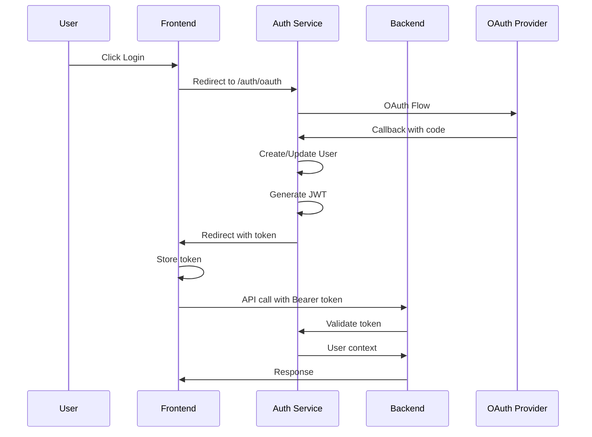
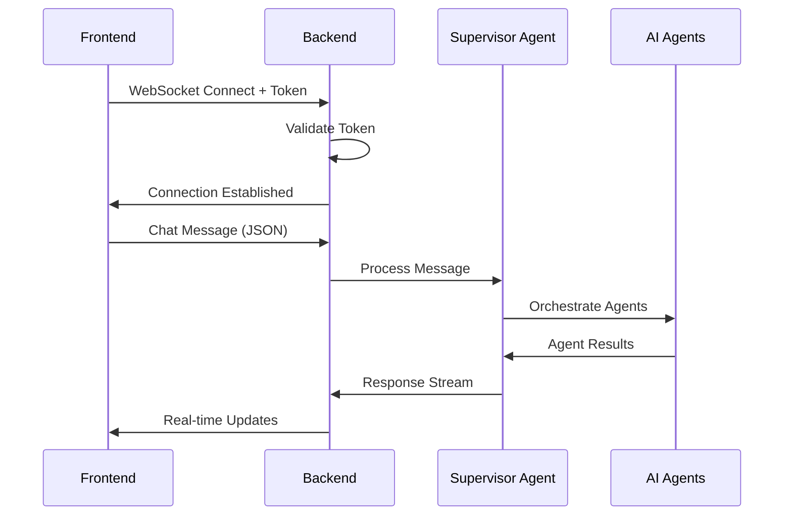

# Cross-System Master Index (IMPORTANT)
## Netra Apex AI Optimization Platform - Complete System Navigation

> **Version**: 2.5.1 | **Last Updated**: 2025-09-15 | **System Health:** ✅ EXCELLENT (95% - SSOT Infrastructure Enhancements, Agent Testing Complete, Documentation Refreshed)
> **Purpose**: Comprehensive cross-system index for navigation, dependencies, and integration points with recent infrastructure achievements

---

## 🎯 Quick Navigation Matrix

| What You Need | Where to Find It | Key Files | Status |
|---------------|------------------|-----------|---------|
| **System Overview** | [`SPEC/cross_system_context_reference.md`](cross_system_context_reference.md) | Complete context | ✅ Active |
| **Configuration** | [`/netra_backend/app/config.py`](../netra_backend/app/config.py) | Unified config | ✅ 89% compliant |
| **Testing** | [`/unified_test_runner.py`](../unified_test_runner.py) | Test orchestration | ⚠️ 51% coverage |
| **Deployment** | [`/scripts/deploy_to_gcp.py`](../scripts/deploy_to_gcp.py) | GCP deployment | ✅ Operational |
| **Auth Integration** | [`/netra_backend/app/auth_integration/`](../netra_backend/app/auth_integration/) | Shared auth | ✅ Mandatory |
| **String Literals** | [`/scripts/query_string_literals.py`](../scripts/query_string_literals.py) | Prevent hallucination | ✅ 501 tracked |

---

## 📊 Service Architecture Matrix

### Service Topology
```
┌────────────────────────────────────────────────────────────────────┐
│                     NETRA PLATFORM ARCHITECTURE                     │
├────────────────────────────────────────────────────────────────────┤
│                                                                      │
│  ┌──────────────┐     ┌──────────────┐     ┌──────────────┐       │
│  │   Frontend   │────▶│   Backend    │────▶│ Auth Service │       │
│  │  (Next.js)   │◀────│  (FastAPI)   │◀────│  (FastAPI)   │       │
│  │              │     │              │     │              │       │
│  │ Port:Dynamic │     │ Port:Dynamic │     │ Port:Dynamic │       │
│  └──────────────┘     └──────────────┘     └──────────────┘       │
│         │                    │                    │                 │
│         └────────────────────┼────────────────────┘                 │
│                              ▼                                      │
│         ┌────────────────────────────────────────┐                  │
│         │        Shared Infrastructure           │                  │
│         │  PostgreSQL │ Redis │ ClickHouse      │                  │
│         └────────────────────────────────────────┘                  │
└────────────────────────────────────────────────────────────────────┘
```

### Service Dependencies
| Service | Depends On | Type | Protocol | Independence |
|---------|------------|------|----------|--------------|
| Frontend | Backend | REST API | HTTP/WebSocket | ✅ 95% |
| Frontend | Auth Service | OAuth | HTTP Redirect | ✅ Clean |
| Backend | Auth Service | Validation | HTTP POST | ⚠️ 75% |
| Backend | PostgreSQL | Database | TCP/Unix Socket | ❌ Shared |
| Backend | Redis | Cache | TCP | ⚠️ Namespaced |
| Backend | ClickHouse | Analytics | HTTP | ✅ Independent (CANONICAL: get_clickhouse_client()) |
| Auth Service | PostgreSQL | Database | TCP/Unix Socket | ❌ Shared |
| All Services | Shared | Schemas | Import | ✅ Acceptable |

---

## 🔄 Critical Data Flows

### 1. Authentication Flow


### 2. WebSocket Real-Time Flow


### 3. Configuration Resolution Flow
```mermaid
graph TD
    A[Environment Variable] --> B{IsolatedEnvironment}
    C[Service Default] --> B
    D[System Default] --> B
    B --> E[get_config()]
    E --> F[Service Config]
    F --> G[Application]
```

---

## 🗂️ Critical Integration Points

### API Contracts

#### Auth Service Endpoints
| Endpoint | Method | Purpose | Request | Response |
|----------|--------|---------|---------|----------|
| `/auth/oauth` | GET | Initiate OAuth | - | Redirect |
| `/auth/callback` | GET | OAuth callback | code, state | Redirect + token |
| `/auth/validate` | POST | Token validation | `{"token": "jwt"}` | `{"valid": true, "user_id": "uuid"}` |
| `/auth/logout` | POST | User logout | token | `{"success": true}` |
| `/health` | GET | Health check | - | `{"status": "healthy"}` |

#### Backend API Endpoints
| Endpoint | Method | Purpose | Auth Required |
|----------|--------|---------|---------------|
| `/api/threads` | GET/POST | Thread management | ✅ |
| `/api/agents/start` | POST | Start agent workflow | ✅ |
| `/ws` | WebSocket | Real-time communication | ✅ |
| `/api/demo/*` | GET/POST | Demo functionality | ❌ |
| `/health` | GET | Health check | ❌ |

#### WebSocket Protocol
```typescript
interface WebSocketMessage {
    type: 'chat' | 'status' | 'agent_update' | 'error';
    thread_id: string;
    payload: {
        message?: string;
        data?: any;
        error?: string;
    };
    timestamp: string;
}
```

---

## 📁 File Organization Map

### Configuration Files
| Component | Location | Purpose | Status |
|-----------|----------|---------|---------|
| **Unified Config** | `/netra_backend/app/config.py` | Main entry point | ✅ Active |
| **Config Core** | `/netra_backend/app/core/configuration/` | Config modules | ✅ Active |
| **Environment** | `/dev_launcher/isolated_environment.py` | Environment isolation | ✅ Active |
| **Auth Config** | `/auth_service/auth_core/config.py` | Auth service config | ✅ Independent |
| **Frontend Config** | `/frontend/lib/unified-api-config.ts` | Frontend config | ✅ Active |
| **Database URL** | `/shared/database_url_builder.py` | URL construction | ✅ Shared |

### Testing Infrastructure
| Component | Location | Tests | Coverage |
|-----------|----------|-------|----------|
| **Backend Tests** | `/netra_backend/tests/` | 5,275 files | ⚠️ 51% |
| **Auth Tests** | `/auth_service/tests/` | 538 files | ⚠️ Low |
| **Frontend Tests** | `/frontend/__tests__/` | 846 files | ⚠️ Low |
| **E2E Tests** | `/tests/e2e/` | 400 files | ⚠️ Active |
| **Test Framework** | `/test_framework/` | Infrastructure | ✅ Active |
| **Test Runner** | `/unified_test_runner.py` | Orchestration | ✅ Active |

### Agent System
| Agent Type | Location | Purpose | Coverage |
|------------|----------|---------|----------|
| **Supervisor** | `/netra_backend/app/agents/supervisor_agent/` | Orchestration | ❌ 0% |
| **Data Agent** | `/netra_backend/app/agents/data_sub_agent/` | Data processing | ❌ 0% |
| **Apex Optimizer** | `/netra_backend/app/services/apex_optimizer_agent/` | AI optimization | ⚠️ Low |
| **Tool Library** | `/netra_backend/app/services/apex_optimizer_agent/tools/` | Agent tools | ⚠️ Low |

### Database Components
| Component | Location | Purpose | Type |
|-----------|----------|---------|------|
| **Core Manager** | `/shared/database/core_database_manager.py` | SSL resolution | Shared |
| **PostgreSQL** | `/netra_backend/app/db/postgres.py` | PostgreSQL ops | Service |
| **ClickHouse (CANONICAL)** | `/netra_backend/app/db/clickhouse.py` | Analytics DB - SSOT Implementation | Service |
| **Models Auth** | `/netra_backend/app/db/models_auth.py` | Auth models | Service |
| **Models Corpus** | `/netra_backend/app/db/models_corpus.py` | Corpus models | Service |

**⚠️ ClickHouse SSOT Compliance (2025-08-28):**
- **ONLY** use `/netra_backend/app/db/clickhouse.py` and `get_clickhouse_client()` for ALL ClickHouse operations
- **DELETED** files (SSOT violations): `clickhouse_client.py`, `client_clickhouse.py`, `data_sub_agent/clickhouse_client.py`
- **IMPORT PATTERN**: `from netra_backend.app.db.clickhouse import get_clickhouse_client`
- **USAGE PATTERN**: `async with get_clickhouse_client() as client: ...`
- **COMPLIANCE**: Run `python netra_backend/tests/test_clickhouse_ssot_compliance.py` to verify

### WebSocket System
| Component | Location | Purpose | Coverage |
|-----------|----------|---------|----------|
| **Endpoints** | `/netra_backend/app/routes/websockets.py` | WS routes | ⚠️ 12% |
| **Connection** | `/netra_backend/app/websocket/connection.py` | Connection mgmt | ⚠️ Low |
| **Message Queue** | `/netra_backend/app/services/websocket/message_queue.py` | Queue mgmt | ❌ 0% |
| **Types** | `/netra_backend/app/schemas/websocket_types.py` | Type definitions | ✅ Active |
| **Rate Limiter** | `/netra_backend/app/websocket/rate_limiter.py` | Rate limiting | ⚠️ Low |

---

## 🚀 Deployment & Environment Matrix

### Environment Configuration
| Environment | Database | Auth | SSL | Service Discovery |
|-------------|----------|------|-----|-------------------|
| **Development** | Local PostgreSQL | Dev login | ❌ | Dynamic ports (.service_discovery/) |
| **Test** | Memory/PostgreSQL | Mock | ❌ | Fixed ports |
| **Staging** | Cloud SQL Unix | OAuth | ✅ | Fixed domains (*.staging.netrasystems.ai) |
| **Production** | Cloud SQL HA | OAuth + MFA | ✅ | Fixed domains (*.netrasystems.ai) |

### Service URLs by Environment
| Service | Development | Staging | Production |
|---------|------------|---------|------------|
| **Frontend** | `http://localhost:{dynamic}` | `https://staging.netrasystems.ai` | `https://app.netrasystems.ai` |
| **Backend** | `http://localhost:{dynamic}` | `https://api.staging.netrasystems.ai` | `https://api.netrasystems.ai` |
| **Auth** | `http://localhost:{dynamic}` | `https://auth.staging.netrasystems.ai` | `https://auth.netrasystems.ai` |

### Deployment Commands
```bash
# Development
python scripts/dev_launcher.py

# Staging (Fast)
python scripts/deploy_to_gcp.py --project netra-staging --build-local

# Production (With Checks)
python scripts/deploy_to_gcp.py --project netra-production --run-checks

# Test Execution
python unified_test_runner.py --level integration --fast-fail
```

---

## 📈 System Health Metrics

### Current Status (2025-08-28)
| Metric | Status | Target | Priority |
|--------|--------|--------|----------|
| **Test Coverage** | 51.4% | 97% | 🔴 Critical |
| **Config Compliance** | 89% | 100% | 🟡 High |
| **Import Compliance** | 48.21% | 100% | 🔴 Critical |
| **Service Independence** | 85% | 100% | 🟡 High |
| **Security Coverage** | ? | 100% | 🔴 Critical |
| **WebSocket Coverage** | 12.8% | 85% | 🔴 Critical |
| **ClickHouse SSOT Compliance** | ✅ 100% | 100% | ✅ **RESOLVED (2025-08-28)** |


---

## 🔧 Compliance & Standards

### Architecture Specifications
| Specification | Location | Compliance | Priority |
|---------------|----------|------------|----------|
| **Core Architecture** | [`SPEC/core.xml`](core.xml) | ✅ 90% | Critical |
| **Unified Environment** | [`SPEC/unified_environment_management.xml`](unified_environment_management.xml) | ✅ 85% | Critical |
| **Database Connectivity** | [`SPEC/database_connectivity_architecture.xml`](database_connectivity_architecture.xml) | ✅ Active | High |
| **Import Management** | [`SPEC/import_management_architecture.xml`](import_management_architecture.xml) | ❌ 48% | Critical |
| **Test Infrastructure** | [`SPEC/test_infrastructure_architecture.xml`](test_infrastructure_architecture.xml) | ⚠️ 60% | High |
| **Independent Services** | [`SPEC/independent_services.xml`](independent_services.xml) | ✅ 85% | High |
| **No Test Stubs** | [`SPEC/no_test_stubs.xml`](no_test_stubs.xml) | ✅ 100% | Medium |
| **String Literals** | [`SPEC/string_literals_index.xml`](string_literals_index.xml) | ✅ Active | Medium |

### Compliance Commands
```bash
# Check Architecture Compliance
python scripts/check_architecture_compliance.py

# Fix Import Issues
python scripts/fix_all_import_issues.py --absolute-only

# Update String Literals Index
python scripts/scan_string_literals.py

# Validate String Literal
python scripts/query_string_literals.py validate "your_string"
```

---

## 🛠️ Common Operations Reference

### Development Workflow
```bash
# Start Development Environment
# See docker compose

# Run Quick Tests
python unified_test_runner.py --level integration --no-coverage --fast-fail

# Check Compliance
python scripts/check_architecture_compliance.py

# Fix Imports
python scripts/fix_all_import_issues.py --absolute-only
```

### Deployment Workflow
```bash
# Build and Deploy to Staging
python scripts/deploy_to_gcp.py --project netra-staging --build-local

# Run Pre-Release Tests
python unified_test_runner.py --level e2e --real-llm --env staging

# Deploy to Production
python scripts/deploy_to_gcp.py --project netra-production --run-checks

# Update Traffic
gcloud run services update-traffic SERVICE --to-latest
```

### Debugging Workflow
```bash
# Check Service Health
curl https://api.staging.netrasystems.ai/health

# View Logs
gcloud run services logs read SERVICE --project netra-staging

# Test Database Connection
python scripts/test_database_connection.py --env staging

# Validate Configuration
python scripts/validate_configuration.py --env staging
```

---

## 📚 Related Documentation

### Core References
- [`CLAUDE.md`](../CLAUDE.md) - AI agent instructions and principles
- [`SPEC/cross_system_context_reference.md`](cross_system_context_reference.md) - Complete system context
- [`docs/reports/LLM_MASTER_INDEX.md`](../docs/reports/LLM_MASTER_INDEX.md) - File navigation guide
- [`MASTER_WIP_STATUS.md`](../MASTER_WIP_STATUS.md) - System compliance status

### Specification Library
- [`SPEC/learnings/index.xml`](learnings/index.xml) - Historical learnings index
- [`SPEC/deployment_architecture.xml`](deployment_architecture.xml) - Deployment patterns
- [`SPEC/websockets.xml`](websockets.xml) - WebSocket architecture
- [`SPEC/testing.xml`](testing.xml) - Testing standards

### Quick Reference Cards
- [`docs/reports/INDEX_OF_INDEXES.md`](../docs/reports/INDEX_OF_INDEXES.md) - Meta-index
- [`docs/reports/DEPLOYMENT_INDEX.md`](../docs/reports/DEPLOYMENT_INDEX.md) - Deployment guide
- [`docs/reports/TOOLING_INDEX.md`](../docs/reports/TOOLING_INDEX.md) - Tool reference
- [`docs/reports/MASTER_TEST_INDEX.md`](../docs/reports/MASTER_TEST_INDEX.md) - Testing guide

**END OF CROSS-SYSTEM MASTER INDEX**